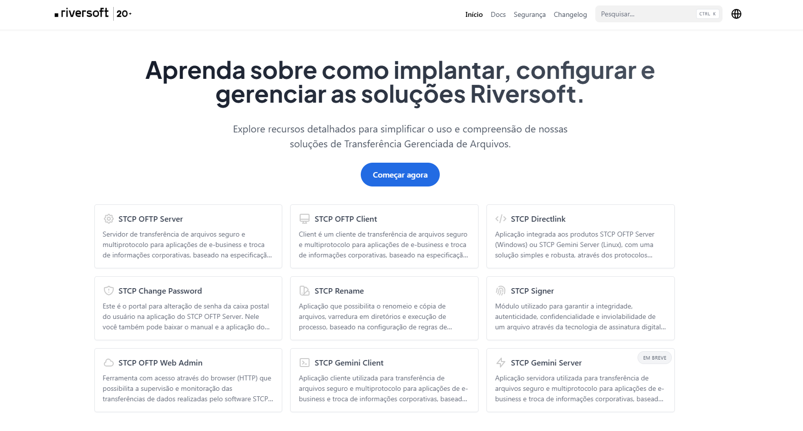

# Documentação Riversoft STCP

## Visão Geral

Este repositório foi desenvolvido para fornecer informações detalhadas sobre a instalação, configuração e utilização das soluções de transferência gerenciada de arquivos (MFT) da Riversoft. Ele atua como uma fonte centralizada de documentação, facilitando o entendimento e oferecendo recursos valiosos para usuários explorarem e aproveitarem ao máximo nossa tecnologia.

## Sobre o STCP

O STCP é um conjunto de soluções Riversoft para a transferência gerenciada de arquivos (MFT), que oferece confiabilidade, desempenho, segurança, rastreabilidade, conformidade às leis de proteção de dados e funcionalidades essenciais para que as organizações troquem arquivos de forma confiável, robusta e escalável.

## O que você encontrará aqui

### Documentação Detalhada
Instruções passo a passo e informações detalhadas sobre a instalação, configuração e utilização eficaz do STCP.

### Exemplos Práticos
Explore casos de uso reais e exemplos práticos que demonstram como aproveitar todas as funcionalidades essenciais do STCP.

### Configuração Avançada
Detalhes sobre opções de configuração avançada para personalizar o STCP de acordo com as necessidades específicas da sua organização.

### Sistemas Operacionais Homologados
Lista de sistemas operacionais compatíveis com o STCP.

### Bancos de Dados Homologados
Informações sobre os bancos de dados homologados para garantir uma integração eficiente com o STCP.

### FAQ (Perguntas Frequentes)
Consulte perguntas frequentes para obter respostas rápidas e informações adicionais sobre o STCP.

