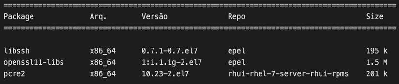
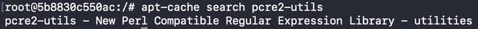

Esta seção tem como objetivo descrever os passos iniciais para instalação e configuração do STCP Gemini Client. Outras configurações podem ser realizadas conforme as necessidades específicas do ambiente e/ou funcionalidades utilizadas.

## Requisitos para Instalação

O STCP Gemini Client está homologado para as distribuições CentOS (versões 7 e 8), Red Hat Enterprise Linux (versões 7 e 8), Amazon Linux, Oracle Linux (versões 7, 8 e 9), Debian (versão 9, 10 e 11) e Ubuntu (versões 18.04 e 20.04) 

Por questões de segurança, o STCP Gemini Client utiliza versões mais recentes das bibliotecas OPENSSL, LIBSSH e PCRE2. 

Essas bibliotecas são dependências (pré-requisitos) para que o STCP Gemini Client possa ser implantado corretamente e deverão estar instaladas no servidor em que o software será implantado.

A instalação do STCP Gemini Client será realizada através do repositório oficial da Riversoft, de acordo com a distribuição Linux utilizada.

## CentOS, Red Hat Enterprise Linux, Oracle Linux e Amazon Linux

### Instalação das dependências



As dependências para o STCP Gemini Client podem ser instaladas através do repositório EPEL, assim como, através dos seus respectivos pacotes RPM e conforme padrão e práticas adotadas por cada organização.

``` bash
$ yum install epel-release
```


**Nota:** O EPEL (Extra Packages for Enterprise Linux) é um repositório utilizado por administradores de sistemas Linux que necessitam instalar no servidor, pacotes mais recentes e versões atualizadas de bibliotecas, visto que esses pacotes mais novos não são imediatamente adicionados aos repositórios oficiais.


No Amazon Linux o acesso ao EPEL pode ser habilitado através do comando:

```bash
amazon-linux-extras enable epel
```

No Oracle Linux, de acordo com a versão utilizada, o acesso ao EPEL pode ser habilitado através do comando abaixo. Para mais informações consulte a documentação da Oracle (https://yum.oracle.com/).



  
  ```
  yum install Oracle-epel-release-el7.x86_64
  ```
  
  
  ```
  yum install Oracle-epel-release-el8.x86_64
  ```
  
  ```
  yum install Oracle-epel-release-el9.x86_64
  ```


Mais informações sobre como configurar o EPEL, podem ser obtidas através do link abaixo ou na documentação da distribuição utilizada.

https://fedoraproject.org/wiki/EPEL

### Instalação do STCP Gemini Client

Para instalar o STCP Gemini Client será necessária a configuração do repositório oficial da Riversoft no servidor.

Para isso, utilizando o terminal, execute os passos a seguir:

```bash
$ vi /etc/yum.repos.d/riversoft.repo
```

Este comando criará um arquivo chamado riversoft-release.repo. Insira nele os seguintes dados:

* Para as versões CentOS 7, Red Hat Enterprise Linux 7, Oracle Linux 7 e Amazon Linux:

```
[Riversoft] 
name=Riversoft Packages for Enterprise Linux 7 - $basearch 
baseurl=http://repoyum.riversoft.com.br/riversoft_repo/prod/centos/7/$basearch
enabled=1 
gpgcheck=1 
```

* Para as versões CentOS 8, Red Hat Enterprise Linux 8, Oracle Linux 8 e Oracle Linux 9:
  
```
[Riversoft] 
name=Riversoft Packages for Enterprise Linux 8 - $basearch 
baseurl=http://repoyum.riversoft.com.br/riversoft_repo/prod/centos/8/$basearch
enabled=1 
gpgcheck=1
```

O arquivo de configuração do repositório oficial da Riversoft também poderá ser obtido utilizando o comando abaixo:

* Para as versões CentOS 7, Red Hat Enterprise Linux 7, Oracle Linux 7 e Amazon Linux:

```bash
$ curl https://www.riversoft.com.br/yum/centos-7.repo --output /etc/yum.repos.d/riversoft-release.repo -k
```

* Para as versões CentOS 8, Red Hat Enterprise Linux 8, Oracle Linux 8 e Oracle Linux 9:

```bash
$ curl https://www.riversoft.com.br/yum/centos-8.repo --output /etc/yum.repos.d/riversoft-release.repo -k
```

Após a configuração do repositório, utilize o comando padrão do YUM para instalar o STCP Gemini Client.

```bash
$ yum install stcpgemini-client.x86_64
```

Confirme as informações exibidas na tela para concluir a instalação e siga para a seção Configuração do STCP Gemini Client.

## Ubuntu e Debian

### Instalação das dependências

A instalação das dependências para o STCP Gemini Client pode ser realizada através do gerenciados de pacotes APT, assim como, através dos seus respectivos pacotes RPM e conforme padrão e práticas adotadas por cada organização.



Utilizando o terminal, execute o passo a seguir:

```bash
$ apt-get update
$ apt-get install pcre2-utils
```

### Instalação do STCP Gemini Client

Para instalar o STCP Gemini Client será necessária a configuração do repositório oficial e da chave pública de assinatura de pacotes da Riversoft.

Utilizando o terminal, execute os passos a seguir:

```bash
$ apt-get install gnupg2
$ wget -O - -q http://apt.riversoft.com.br/riversoft_repo/apt.riversoft.pub | apt-key add -
```

O próximo passo será criar o arquivo de configuração de acesso ao repositório oficial dos pacotes da Riversoft.

```bash
$ vi /etc/apt/sources.list.d/apt-riversoft.list
``` 

Este comando criará um arquivo chamado apt-riversoft.list, insira nele os seguintes dados:

* Para a versão Ubuntu 18.04 (bionic):
  
```
deb http://apt.riversoft.com.br/riversoft_repo/debian/ bionic main
```

* Para a versão Ubuntu 20.04 (focal) e Debian:

```
deb http://apt.riversoft.com.br/riversoft_repo/debian/ focal main
```

* Para a versão Ubuntu 24.04 e Debian 12:

```
deb http://apt.riversoft.com.br/riversoft_repo/debian/ noble main
```

Após a configuração do repositório, utilize os comandos padrão do APT para instalar o STCP Gemini Client.

```bash
$ apt-get update
$ apt-get install stcpgemini-client
```

Confirme as informações exibidas na tela para concluir a instalação e siga para o passo Configuração do STCP Gemini Client. 