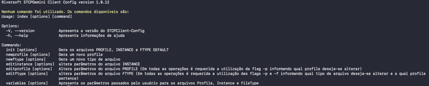
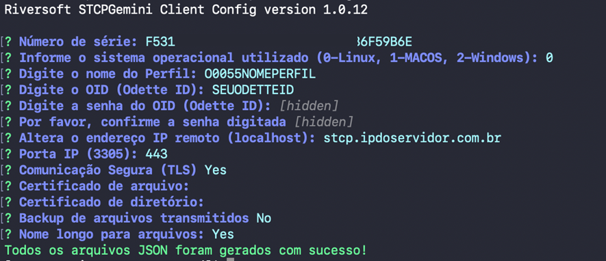

Toda a configuração da aplicação será realizada através do STCP Gemini Client Config. Não é necessária a utilização do super-usuário (root) para a configuração. 



Siga os passos abaixo para criar o arquivo de configuração da aplicação:

```bash
$ cd /usr/local/stcpclient/configs/
$ cp example-stcpclient.config.json stcpclient.config.json
```

Execute o configurador do STCP Gemini Client e siga os passos exibidos na tela para concluir a configuração (consulte tabela abaixo com os dados para preenchimento).

```bash
$ stcpclient-config init
```



| Parâmetros       |  Descrição      | 
| -------------    | :-------------: | 
| Número de série  |  **Fornecido pelo Bradesco**  | 
| Sistema operacional   | 0-Linux                  |    
| Nome do Perfil        | O0055BRADESCO            |   
| OID (Odette ID)       | **Fornecido pelo Bradesco**  |   
| Senha OID (Odette ID) | **Fornecido pelo Bradesco**  |   
| Endereço IP           | rvsweb.bradesco.com.br       |   
| Porta                 |         443                  |   
| Comunicação segura (TLS) |         Não               |   
| Certificado de arquivo   |      Deixar em branco     |   
| Certificado de diretório |      Deixar em branco     |   
| Backup arquivos transmitidos |         Não               |   
| Nome longo para arquivos     |         Sim               |   
