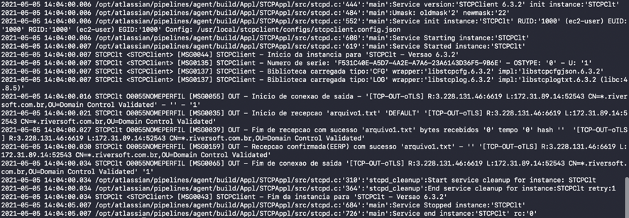

Para executar a aplicação, através do terminal, utilize a linha de comando abaixo:

```bash
$ stcpclient -p O0055BRADESCO -r 1 /usr/local/stcpclient/configs/stcpclient.config.json
```

Após a execução do STCP Gemini Client, assim que a conexão com servidor do BRADESCO for estabelecida com sucesso, os arquivos serão enviados e/ou recebidos automaticamente:



## Como enviar e receber arquivos

Os arquivos que serão enviados para o Bradesco deverão ser disponibilizados na pasta SAIDA da aplicação.

```
/usr/local/stcpclient/data/STCPClt/O0055BRADESCO/SAIDA
```

Em seguida, execute o STCP Gemini Client conforme descrito acima.


**Nota:** Todos os arquivos que estiverem na pasta SAIDA serão enviados. 
Os arquivos enviados com sucesso serão removidos automaticamente da pasta de SAIDA.


Ao executar o STCP Gemini Client, os arquivos que forem recebidos do Bradesco ficarão disponíveis na pasta ENTRADA da aplicação.

```
/usr/local/stcpclient/data/STCPClt/O0055BRADESCO/ENTRADA
```

## Modo de execução através do Cron

É possível automatizar a execução do STCP Gemini Client utilizando ferramentas de agendamento que permitem controlar tarefas a serem executadas em tempos pré-configurados, como por exemplo, o Cron. 

```bash
$ sudo cat /etc/crontab

0 0 * * * /bin/bash -l -c "PATH=\"$PATH:/usr/local/bin\"; stcpclient -p O0055BRADESCO -r 1 /usr/local/stcpclient/configs/stcpclient.config.json"
```


