## Installing the STCP OFTP Client

Before you begin the installation, check the requirements for installing and using the Riversoft STCP OFTP Client below:

*	1 GHz or higher 32-bit (x86) or 64-bit (x64) processor
*	512 MB RAM (32-bit) or 1 GB RAM (64-bit)
*	30 MB of available hard disk space for the application
*	Operating System: Windows 10/11/2012/2016/2019/2022

a)	Run the file from the location where it was saved to start the installation and click the Next button.

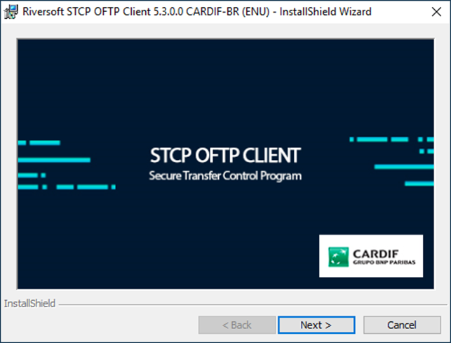

b)	Click Next on the welcome screen to continue the installation process.

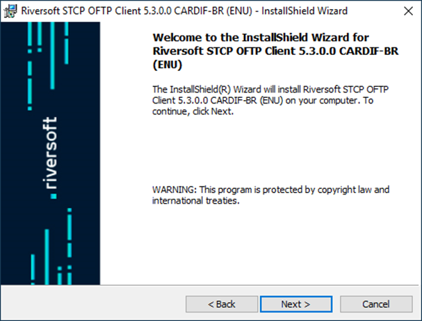

c)	Select the "I accept the terms of the license agreement" option and click Next.

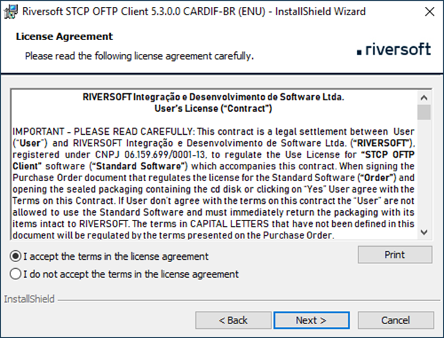

d)	Fill in the requested information correctly and click Next.

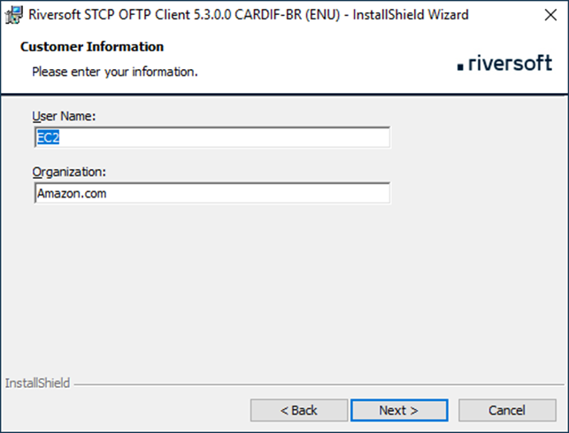

e)	Accept or change the installation directory, and then click Next.

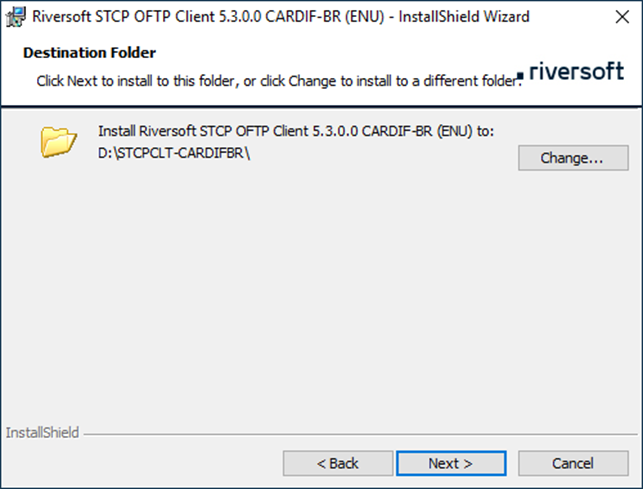

f)	Select the desired option so that the installation can begin.

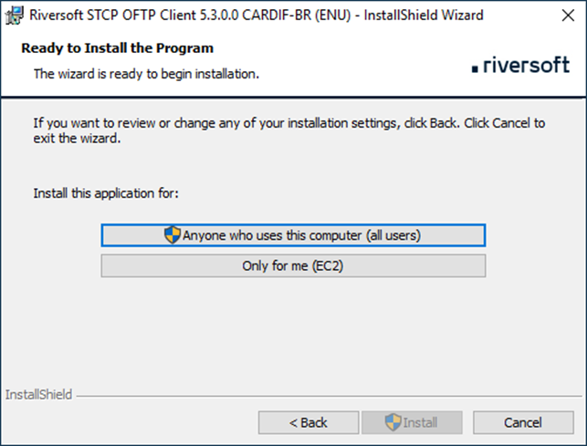

g)	To finish the installation process, click Finish.

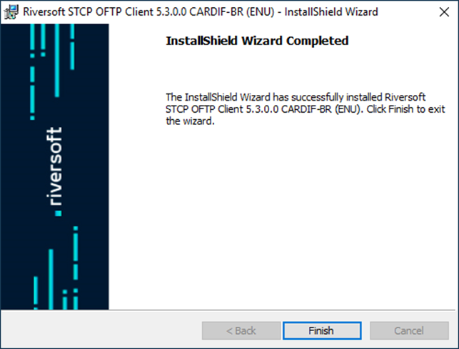

## User configuration and transfer password in the application

a)	Enter Setup using the Start - All Programs - Riversoft STCP OFTP Client 5.3.0.0 CARDIF-BR shortcut, click Riversoft STCP OFTP Client Config, select the O0055CARDIF profile, and then click Properties.

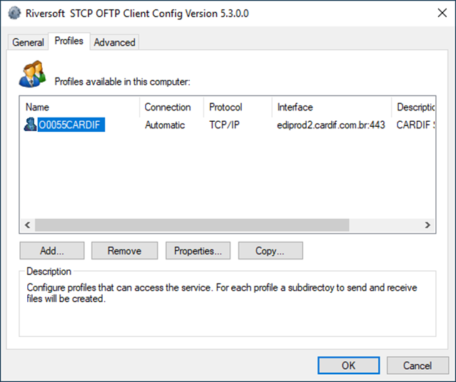

b)	Enter your ID, your password, and click the OK button to save your changes.

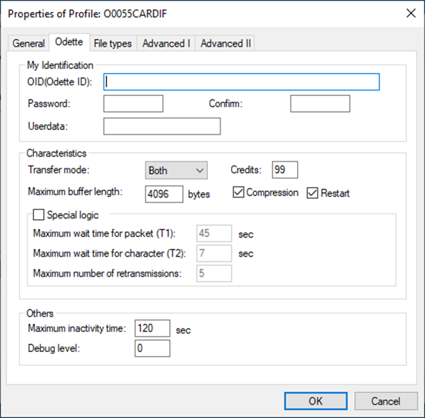

c)	To finish the setup, click OK.

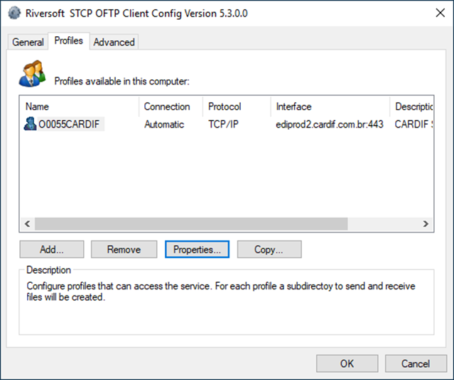

d)	After the ID and password configuration has been successfully completed, a shortcut for quick access to the transfer through the Riversoft STCP OFTP Client will be created on your computer's desktop.

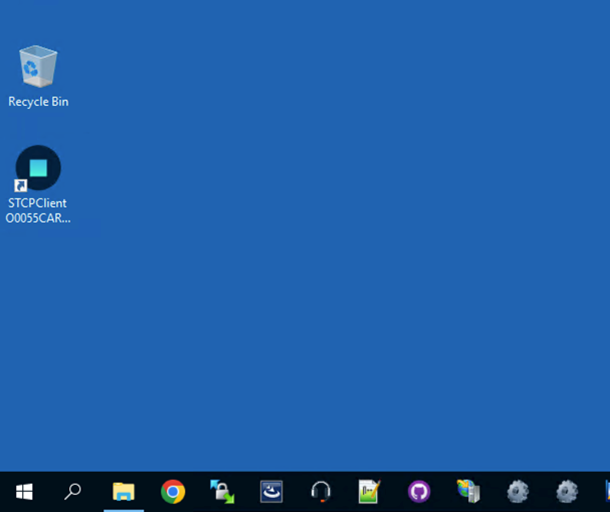

e)	Click on the STCPClient shortcut O0055CARDIF, created on your computer's desktop, and check if communication has been successfully established.



Upon starting, the Riversoft STCP OFTP Client executes the connection process and checks for files to transmit and/or receive. If there are no files, the connection is terminated, and the application window is automatically closed.


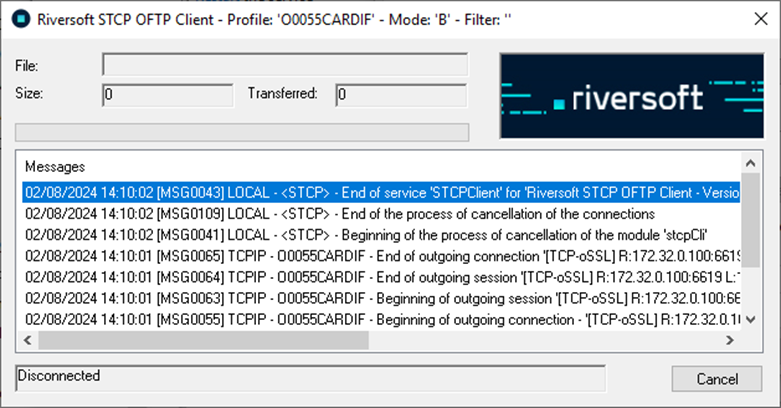

## How to send and receive files through the riversoft stcp oftp client (manual)

a)	TO SEND 

Place the files you want to send in the OUTPUT folder of the Riversoft STCP OFTP Client (Ex. C:\STCPCLT-CARDIFBR\O0055CARDIF\OUTBOX) and click on the STCPClient shortcut O0055CARDIF, created on your computer's desktop.


All files that are in the OUTPUT folder will be transferred automatically and after successfully sent, they will be moved from the OUTPUT folder to the BACKUP folder (Ex. C:\STCPCLT-CARDIFBR\O0055CARDIF\OUTBOX\BACKUP).


b)	TO RECEIVE

Click on the STCPClient O0055CARDIF shortcut, created on your computer's desktop, and after ending the communication, the received files will be available in the INPUT folder of the Riversoft STCP OFTP Client (Ex. C:\STCPCLT-CARDIFBR\O0055CARDIF\INBOX).

## How to send and receive files through stcp oftp client (automatic)

To automate the transfer process, Riversoft STCP OFTP Client can be run via command line which allows its integration with external applications or Task Scheduler operating system:

| Parameter                 | Description |
| -----------               | ----------- |
| <config file>             | Sets the name of the installation configuration file to "CTCP. INI" with the full path.       |
| -p <profile name>         | Sets the name of the connection profile.        |
| -r <number of attempts>   | Sets the number of connection attempts.        |
| -t <retry interval>       |  Sets the interval (in seconds) between retries.        |
| -m <modo>                 |  Defines the transfer mode to be performed: B, S, or R. <br> B = Transmit and receive <br> S = Transmit only <br> R = Receive only |
| -f <File Filter>          | Sets the file filter using regular expression.        |
| -w <closes dialog>        | Defines whether the dialog box will close automatically at the end of the run: 0 or 1. <br> 0 = Does not close the dialog box <br> 1 = Closes the dialog box. |

----------------

```{filename="Command line example"}

C:\STCPCLT-CARDIFBR\Program\stcpclt.exe "C:\STCPCLT-CARDIFBR\CTCP. INI" -p O0055CARDIF -r 5 -t 30 -m B
```

## Transfer logs

The Riversoft STCP OFTP Client creates a set of daily text files containing the transfer information (date, ID, file, operation). Through these files it is possible to check the occurrences of success and failures of connection and file transfer.

Riversoft STCP OFTP Client logs are divided into two categories:

a)	SYSTEM LOGS

Available in the LOG folder of the Riversoft STCP OFTP Client installation directory (e.g. C:\STCPCLT-CARDIFBR\Log) and are created daily. Record information regarding SYSTEM events.

•	STCP OFTP Start/End.
•	Start/End of External Command Execution.
•	Start and End of the Agenda.
•	System errors in general.

The naming of the log files follows the pattern below:

```
YYYYMMDD.log.txt
YYYYMMDD.msg.txt
```

b)	COMMUNICATION LOGS 

Available in the LOG folder of the corresponding profile (e.g. C:\STCPCLT-CARDIFBR\O0055CARDIFBR\LOG). Record information regarding the events of the transfer process of a given profile. Each profile, registered in the system (Profiles tab), has a corresponding LOG folder.

The events listed in these files can be: 

•	Connection Start/End IN or OUT.
•	Start/End of Session.
•	Start/End of Transmission or Reception of files.
•	Errors in the transfer process.

The naming of the log files follows the pattern below:

```
YYYYMMDD. O0055CARDIFBR.msg.txt
```

## How to configure the riversoft stcp oftp client to use a proxy server for connection

a)	Enter the Setup program using the Start - All Programs - Riversoft STCP OFTP Client 5.3.0.0 CARDIF-BR - Riversoft STCP OFTP Client Config. Select the O0055CARDIF profile on the Profiles tab, and then click Properties.


b)	On the General tab, click the Configure button.

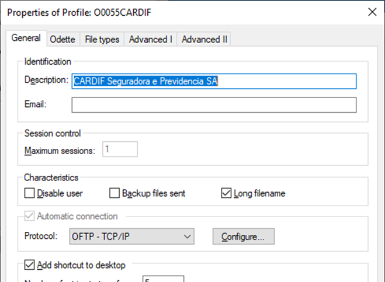

c)	On the Proxy tab, click the Reads IE Proxy Configuration button to get the Internet Explorer browser information. If the Proxy server uses authentication, it will be necessary to fill in the corresponding fields.

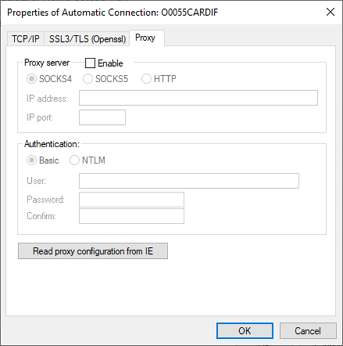


Some authentication settings require the domain server information (where applicable) in the following pattern: <Domain Name>\<Domain User>. Consult your network administrator if you have any questions about the configuration.


## Configuring the riversoft stcp oftp client autorun schedule on windows 10, 11, 2012, 2016, 2019 and 2022

To automatically run the file transfer application, we must perform the following steps to configure the scheduled tasks of the operating system.

a)	Access the Task Scheduler within Administrative Tools.
b)	Click Create Task in the Actions pane.

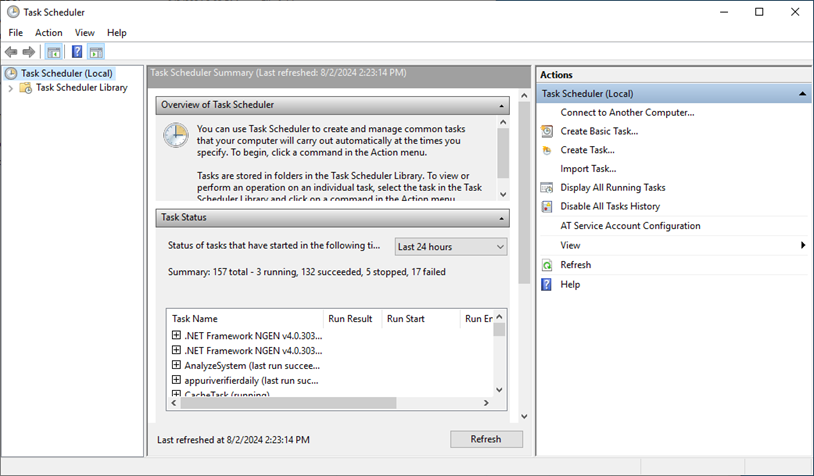

c)	On the General tab of the task creation window, configure the fields as needed. Take a close look at the security options as per your environment settings. 

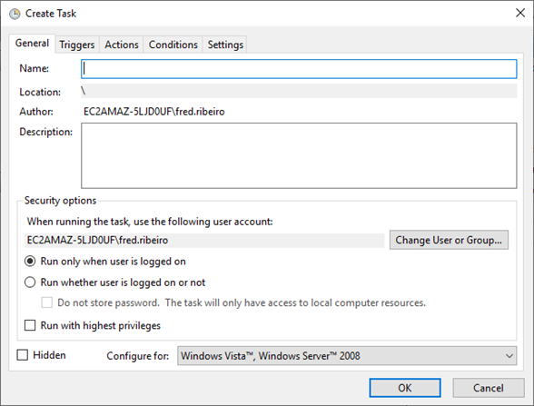

d)	On the Triggers tab, click the New button.

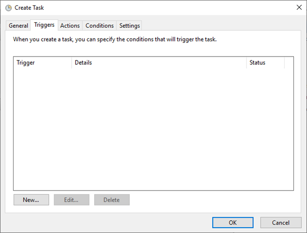

e)	In the New Trigger window, configure the schedule as desired, and then click the OK button to save the information.

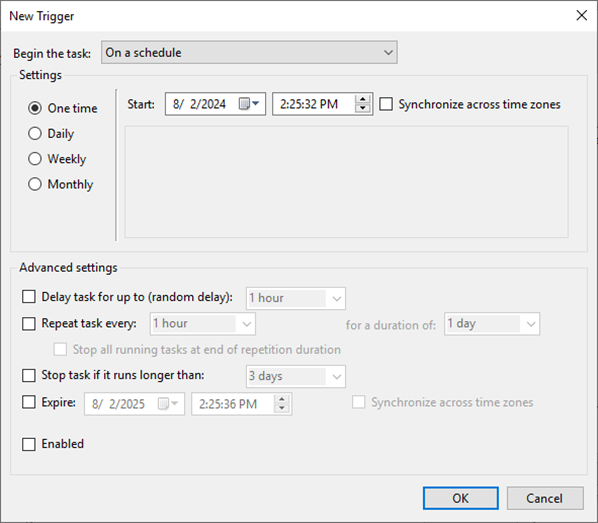

f)	On the Actions tab, click the New button.

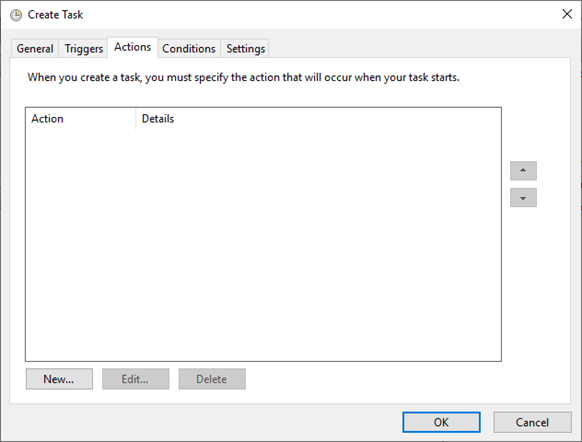

g)	In the Program/script field, enter the command line (see example below) used to run the Riversoft STCP OFTP Client and click the OK button.

```
C:\STCPCLT-CARDIFBR\Program\stcpclt.exe "C:\STCPCLT-CARDIFBR\CTCP. INI" -p O0055CARDIF -r 5 -t 30 -m B
```

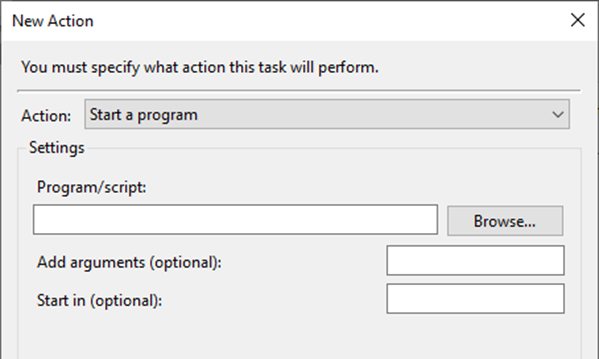



The command line can be obtained by right-clicking on the STCPClient shortcut O0055CARDIF which was created on the desktop at the time of software installation and configuration. On the Shortcut tab, copy the contents of the Target field.


h)	Click the Yes button to confirm the message about the inclusion of arguments in the Program text box.

i)	After performing the steps described, the created task will be displayed in the main Task Scheduler window.

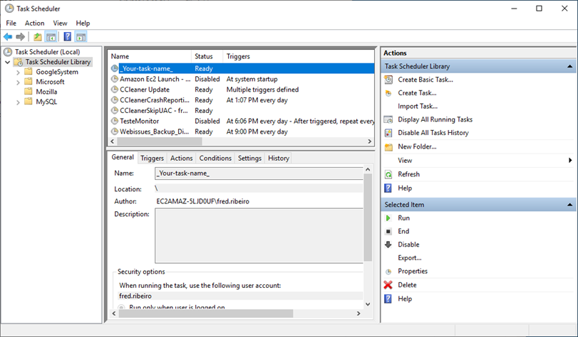

## Automatic update

Fundamental security updates or software updates for the Riversoft STCP OFTP Client are released as automatic updates. 

The Riversoft STCP OFTP Client connects to the Riversoft update server and checks for updates of this nature daily, and when an automatic security or software update is available, it automatically installs it.

The auto-update module only has access to the directory structure and files related to the Riversoft STCP OFTP Client.

During the automatic update, the Riversoft STCP OFTP Client makes a backup copy of the files that have been updated in the "UPDATER" folder of the application's installation directory (e.g. C:\STCPCLT-CARDIFBR). This way, in case of any problem, it is possible to restore the files prior to the update process.

The logs containing the information about the update are recorded in the "stcpupdater_client.log" file, available in the "UPDATER" folder of the application's installation directory (e.g. C:\ STCPCLT-CARDIFBR).


## Transfer log file

The Riversoft STCP OFTP Client creates a daily audit file, containing the information corresponding to the start and end of the session, start and end of the transfer, among others.

Through this file it is possible to create reports and statistics on the use of the service. The audit file is stored in the LOG control subdirectory with the nomenclature YYYYMMDD.log.txt. 

Each line of the file is a fixed-format record, containing the following information:

| Seq.        | Tam         | Format      |  Description   |
| ----------- | ----------- | ----------- | -----------    |
| 1           | 14          | N           | Date and time of occurrence (YYYYMMDDhhmmss)          |
| 2           | 4           | N           | Code of the operation related to this record: <br> 0000 – Incoming login <br> 0001 – End of incoming session <br> 0002 – Sign-out Login <br> 0003 – Exit Session End <br> 0004 – File transmission start <br> 0005 – End of file transmission <br> 0006 – Beginning of file reception <br> 0007 – End of file reception <br> 0008 – File Routing (STCPREN) |
| 3           | 30          | X           | Username                          |
| 4           | 16          | X           | Name of the communication process |
| 5           | 8           | X           | Code of procedure                 |
| 6           | 8           | X           | Code that thread                  |
| 7           | 6           | N           | Result <br> 000000 – Success      |
| 8           | 12          | N           | File size                         |
| 9           | 256         | X           | File Name                         |
| 10          | 128         | X           | General Information               |

## Table of error codes and procedures

In case there is any failure or malfunction of the Riversoft STCP OFTP Client, check the tables below for the corresponding code and the suggested procedure.

### Odette protocol transfer error codes

| **Code** | **Description**                                                                                  | **Procedures**                                                                                                                   |
|----------|--------------------------------------------------------------------------------------------------|----------------------------------------------------------------------------------------------------------------------------------|
| 401      | The file name is invalid, or a file naming filter is set.                                         | Check for invalid characters or blank space in the file name. Check in the user/profile setting, under the "Advanced" tab, if a file filter has been set. |
| 402      | Invalid Destination parameter.                                                                    | Check in the user/profile configuration if there are any incorrectly configured file types.                                      |
| 403      | Invalid Originator parameter.                                                                     | Check in the user/profile configuration if there are any incorrectly configured file types.                                      |
| 404      | Registry format not supported.                                                                    | Check in the user/profile configuration if there are any incorrectly configured file types.                                      |
| 405      | Registry size not supported.                                                                      | Check in the user/profile configuration if there are any incorrectly configured file types.                                      |
| 406      | File size exceeds the maximum allowed.                                                            | Check in the user/profile configuration if there are any incorrectly configured file types.                                      |
| 410      | Invalid record counter.                                                                           | Check in the user/profile configuration if there are any incorrectly configured file types.                                      |
| 411      | Invalid byte counter.                                                                             | Check in the user/profile configuration if there are any incorrectly configured file types.                                      |
| 412      | Access method failed.                                                                             | Verify that the directories corresponding to the user/profile have been created correctly and have the necessary permissions.    |
| 413      | Duplicate file.                                                                                   | The overwrite option is disabled and there is already a file in the "INPUT" directory with the same name.                        |
| 499      | Unspecified code: An error has been detected, but it cannot be adequately described by the available codes. | Try the transfer again. If the error persists, contact the product's technical support.                                          |


### Odette protocol session error codes

| **Code** | **Description**                                                                                  | **Procedures**                                                                                                                   |
|----------|--------------------------------------------------------------------------------------------------|----------------------------------------------------------------------------------------------------------------------------------|
| 501      | Invalid command in ODETTE package.                                                                | Try the transfer again. If the error persists, contact the product's technical support.                                          |
| 502      | Violation of protocol.                                                                            | Try the transfer again. If the error persists, contact the product's technical support.                                          |
| 503      | User code not registered on the server.                                                           | Check if the user (Odette ID) is already registered on the transfer server.                                                      |
| 504      | Invalid password.                                                                                 | Check if the password used is already registered on the transfer server.                                                         |
| 505      | Local computer error, communication ending.                                                       | Try the transfer again. If the error persists, contact the product's technical support.                                          |
| 506      | Command contains invalid data.                                                                    | Try the transfer again. If the error persists, contact the product's technical support.                                          |
| 507      | Invalid ODETTE package size.                                                                      | Try the transfer again. If the error persists, contact the product's technical support.                                          |
| 508      | Resource limit exceeded or user disabled.                                                         | Make sure the registered user is enabled. Verify that the number of transfer sessions setting is supported.                      |
| 509      | Inactivity timeout exceeded.                                                                      | Try the transfer again. If the error persists, contact the product's technical support.                                          |
| 510      | Incompatible mode.                                                                                | Try the transfer again. If the error persists, contact the product's technical support.                                          |
| 599      | Unspecified code.                                                                                 | Try the transfer again. If the error persists, contact the product's technical support.                                          |


### Download error codes

| **Code** | **Description**                                                                                  | **Procedures**                                                                                                                   |
|----------|--------------------------------------------------------------------------------------------------|----------------------------------------------------------------------------------------------------------------------------------|
| 1100     | The file contains the invalid external timestamp extension.                                       | Verify that the specified timestamp is correctly set (YYYYMMDDhhmmss).                                                           |
| 1101     | The file name has exceeded the maximum limit of twenty-six (26) characters.                       | Verify that the long name setting is enabled and that the transfer partner incorporates this option.                             |
| 1102     | The file name contains invalid character or blank space.                                          | Remove the invalid characters from the file name.                                                                                |
| 1103     | The file name is locked.                                                                          | Check if in the user/profile configuration the filter options, in the "Advanced" tab, are active.                                |
| 1104     | The file size has exceeded the limit.                                                             | Check if in the user/profile configuration the filter options, in the "Advanced" tab, are active.                                |


### TCP/IP communication interface error codes

| **Code** | **Description**                                                                                  | **Procedures**                                                                                                                   |
|----------|--------------------------------------------------------------------------------------------------|----------------------------------------------------------------------------------------------------------------------------------|
| 10048    | Address is already in use. (WSAEADDRINUSE).                                                       | Try the transfer again. If the error persists, contact the product's technical support.                                          |
| 10049    | Address is not available. (WSAEADDRNOTAVAIL).                                                     | Verify that the IP address or name is correctly configured and that the DNS server is located. Try the transfer again. If the error persists, contact the product's technical support. |
| 10050    | The network is down. (WSAENETDOWN).                                                               | Make sure that your computer has access to the local network. Try the transfer again. If the error persists, contact the product's technical support. |
| 10051    | The network was not located. (WSAENETUNREACH).                                                    | Make sure that your computer has access to the local network. Try the transfer again. If the error persists, contact the product's technical support. |
| 10052    | The network connection was aborted by a reset. (WSAENETRESET).                                    | Check that access to the local network is still available. Try the transfer again. If the error persists, contact the product's technical support. |
| 10053    | The network connection has been aborted by the software. (WSAECONNABORTED).                       | Make sure that your computer has access to the local network. Try the transfer again. If the error persists, contact the product's technical support. |
| 10054    | The network connection was aborted by the remote computer. (WSAECONNRESET).                       | Make sure that your computer has access to the local network. Try the transfer again. If the error persists, contact the product's technical support. |
| 10060    | The connection request failed because the remote computer did not respond for a period of time. (WSAETIMEDOUT). | Make sure that your computer has access to the local network and that the firewall is not blocked. Try the transfer again. If the error persists, contact the product's technical support. |
| 10061    | The connection request was refused because the remote computer does not have the service available. (WSAECONNREFUSED). | Make sure that your computer has access to the local network and that the firewall is not blocked. Try the transfer again. If the error persists, contact the product's technical support. |
| 10064    | The operation failed because the remote computer is disabled. (WSAEHOSTDOWN).                     | Make sure that your computer has access to the local network and that the firewall is not blocked. Try the transfer again. If the error persists, contact the product's technical support. |
| 10065    | An operation was requested for an unknown remote computer. (WSAEHOSTUNREACH).                     | Make sure that your computer has access to the local network and that the firewall is not blocked. Try the transfer again. If the error persists, contact the product's technical support. |
| 10805    | The creation of the front desk control semaphore failed.                                          | Internal protocol error, please contact the technical department.                                                                |
| 10806    | The creation of the reception termination control semaphore failed.                               | Internal protocol error, please contact the technical department.                                                                |
| 10807    | The receive buffer allocation failed.                                                             | Internal protocol error, please contact the technical department.                                                                |
| 10808    | The transmission buffer allocation failed.                                                        | Internal protocol error, please contact the technical department.                                                                |
| 10809    | Connection identifier has already been released or is invalid.                                    | Try the transfer again. If the error persists, contact the product's technical support.                                          |
| 10822    | The connection has already been terminated.                                                       | Try the transfer again. If the error persists, contact the product's technical support.                                          |
| 10830    | The communication mode setting is invalid.                                                        | Try the transfer again. If the error persists, contact the product's technical support.                                          |
| 10831    | The address of the remote computer has not been configured.                                       | Try the transfer again. If the error persists, contact the product's technical support.                                          |
| 10900    | Data compression did not complete successfully.                                                   | Try the transfer again. If the error persists, contact the product's technical support.                                          |
| 10901    | Data decompression was not completed successfully.                                                | Try the transfer again. If the error persists, contact the product's technical support.                                          |
| 10902    | The configured proxy server type is not supported.                                                | Try the transfer again. If the error persists, contact the product's technical support.                                          |

### TCP/IP communication interface (proxy) error codes

| **Code** | **Description**                                                                                  | **Procedures**                                                                                                                   |
|----------|--------------------------------------------------------------------------------------------------|----------------------------------------------------------------------------------------------------------------------------------|
| 19401    | The request was declined by the Proxy. (HTTP)                                                     | Check if the proxy server supports communication via the "CONNECT" method. Try the transfer again. If the error persists, contact the product's technical support. |
| 19402    | Code is reserved for future use. (HTTP)                                                           | It does not apply.                                                                                                               |
| 19403    | Username/password has not been authenticated. (HTTP)                                              | Verify that the user/password to access the proxy server has been correctly configured. Try the transfer again. If the error persists, contact the product's technical support. |
| 19404    | The requested page was not found. (HTTP)                                                          | It does not apply.                                                                                                               |
| 19405    | Access method is not allowed. (HTTP)                                                              | Make sure that there is no access restriction on your firewall. Try the transfer again. If the error persists, contact the product's technical support. |
| 19406    | The feature does not have the requested characteristics. (HTTP)                                   | Try the transfer again. If the error persists, contact the product's technical support.                                          |
| 19407    | The Proxy server requires authentication. (HTTP)                                                  | Verify that the user authentication type and password to access the proxy server have been correctly configured. Try the transfer again. If the error persists, contact the product's technical support. |
| 19408    | Time expired for the request. (HTTP)                                                              | Try the transfer again. If the error persists, contact the product's technical support.                                          |
| 19409    | The request cannot be processed because there is a resource conflict. (HTTP)                      | Try the transfer again. If the error persists, contact the product's technical support.                                          |
| 19410    | The requested feature is not available. (HTTP)                                                    | Try the transfer again. If the error persists, contact the product's technical support.                                          |
| 19411    | The server declined the request because it did not find the ContentLength field. (HTTP)           | Try the transfer again. If the error persists, contact the product's technical support.                                          |
| 19412    | The server declined the request because the preconditions field is invalid. (HTTP)                | Try the transfer again. If the error persists, contact the product's technical support.                                          |
| 19413    | The server declined the request because the content exceeds the size limit. (HTTP)                | Try the transfer again. If the error persists, contact the product's technical support.                                          |
| 19414    | The server declined the request because the URI field exceeds the limit. (HTTP)                   | Try the transfer again. If the error persists, contact the product's technical support.                                          |
| 19415    | The server declined the request because it has an unsupported format. (HTTP)                      | Try the transfer again. If the error persists, contact the product's technical support.                                          |
| 19416    | The server declined the request because the Range field has an unsupported value. (HTTP)          | Try the transfer again. If the error persists, contact the product's technical support.                                          |
| 19417    | The server declined the request because the Expect field has an unsupported value. (HTTP)         | Try the transfer again. If the error persists, contact the product's technical support.                                          |
| 19500    | The server encountered an internal error while trying to process the request. (HTTP)              | Try the transfer again. If the error persists, contact the product's technical support.                                          |
| 19501    | The server does not support a requested feature. (HTTP)                                           | Try the transfer again. If the error persists, contact the product's technical support.                                          |
| 19502    | The server was unable to establish contact or there was a failure to connect to the other server. (HTTP) | Make sure that there is no access restriction on your firewall. Try the transfer again. If the error persists, contact the product's technical support. |
| 19503    | The server is not available to process the request. (HTTP)                                        | Try the transfer again. If the error persists, contact the product's technical support.                                          |
| 19504    | There was a timeout in the communication between the servers. (HTTP)                              | Try the transfer again. If the error persists, contact the product's technical support.                                          |
| 19505    | The server declined the request because the protocol version is not supported. (HTTP)             | Try the transfer again. If the error persists, contact the product's technical support.                                          |


### TCP/IP communication interface error codes (tls encryption)

| **Code** | **Description**                                                     | **Procedures**                                                                                                                   |
|----------|---------------------------------------------------------------------|----------------------------------------------------------------------------------------------------------------------------------|
| 20001    | The TLS protocol negotiation was not completed successfully.        | Verify that the TLS protocol is supported by the transfer partner and the certificate is correctly configured. Try the transfer again. If the error persists, contact the product's technical support. |

