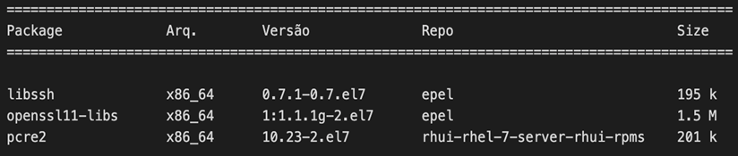
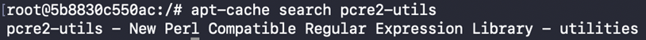
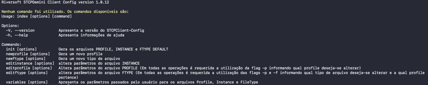
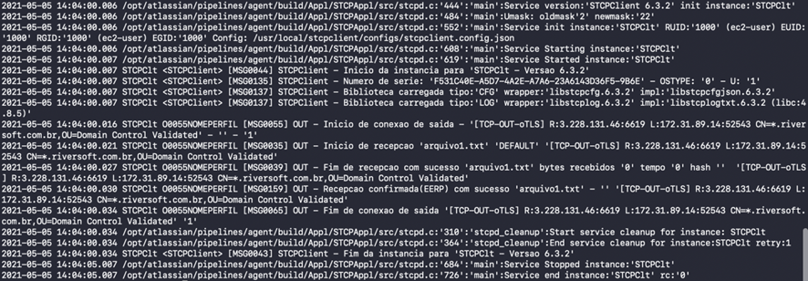
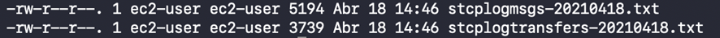

<br>


<br>


Esta seção tem como objetivo descrever os passos iniciais para instalação e configuração do STCP Gemini Client. Outras configurações podem ser realizadas conforme as necessidades específicas do ambiente e/ou funcionalidades utilizadas.

O STCP Gemini Client é uma aplicação cliente utilizada para transferência de arquivos seguro e multiprotocolo para aplicações de e-business e troca de informações corporativas, baseado na especificação OFTP (ODETTE File Transfer Protocol).

## Instalação

Esta seção tem como objetivo descrever os passos iniciais para instalação e configuração do STCP Gemini Client. Outras configurações podem ser realizadas conforme as necessidades específicas do ambiente e/ou funcionalidades utilizadas.

### Requisitos

O STCP Gemini Client está homologado para as distribuições CentOS (versões 7 e 8), Red Hat Enterprise Linux (versões 7 e 8), Amazon Linux, Oracle Linux (versões 7, 8 e 9), Debian (versão 9, 10 e 11) e Ubuntu (versões 18.04, 20.04, 22.04 e 24.04) 

Por questões de segurança, o STCP Gemini Client utiliza versões mais recentes das bibliotecas OPENSSL, LIBSSH e PCRE2. 

Essas bibliotecas são dependências (pré-requisitos) para que o STCP Gemini Client possa ser implantado corretamente e deverão estar instaladas no servidor em que o software será implantado.

A instalação do STCP Gemini Client será realizada através do repositório oficial da Riversoft, de acordo com a distribuição Linux utilizada.

## Instalação: CentOS, Red Hat Enterprise Linux, Oracle Linux e Amazon Linux

### Instalação das dependências



As dependências para o STCP Gemini Client podem ser instaladas através do repositório EPEL, assim como, através dos seus respectivos pacotes RPM, conforme padrão e práticas adotadas por cada organização.

``` bash
$ yum install epel-release
```


**Nota:** O EPEL (Extra Packages for Enterprise Linux) é um repositório utilizado por administradores de sistemas Linux que necessitam instalar no servidor, pacotes mais recentes e versões atualizadas de bibliotecas, visto que esses pacotes mais novos não são imediatamente adicionados aos repositórios oficiais.


No Amazon Linux o acesso ao EPEL pode ser habilitado através do comando:

```bash
amazon-linux-extras enable epel
```

No Oracle Linux, de acordo com a versão utilizada, o acesso ao EPEL pode ser habilitado através do comando abaixo. Para mais informações consulte a documentação da Oracle (https://yum.oracle.com/).



  
  ```
  yum install Oracle-epel-release-el7.x86_64
  ```
  
  
  ```
  yum install Oracle-epel-release-el8.x86_64
  ```
  
  ```
  yum install Oracle-epel-release-el9.x86_64
  ```


Mais informações sobre como configurar o EPEL, podem ser obtidas através do link abaixo ou na documentação da distribuição utilizada.

https://fedoraproject.org/wiki/EPEL

### Instalação do STCP Gemini Client

Para instalar o STCP Gemini Client será necessária a configuração do repositório oficial da Riversoft no servidor.

Para isso, utilizando o terminal, execute os passos a seguir:

```bash
$ vi /etc/yum.repos.d/riversoft.repo
```

Este comando criará um arquivo chamado riversoft-release.repo. Insira nele os seguintes dados:

* Para as versões CentOS 7, Red Hat Enterprise Linux 7, Oracle Linux 7 e Amazon Linux:

```
[Riversoft] 
name=Riversoft Packages for Enterprise Linux 7 - $basearch 
baseurl=http://repoyum.riversoft.com.br/riversoft_repo/prod/centos/7/$basearch
enabled=1 
gpgcheck=1 
```

* Para as versões CentOS 8, Red Hat Enterprise Linux 8, Oracle Linux 8 e Oracle Linux 9:
  
```
[Riversoft] 
name=Riversoft Packages for Enterprise Linux 8 - $basearch 
baseurl=http://repoyum.riversoft.com.br/riversoft_repo/prod/centos/8/$basearch
enabled=1 
gpgcheck=1
```

O arquivo de configuração do repositório oficial da Riversoft também poderá ser obtido utilizando o comando abaixo:

* Para as versões CentOS 7, Red Hat Enterprise Linux 7, Oracle Linux 7 e Amazon Linux:

```bash
$ curl https://www.riversoft.com.br/yum/centos-7.repo --output /etc/yum.repos.d/riversoft-release.repo -k
```

* Para as versões CentOS 8, Red Hat Enterprise Linux 8, Oracle Linux 8 e Oracle Linux 9:

```bash
$ curl https://www.riversoft.com.br/yum/centos-8.repo --output /etc/yum.repos.d/riversoft-release.repo -k
```

Após a configuração do repositório, utilize o comando padrão do YUM para instalar o STCP Gemini Client.

```bash
$ yum install stcpgemini-client.x86_64
```

Confirme as informações exibidas na tela para concluir a instalação e siga para a seção Configuração do STCP Gemini Client.

## Ubuntu e Debian

### Instalação das dependências

A instalação das dependências para o STCP Gemini Client pode ser realizada através do gerenciados de pacotes APT, assim como, através dos seus respectivos pacotes RPM e conforme padrão e práticas adotadas por cada organização.



Utilizando o terminal, execute o passo a seguir:

```bash
$ apt-get update
$ apt-get install pcre2-utils
```

### Instalação do STCP Gemini Client

Para instalar o STCP Gemini Client será necessária a configuração do repositório oficial e da chave pública de assinatura de pacotes da Riversoft.

Utilizando o terminal, execute os passos a seguir:

```bash
$ apt-get install gnupg2
$ wget -O - -q http://apt.riversoft.com.br/riversoft_repo/apt.riversoft.pub | apt-key add -
```

O próximo passo será criar o arquivo de configuração de acesso ao repositório oficial dos pacotes da Riversoft.

```bash
$ vi /etc/apt/sources.list.d/apt-riversoft.list
``` 

Este comando criará um arquivo chamado apt-riversoft.list, insira nele os seguintes dados:

* Para a versão Ubuntu 18.04 (bionic):
  
```
deb http://apt.riversoft.com.br/riversoft_repo/debian/ bionic main
```

* Para a versão Ubuntu 20.04 (focal) e Debian:

```
deb http://apt.riversoft.com.br/riversoft_repo/debian/ focal main
```

* Para a versão Ubunut 22.04, Ubuntu 24.04 e Debian 12:

```
deb http://apt.riversoft.com.br/riversoft_repo/debian/ noble main
```

Após a configuração do repositório, utilize os comandos padrão do APT para instalar o STCP Gemini Client.

```bash
$ apt-get update
$ apt-get install stcpgemini-client
```

Confirme as informações exibidas na tela para concluir a instalação e siga para os passo abaixo de **Configuração** do STCP Gemini Client. 

## Configuração

Toda a configuração da aplicação será realizada através do STCP Gemini Client Config. Não é necessária a utilização do super-usuário (root) para a configuração. 



Siga os passos abaixo para criar o arquivo de configuração da aplicação:

```bash
$ cd /usr/local/stcpclient/configs/
```

```bash
$ cp example-stcpclient.config.json stcpclient.config.json
```

Execute o configurador do STCP Gemini Client e siga os passos exibidos na tela para concluir a configuração (consulte tabela abaixo com os dados para preenchimento).

```bash
$ stcpclient-config init
```

 

## Execução

Para executar a aplicação, através do terminal, utilize a linha de comando abaixo:

```bash
$ stcpclient -p O0055ESALES -r 1 /usr/local/stcpclient/configs/stcpclient.config.json
```

Após a execução do STCP Gemini Client, assim que a conexão com servidor do BRADESCO for estabelecida com sucesso, os arquivos serão enviados e/ou recebidos automaticamente:



### Como enviar e receber arquivos

Os arquivos que serão enviados para o  deverão ser disponibilizados na pasta SAIDA da aplicação.

```
/usr/local/stcpclient/data/STCPClt/O0055ESALES/SAIDA
```

Em seguida, execute o STCP Gemini Client conforme descrito acima.


**Nota:** Todos os arquivos que estiverem na pasta SAIDA serão enviados. 
Os arquivos enviados com sucesso serão removidos automaticamente da pasta de SAIDA.


Ao executar o STCP Gemini Client, os arquivos que forem recebidos do  ficarão disponíveis na pasta ENTRADA da aplicação.

```
/usr/local/stcpclient/data/STCPClt/O0055ESALES/ENTRADA
```

### Modo de execução através do Cron

É possível automatizar a execução do STCP Gemini Client utilizando ferramentas de agendamento que permitem controlar tarefas a serem executadas em tempos pré-configurados, como por exemplo, o Cron. 

```bash
$ sudo cat /etc/crontab

0 0 * * * /bin/bash -l -c "PATH=\"$PATH:/usr/local/bin\"; stcpclient -p O0055ESALES -r 1 /usr/local/stcpclient/configs/stcpclient.config.json"
```

## Logs 

Todo o processo de conexão e transferência de arquivos do STCP Gemini Client é registrado em arquivos de log. 

A aplicação cria um conjunto de arquivos de texto diário contendo as informações de cada conexão, envio e recepção de arquivos. 

Através dos arquivos de log é possível auditar todos os eventos de comunicação e ocorrências de sucesso e/ou falhas no processo de transferência.


Os arquivos de log são armazenados na pasta LOG.

```
/usr/local/stcpclient/logs
```



Para mais detalhes consulte a documentação do produto:
[STCP Gemini Client](/stcpgeminiclient/)
