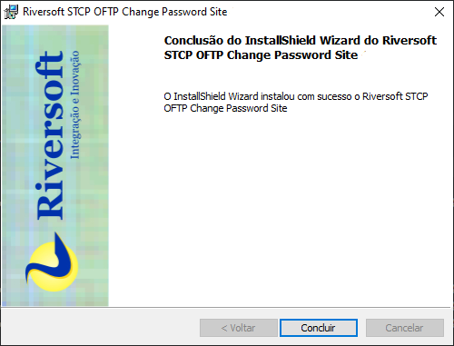

Este documento tem por objetivo descrever os passos necessários para instalação e configuração do site de troca de senha, o STCP OFTP Change Password, do serviço STCP OFTP Server Enterprise.

_O STCP OFTP Change Password deverá ser configurado em um site ou diretório virtual no IIS utilizando SSL (HTTPS) e .Net Framework 2 ou superior_.

------------

## Instalação do site de troca de senha do STCP OFTP Server Enterprise

a. Clique no botão “**Avançar**” para prosseguir com a instalação.


b. Aceite os termos do contrato de licença e clique no botão “**Avançar**”.


c. Aceite ou modifique as informações do cliente e clique no botão “**Avançar**”.


d. Altere a informação do diretório de instalação e clique no botão “**Avançar**”.


e. Selecione a opção desejada e clique no botão “**Instalar**” para prosseguir.


f. Após a finalização do processo de instalação, clique no botão “**Concluir**”.




----------
## Configuração do Riversoft STCP OFTP Change Password no IIS

a. Acesse a ferramenta de configuração do IIS (Internet Information Services) e crie um novo diretório virtual e/ou site para a configuração do STCP OFTP Change Password.

<!--  -->


<!--  -->


b. Informe o nome para o novo diretório virtual conforme figura abaixo e clique no botão "**Avançar**".


c. Configure as permissões conforme apresentado e clique no botão "**Avançar**".


d. Clique no botão "**Concluir**" para finalizar a criação do diretório virtual.


e. Nas propriedades do diretório virtual criado, selecione a aba "**Documentos**" e pressione o botão "**Adicionar**".


f. Informe o nome da página inicial do site conforme a figura abaixo e pressione "**OK**". Remova as outras páginas utilizando o botão "**Remover**".


g. Na aba "**ASP .NET**" configure a versão conforme a figura abaixo:

h. Para finalizar o processo de configuração clique no botão "**OK**".

------
## Configuração do arquivo stcpmon.config

a. Vá até o diretório de instalação da aplicação STCP OFTP Change Password e renomeie o arquivo "**exemplo.stcpmon.config**" para "**stcpmon.config**".


b. Configure o arquivo "**stcpmon.config**" conforme informado abaixo:

```ini
stcpmon.config

<?xml version="1.0" encoding="utf-8"?>
<configuration>
 <configSections>
 <section
name="Server1" type="Riversoft.NetLink.NetLinkTCPConnectionConfig,
Riversoft.NetLink, Version=3.1.0.2053, Culture=neutral,
PublicKeyToken=null"
allowLocation="true"
allowDefinition="Everywhere" allowExeDefinition="MachineToApplication"
restartOnExternalChanges="true"
requirePermission="true" />
 </configSections>
 <Server1 TCPRemoteAddress="172.20.30.213" TCPRemotePort="33050"
TCPRfc2204="16" />
</configuration>
```

c. Na da tag "**configSections**" configure os seguintes parâmetros:

```ini
<configSections>
...
name = defina um nome para o servidor. Exemplo "Server1"
type = "Riversoft.NetLink.NetLinkTCPConnectionConfig, Riversoft.NetLink,
Version=3.1.0.2053, Culture=neutral, PublicKeyToken=null"
allowLocation = "true"
allowDefinition = "Everywhere"
allowExeDefinition = "MachineToApplication"
restartOnExternalChanges = "true"
requirePermission = "true"
...
</configSections>
```

d. Crie uma tag com o nome dado para o servidor, neste exemplo "**Server1**" e configure suas características.

< Server1 TCPRemoteAddress="172.20.30.213" TCPRemotePort="33050" TCPRfc2204="16" />

TCPRemoteAddress = endereço ip do servidor de monitoração do STCP.
TCPRemotePort = porta ip do servidor de monitoração do STCP.
TCPRfc2204 = "16"

-------------

## Configuração do arquivo web.config

a. No diretório de instalação da aplicação STCP OFTP Change Password, renomeie o arquivo "**exemplo.web.config**" para "**web.config**" e abra o arquivo já renomeado.


b. Na seção "**appSettings**", realize as configurações da imagem de validação (Captcha Image).

Configurações da imagem de validação (Captcha Image).

```ini
web.config

...
<!-- Inicio Configuracao do Captcha -->
<add key="STCPCaptcha:CharType" value="AlphaNum" />
<add key="STCPCaptcha:Len" value="4" />
<add key="STCPCaptcha:FontFamily0" value="Comic Sans MS" />
<add key="STCPCaptcha:FontFamily1" value="Times New Roman" />
<add key="STCPCaptcha:FontFamily2" value="Arial" />
<add key="STCPCaptcha:FontFamily3" value="Verdana" />
<add key="STCPCaptcha:FontFamily4" value="Georgia" />
<add key="STCPCaptcha:FontFamily5" value="Impact" />
<add key="STCPCaptcha:FontFamily6" value="Courier New" />
<add key="STCPCaptcha:FontFamily7" value="Book Antiqua" />
<add key="STCPCaptcha:FontFamily8" value="Garamond" />
<add key="STCPCaptcha:FontFamily9" value="Arial Narrow" />
<!-- Fim Configuracao do Captcha -->
...
```
Configure na propriedade "value" o tipo de texto que deverá ser mostrado na imagem.
< add key="STCPCaptcha:CharType" value="AlphaNum" />

"AlphaNum" = letras (maiúsculas ou minúsculas) e números.
"Numeric" = apenas números.
"Alpha" = apenas letras (maiúsculas ou minúsculas).
"AlphaLower" = apenas letras minúsculas.
"AlphaUpper" = apenas letras maiúsculas.
"AlphaLowerNum" = letras minúsculas e números.
"AlphaUpperNum" = letras maiúsculas e números.

Configure na propriedade "value" a quantidade de caracteres que deve ser mostrada na imagem.

< add key="STCPCaptcha:Len" value="4" />

Para alterar o tipo de fonte da imagem, use a seguinte tag:

< add key="STCPCaptcha:FontFamily0" value="Comic Sans MS" />

Configurações da conexão com o servidor STCP

```ini
web.config
...
<!-- Inicio Configuracao de conexao com o Servidor STCP -->
<add key="STCPMonitor:Connection" value="Server1" />
<add key="STCPMonitor:Userid" value="stcpmon" />
<add key="STCPMonitor:Password" value="teste" />
<add key="STCPMonitor:Security" value="false" />
<!-- Fim Configuracao de conexao -->
...
```
Configure na propriedade "value" o nome do servidor informado no arquivo "stcpmon.config".

< add key="STCPMonitor:Connection" value="Server1" />

Configure na propriedade "value" o nome do usuário de monitoração do STCP.

< add key="STCPMonitor:Userid" value="stcpmon" />

Configure na propriedade "value" a senha do usuário de monitoração do STCP.

< add key="STCPMonitor:Password" value="teste" />

Configure na propriedade "value" o valor "true" caso queira habilitar a comunicação através do protocolo SSL3, caso contrário, utilize "false".

< add key="STCPMonitor:Security" value="false" />

Configurações do idioma padrão.

```ini
web.config
...
<!-- Inicio Configuracao do idioma (DEFAULT) -->
<add key="STCPChangePassword:DefaultLanguage" value="ptb" />
...
```

O site do STCP OFTP Change Password pode ser exibido nos idiomas Português, Inglês e Espanhol.
Configure na propriedade "value" o idioma padrão para o site.

< add key="STCPChangePassword:DefaultLanguage" value="ptb" />

"ptb" = Idioma Português.
"enu" = Idioma Inglês.
"esp" = Idioma Espanhol.

Configurações regionais.

```ini
web.config

...
<add key="STCPChangePassword:ImageButtonFlagPTB"
value="~/images/btn_ptb.gif"/>
<add key="STCPChangePassword:ImageButtonFlagENU"
value="~/images/btn_enu.gif"/>
<add key="STCPChangePassword:ImageButtonFlagESP"
value="~/images/btn_esp.gif"/>
...
```

Caso não deseje exibir o site em um determinado idioma, comente a linha desejada utilizando as tags <!- - e -->.

Exemplo:
< add key="STCPChangePassword:ImageButtonFlagPTB"
value="~/images/btn_ptb.gif"/>

< add key="STCPChangePassword:ImageButtonFlagENU"
value="~/images/btn_enu.gif" />

< !-- < add key="STCPChangePassword:ImageButtonFlagESP"
value="~/images/btn_esp.gif" /> -->

Configurações dos botões.

```ini
web.config

...
<add key="STCPChangePassword:ptb:ImageButtonRefresh"
value="~/images/cmdRefresh_ptb_blue1.gif" />
<add key="STCPChangePassword:ptb:ImageButtonConfirm"
value="~/images/cmdCheck1_ptb_blue1.gif" />
<add key="STCPChangePassword:ptb:ImageButtonClose"
value="~/images/cmdClose_ptb_blue1.gif" />
<add key="STCPChangePassword:ptb:ImageButtonDownload3"
value="~/images/cmdDownload3_ptb_blue1.gif" />
<add key="STCPChangePassword:ptb:ImageButtonNext"
value="~/images/cmdNext_ptb_blue1.gif" />
<add key="STCPChangePassword:ptb:ImageButtonDownload"
value="~/images/cmd_download_ptb_blue1.gif" />
<add key="STCPChangePassword:ptb:ImageButtonFinish"
value="~/images/cmdFinish_ptb_blue1.gif" />
...
```

Configure na propriedade "value" o padrão de cores para os botões do site.

Exemplo:
< add key="STCPChangePassword:ptb:ImageButtonRefresh"
value="~/images/cmdRefresh_ptb_PADRAO.gif" />


Onde "PADRAO" pode ser substituído pelas cores:


Configurações dos instaladores e documentação para download.

```ini
web.config
...
 <add key="STCPChangePassword:enu:UrlHyperlinkDownload1"
value="downloads/STCPClient-appl-PTB.msi" />
 <add key="STCPChangePassword:enu:UrlHyperlinkDownload2"
value="downloads/STCPClient-appl-PTB.zip" />
 <add key="STCPChangePassword:enu:UrlHyperlinkDownload3" value="downloads/
STCPClient-appl-PTB.PDF" />
...
```

Através do STCP OFTP Change Password o usuário pode ter acesso ao download da documentação do produto e também dos pacotes de instalação (MSI ou ZIP). Para estarem disponíveis para download, tais arquivos devem ser disponibilizados na pasta "**/download**" do diretório de instalação do site/diretório virtual e seguir a seguinte nomenclatura:


------
## Configuração imagem de fundo e CSS

**Configurações da imagem de fundo do site (background).**

As imagens de fundo do site deverão ser criadas seguindo as dimensões declaradas abaixo e estar no formato JPEG. Tais imagens devem seguir o padrão de nomenclatura "**background_ptb.jpg**" (versão Português), "**background_enu.jpg**" (versão Inglês) e "**background_esp.jpg**" (versão Espanhol).


O diretório padrão para armazenamento das imagens de background é: "**/images**".


Um modelo para ser utilizado como a imagem de fundo, assim como as imagens originais do site padrão, está disponível no diretório "**/modelos**".


**Configurações CSS (cores das bordas e título)**

O padrão de cores das bordas e cor de fundo do título do site padrão do STCP OFTP Change Password, pode ser realizado através da alteração das classes #**conteudo**, #**tituloLogin** e #**frmLogin**, no arquivo "**css/STCPChangePassword.css**"

Nas classes #**conteudo** e #**frmLogin** as alterações devem ser realizadas no parâmetro "**border**", alterando o valor "**#XXXXXX**" pela cor desejada.

Já na classe #**tituloLogin** a alteração deverá ser realizada no parâmetro "**background-color**", alterando o valor "**#XXXXXX**" pela cor desejada.


Seguem abaixo os exemplos das classe do arquivo CSS.


