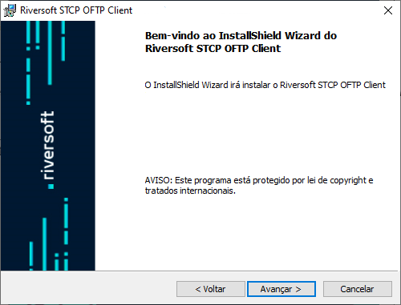

# Distribuição do link para instalação

O STCP OFTP Client é distribuído através de um link para download que contém o programa **SETUP.EXE**. Os seguintes passos devem ser executados para iniciar o processo de instalação:

1. Através do link faça o download da aplicação.
2. Agora execute o arquivo baixado.
3. Clique no botão **Avançar**.

4. Esta é a tela de boas-vindas, clique no botão **Avançar** para continuar. Pressione **Voltar** para retornar à tela anterior ou **Cancelar** para interromper o processo de instalação.

5. Leia cuidadosamente o Contrato de Licença de Uso do Usuário Final e caso concorde com os termos propostos, marque a opção correspondente e pressione o botão **Avançar** para prosseguir com a instalação. Pressione **Voltar** para retornar à tela anterior ou
**Cancelar** para interromper o processo de instalação.

6. Na tela **Informações do Cliente**, informe o Nome do usuário e Organização (Empresa).

7. Clique no botão **Avançar** para continuar a instalação.

Pressione **Voltar** para retornar à tela anterior ou **Cancelar** para cancelar todo o processo de instalação.

8. Na tela **Pasta de Destino**, clique em **Avançar** para instalar no diretório padrão ou **Alterar** para selecionar outro diretório ou criar um novo.

Pressione **Voltar** para retornar à tela anterior ou **Cancelar** para interromper o processo de instalação.

9. Na tela **Pronto para Instalar o Programa**, clique em **Qualquer pessoa que utilizar este computador (todos os usuários)** ou **Somente para mim (Riversoft)** para instalar.

Pressione **Voltar** para retornar à tela anterior ou **Cancelar** para interromper o processo de instalação.

10. Na tela **Conclusão do clt-installshield**, clique no botão **Concluir** para finalizar a instalação.

