## Configurador

O programa de configuração do STCP OFTP Client foi instalado na pasta selecionada durante o processo de instalação e pode ser acessado através do menu **Iniciar**. Caso você não tenha alterado a pasta padrão, execute os seguintes passos:

&nbsp; No menu **Iniciar**, **Todos os Programas**, selecione **Riversoft STCP OFTP Client**.

 &nbsp; Clique no programa **Riversoft STCP OFTP Client Config**.

O programa de configuração pode ser acessado também na pasta **Program** da aplicação, conforme exemplo de estrutura abaixo:

```
*:\STCPCLT\Program\Riversoft STCP OFTP Client Config
```


  
    
       
        
      
    
  



## Informações gerais

<span style="display:inline-block; width: 25px; height: 25px; border-radius: 50%; background-color: #B0B0B0; color: white; text-align: center; line-height: 25px; font-size: 14px;">1</span> &nbsp; Na guia Geral, preencha os campos com as informações descritas abaixo:

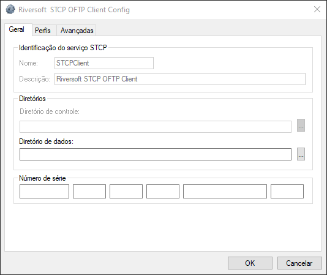

| Campos                |                                                                                                                        Descrição                                                                                                                         |
| :-------------------- | :------------------------------------------------------------------------------------------------------------------------------------------------------------------------------------------------------------------------------------------------------ |
| Nome                  |                                                          Este campo informa o nome do serviço do STCP OFTP Client. <br> Obs.: Para a versão STCP OFTP Client, este parâmetro não pode ser modificado                                                          |
| Descrição             |                                                       Este campo informa a descrição do serviço do STCP OFTP Client. <br> Obs.: Para a versão STCP OFTP Client, este parâmetro não pode ser modificado.                                                       |
| Diretório de controle | Este campo informa o nome do diretório de instalação do STCP OFTP Client, onde serão armazenadas as configurações dos Perfis, logs e arquivos de depuração da comunicação. <br> Obs.: Para a versão STCP OFTP Client, este parâmetro não pode ser modificado. |
| Diretório de dados    |                    Preencha este campo com o diretório onde a estrutura de subdiretórios para envio e recepção dos arquivos de cada Perfil deverá ser criada. <br> Obs.: Esta configuração deve ser alterada antes da criação dos Perfis.                     |
| Número de série*       |                                                              Preencha este campo com o número de série que foi disponibilizado por email.                                                            |



  *O preenchimento deste campo é obrigatório.


## Configurar Perfil

Na guia **Perfis** você poderá adicionar, remover ou modificar os parâmetros de configuração de
um usuário do serviço <a href="/docs/stcpserver/" target="_blank">STCP OFTP Server</a>  &nbsp;.

<span style="display:inline-block; width: 25px; height: 25px; border-radius: 50%; background-color: #B0B0B0; color: white; text-align: center; line-height: 25px; font-size: 14px;">1</span> &nbsp;Clique no botão **Adicionar**


Para um novo Perfil adicionado, automaticamente, será criada uma estrutura de subdiretórios (vide exemplo abaixo) para o envio e recepção dos arquivos, dentro do Diretório de Dados que foi previamente configurado na guia Geral (tópico anterior).



  

    
    

    
      
      
    

    
    

    

      
      

      
      
    

    




<span style="display:inline-block; width: 25px; height: 25px; border-radius: 50%; background-color: #B0B0B0; color: white; text-align: center; line-height: 25px; font-size: 14px;">2</span> &nbsp;Preencha os campos **Nome** e **Descrição**.

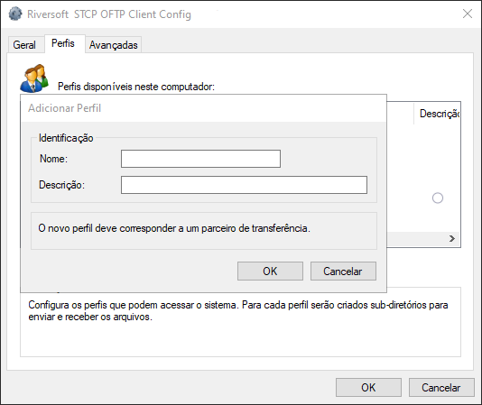

<br>

Clique em **OK**.

<br>


| Campos    |                                                                                                             Descrição                                                                                                              |
| :-------- | :-------------------------------------------------------------------------------------------------------------------------------------------------------------------------------------------------------------------------------- |
| Nome      | Preencha este campo com o nome desejado para este Perfil, que pode ser: a identificação ODETTE (OID) do parceiro, o nome da aplicação, a sua identificação ODETTE (OID) ou outra qualquer. <br>Obs.: Não utilize caracteres especiais. |
| Descrição |                                                                                          Preencha este campo com a descrição que desejar.                                                                                          |
<br>

<span style="display:inline-block; width: 25px; height: 25px; border-radius: 50%; background-color: #B0B0B0; color: white; text-align: center; line-height: 25px; font-size: 14px;">3</span> &nbsp;Na guia **Odette**, preencha os seguintes campos:

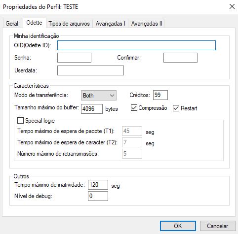

| Campos                                |                                                                                                                        Descrição                                                                                                                        |
| :------------------------------------ | :----------------------------------------------------------------------------------------------------------------------------------------------------------------------------------------------------------------------------------------------------- |
| OID (Odette ID)                       |                                                          Preencha este campo com a identificação Odette associada a este Perfil. Este campo poderá ter no máximo 25 (vinte e cinco) caracteres                                                          |
| Senha                                 |                                                                 Preencha este campo com a senha associada à identificação Odette. Este campo poderá ter no máximo 8 (oito) caracteres.                                                                  |
| Confirmar                             |                                                                                        Preencha este campo com a senha informada no campo Senha para validação.                                                                                         |
| Userdata                              |                                                 Preencha este campo com os dados extras associados à identificação Odette informada. <br> Obs.: Preencha este campo somente se for requerido pelo servidor.                                                  |
| Características                       | As opções definidas neste grupo serão utilizadas pelo STCP OFTP Server na comunicação com o servidor Odette. <br> Obs.: Não modifique estas características sem ler atentamente o que significa cada uma delas e ter certeza de que realmente deseja fazê-lo. |
| Modo de transferência                 |   Esta opção permite selecionar o modo de transferência que será utilizado para comunicação com o servidor, são eles: <br> **Both:** transmissão e recepção de arquivos <br> **Sender:** somente transmissão de arquivos <br> **Receiver:** somente recepção de arquivos    |
| Créditos                              |                                              Preencha este campo com a quantidade de blocos de dados que serão transferidos até aguardar uma nova autorização para envio. O intervalo válido é de 1 até 99                                               |
| Tamanho máximo do buffer              |                                                                Preencha este campo com o tamanho máximo dos blocos de dados que serão transferidos. O intervalo válido é de 1 até 65535.                                                                |
| Compressão                            |                                                                               Esta opção assinalada habilita a compressão dos dados (padrão Odette) de uma transferência.                                                                               |
| Restart                               |                      Esta opção assinalada habilita o controle de recuperação automática na interrupção de uma transferência. Com esta opção habilitada, o STCP OFTP Server irá recuperar a transferência do ponto de interrupção.                      |
| Special Logic                         |  Esta opção assinalada habilita o controle de regime de comunicação lógica especial. Somente deve ser habilitado para comunicação através do protocolo PAD ou SERIAL. Obs.: Não habilite esta opção quando não for utilizado o Protocolo PAD ou SERIAL.  |
| Tempo máximo de espera de pacote (T1) |                                                                                                     Tempo máximo para detectar timeout de processo                                                                                                      |
| Tempo máximo de espera de caracter    |                                                                                        Tempo máximo para detectar erros na recepção dos caracteres individuais.                                                                                         |
| Número máximo de retransmissões       |                                                                           Número máximo de retransmissões utilizando o controle do regime de comunicação de lógica especial.                                                                            |
| Outros                                |                                       As opções definidas neste grupo serão utilizadas localmente pelo STCP OFTP Client para controlar o tempo de inatividade e a geração do arquivo de depuração da comunicação.                                       |
| Tempo máximo de inatividade           |                                                               Preencha este campo com o tempo máximo de inatividade de comunicação entre o STCP OFTP Client Server e o computador remoto                                                                |
| Nível de debug                        |      Preencha este campo com o nível de detalhamento das informações que serão gravadas no arquivo de depuração. Para obter no mesmo arquivo de depuração a informação dos diferentes níveis, preencha este campo com a soma dos níveis desejados.  |
---

Para obter as informações detalhadas sobre o nível de Debug acesse a seção <a href="/debug" target="_blank">Debug</a>  &nbsp;.



Obs.: Somente habilite esta opção quando for solicitado por equipe especializada.


Pressione o botão **OK** para prosseguir ou **Cancelar** para abandonar sem alterar as configurações.

## Guia Avançadas

<span style="display:inline-block; width: 25px; height: 25px; border-radius: 50%; background-color: #B0B0B0; color: white; text-align: center; line-height: 25px; font-size: 14px;">3</span> &nbsp;Na guia **Avançadas**, configure os seguintes campos.

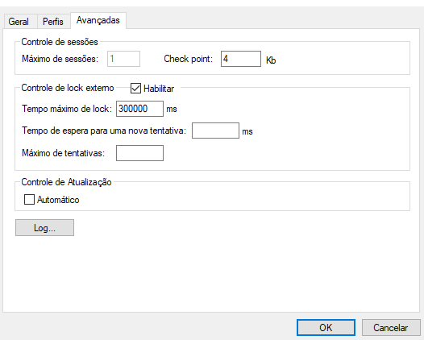

| Campos                                  |                                                                                                                                  Descrição                                                                                                                                   |
| :-------------------------------------- | :-------------------------------------------------------------------------------------------------------------------------------------------------------------------------------------------------------------------------------------------------------------------------- |
| Máximo de sessões                       |                                               Este campo informa a quantidade máxima de sessões simultâneas de transferência que podem ser ativadas pelo serviço. <br> Obs.: Limitado a 1 (uma) sessão na versão STCP OFTP Client.                                                |
| Check point                             | Preencha este campo com o múltiplo da quantidade de dadosrecebidos para que o STCP OFTP Client force uma gravação física do arquivo. No caso de uma interrupção da transferência, a sua recuperação ocorrerá a partir da última posição de check point corretamente gravada. |
| Habilitar                               |                                                                                                                     Habilita o controle de lock externo.                                                                                                                     |
| Tempo máximo de lock                    |                                                                                                               Tempo máximo que o arquivo permanece bloqueado.                                                                                                                |
| Tempo de espera para uma nova tentativa |                                                                                                         Tempo de espera para nova tentativa de processar o arquivo.                                                                                                          |
| Máximo de tentativas                    |                                                                                                                 Número de tentativas de processar o arquivo.                                                                                                                 |
| Controle de Atualização                 |                                                                                                Este campo habilita o controle de atualização automática do STCP OFTP Client.                                                                                                 |

### Log

Clique no botão **Log** para continuar a configuração.


Na guia **Geral**, Preencha os seguintes campos.

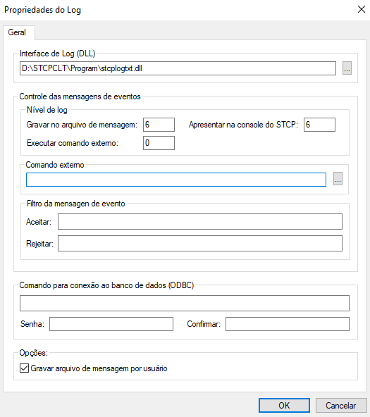

| Campos                                        |                                                                                           Descrição                                                                                           |
| :-------------------------------------------- | :-------------------------------------------------------------------------------------------------------------------------------------------------------------------------------------------: |
| Interface de Log (DLL)                        |                                   Grava em arquivo de texto caso a DLL selecionada seja stcplogtxt.dll ou grava em Banco de dados se a DLL for logodbc.dll.                                   |
| Gravar no arquivo de mensagem                 |                                                    Preencha este campo com o nível de evento que será armazenado no arquivo de mensagens.                                                     |
| Apresentar na console do STCP                 |                                            Preencha este campo com o nível de evento que será mostrado najanela de mensagens do STCP OFTP Server.                                             |
| Executar comando externo                      |                                               Preencha este campo com o nível de evento que irá disparar um comando (programa ou bat) externo.                                                |
| Comando externo                               |                                                             Preencha este campo com o nome do comando externo (programa ou bat).                                                              |
| Aceitar                                       |                                                                  Registra nos arquivos de log ou no Banco de dados do STCP.                                                                   |
| Rejeitar                                      |                                                                Não registra nos arquivos de log ou no Banco de dados do STCP.                                                                 |
| Comando para conexão ao banco de dados (ODBC) |                                                      String de conexão à fonte de dados ODBC. Informe DSN, UID (usuário) e PWD (senha).                                                       |
| Senha                                         |                                                                         Digite a senha para acesso ao banco de dados.                                                                         |
| Confirmar                                     |                                                           Preencha este campo com a senha informada no campo Senha para validação.                                                            |
| Gravar arquivo de mensagem por usuário        | Esta opção assinalada habilita a geração do arquivo de mensagens dos eventos individualmente para cada Usuário. Obs.: O arquivo de mensagens será gerado no subdiretório LOG de cada usuário. |

**Tabela com a descrição do Nível do evento:**

| Nível do Evento |                                                                      Descrição                                                                      |
| :-------------- | :------------------------------------------------------------------------------------------------------------------------------------------------- |
| 0               |                                                    Os eventos de início e término da aplicação.                                                     |
| 1               |                                                        Os eventos que contenham algum erro.                                                         |
| 2               |                                     Os eventos de término da operação de cancelamento de espera de uma conexão.                                     |
| 3               |                                            Os eventos de início e término de cancelamento das conexões.                                             |
| 4               | Os eventos de início e término de conexão com sucesso, início e término de sessão, início e término de transmissão ou início e término de recepção. |
| 5               |                                                                    Não definido.                                                                    |
| 6               |                                                                    Não definido.                                                                    |
| 7               |                                        Os eventos de início e término da unidade de processamento (threads).                                        |
| 8               |                                                      Os eventos de início e término da agenda.                                                      |


 Obs.: Os eventos associados a um nível inferior ou igual ao selecionado serão processados.


Pressione o botão **OK** para prosseguir ou **Cancelar** para abandonar sem alterar as configurações.

## Propriedades do Perfil

<span style="display:inline-block; width: 25px; height: 25px; border-radius: 50%; background-color: #B0B0B0; color: white; text-align: center; line-height: 25px; font-size: 14px;">1</span> &nbsp; Com o perfil já criado, selecione-o e clique no botão **Propriedades**

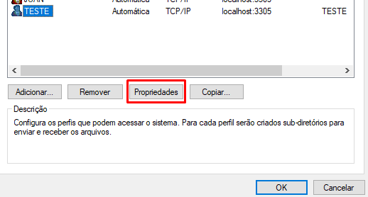

<span style="display:inline-block; width: 25px; height: 25px; border-radius: 50%; background-color: #B0B0B0; color: white; text-align: center; line-height: 25px; font-size: 14px;">2</span> &nbsp; Na guia **Geral**, configure os seguintes campos.


| Campos                                |                                                                                                                                                                                       Descrição                                                                                                                                                                                        |
| :------------------------------------ | :------------------------------------------------------------------------------------------------------------------------------------------------------------------------------------------------------------------------------------------------------------------------------------------------------------------------------------------------------------------------------------ |
| Descrição                             |                                                                                                                                                                    Preencha este campo com a descrição que desejar.                                                                                                                                                                    |
| Email                                 |                                                                                                                                                 Este email deve estar associado à Caixa Postal e serve para o sistema de notificação.                                                                                                                                                  |
| Máximo de sessões                     |                                                                                                                                         Este campo informa a quantidade máxima de sessões simultâneas de transferência que podem ser ativadas.                                                                                                                                         |
| Bloquear usuário                      |                                                                                                                                          Esta opção assinalada habilita temporariamente este Perfil a realizar as operações de transferência.                                                                                                                                          |
| Backup arquivos transmitidos          | Esta opção assinalada habilita temporariamente este Perfil a mover os arquivos transmitidos com sucesso para o subdiretório de backup. <br> Obs.: Os arquivos movidos para o diretório de backup contêm uma extensão no final do nome com a seguinte característica: YYYYMMDDhhmmss, onde YYYY é o ano, MM é o mês, DD é o dia, hh é a hora, mm são os segundos do término da transferência |
| Nome longo para arquivos               |                                        Esta opção assinalada habilita temporariamente este Perfil a transferir arquivos com nome maior que 26 (vinte e seis) posições.                                         |
| Protocolo                             |                                                                                                                                           Este campo seleciona o tipo de protocolo de comunicação que este Perfil irá utilizar para conexão.                                                                                                                                           |
| Adicionar atalho na área de desktop   |                                                                                                         Esta opção assinalada habilita a criação do ícone na área de trabalho (desktop) com o atalho para executar o STCP OFTP Client e realizar a operação de transferência.                                                                                                          |
| Número de tentativas de transferência |                                                                                                                                     Preencha este campo com o número máximo de tentativas de conexão que este Perfil irá executar em caso de falha                                                                                                                                     |
| Intervalo entre tentativas            |                                                                                                                                  Preencha este campo com o intervalo mínimo (segundos) de espera para a realização de uma nova tentativa de conexão.                                                                                                                                   |
| Solicitar usuário e senha             |                                                                                                                                                        Esta opção assinalada irá solicitar usuário e senha ao executar o STCP.                                                                                                                                                         |
---

  Não habilite esta opção se você não tiver absoluta certeza de que o parceiro remoto é um STCP OFTP Client e que esteja também com esta característica habilitada.


<span style="display:inline-block; width: 25px; height: 25px; border-radius: 50%; background-color: #B0B0B0; color: white; text-align: center; line-height: 25px; font-size: 14px;">3</span> &nbsp;Ainda na guia **Geral**, clique no botão **Configurar** para configurar a opção de protocolo
selecionada anteriormente.


| Protocolo     |                                                Descrição                                                |
| :------------ | :-----------------------------------------------------------------------------------------------------: |
| OFTP - TCP/IP | Configura o STCP OFTP Server para utilizar o protocolo de comunicação TCP/IP através de uma rede local. |
---


> Clique [aqui](https://docs.aws.amazon.com/pt_br/AmazonS3/latest/userguide/Welcome.html)  &nbsp; para mais informações sobre o **Amazon Simple Storage Service (S3)**.

> Clique [aqui](https://azure.microsoft.com/pt-br/products/storage/blobs)  &nbsp; para mais informações sobre o **Armazenamento de Blobs do Azure**.

### Protocolo OFTP - TCP/IP

<span style="display:inline-block; width: 25px; height: 25px; border-radius: 50%; background-color: #B0B0B0; color: white; text-align: center; line-height: 25px; font-size: 14px;">1</span> &nbsp; Se o protocolo selecionado foi **OFTP – TCP/IP**, configure as seguintes opções na guia **TCP/IP**.


| Campos             |                                                                                                                                                                                                                                                                                                                                                                                                                                                                                                                                                                  Descrição                                                                                                                                                                                                                                                                                                                                                                                                                                                                                                                                                                   |
| :----------------- | :------------------------------------------------------------------------------------------------------------------------------------------------------------------------------------------------------------------------------------------------------------------------------------------------------------------------------------------------------------------------------------------------------------------------------------------------------------------------------------------------------------------------------------------------------------------------------------------------------------------------------------------------------------------------------------------------------------------------------------------------------------------------------------------------------------------------------------------------------------------------------------------------------------------------------------------------------------------------------------------------------------------------------------------------------------------------------------------------------------------------------------------ |
| Endereço IP        |                                                                                                                                                                                                                                                                                                                                                                                                                                                                                                                             Preencha este campo com o endereço TCP/IP ou nome (DNS) do servidor STCP OFTP Server                                                                                                                                                                                                                                                                                                                                                                                                                                                                                                                             |
| Porta IP           |                                                                                                                                                                                                                                                                                                                                                                                                                                                                                                                                     Preencha este campo com a porta TCP/IP do servidor STCP OFTP Server.                                                                                                                                                                                                                                                                                                                                                                                                                                                                                                                                     |
| Endereço IP        |                                                                                                                                                                                                                                                                                                                                                                                                                                                                                                                         Preencha este campo com o endereço TCP/IP ou nome (DNS) da Interface local STCP OFTP Client.                                                                                                                                                                                                                                                                                                                                                                                                                                                                                                                         |
| Porta IP           |                                                                                                                                                                                                                                                                                                                                                                                                                                                                                                                                 Preencha este campo com a porta TCP/IP da Interface local STCP OFTP Client.                                                                                                                                                                                                                                                                                                                                                                                                                                                                                                                                  |
| Comunicação segura | Grava as informações de mudanças do estado do protocolo. <br> **Nativa (Básica):** Configura a comunicação segura com criptografia com nível de segurança básico. <br> `Obs.:` Antes de habilitar esta opção confirme se o servidor com quem você deseja se comunicar suporta esta característica. <br> <br> **Nativa (Média):** Configura a comunicação segura com criptografia com nível de segurança médio. <br> `Obs.:` Antes de habilitar esta opção confirme se o servidor com quem você deseja se comunicar suporta esta característica. <br> <br>  **Nativa (Alta):** Configura a comunicação segura com criptografia com nível de segurança alto. <br> `Obs.:` Antes de habilitar esta opção confirme se o servidor com quem você deseja se comunicar suporta esta característica. <br> <br> **TLS(Openssl):** Configura a comunicação segura com criptografia e certificação digital, com a utilização da padronização definida na RFC2246 (TLS1/SSL3). O TLS é comumente encontrado nos servidores de sites seguros (HTTPS) e oferece o maior grau de segurança atualmente disponível. <br> `Obs.:` Antes de habilitar esta opção confirme se o servidor com quem você deseja se comunicar suporta esta característica. |
| Compatibilidade    |                                                                                                                                                                                                                                                                                                                                                                                                                                                                                                             Esta opção possibilita compatibilizar o STCP OFTP Client com diferentes produtos que existem atualmente no mercado.                                                                                                                                                                                                                                                                                                                                                                                                                                                                                                              |
| RFC2204            |                                                                                                                                                                                                                                                                                                                                                                                                                                                                                                        Esta opção de compatibilidade permite a comunicação do STCP OFTP Client com outros produtos que seguem a recomendação RFC2204.                                                                                                                                                                                                                                                                                                                                                                                                                                                                                                        |
| RFC1006/RFC1086    |                                                                                                                                                                                                                                                                                                                                                                                                                                                                                       Esta opção de compatibilidade permite a comunicação do STCP OFTP Client através de gateways de comunicação TCP-IP/X.25, que seguem a recomendação RFC1006/1086.                                                                                                                                                                                                                                                                                                                                                                                                                                                                                        |
| RVS\*              |                                                                                                                                                                                                                                                                                                                                                                                                                                   Esta opção de compatibilidade permite a comunicação do STCP OFTP Client com o produto RVS*. <br> Obs.: Esta opção não deve ser habilitada quando o servidor RVS* for uma versão do mainframe (grande porte). donos.                                                                                                                                                                                                                                                                                                                                                                                                                                    |
| X25/Router         |                                                                                                                                                                                                                                                                                                                                                                                                                                                        Esta opção de compatibilidade permite a comunicação do STCP OFTP Client através de roteadores, com suporte à comunicação X.25 através de socket. Obs.: Consulte a Riversoft sobre esta configuração se você estiver em dúvida                                                                                                                                                                                                                                                                                                                                                                                                                                                         |
| XFB\*/SSL          |                                                                                                                                                                                                                                                                                                                                                                                                                                                                                                                                    Habilita a compatibilidade do STCP com o XFB em conexões seguras SSL.                                                                                                                                                                                                                                                                                                                                                                                                                                                                                                                                     |
| Compressão GZIP    |                                                                                                                                                                                                                                                                                                                                                                                                                                                        Esta opção assinalada habilita a utilização da compressão GZIP onthe-fly (durante a transferência). <br> Obs.: Antes de habilitar esta opção confirme se o servidor com quem você deseja se comunicar suporta esta característica.                                                                                                                                                                                                                                                                                                                                                                                                                                                         |


  \*As marcas citadas são propriedade dos seus respectivos donos.


<span style="display:inline-block; width: 25px; height: 25px; border-radius: 50%; background-color: #B0B0B0; color: white; text-align: center; line-height: 25px; font-size: 14px;">2</span> &nbsp;Na guia **TLS(Openssl)**, configure os seguintes campos para o protocolo OFTP - TCP/IP.


| Campos      |                                                                                                         Descrição                                                                                                         |
| :---------- | :-----------------------------------------------------------------------------------------------------------------------------------------------------------------------------------------------------------------------: |
| Chave       |                                                         Preencha este campo com o nome do arquivo (caminho completo) onde se encontra instalada a chave privativa                                                         |
| Certificado |                                     Preencha este campo com o nome do arquivo (caminho completo)onde se encontra instalado o certificado digital (X509) associado à chave privativa.                                      |
| Senha       |                                                                         Preencha este campo com a senha que protege o arquivo da chave privativa.                                                                         |
| Confirmar   |                                                                         Preencha este campo com a senha informada no campo Senha para validação.                                                                          |
| Arquivo     |             Preencha este campo com o nome do arquivo (caminho completo) onde se encontra instalado o certificado digital (X509) contendo a chave pública que assina o certificado apresentado pelo servidor.             |
| Diretório   |         Preencha este campo com o nome do diretório (caminho completo) onde se encontram instalados os certificados digitais (X509) contendo a chave pública que assina o certificado apresentado pelo servidor.          |
| Algoritmos  | Preencha este campo com os nomes dos algoritmos suportados para assinatura digital, hashing e criptografia dos dados. Obs.: Caso este campo não seja configurado, o protocolo TLS1/SSL3 será selecionado automaticamente. |
| Debug       |                                                            Esta opção permite gerar um arquivo de depuração na pasta Debug do diretório de instalação do STCP.                                                            |
----

<span style="display:inline-block; width: 25px; height: 25px; border-radius: 50%; background-color: #B0B0B0; color: white; text-align: center; line-height: 25px; font-size: 14px;">3</span> &nbsp;Na guia **Proxy**, configure as seguintes opções para o protocolo **OFTP – TCP/IP**.

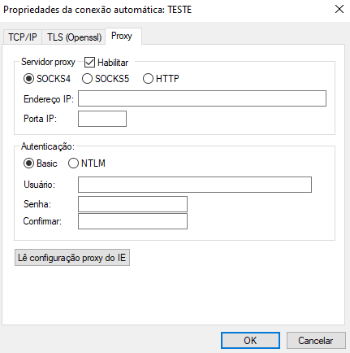

| Campos                      |                                                                                        Descrição                                                                                         |
| :-------------------------- | :-------------------------------------------------------------------------------------------------------------------------------------------------------------------------------------- |
| Habilitar                   |                                                            Esta opção assinalada habilita a utilização de um servidor Proxy.                                                             |
| SOCKS4                      |                                            Esta opção habilita a utilização de um servidor Proxy em conformidade com a especificação SOCKS4.                                             |
| SOCKS5                      | Esta opção habilita a utilização de um servidor Proxy em conformidade com a recomendação RFC1928 (SOCKS5) e RFC1929. <br> Obs.: O processo de autenticação utilizado é o definido na RFC1929. |
| HTTP                        |              Esta opção habilita a utilização de um servidor Proxy em conformidade com a recomendação RFC2817 (HTTP). <br> Obs.: O processo de autenticação utilizado é o Basic.              |
| Endereço IP                 |                                                     Preencha este campo com o endereço TCP/IP ou nome (DNS) do servidor STCP Proxy.                                                      |
| Porta IP                    |                                                                Preencha este campo com a porta TCP/IP do servidor Proxy.                                                                 |
| Basic                       |                                                     Marque esta opção se o seu servidor Proxy suporta o modo de autenticação Basic.                                                      |
| NTLM                        |           Marque esta opção se o seu servidor Proxy suporta o modo de autenticação NTLM. Caso você utilize servidores Proxy da Microsoft, esta deve ser a opção preferencial.            |
| Usuário                     |                                                   Preencha este campo com o nome do usuário autorizado a utilizar o serviço de Proxy.                                                    |
| Senha                       |                                                         Preencha este campo com a senha informada no campo Senha para validação.                                                         |
| Confirmar                   |                                                         Preencha este campo com a senha informada no campo Senha para validação.                                                         |
| Lê configuração Proxy do IE |                  Pressione este botão para ler as configurações de Proxy configuradas no Internet Explorer. <br> Obs.: As informações de autenticação não serão lidas do IE.                  |
--------

Pressione o botão **OK** para prosseguir ou **Cancelar** para abandonar sem alterar as configurações

### Tipos de Arquivos

<span style="display:inline-block; width: 25px; height: 25px; border-radius: 50%; background-color: #B0B0B0; color: white; text-align: center; line-height: 25px; font-size: 14px;">1</span> &nbsp;Vá para a guia **Tipos de Arquivos**

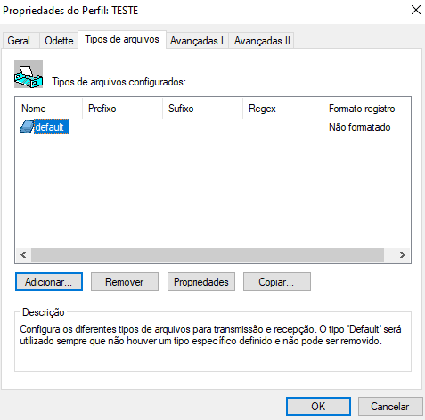

A configuração de um **Tipo de Arquivo** possibilita alterar algumas características na transferência do arquivo, tais como: conversão do nome ou formato do arquivo, conversão da codificação dos dados, inicialização de uma aplicação ou bat, entre outras.

O tipo **Default** sempre deverá existir e será utilizado nos casos em que não haja um tipo específico definido para a transferência em andamento.

A associação entre um **Tipo de arquivo** e o arquivo propriamente dito pode ser estabelecida de três formas distintas:

| Tipo |                                          Descrição                                           |
| :--- | :------------------------------------------------------------------------------------------: |
| 1    |                         Através do nome do arquivo e o nome do tipo.                         |
| 2    | Parte do nome do arquivo e os valores definidos na propriedades de Prefixo e Sufixo do tipo. |
| 3    |              O nome do arquivo e os valores definidos em uma expressão regular.              |
---


  Obs.: Para informações mais detalhadas sobre expressão regular (RegEx), acesse
  o site www.pcre.org.


A tabela abaixo demonstra a associação do nome do arquivo com o tipo específico:

| Nome Tipo | Tipo | Prefixo | Sufixo | Regex |    Nome Arquivo     |         Associação          |
| :-------- | :--: | :-----: | :----: | :---: | :-----------------: | :-------------------------: |
| TEST.0    |  1   |    -    |   -    |   -   |  TEST.0 e TEST.TXT  |  TEST.0: Sim TEST.TXT: Não  |
| TEST.1    |  2   |  TEST   |   -    |   -   | TEST.TXT e TXT.TEST | TEST.TXT: Sim TXT.TEST: Não |
| TEST.2    |  2   |    -    |  TEST  |   -   | TXT.TEST e TXT.TXT  | TXT.TEST: Sim TXT.TXT: Não  |
| TEST.3    |  3   |    -    |   -    |  T.T  |  TXT.TXT e TXTTXT   |  TXT.TXT: Sim TXTTXT: Não   |
| Default   |  -   |    -    |   -    |   -   |       TXTTXT        |             Sim             |

Nesta nova tela, preencha o campo com o **Nome do novo tipo de arquivo**.
Clique em **OK** para salvar as configurações.


| Campo                        |                                                       Descrição                                                        |
| :--------------------------- | :--------------------------------------------------------------------------------------------------------------------: |
| Nome do novo tipo de arquivo | Preencha este campo com o nome desejado para o novo tipo. Obs.: Não utilize caracteres especiais ou espaços em branco. |
-------

<span style="display:inline-block; width: 25px; height: 25px; border-radius: 50%; background-color: #B0B0B0; color: white; text-align: center; line-height: 25px; font-size: 14px;">2</span> &nbsp;Na guia **Geral**, preencha e configure os seguintes campos.

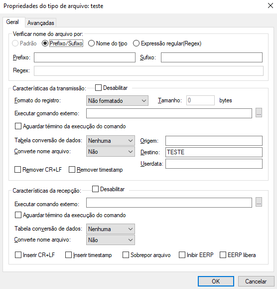

| Campos                         |                                                                                                                                          Descrição                                                                                                                                           |
| :----------------------------- | :------------------------------------------------------------------------------------------------------------------------------------------------------------------------------------------------------------------------------------------------------------------------------------------: |
| Verificar nome do arquivo por: | As opções definidas neste grupo serão utilizadas pelo STCP OFTP Client para definir a forma de associação do nome do arquivo com o tipo: Padrão (Default), Prefixo/Sufixo, Nome do tipo, Expressão regular. Obs.: O nome do tipo associa o nome do arquivo ao nome do tipo de arquivo criado |
| Prefixo                        |                                                                                                   Preencha este campo com o prefixo do nome do arquivo que deve ser associado a este tipo.                                                                                                   |
| Sufixo                         |                                                                                                   Preencha este campo com o sufixo do nome do arquivo que deve ser associado a este tipo.                                                                                                    |
| Expressão regular              |                                                                                                       Preencha este campo com a expressão regular que deve ser associada a este tipo.                                                                                                        |
| Desabilitar                    |                                                                                                       Esta opção assinalada desabilita o tratamento do tipo de arquivo na transmissão.                                                                                                       |
| Formato do registro            |                Esta opção permite selecionar o formato do registro do arquivo, são eles: Não Formatado, Fixo e Variável. Obs.: Somente utilize Fixo ou Variável quando o servidor Odette for uma versão de mainframe (grande porte) e esta característica estiver habilitada.                |
| Executar comando externo       |                                                                                Preencha este campo com o nome de uma aplicação ou arquivo de lote (bat) a ser executado após o envio com sucesso do arquivo.                                                                                 |
| Tabela conversão de dados      |                                                 Esta opção permite selecionar a tabela de conversão dos dados na transmissão, são elas: Nenhuma, ASC2EBC.TAB (converte de ASCII para EBCDIC) e EBC2ASC.TAB (converte de EBCDIC para ASCII).                                                  |
| Origem                         |                                                                    Preencha este campo com o a identificação Odette (OID) de origem do arquivo. Obs.: Quando o Perfil é criado, este campo contém a identificação local.                                                                     |
| Converte nome arquivo          |                                                                                   Esta opção permite selecionar a conversão do nome do arquivo antes de transmitir, são elas: Não, maiúscula ou minúscula.                                                                                   |
| Destino                        |                                                                  Preencha este campo com o a identificação Odette (OID) do destino deste arquivo. Obs.: Quando o Perfil é criado, este campo contém a identificação remota.                                                                  |
| Remover CR+LF                  |                                     Esta opção permite habilitar ou inibir a remoção dos caracteres CR (Carriage Return) e LF (Line Feed) na transmissão do arquivo. Obs.: Somente utilize esta opção quando o formato do registro for Fixo ou Variável.                                     |
| Remover Timestamp              |                                                                                                  Esta opção permite habilitar ou inibir a remoção do timestamp externo do nome do arquivo.                                                                                                   |
| Userdata                       |                                                                    Preencha este campo com os dados extras associados à identificação Odette informada. Obs.: Preencha este campo somente se for requerido pelo servidor                                                                     |
| Desabilitar                    |                                                                                                         Esta opção assinalada desabilita o tratamento do tipo de arquivo na recepção                                                                                                         |
| Executar comando externo       |                                                                               Preencha este campo com o nome de uma aplicação ou arquivo de lote (bat) a ser executado após a recepção com sucesso do arquivo.                                                                               |
| Tabela conversão de dados      |                                                   Esta opção permite selecionar a tabela de conversão dos dados na recepção, são elas: Nenhuma, ASC2EBC.TAB (converte de ASCII para EBCDIC) e EBC2ASC.TAB (converte de EBCDIC para ASCII).                                                   |
| Converte nome do arquivo       |                                                                                     Esta opção permite selecionar a conversão do nome do arquivo após a recepção, são elas: Não, maiúscula ou minúscula.                                                                                     |
| Inserir CR+LF                  |                                      Esta opção permite habilitar ou inibir a inserção dos caracteres CR (Carriage Return) e LF (Line Feed) na recepção do arquivo. Obs.: Somente utilize esta opção quando o formato do registro for Fixo ou Variável.                                      |
| Inserir Timestamp              |                                                                                                  Esta opção permite habilitar ou inibir a inserção do timestamp externo no nome do arquivo.                                                                                                  |
| Sobrepor                       |                                                                                        Esta opção permite habilitar ou inibir a sobreposição do arquivo quando já existir um arquivo com o mesmo nome                                                                                        |
| Inibir EERP                    |                                    Esta opção permite habilitar ou inibir o envio do comando Odette EERP (End to End Response) ao final da recepção do arquivo com sucesso. Obs.: Somente utilize esta opção se o servidor suportar esta característica.                                     |
| EERP libera                    |                                       Esta opção permite habilitar ou inibir o tratamento do arquivo recebido somente após o envio do Odette EERP (End to End Response). Obs.: Somente utilize esta opção se o servidor suportar esta característica.                                        |
----------------

<span style="display:inline-block; width: 25px; height: 25px; border-radius: 50%; background-color: #B0B0B0; color: white; text-align: center; line-height: 25px; font-size: 14px;">3</span> &nbsp;Na guia **Avançadas**, selecione as seguintes propriedades do tipo de arquivo.

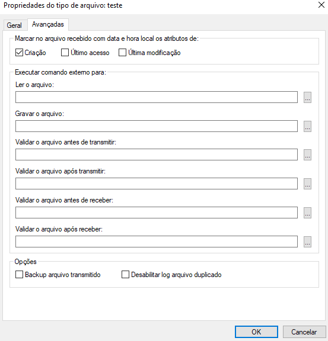

| Campos                                                            |                                                                                                         Descrição                                                                                                          |
| :---------------------------------------------------------------- | :------------------------------------------------------------------------------------------------------------------------------------------------------------------------------------------------------------------------: |
| Marcar no arquivo recebido com data e hora local os atributos de: | Esta opção permite habilitar ou desabilitar a inserção da data e hora local no arquivo recebido para os atributos correspondentes. Obs.: A data e a hora do protocolo ODETTE serão utilizadas nos atributos desabilitados. |
| Ler o arquivo                                                     |                                                        Preencha este campo com o nome de um programa externo que será executado para realizar a leitura do arquivo.                                                        |
| Gravar o arquivo                                                  |                                                       Preencha este campo com o nome de um programa externo que será executado para realizar a gravação do arquivo.                                                        |
| Backup arquivo transmitido                                        |                                                                     Esta opção assinalada habilita o backup dos arquivos transmitidos para este tipo.                                                                      |
---------------

Validar o arquivo antes de transmitir:

Executa um comando externo para validar o arquivo antes de transmitir. Em caso de sucesso (Return code 0), o processo de transmissão será executado.


Validar o arquivo após transmitir:

Executa comando para validar arquivo após a transmissão. Em caso de sucesso (Return code 0), o processo de transmissão será executado.


Validar o arquivo antes de receber:

Executa um comando externo antes de receber o arquivo. Em caso de sucesso (Return code 0), o arquivo é fechado e a recepção, finalizada com sucesso.


Validar o arquivo após receber:

Executa um comando externo após receber o arquivo, antes do fechamento do arquivo. Em caso
de sucesso (Return code 0), o processo é finalizado com sucesso.


### Guia Avançadas I

Na guia **Avançadas I**, nas **Propriedades do Perfil**, preencha os seguintes campos de configuração.

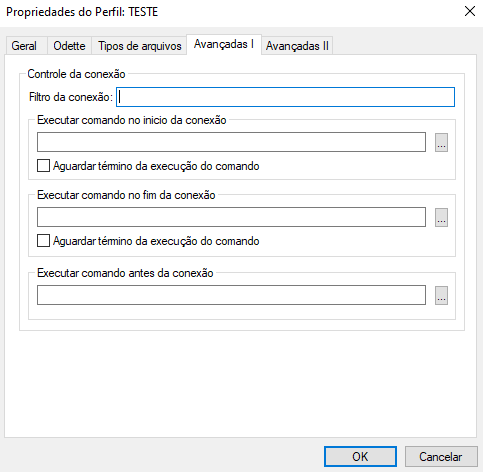

| Campos                                  |                                                                                                            Descrição                                                                                                             |
| :-------------------------------------- | :------------------------------------------------------------------------------------------------------------------------------------------------------------------------------------------------------------------------------: |
| Filtro da conexão                       |                                                                      Preencha este campo com uma expressão regular para validar as informações da conexão.                                                                       |
| Executar comando no início da conexão   |    Preencha este campo com o nome de um comando (programa ou bat) externo que deve ser executado no início da conexão, imediatamente, após a identificação do usuário e antes de transferir (enviar ou receber) os arquivos.     |
| Aguardar término da execução do comando | Esta opção assinalada habilita o STCP OFTP Server a aguardar o encerramento do comando externo. Obs.: Utilize esta opção com cautela. Caso a aplicação necessite realizar operações complexas, mantenha esta opção desabilitada. |
| Executar comando no fim da conexão      |                                                        Preencha este campo com o nome de um comando (programa ou bat) externo que deve ser executado ao final da conexão                                                         |
| Aguardar término da execução do comando | Esta opção assinalada habilita o STCP OFTP Server a aguardar o encerramento do comando externo. Obs.: Utilize esta opção com cautela. Caso a aplicação necessite realizar operações complexas, mantenha esta opção desabilitada. |

### Guia Avançadas II

Na guia **Avançadas II**, nas **Propriedades do Perfil**, preencha os seguintes campos de configuração.


| Campos                                                   |                                                                           Descrição                                                                           |
| :------------------------------------------------------- | :-----------------------------------------------------------------------------------------------------------------------------------------------------------: |
| Enviar na conexão de saída                               | Esta opção assinalada habilita o envio de informações TolkenID/Hash e é configurada quando utilizamos o STCP OFTP Server com a conexão automática habilitada. |
| Interface externa para gerar TokenID/Hash para a conexão |                             Parâmetro que informa a biblioteca utilizada para gerar as informações TolkenID/Hash para a conexão.                              |
| Filtro de arquivos                                       |                                 Preencha este campo com uma expressão regular para validar o nome do arquivo na transmissão.                                  |
| Tamanho máximo                                           |                             Preencha este campo com o tamanho máximo que um arquivo pode ter para ser transferido na transmissão.                             |
| Enviar ID local do arquivo no campo Userdata             |                                            Esta opção assinalada habilita o envio de um sequencial para o arquivo.                                            |
| Filtro de arquivos                                       |                                   Preencha este campo com uma expressão regular para validar o nome do arquivo na recepção.                                   |
| Tamanho máximo                                           |                              Preencha este campo com o tamanho máximo que um arquivo pode ter para ser transferido na recepção.                               |
| Criar referência de arquivo recebido                     |                           Esta opção controla a duplicidade de arquivo, criando uma referência do arquivo no diretório **Restart**.                           |


## Configuração para comunicação TLS(Openssl)

Na guia **Perfis**, selecione o perfil desejado e clique no botão **Propriedades**.


Na guia **Geral**, pressione o botão **Configurar**.

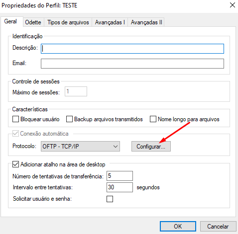

Na guia **TCP/IP**, marque a opção **Comunicação Segura** e em seguida, selecione **TLS**.
Clique em **OK** para concluir o processo de configuração.


Caso a comunicação entre o STCP OFTP Server Enterprise/Lite e o STCP OFTP Client que está sendo configurado exija autenticação, o **Certificado Digital** deverá ser informado na guia **TLS(Openssl)** no campo **Arquivo da opção Certificados CA (Autoridades)**.

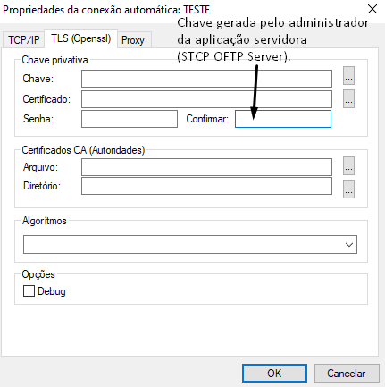


## Estrutura dos Diretórios

Após a sua instalação e configuração, teremos a seguinte árvore de diretórios, onde serão armazenadas as informações de configuração, logs e controle.


  
    

    
    

    
      
      
    

    
    

    

      
      

      
      
    

    


  
  

  
    
    
  

  
  
  
  
  
  

  
    
    
    
    
    
    
    
    
    
    
    
    
    
    
    
    
    
    
    
    
    
    
    
    
    
    
    
    

  

  
    
    
    
  

  
  

  
    
    
    
    
    
    
    
    

  

  
  

  





