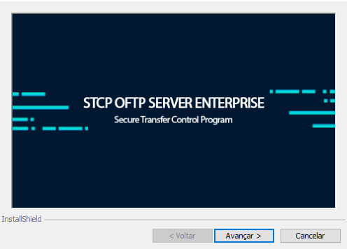
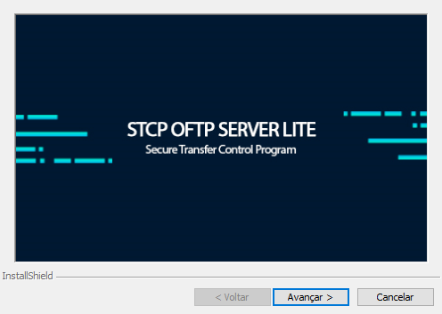

## Como instalar o STCP OFTP Server

O STCP OFTP Server é distribuído através de um link de instalação, que contém um executável em formato `msi`. Os seguintes passos devem ser executados para iniciar o processo de instalação:

1 Clique no executável para iniciar o processo de instalação.

2 Esta é a tela de boas-vindas, clique em **Avançar** para continuar.

Pressione **Voltar** para retornar à tela anterior ou **Cancelar** para interromper o processo de instalação.

3 Leia cuidadosamente o Contrato de Licença de Uso do Usuário Final e caso concorde com os termos propostos, marque a opção correspondente e pressione o botão **Avançar** para prosseguir com a instalação.

Pressione **Voltar** para retornar à tela anterior ou **Cancelar** para interromper o processo de instalação.

<!--  -->

4 Na tela **Informações do Cliente**, informe o Nome do usuário e Empresa.
5. Clique em **Avançar** para continuar a instalação.

Pressione **Voltar** para retornar à tela anterior ou **Cancelar** para cancelar todo o processo de instalação.

<!--  -->

6 Na tela **Pasta de Destino**, clique em **Avançar** para instalar no diretório padrão ou **Alterar** para selecionar outro diretório ou criar um novo.

Pressione **Voltar** para retornar à tela anterior ou **Cancelar** para interromper o processo de instalação.

<!--  -->

7 Na tela **Pronto para Instalar** o Programa, verifique se as configurações escolhidas estão corretas e clique em **Instalar** para continuar.

Pressione **Voltar** para retornar à tela anterior ou **Cancelar** para interromper o processo de instalação.

<!--  -->

8 Na tela **Conclusão do Installshield**, clique em **Concluir** para finalizar a instalação.

<!--  -->
