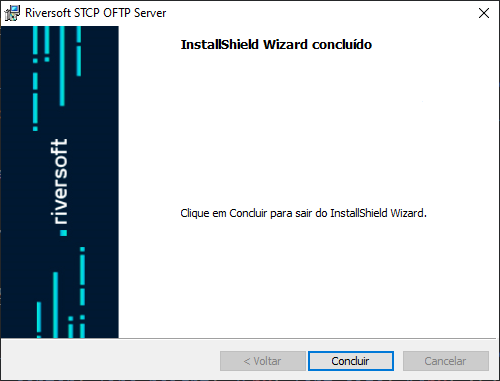

## Distribuição dos pacotes

O pacote de instalação será distribuído através de um link pela Equipe de Sustentação da Riversoft.

Após extrair o zip com o executável, os seguintes passos devem ser executados:

1 &nbsp; Clique no executável para iniciar o processo de instalação.

2 &nbsp; Esta é a tela de boas-vindas, clique em **Avançar** para continuar.

Pressione **Voltar** para retornar à tela anterior ou **Cancelar** para interromper o processo de instalação.

3 &nbsp; Leia cuidadosamente o Contrato de Licença de Uso do Usuário Final e caso concorde com os termos propostos, marque a opção correspondente e pressione o botão **Avançar** para prosseguir com a instalação.

Pressione **Voltar** para retornar à tela anterior ou **Cancelar** para interromper o processo de instalação.

4 &nbsp; Na tela **Informações do Cliente**, informe o Nome do usuário e Empresa.

Clique em **Avançar** para continuar a instalação.

Pressione **Voltar** para retornar à tela anterior ou **Cancelar** para cancelar todo o processo de instalação.

5 &nbsp; Na tela **Pasta de Destino**, clique em **Avançar** para instalar no diretório padrão ou **Alterar** para selecionar outro diretório ou criar um novo.

Pressione **Voltar** para retornar à tela anterior ou **Cancelar** para interromper o processo de instalação.

6 &nbsp; Na tela **Pronto para Instalar** o Programa, verifique se as configurações escolhidas estão corretas e clique em **Instalar** para continuar.

Pressione **Voltar** para retornar à tela anterior ou **Cancelar** para interromper o processo de instalação.

7 &nbsp;Na tela **Conclusão do Installshield**, clique em **Concluir** para finalizar a instalação.

