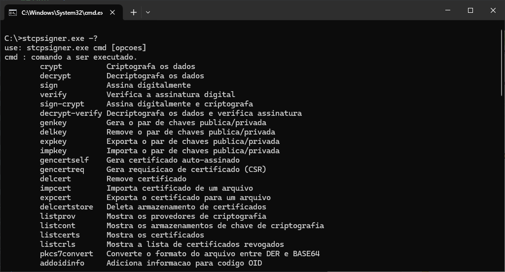

# Distribuição do executável

O pacote de instalação será distribuído através de um link pela Equipe de Sustentação da Riversoft.

Após extrair o zip com o arquivo executável, execute-o no terminal com os parâmteros desejados.

Exemplo:


  
  
  



  Veja na seção de [Execução](/docs/stcpsigner/exec/) cada comando disponível. 


