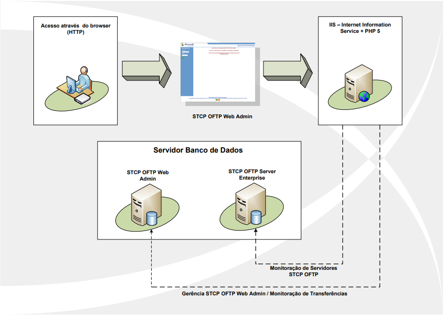

# Introdução

O STCP OFTP Web Admin é uma ferramenta com acesso através do browser (HTTP) que possibilita a supervisão e monitoração das transferências de dados realizadas pelo software do STCP OFTP Client/Server.

 

# Características Gerais

* Ferramenta para supervisão e monitoração das transferências;
* Acesso através do browser (HTTP);
* Visão diferenciada por operador;
* Consulta de transferências;
* Monitoração remota do serviço;
* Relatório de eventos;
* Relatório de estatísticas.

 

# Por que utilizar?

A proposta da ferramenta STCP OFTP Web Admin é facilitar o acesso da monitoração das funcionalidades do STCP OFTP.

Através de uma interface web, um usuário previamente cadastrado pode gerenciar as transferências de dados, os eventos ocorridos, consultar os agendamentos do sistema, monitorar os servidores STCP OFTP remotamente e tantas outras funcionalidades que podem ser visualizadas na seção de <a href="/docs/stcpwebadmin/config/#funcionalidades">Funcionalidades</a>  &nbsp;

 

 

