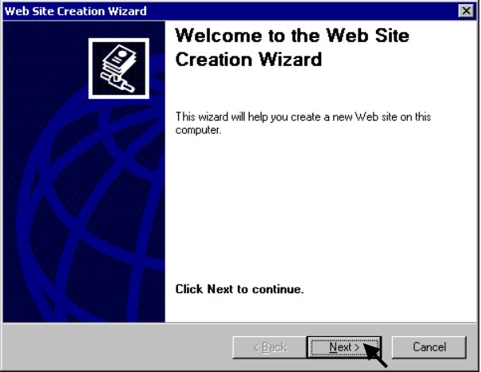
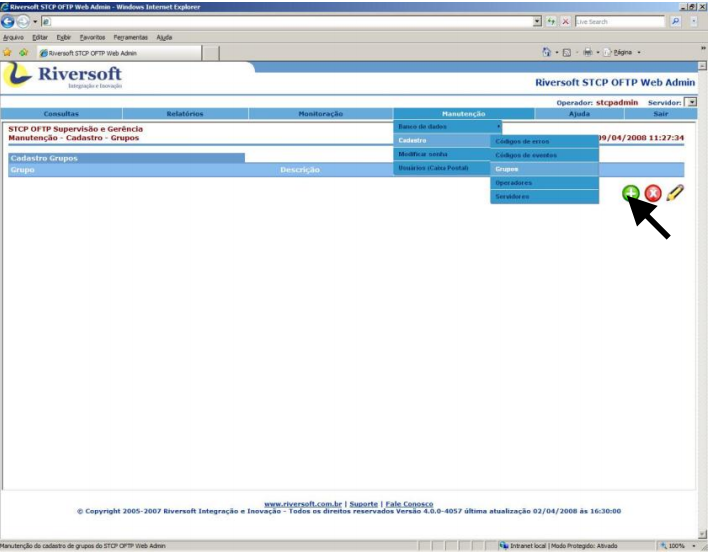
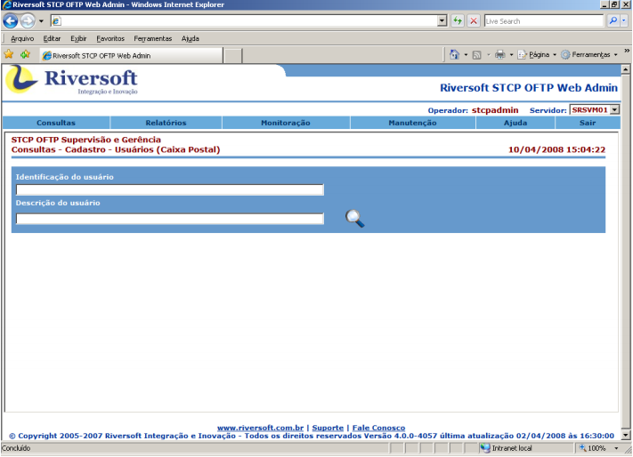
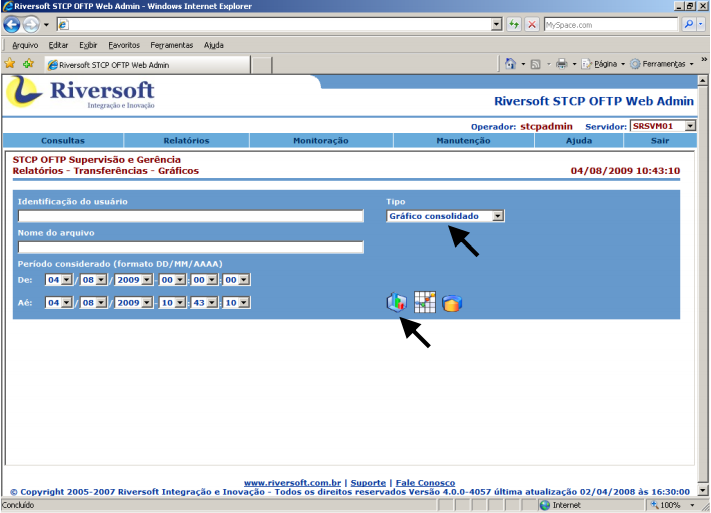
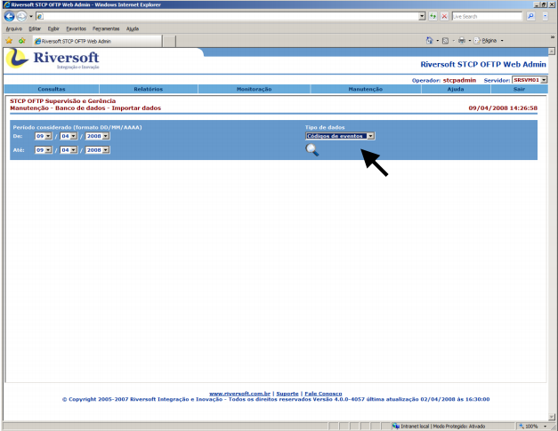
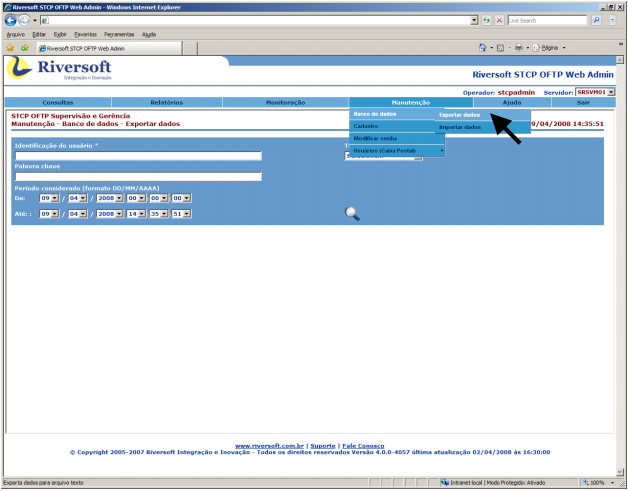
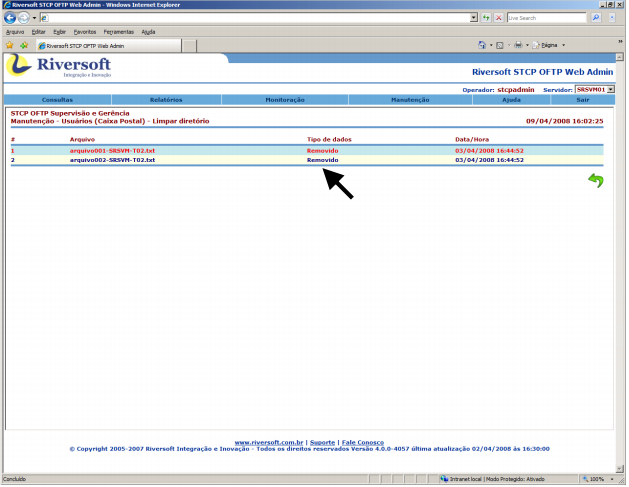
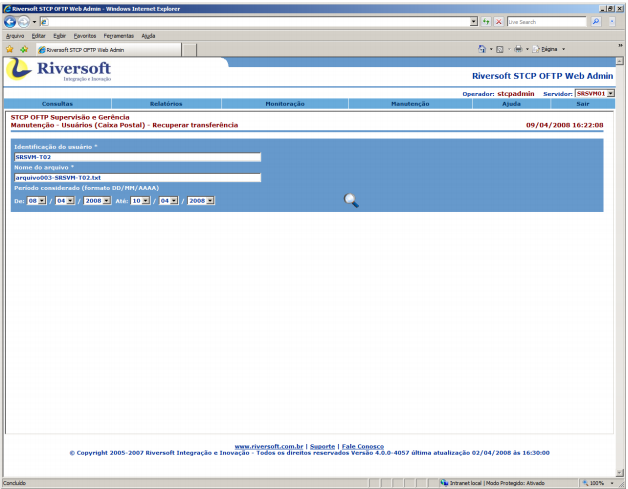
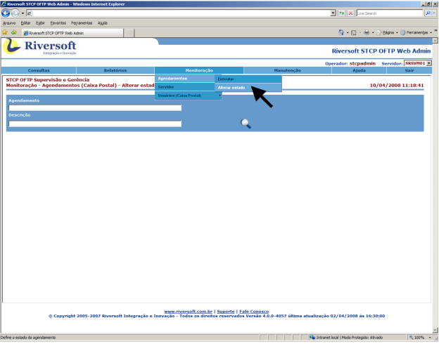
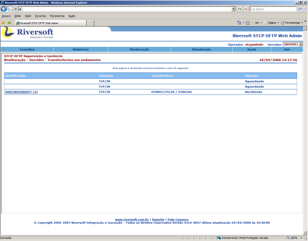

# Configuração do Riversoft STCP OFTP Web Admin

Para o correto funcionamento da ferramenta, deverão ser configurados os seguintes arquivos:

Configure o acesso ao Banco de Dados da ferramenta no arquivo **C:\Inetpub\wwwroot\STCPWEB_ADMIN\conf\stcpweb_db.inc**:

Os parâmetros a serem configurados neste arquivo são:

* Configuração da base de dados que gerenciará as informações de operadores, grupos e servidores do STCP OFTP Web Admin:
     * **$TipoDBConf** = tipo do gerenciador de banco de dados utilizado. As opções disponíveis são ACCESS, MSSERVER, MySql, Oracle, SQLite e Sybase.
     * **$fnameConfDB** = nome da fonte de dados(ODBC) usada para conectar-se à base de dados de configuração.
     * **$UsuarioDBConf** = nome do usuário para autenticação na base de dados.
     * **$SenhaDBConf** = senha do usuário para autenticação na base de dados.
* Configuração da base de dados que gerenciará as informações de códigos de erros e de eventos do sistema:
     * **$TipoDBErros** = tipo do gerenciador de banco de dados utilizado. As opções disponíveis são ACCESS, MSSERVER, MySql, Oracle, SQLite,
Sybase.
     * **$fnameErrosDB** = nome da fonte de dados(ODBC) usada para conectar-se à base de dados de erros.
     * **$UserDBErros** = nome do usuário para autenticação na base de dados.
     * **$SenDBErros** = senha do usuário para autenticação na base de dados.
* Configuração da base de dados que gerenciará as informações de log dos operadores do STCP OFTP Web Admin:
     * **$TipoDBLogOper**= tipo do gerenciador de banco de dados utilizado. As opções disponíveis são ACCESS, MSSERVER, MySql, Oracle, SQLite, Sybase.
     * **$fnameLogDB** = nome da fonte de dados(ODBC) usada para conectar-se à base de dados de log.
     * **$UserDBLogOper** = nome do usuário para autenticação na base de dados.
     * **$SenDBLogOper** = senha do usuário para autenticação na base de dados
* Configuração da sessão da base de dados:
     * **$SQLAlterSession** = este parâmetro deve ser usado quando a base de dados utilizada for Oracle 8i ou Oracle 10g. Para utilizar este parâmetro, basta retirar o comentário do início da linha.


Obs.: as configurações acima podem ser feitas em uma mesma base de dados, ou seja, não é necessário o uso de bases de dados distintas para o funcionamento do STCP OFTP Web Admin.


### Configuração do Riversoft STCP OFTP Web Admin no IIS 5

Acesse o **Internet Services Manager** através do _menu_: **Iniciar → Programs → Administrative Tools**.


Clique com o botão direito do mouse em **Default Web Site** para expandir o
menu, vá até **New** e selecione **Site**.


Clique em **Next** para continuar a instalação do novo Web Site.



Digite um nome para a descrição do novo Web Site.


Verifique com o Administrador da Rede as configurações corretas para este passo e clique em **Next** para prosseguir.


Selecione a pasta “**www**” do diretório que foi indicado no procedimento de instalação(**C:\Inetpub\wwwroot\STCPWEB_ADMIN**\ ).

Clique em **Next** para continuar.


Marque as seguintes opções:


Clique em **Finish** para finalizar a criação do novo Web Site.


Clique com o botão direito em **STCPWEB** e selecione **Properties**.


Na guia **Home Directory**, marque as opções de acordo com a imagem abaixo.


Clique no botão **Configuration** para prosseguir.


Clique em **Add** para adicionar a extensão do PHP para o IIS 5.


Digite o caminho do arquivo “**php-cgi.exe**” no campo Executable e “**.php**” em Extension.


Clique em **OK** para salvar as configurações.


Confirme se a extensão foi instalada corretamente e clique em **OK**.


Na guia **Documents**, clique em **Add**.


Adicione **“stcpweblogin.php”** como a página inicial padrão do novo site que foi criado.


Com o botão direito do mouse, clique em **STCPWEB → New → Virtual Directory**.


A tela de criação do diretório virtual é apresentada. Clique em **Next** para prosseguir.


Digite **“stcpweb”** como o novo nome para o diretório virtual.


Procure o diretório **“C:\Inetpub\wwwroot\STCPWEB_ADMIN\www”**, onde será publicado o Web Site.


Marque as seguintes opções:


Clique em **Finish** para finalizar a criação do diretório virtual.


A configuração do Riversoft STCP OFTP Web Admin no IIS 5 foi concluída com sucesso.


### Configuração do Riversoft STCP OFTP Web Admin no IIS 6

Acesse a ferramenta de gerenciamento e administração do Internet Information Services (IIS) para criar o site do Riversoft STCP OFTP Web Admin.


Adicione uma Extension para o PHP, clicando com o botão direito do mouse em “Web Service Extension” e selecione **“Add a new Web service extension”**.


Digite **“PHP”** como o nome da nova extensão Web service:


Procure o diretório de instalação do arquivo **“php-cgi.exe”**, ou digite o caminho:


Marque a opção **“Set extension status to Allowed”** e clique em **OK**.


Crie o novo site para o Riversoft STCP OFTP Web Admin.


Verifique com o Administrador da Rede as configurações corretas para este passo e clique em **Next** para prosseguir.


Procure o diretório onde o novo Web Site será criado, ou digite o caminho. Caso este não exista, ele deverá ser criado previamente.


Clique em **Next** para prosseguir.


Marque as seguintes opções:


Adicione **“stcpweblogin.php”** como a página inicial padrão do novo site que foi criado.


Na guia **Home Directory**, selecione as opções mostradas abaixo.


Clique em **Configuration** para prosseguir.


Digite o caminho do arquivo **“php-cgi.exe”** no campo Executable e **“.php”** em Extension.


Com o botão direito do mouse clique em **STCPWEB → New → Virtual Directory**.


Digite “stcpweb” como o nome do diretório.


Procure o diretório onde o Web Site será publicado, ou digite o caminho.


Configure as permissões de acesso para o usuário **“Internet Guest Account (IUSR)”** nos diretórios abaixo relacionados:

Diretório| Permissões
:---     | :---
C:\php   | Leitura /Execução
C:\php\sessiondata| Leitura /Gravação
C:\Inetpub\wwwroot\STCPWEB_ADMIN\www| Leitura /Gravação /Modificação
%SYSTEMROOT%\CMD.EXE| Leitura /Execução
C:\Inetpub\wwwroot\STCPWEB_ADMIN\conf| Leitura /Gravação /Modificação

### Acesso ao Riversoft STCP OFTP Web Admin

Pelo seu navegador, entre com o endereço do Riversoft STCP OFTP Web
Admin.


5.4.2. Digite “stcpadmin” no campo operador e “teste” em senha.

Obs.: para o primeiro login na ferramenta, qualquer nome de operador e senha serão aceitos, já que não existe nenhum operador cadastrado.


### Cadastro de Administrador do sistema

Acesse **Manutenção → Cadastro → Operadores**.

Clique no botão "+".


Cadastre o administrador do sistema.

Obs.: o administrador do sistema deverá ser obrigatoriamente o **“stcpadmin”**. Este operador não terá restrições de acesso e poderá gerenciar todos os outros operadores.


Clique no botão para salvar as informações do administrador do sistema.

Clique em **Sair** para acessar o sistema com o novo nome de operador e a nova senha.


### Criação de Grupos

Adicione grupos acessando **Manutenção → Cadastro → Grupos**.

Clique no botão "+".



Preencha os campos: nome, descrição e servidor/usuário.

Obs.: para associar todos os servidores a todos os usuários, utilize **“*\ *”**. Para especificar os usuários relacionados ao servidor, basta separar com uma barra invertida \ . Exemplo: **SERV001\USER001**.

Selecione os operadores e as permissões que farão parte do grupo.


Clique no botão para salvar as informações do grupo.

### Cadastro de Operadores

Agora cadastre os operadores que farão parte dos grupos criados.

Acesse **Manutenção → Cadastro → Operadores**.

Clique no botão "+".


Adicione os operadores, incluindo-os nos grupos adequados.


Clique no botão para salvar as informações do operador.

### Cadastro dos Servidores

Adicione grupos acessando **Manutenção → Cadastro → Servidores**.

Clique no botão "+".


Adicione as informações do servidor.

Obs.: este servidor refere-se ao servidor de monitoração definido no STCP OFTP Server.


Clique no botão para salvar as informações do servidor.

## Funcionalidades

### Consulta aos Agendamentos

Esta funcionalidade permite ao usuário consultar os agendamentos na ferramenta STCP OFTP Server Enterprise.

Acesse **Consultas → Cadastro → Agendamentos**.

Informe o nome completo do agendamento no campo “Nome do Agendamento”. Para filtrar os dados da pesquisa, informe também a descrição do agendamento.

Ou clique no botão para visualizar todos os agendamentos.


### Consulta aos Códigos de erros

Esta funcionalidade permite ao usuário consultar os códigos de erros.

Acesse **Consultas → Cadastro → Códigos de erros**.

Informe o “Código de erro”. Para filtrar os dados da pesquisa, informe também
a descrição do erro.

Ou clique no botão para visualizar todos os códigos de erros.


### Consulta aos Códigos de eventos

Esta funcionalidade permite ao usuário consultar os códigos de eventos.

Acesse **Consultas → Cadastro → Códigos de eventos**.

Informe o “Código do evento”. Para filtrar os dados da pesquisa, informe
também a descrição do evento.

Ou clique no botão para visualizar todos os códigos de eventos.


### Consulta aos Grupos

Esta funcionalidade permite ao usuário consultar os Grupos.

Acesse **Consultas → Cadastro → Grupos**.

Informe o “Grupo”. Para filtrar os dados da pesquisa, informe também a descrição do grupo.

Ou clique no botão para visualizar todos os grupos cadastrados.


### Consulta aos Operadores

Esta funcionalidade permite ao usuário consultar os Operadores.

Acesse **Consultas → Cadastro → Operadores**.

Informe o “Operador”. Para filtrar os dados da pesquisa, informe também a
descrição do operador.

Ou clique no botão para visualizar todos os operadores cadastrados.


### Consulta aos Usuários

Esta funcionalidade permite ao usuário consultar os Usuários cadastrados.

Acesse **Consultas → Cadastro → Usuários**.

Informe a “Identificação do usuário”. Para filtrar os dados da pesquisa, informe
também a descrição do usuário.

Ou clique no botão para visualizar todos os usuários cadastrados.



### Histórico das Transferências

Esta funcionalidade permite ao usuário consultar o Histórico das Transferências.

Para consultar o histórico das transferências, acesse **Consultas → Transferências → Histórico**.

Informe a “Identificação do usuário” e o “Nome do arquivo”.

Selecione o “Período considerado” e a “Situação” (Todas, Recebidas/OK, Enviadas/OK, Falha Rx ou Falha Tx).

Ou clique no botão para visualizar todo o histórico das transferências.


### Transferências Pendentes

Esta funcionalidade permite ao usuário consultar as Transferências Pendentes.

Acesse **Consultas → Transferências → Pendentes**.

Informe o Usuário. Para filtrar os dados da pesquisa, informe também a descrição do usuário.

Selecione o “Período considerado” e a “Situação” (Pend envio, Pend conf, Pend restart ou Pend tratamento).

Ou clique no botão para visualizar todas as transferências pendentes.


### Relatório de Eventos de Operadores

Esta funcionalidade permite ao usuário consultar o relatório de eventos de operadores organizados por Data/Hora ou pelo operador, em ordem crescente. Os eventos listados no relatório são referentes ao início/fim de sessão, alteração de parâmetros e demais ações realizadas pelos operadores no STCP OFTP Web Admin.

Acesse **Relatórios → Eventos → Operadores**.

Informe a “Identificação do Operador”. Para pesquisa avançada, digite no campo “Pesquisa Avançada” parte do texto do arquivo.

Selecione o “Período considerado”, e DataHora ou Operador em “Ordenado por”.


Ou clique no botão para visualizar todos os eventos.


### Relatório de Eventos do Sistema

Esta funcionalidade permite ao usuário consultar o relatório de eventos do Sistema organizado por Data/Hora ou módulo, em ordem crescente. Os eventos listados no relatório podem ser: início/fim do serviço STCP OFTP, início/fim de conexões entrantes ou saintes, início e término da agenda, início e término de transmissão e recepção de arquivos, erros do sistema/transferência etc.

Acesse **Relatórios → Eventos → Sistema**.

Informe a “Identificação do Módulo". Para pesquisa avançada, digite no campo “Pesquisa Avançada” o módulo do sistema onde ocorreu o evento. Exemplo: STCP, STCPMON, STCPCONF, etc.

Selecione o “Período considerado”, e DataHora ou Módulo em “Ordenado por”.


Ou clique no botão para visualizar todos os eventos.


### Relatório de Eventos dos Usuários

Esta funcionalidade permite ao usuário consultar o relatório de eventos dos usuários organizados por Data/Hora ou usuário, em ordem crescente. Os eventos listados no relatório podem ser: início/fim de conexões entrantes ou saintes, início e término de transmissão e recepção de arquivos, erros na transferência do usuário, dentre outros.

Acesse **Relatórios → Eventos → Usuários (Caixa Postal)**.

Informe a “Identificação do Usuário”. Para pesquisa avançada, digite no campo
“Pesquisa Avançada” parte do texto do arquivo.

Selecione o “Período considerado”, e DataHora ou Usuário em “Ordenado por”.


Ou clique no botão para visualizar todos os eventos.


### Relatório - Auditoria das transferências

Esta funcionalidade permite ao usuário consultar o relatório das transferências organizado por Data/Hora ou usuário, em ordem crescente.

Acesse Relatórios → Transferências → Auditoria.

Informe a “Identificação do Usuário”. Para pesquisa avançada, digite no campo “Pesquisa Avançada” parte do texto do arquivo.

Selecione o “Período considerado”, e DataHora ou Usuário em “Ordenado por”.


Ou clique no botão para visualizar a auditoria de todas as transferências.


### Relatório - Estatísticas das transferências

Esta funcionalidade permite ao usuário consultar o relatório de estatística das transferências organizado por tipo.

Acesse **Relatórios → Transferências → Estatísticas**.

Informe a “Identificação do usuário”. Para filtrar os dados da pesquisa, informe o “Nome do arquivo”.

Selecione o “Período considerado”, e o “Tipo” de relatório (consolidado, anual, mensal, semanal, dia da semana, Diário ou por hora).


Ou clique no botão para visualizar a estatística de todas as transferências.


### Relatório - Gráficos das transferências

Esta funcionalidade permite ao usuário visualizar o gráfico das transferências organizado por tipo.

Acesse **Relatórios → Transferências → Gráficos**.

Informe a “Identificação do usuário”. Para filtrar os dados da pesquisa, informe o “Nome do arquivo”.

Selecione o “Período considerado”, e o “Tipo” de relatório (consolidado, anual, mensal, semanal, dia da semana, Diário ou por hora).

Escolha a forma como será apresentado o gráfico.

Ou clique no botão para visualizar o gráfico de todas as transferências.



### Relatório – Roteamentos
Acesse **Relatórios → Roteamentos → Auditoria**.
A pesquisa pode ser feita informando a “Identificação da origem”, por exemplo, que é o nome de usuário.

```
Exemplo: O005RIVERSOFT.
```


Ou infome a “Identificação do destino”.

```
Exemplo: SRSVM-T02.
```


Para visualizar todos os relatórios, clique no botão.


### Importação de códigos de erros

Para importar os códigos de erros de um arquivo xml para o banco de dados do STCP OFTP Web Admin, acesse **Manutenção → Banco de Dados → Importar Dados**.


Em **Tipo de Dados**, escolha a opção **Códigos de Erros** e clique no botão.


Selecione o arquivo encontrado e clique no botão.


Quando o processo de importação for concluído, será mostrada a confirmação.


### Importação de códigos de eventos

Para importar os códigos de eventos de um arquivo xml para o banco de dados da STCP OFTP Web Admin, acesse **Manutenção → Banco de Dados → Importar Dados**.


Em Tipo de Dados, escolha a opção Códigos de Eventos e clique no botão.



Selecione o arquivo encontrado e clique no botão.


Quando o processo de importação for concluído, será mostrada a confirmação.


### Exportação de códigos de erros

Para exportar os códigos de erros da base de dados do STCP OFTP Web Admin para um arquivo xml, acesse **Manutenção → Banco de Dados → Exportar Dados**.


Em **Tipo de Dados**, escolha a opção **Códigos de Erros** e clique no botão.


Para realizar a exportação dos dados, clique no botão.


Quando o processo de exportação for concluído, será mostrada a confirmação.


### Exportação de códigos de eventos

Para exportar os códigos de eventos da base de dados do STCP OFTP Web Admin para um arquivo xml, acesse **Manutenção → Banco de Dados → Exportar Dados**.



Em Tipo de Dados, escolha a opção Códigos de Eventos e clique no botão.


Para realizar a exportação dos dados, clique no botão.


Quando o processo de exportação for concluído, será mostrada a confirmação.


### Cadastro de códigos de erros

Para cadastrar um código de erro, acesse **Manutenção → Cadastro → Códigos de erros**.

Clique no botão "+".


Preencha os campos: **código, descrição** e **procedimento**.

Selecione a classificação do erro no campo **Classe**.


Clique no botão para salvar as informações do código de erro.

### Cadastro de códigos de eventos

Para cadastrar um código de evento, acesse **Manutenção → Cadastro → Códigos de eventos**.

Clique no botão.


Preencha os campos: **código, descrição e procedimento**.


Clique no botão para salvar as informações do código de evento.

### Modificar senha de operador

Para modificar a senha do operador do STCP OFTP Web Admin, acesse **Manutenção → Modificar senha**.

Obs.: este procedimento modifica a senha do operador que está logado na ferramenta.


Preencha os campos: **senha atual, nova senha** e **confirma**.


Clique no botão para salvar a nova senha.

### Limpeza de diretório de Usuários (Caixa Postal)

Para realizar a limpeza de diretório de uma caixa postal do STCP OFTP Server, acesse **Manutenção → Usuários (Caixa Postal) → Limpar diretório**.


Preencha os campos:

* Identificação do usuário = nome da caixa postal.
* Nome do arquivo = nome do arquivo que deseja buscar. Caso queira ver todos os arquivos, deixe este campo em branco.
* Período considerado = refere-se à data de criação do arquivo dentro do diretório especificado.
* Diretório = selecione o diretório onde deseja fazer a limpeza. As opções disponíveis
são: _backup, pendente de envio, pendente de confirmação, recebidos, pendente de
restart_.

Clique no botão para realizar a pesquisa no diretório.


Selecione os arquivos que deseja remover e clique no botão.


Quando o processo de limpeza for concluído, será mostrada a confirmação.



### Recuperar transferência de Usuários (Caixa Postal)

Para recuperar uma transferência de uma caixa postal do STCP OFTP Server, acesse **Manutenção → Usuários (Caixa Postal) → Recuperar transferência**.

Obs.: este procedimento recupera uma transferência do diretório **Backup** e coloca no diretório **Saída** da caixa postal.


Preencha os campos:

* Identificação do usuário = nome da caixa postal.
* Nome do arquivo = nome completo do arquivo que deseja recuperar.
* Período considerado = refere-se à data de criação do arquivo dentro do diretório de backup.

Clique no botão para buscar o arquivo.



Selecione o arquivo e clique no botão.


Quando o processo de recuperação for concluído, será mostrada a confirmação.


### Resetar senha de Usuários (Caixa Postal)

Para resetar a senha de uma caixa postal do STCP OFTP Server, acesse **Manutenção → Usuários (Caixa Postal) → Resetar senha**.


Preencha os campos: **usuário (caixa postal), nova senha** e **confirma**.


Clique no botão para salvar a nova senha da caixa postal.

### Executar agendamento do STCP OFTP Server

Para executar um agendamento do STCP OFTP Server, acesse **Monitoração → Agendamentos → Executar.**


Preencha os campos:

* **Agendamento** = nome do agendamento que deseja buscar. Caso queira ver todos os agendamentos, deixe este campo em branco.
* **Descrição** = descrição do agendamento. Use este campo para filtrar os agendamentos pela descrição.

Clique no botão para buscar o agendamento.


Clique sobre o nome do agendamento para executá-lo.


Será aberta uma nova janela informando o resultado da execução do agendamento.

Obs.: se o agendamento estiver desabilitado, não será possível executá-lo.


### Alterar estado de agendamento do STCP OFTP Server

Para alterar o estado de um agendamento do STCP OFTP Server, acesse **Monitoração → Agendamentos → Alterar estado**.

Obs.: este procedimento permite que um agendamento seja bloqueado/desbloqueado.



Preencha os campos:

* **Agendamento** = nome do agendamento que deseja buscar. Caso queira ver todos os agendaamentos, deixe este campo em branco.
* **Descrição** = descrição do agendamento. Use este campo para filtrar os agendamentos pela descrição.

Clique no botão para buscar o agendamento.


Clique sobre o nome do agendamento para alterar seu estado.


O estado do agendamento é mostrado no lado direito da janela.


### Monitorar eventos do servidor

Para visualizar os eventos do servidor de monitoração do STCP OFTP Server, acesse **Monitoração → Servidor → Eventos**.


* A monitoração do servrdor permite visualizar, em tempo real, todos os eventos¹ da sessão atual do serviço do STCP OFTP. Esta página é atualizada de tempos em tempos.


¹ Início/fim do serviço STCP OFTP, Início/Fim de conexões entrantes/saintes, Início e Término da agenda, Início e Término de transmissão e recepção de arquivos, Erros do sistema/transferência, dentre outros.

### Monitorar transferências

Para monitorar as transferências em andamento, acesse **Monitoração → Servidor → Transferências em andamento.**


* As transferências são monitoradas em tempo real e a página é atualizada de tempos em tempos.



### Iniciar conexão com usuários (Caixa Postal)

Para iniciar uma conexão com uma caixa postal do STCP OFTP Server, acesse **Monitoração → Usuários (Caixa Postal) → Iniciar Conexão**.

Obs.: esta funcionalidade só está disponível para caixas postais que estejam com a conexão automática habilitada.


Preencha os campos:

* **Identificação do usuário** = nome da caixa postal. Caso queira ver todas as caixas postais, deixe este campo em branco.
* **Descrição do usuário** = descrição da caixa postal. Use este campos para filtrar as caixas postais pela descrição.

Clique no botão para realizar a busca.


Clique sobre o  nome da caixa postal para iniciar a conexão.


Será aberta uma nova janela mostrando o resultado da conexão do usuário.


### Alterar estado de usuários (Caixa Postal)

Para alterar o estado de uma caixa postal do STCP OFTP Server, acesse **Monitoração → Usuários (Caixa Postal) → Alterar estado**.

Obs.: este procedimento permite que uma caixa postal seja bloqueada/desbloqueada.


Preencha os campos:

* **Identificação do usuário** = nome da caixa postal que deseja buscar. Caso queira ver todas as caixas postais, deixe este campo em branco.
* **Descrição do usuário** = descrição da caixa postal. Use este campo para filtrar as caixas pela descrição.

Clique no botão para realizar a busca.


Clique sobre o noem da caixa postal para alterar seu estado.


O estado da caixa postal é mostrado no lado direito da janela.


## Glossário

**I**

**IUSR**
Conta Interna para acesso anônimo ao Internet Information Service.

**S**

**System DSN**
Pode ser usado por alguém que tenha acesso à máquina.

## Referências

Disponível em: (<http://www.webopedia.com/TERM/D/DNS.html>).

Acesso em: 16 de agosto de 2007.
