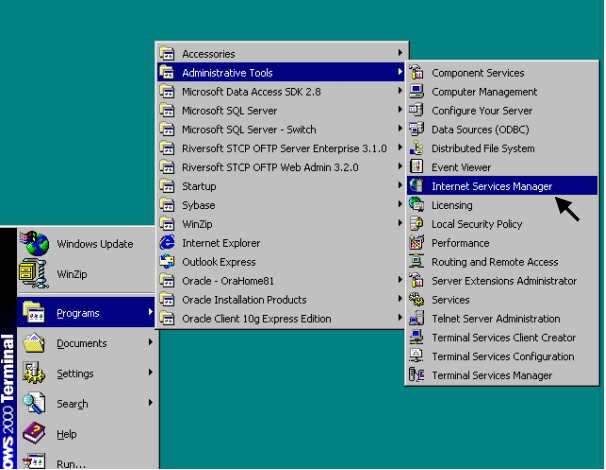
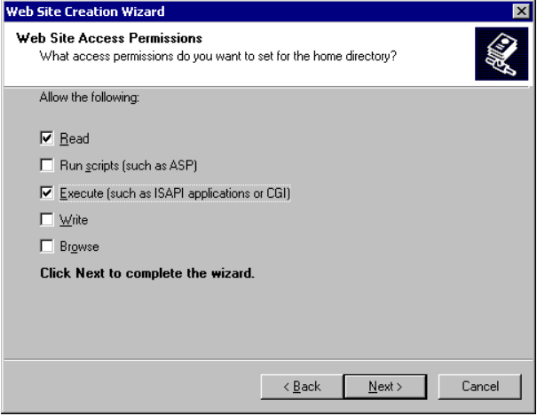
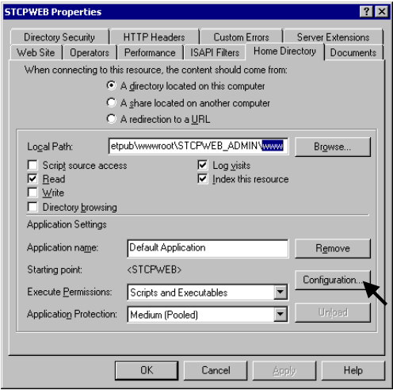
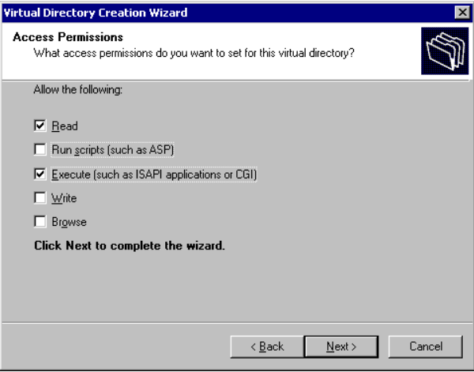
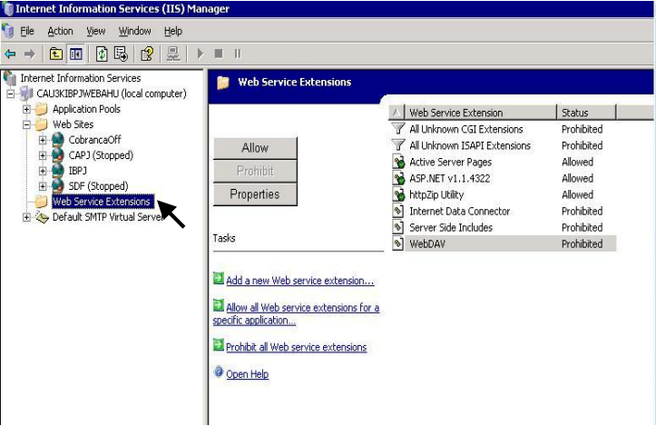
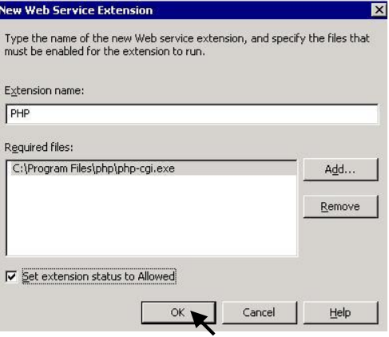
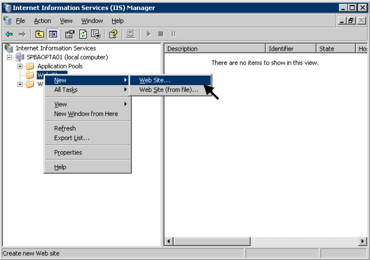

# Introdução

Esta seção tem por objetivo descrever os passos necessários para configuração do STCP OFTP Web Admin no IIS (versões 5, 6 e 7/7.5).

Para realização destes procedimentos os seguintes pré-requisitos são necessários:

* Instalação do IIS no servidor;
* Instalação do STCP OFTP Web Admin;
* Criação do banco de dados STCP OFTP Web Admin;
* Configuração do driver ODBC para acesso ao banco de dados do STCP OFTP Web Admin;
* Instalação e configuração do processador de scripts PHP.

Maiores detalhes relacionados à instalação do STCP OFTP Web Admin podem ser obtidos na seção de [instalação](/docs/stcpwebadmin/install/)

## IIS 5

<span style="display:inline-block; width: 25px; height: 25px; border-radius: 50%; background-color: #0095C7; color: white; text-align: center; line-height: 25px; font-size: 14px; font-family: Arial;">1</span> &nbsp; Acesse o **Internet Services Manager** através do _menu_: **Iniciar → Programs → Administrative Tools**.



<span style="display:inline-block; width: 25px; height: 25px; border-radius: 50%; background-color: #0095C7; color: white; text-align: center; line-height: 25px; font-size: 14px; font-family: Arial;">2</span> &nbsp; Clique com o botão direito do mouse em **Default Web Site** para expandir o
menu, vá até **New** e selecione **Site**.


<span style="display:inline-block; width: 25px; height: 25px; border-radius: 50%; background-color: #0095C7; color: white; text-align: center; line-height: 25px; font-size: 14px; font-family: Arial;">3</span> &nbsp; Clique em **Next** para continuar a instalação do novo Web Site.


<span style="display:inline-block; width: 25px; height: 25px; border-radius: 50%; background-color: #0095C7; color: white; text-align: center; line-height: 25px; font-size: 14px; font-family: Arial;">4</span> &nbsp; Digite um nome para a descrição do novo Web Site.


<span style="display:inline-block; width: 25px; height: 25px; border-radius: 50%; background-color: #0095C7; color: white; text-align: center; line-height: 25px; font-size: 14px; font-family: Arial;">5</span> &nbsp; Verifique com o Administrador da Rede as configurações corretas para este passo e clique em **Next** para prosseguir.


<span style="display:inline-block; width: 25px; height: 25px; border-radius: 50%; background-color: #0095C7; color: white; text-align: center; line-height: 25px; font-size: 14px; font-family: Arial;">6</span> &nbsp;Selecione a pasta **www** do diretório que foi indicado no procedimento de instalação

```
<disco>:\Inetpub\wwwroot\STCPWEB_ADMIN\
```

<span style="display:inline-block; width: 25px; height: 25px; border-radius: 50%; background-color: #0095C7; color: white; text-align: center; line-height: 25px; font-size: 14px; font-family: Arial;">7</span> &nbsp;Clique em **Next** para continuar.


<span style="display:inline-block; width: 25px; height: 25px; border-radius: 50%; background-color: #0095C7; color: white; text-align: center; line-height: 25px; font-size: 14px; font-family: Arial;">8</span> &nbsp;Marque as seguintes opções:



<span style="display:inline-block; width: 25px; height: 25px; border-radius: 50%; background-color: #0095C7; color: white; text-align: center; line-height: 25px; font-size: 14px; font-family: Arial;">9</span> &nbsp;Clique em **Finish** para finalizar a criação do novo Web Site.


<span style="display:inline-block; width: 25px; height: 25px; border-radius: 50%; background-color: #0095C7; color: white; text-align: center; line-height: 25px; font-size: 14px; font-family: Arial;">10</span> &nbsp;Clique com o botão direito em **STCPWEB** e selecione **Properties**.


<span style="display:inline-block; width: 25px; height: 25px; border-radius: 50%; background-color: #0095C7; color: white; text-align: center; line-height: 25px; font-size: 14px; font-family: Arial;">11</span> &nbsp;Na guia **Home Directory**, marque as opções de acordo com a imagem abaixo.


<span style="display:inline-block; width: 25px; height: 25px; border-radius: 50%; background-color: #0095C7; color: white; text-align: center; line-height: 25px; font-size: 14px; font-family: Arial;">12</span> &nbsp;Clique no botão **Configuration** para prosseguir.



<span style="display:inline-block; width: 25px; height: 25px; border-radius: 50%; background-color: #0095C7; color: white; text-align: center; line-height: 25px; font-size: 14px; font-family: Arial;">13</span> &nbsp;Clique em **Add** para adicionar a extensão do PHP para o IIS 5.


<span style="display:inline-block; width: 25px; height: 25px; border-radius: 50%; background-color: #0095C7; color: white; text-align: center; line-height: 25px; font-size: 14px; font-family: Arial;">14</span> &nbsp;Digite o caminho do arquivo “**php-cgi.exe**” no campo Executable e “**.php**” em Extension.


<span style="display:inline-block; width: 25px; height: 25px; border-radius: 50%; background-color: #0095C7; color: white; text-align: center; line-height: 25px; font-size: 14px; font-family: Arial;">15</span> &nbsp;Clique em **OK** para salvar as configurações.


<span style="display:inline-block; width: 25px; height: 25px; border-radius: 50%; background-color: #0095C7; color: white; text-align: center; line-height: 25px; font-size: 14px; font-family: Arial;">16</span> &nbsp;Confirme se a extensão foi instalada corretamente e clique em **OK**.


<span style="display:inline-block; width: 25px; height: 25px; border-radius: 50%; background-color: #0095C7; color: white; text-align: center; line-height: 25px; font-size: 14px; font-family: Arial;">17</span> &nbsp;Na guia **Documents**, clique em **Add**.


<span style="display:inline-block; width: 25px; height: 25px; border-radius: 50%; background-color: #0095C7; color: white; text-align: center; line-height: 25px; font-size: 14px; font-family: Arial;">18</span> &nbsp;Adicione **stcpweblogin.php** como a página inicial padrão do novo site que foi criado.


<span style="display:inline-block; width: 25px; height: 25px; border-radius: 50%; background-color: #0095C7; color: white; text-align: center; line-height: 25px; font-size: 14px; font-family: Arial;">19</span> &nbsp;Com o botão direito do mouse, clique em **STCPWEB → New → Virtual Directory**.


<span style="display:inline-block; width: 25px; height: 25px; border-radius: 50%; background-color: #0095C7; color: white; text-align: center; line-height: 25px; font-size: 14px; font-family: Arial;">20</span> &nbsp;A tela de criação do diretório virtual é apresentada. Clique em **Next** para prosseguir.


<span style="display:inline-block; width: 25px; height: 25px; border-radius: 50%; background-color: #0095C7; color: white; text-align: center; line-height: 25px; font-size: 14px; font-family: Arial;">21</span> &nbsp;Digite **“stcpweb”** como o novo nome para o diretório virtual.


<span style="display:inline-block; width: 25px; height: 25px; border-radius: 50%; background-color: #0095C7; color: white; text-align: center; line-height: 25px; font-size: 14px; font-family: Arial;">22</span> &nbsp;Procure o diretório **“C:\Inetpub\wwwroot\STCPWEB_ADMIN\www”**, onde será publicado o Web Site.


<span style="display:inline-block; width: 25px; height: 25px; border-radius: 50%; background-color: #0095C7; color: white; text-align: center; line-height: 25px; font-size: 14px; font-family: Arial;">23</span> &nbsp;Marque as seguintes opções:



<span style="display:inline-block; width: 25px; height: 25px; border-radius: 50%; background-color: #0095C7; color: white; text-align: center; line-height: 25px; font-size: 14px; font-family: Arial;">24</span> &nbsp;Clique em **Finish** para finalizar a criação do diretório virtual.


<span style="display:inline-block; width: 25px; height: 25px; border-radius: 50%; background-color: #0095C7; color: white; text-align: center; line-height: 25px; font-size: 14px; font-family: Arial;">25</span> &nbsp;A configuração do Riversoft STCP OFTP Web Admin no IIS 5 foi concluída com sucesso.


## IIS 6

<span style="display:inline-block; width: 25px; height: 25px; border-radius: 50%; background-color: #0095C7; color: white; text-align: center; line-height: 25px; font-size: 14px; font-family: Arial;">1</span> &nbsp;Acesse a ferramenta de gerenciamento e administração do Internet Information Services (IIS) para criar o site do Riversoft STCP OFTP Web Admin.



<span style="display:inline-block; width: 25px; height: 25px; border-radius: 50%; background-color: #0095C7; color: white; text-align: center; line-height: 25px; font-size: 14px; font-family: Arial;">2</span> &nbsp;Adicione uma Extension para o PHP, clicando com o botão direito do mouse em “Web Service Extension” e selecione **Add a new Web service extension**.


<span style="display:inline-block; width: 25px; height: 25px; border-radius: 50%; background-color: #0095C7; color: white; text-align: center; line-height: 25px; font-size: 14px; font-family: Arial;">3</span> &nbsp;Digite **“PHP”** como o nome da nova extensão Web service:


<span style="display:inline-block; width: 25px; height: 25px; border-radius: 50%; background-color: #0095C7; color: white; text-align: center; line-height: 25px; font-size: 14px; font-family: Arial;">4</span> &nbsp;Procure o diretório de instalação do arquivo **php-cgi.exe**, ou digite o caminho:


<span style="display:inline-block; width: 25px; height: 25px; border-radius: 50%; background-color: #0095C7; color: white; text-align: center; line-height: 25px; font-size: 14px; font-family: Arial;">5</span> &nbsp;Marque a opção **Set extension status to Allowed** e clique em **OK**.



<span style="display:inline-block; width: 25px; height: 25px; border-radius: 50%; background-color: #0095C7; color: white; text-align: center; line-height: 25px; font-size: 14px; font-family: Arial;">6</span> &nbsp;Crie o novo site para o Riversoft STCP OFTP Web Admin.



<span style="display:inline-block; width: 25px; height: 25px; border-radius: 50%; background-color: #0095C7; color: white; text-align: center; line-height: 25px; font-size: 14px; font-family: Arial;">7</span> &nbsp;Verifique com o Administrador da Rede as configurações corretas para este passo e clique em **Next** para prosseguir.


<span style="display:inline-block; width: 25px; height: 25px; border-radius: 50%; background-color: #0095C7; color: white; text-align: center; line-height: 25px; font-size: 14px; font-family: Arial;">8</span> &nbsp;Procure o diretório onde o novo Web Site será criado, ou digite o caminho. Caso este não exista, ele deverá ser criado previamente.


<span style="display:inline-block; width: 25px; height: 25px; border-radius: 50%; background-color: #0095C7; color: white; text-align: center; line-height: 25px; font-size: 14px; font-family: Arial;">9</span> &nbsp;Clique em **Next** para prosseguir.


<span style="display:inline-block; width: 25px; height: 25px; border-radius: 50%; background-color: #0095C7; color: white; text-align: center; line-height: 25px; font-size: 14px; font-family: Arial;">10</span> &nbsp;Marque as seguintes opções:


<span style="display:inline-block; width: 25px; height: 25px; border-radius: 50%; background-color: #0095C7; color: white; text-align: center; line-height: 25px; font-size: 14px; font-family: Arial;">11</span> &nbsp;Adicione **stcpweblogin.php** como a página inicial padrão do novo site que foi criado.


<span style="display:inline-block; width: 25px; height: 25px; border-radius: 50%; background-color: #0095C7; color: white; text-align: center; line-height: 25px; font-size: 14px; font-family: Arial;">12</span> &nbsp;Na guia **Home Directory**, selecione as opções mostradas abaixo.


<span style="display:inline-block; width: 25px; height: 25px; border-radius: 50%; background-color: #0095C7; color: white; text-align: center; line-height: 25px; font-size: 14px; font-family: Arial;">13</span> &nbsp;Clique em **Configuration** para prosseguir.


<span style="display:inline-block; width: 25px; height: 25px; border-radius: 50%; background-color: #0095C7; color: white; text-align: center; line-height: 25px; font-size: 14px; font-family: Arial;">14</span> &nbsp;Digite o caminho do arquivo **php-cgi.exe** no campo Executable e **.php** em Extension.


<span style="display:inline-block; width: 25px; height: 25px; border-radius: 50%; background-color: #0095C7; color: white; text-align: center; line-height: 25px; font-size: 14px; font-family: Arial;">15</span> &nbsp;Com o botão direito do mouse clique em **STCPWEB → New → Virtual Directory**.


<span style="display:inline-block; width: 25px; height: 25px; border-radius: 50%; background-color: #0095C7; color: white; text-align: center; line-height: 25px; font-size: 14px; font-family: Arial;">16</span> &nbsp;Digite **stcpweb** como o nome do diretório.


<span style="display:inline-block; width: 25px; height: 25px; border-radius: 50%; background-color: #0095C7; color: white; text-align: center; line-height: 25px; font-size: 14px; font-family: Arial;">17</span> &nbsp;Procure o diretório onde o Web Site será publicado, ou digite o caminho.


<span style="display:inline-block; width: 25px; height: 25px; border-radius: 50%; background-color: #0095C7; color: white; text-align: center; line-height: 25px; font-size: 14px; font-family: Arial;">18</span> &nbsp;Configure as permissões de acesso para o usuário **Internet Guest Account (IUSR)** nos diretórios abaixo relacionados:

Diretório| Permissões
:---     | :---
C:\php   | Leitura /Execução
C:\php\sessiondata| Leitura /Gravação
C:\Inetpub\wwwroot\STCPWEB_ADMIN\www| Leitura /Gravação /Modificação
%SYSTEMROOT%\CMD.EXE| Leitura /Execução
C:\Inetpub\wwwroot\STCPWEB_ADMIN\conf| Leitura /Gravação /Modificação


## IIS 7/7.5

### Suporte a aplicações PHP no IIS 7/7.5

<span style="display:inline-block; width: 25px; height: 25px; border-radius: 50%; background-color: #0095C7; color: white; text-align: center; line-height: 25px; font-size: 14px; font-family: Arial;">1</span> &nbsp;O primeiro passo a ser feito é habilitar a role CGI no IIS. Para isso acesse **Gerenciador de servidores » Funções » Servidor Web (IIS) » Adicionar Serviços de Função**


<span style="display:inline-block; width: 25px; height: 25px; border-radius: 50%; background-color: #0095C7; color: white; text-align: center; line-height: 25px; font-size: 14px; font-family: Arial;">2</span> &nbsp;Na tela **Adicionar Serviços de Função**, em **Desenvolvimento de Aplicativo**, selecione **CGI** e clique em **Instalar** para continuar.


## Configurando o IIS para manipular requisições PHP

<span style="display:inline-block; width: 25px; height: 25px; border-radius: 50%; background-color: #0095C7; color: white; text-align: center; line-height: 25px; font-size: 14px; font-family: Arial;">1</span> &nbsp; Abra o Gerenciador de Serviços de Informações da Internet (IIS), selecione o nome do servidor e de um duplo clique em **Mapeamentos de Manipulador**.


<span style="display:inline-block; width: 25px; height: 25px; border-radius: 50%; background-color: #0095C7; color: white; text-align: center; line-height: 25px; font-size: 14px; font-family: Arial;">2</span> &nbsp;No painel **Ações**, clique em **Adicionar mapeamento de Script**.


<span style="display:inline-block; width: 25px; height: 25px; border-radius: 50%; background-color: #0095C7; color: white; text-align: center; line-height: 25px; font-size: 14px; font-family: Arial;">3</span> &nbsp;Na janela **Adicionar Mapeamento de Script** preencha os parâmetros solicitados conforme a imagem abaixo e pressione o botão **OK**. Note que no parâmetro **Executável** deverá ser informado o diretório do arquivo **php-cgi.exe** no ambiente em questão.

Neste procedimento a instalação do PHP foi realizada no diretório **C:\PHP5**.


A mensagem abaixo poderá ser exibida solicitando permissão para adicionar a extensão ISAPI. Clique no botão **Sim** para continuar.


## Criação e configuração do site no IIS

<span style="display:inline-block; width: 25px; height: 25px; border-radius: 50%; background-color: #0095C7; color: white; text-align: center; line-height: 25px; font-size: 14px; font-family: Arial;">1</span> &nbsp;Ainda na janela do Gerenciador de Serviços de Informações da Internet (IIS), selecione **Sites** e no painel **Ações** clique em **Adicionar Site**.


<span style="display:inline-block; width: 25px; height: 25px; border-radius: 50%; background-color: #0095C7; color: white; text-align: center; line-height: 25px; font-size: 14px; font-family: Arial;">2</span> &nbsp;Na janela **Adicionar Site** preencha os parâmetros solicitados conforme imagem abaixo e pressione o botão “OK” para concluir a criação do site. Note que no parâmetro **Caminho físico** deverá ser informado a pasta **www** do diretório de instalação do STCP OFTP Web Admin no ambiente em questão.

Neste procedimento a instalação do STCP OFTP Web Admin foi realizada no diretório **C:\inetpub\wwwroot\stcpwebadmin**.



 Verique com o administrador de rede quais as configurações corretas para a etapa anterior.


<span style="display:inline-block; width: 25px; height: 25px; border-radius: 50%; background-color: #0095C7; color: white; text-align: center; line-height: 25px; font-size: 14px; font-family: Arial;">3</span> &nbsp;O novo site será exibido no painel **Conexões**, da janela do Gerenciador de Serviços de Informações da Internet (IIS).


<span style="display:inline-block; width: 25px; height: 25px; border-radius: 50%; background-color: #0095C7; color: white; text-align: center; line-height: 25px; font-size: 14px; font-family: Arial;">4</span> &nbsp; Selecione este novo site (Ex. stcpwebadmin) e na área **IIS**, dê um duplo clique no ícone **Documento Padrão**.


<span style="display:inline-block; width: 25px; height: 25px; border-radius: 50%; background-color: #0095C7; color: white; text-align: center; line-height: 25px; font-size: 14px; font-family: Arial;">5</span> &nbsp; No painel **Ações** clique em **Adicionar**.


<span style="display:inline-block; width: 25px; height: 25px; border-radius: 50%; background-color: #0095C7; color: white; text-align: center; line-height: 25px; font-size: 14px; font-family: Arial;">6</span> &nbsp; Na janela **Adicionar Documento Padrão** preencha o parâmetro solicitado conforme imagem abaixo e pressione o botão **OK** para concluir a configuração do documento padrão.


<span style="display:inline-block; width: 25px; height: 25px; border-radius: 50%; background-color: #0095C7; color: white; text-align: center; line-height: 25px; font-size: 14px; font-family: Arial;">7</span> &nbsp;Selecione novamente o novo site (Ex. stcpwebadmin) e no painel **Ações**, clique em **Procurar *:XX (http)**. Onde **XX** refere-se à porta configurada.


Se todos os pré-requisitos foram atendidos e os passos deste procedimento seguidos corretamente, a janela do STCP OFTP Web Admin deverá ser exibida.


