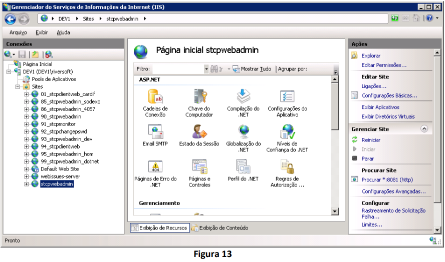

# Configuração do Riversoft STCP OFTP Web Admin no IIS7/7.5

### Objetivo
Este documento tem por objetivo descrever os passos necessários para configuração do STCP OFTP Web Admin no IIS7/7.5. Para realização deste procedimento os seguintes pré-requisitos são necessários:

* Instalação do IIS no servidor;
* Instalação do STCP OFTP Web Admin;
* Criação do banco de dados STCP OFTP Web Admin;
* Configuração do driver ODBC para acesso ao banco de dados do STCP OFTP Web Admin;
* Instalação e configuração do processador de scripts PHP.

Maiores detalhes relacionados à instalação do STCP OFTP Web Admin podem ser obtidos na seção referente através do [link](/docs/stcpwebadmin/install/)

<!-- (http://www.riversoft.com.br/downloads/manuais/STCPWebAdmin_4_0-PTB-Rev1.1.pdf) -->

### Como configurar o suporte a aplicações PHP no IIS 7/7.5

O primeiro passo a ser feito é habilitar a role CGI no IIS. Para isso acesse “Gerenciador de servidores » Funções » Servidor Web (IIS) » Adicionar Serviços de Função”


Na tela “Adicionar Serviços de Função”, em “Desenvolvimento de Aplicativo”, selecione “CGI” e clique em “Instalar” para continuar.


### Configurando o IIS para manipular requisições PHP

Abra o Gerenciador de Serviços de Informações da Internet (IIS), selecione o nome do servidor e de um
duplo clique em “Mapeamentos de Manipulador”.


No painel “Ações”, clique em “Adicionar mapeamento de Script”.


Na janela “Adicionar Mapeamento de Script” preencha os parâmetros solicitados conforme “Figura 5” e pressione o botão “OK”. Note que no parâmetro “Executável” deverá ser informado o diretório do arquivo “php-cgi.exe” no ambiente em questão.

Neste procedimento a instalação do PHP foi realizada no diretório “C:\PHP5”.


A mensagem abaixo poderá ser exibida solicitando permissão para adicionar a extensão ISAPI. Clique no botão “Sim” para continuar.


### Criação e configuração do site para o STCP OFTP Web Admin no IIS

Ainda na janela do Gerenciador de Serviços de Informações da Internet (IIS), selecione “Sites” e no painel “Ações” clique em “Adicionar Site”.


Na janela “Adicionar Site” preencha os parâmetros solicitados conforme “Figura 8” e pressione o botão “OK” para concluir a criação do site. Note que no parâmetro “Caminho físico” deverá ser informado a pasta “www” do diretório de instalação do STCP OFTP Web Admin no ambiente em questão.

Neste procedimento a instalação do STCP OFTP Web Admin foi realizada no diretório “C:\inetpub\wwwroot\stcpwebadmin”.


O novo site será exibido no painel “Conexões”, da janela do Gerenciador de Serviços de Informações da
Internet (IIS).


Selecione este novo site (Ex. stcpwebadmin) e na área “IIS”, dê um duplo clique no ícone “Documento
Padrão”.


No painel “Ações” clique em “Adicionar”.


Na janela “Adicionar Documento Padrão” preencha o parâmetro solicitado conforme “Figura 12” e pressione o botão “OK” para concluir a configuração do documento padrão.


Selecione novamente o novo site (Ex. stcpwebadmin) e no painel “Ações”, clique em “Procurar *:XX (http)”. Onde “XX” refere-se à porta configurada no passo 4.2.



Se todos os pré-requisitos (mencionados no item 1) foram atendidos e os passos deste procedimento seguidos corretamente, a janela do STCP OFTP Web Admin deverá ser exibida.


## Atualização da tabela TBLOperadores do Banco de Dados do STCP OFTP Web Admin (SQL Server, MySQL e Oracle)

Nas versões 4.3.3 ou superiores, do STCP OFTP Web Admin, foram implementadas diversas melhorias como: Autenticação através de LDAP, acesso às políticas de segurança e novos Registro de logs de operadores.

Para a utilização das novas versões do produto, será necessária também a atualização da tabela _TBLOPERADORES_, do banco de dados utilizado pela ferramenta, utilizando os scripts abaixo:

### SQL Server

```sql
ALTER TABLE TBLOPERADORES ADD LOGINFAILS INT NOT NULL CONSTRAINT
[TBLOPERADORES_LOGINFAILS_DEFAULT]
DEFAULT(0);
```

### MySQL

```mysql
ALTER TABLE TBLOPERADORES ADD COLUMN (LOGINFAILS DECIMAL(38,0) DEFAULT 0 NOT NULL);
```

### Oracle

```sql
ALTER TABLE TBLOPERADORES ADD (LOGINFAILS NUMBER(3,0) DEFAULT 0 NOT NULL);
```
