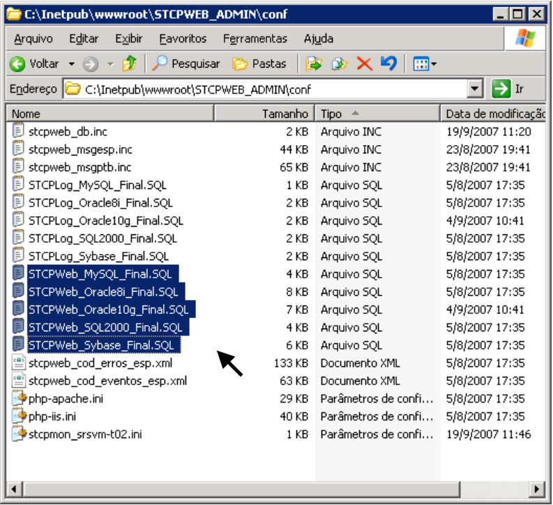
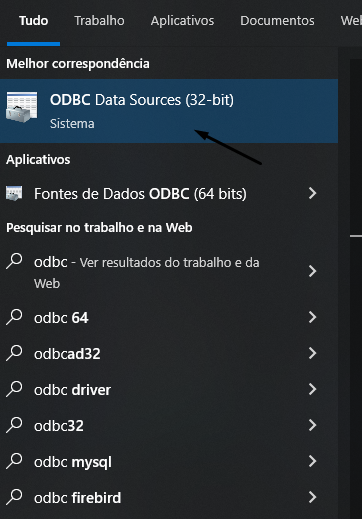
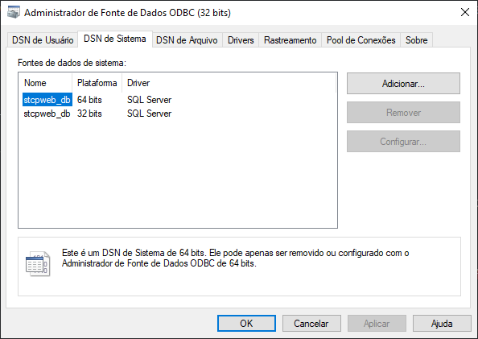
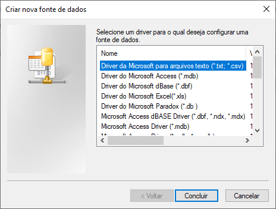
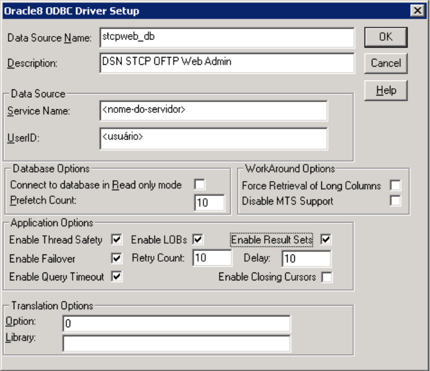
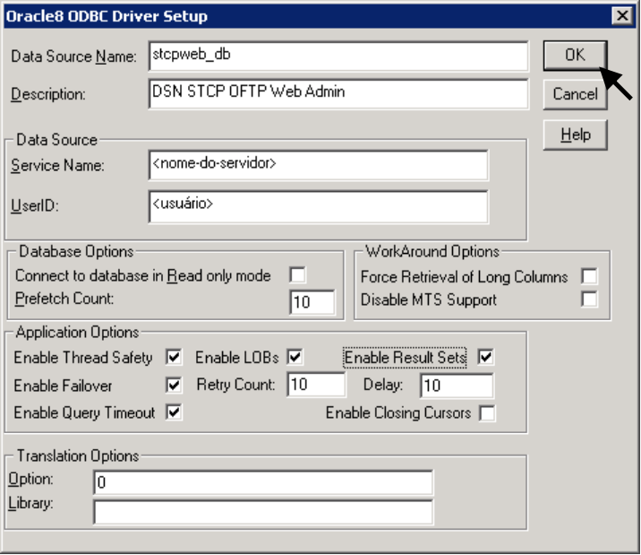
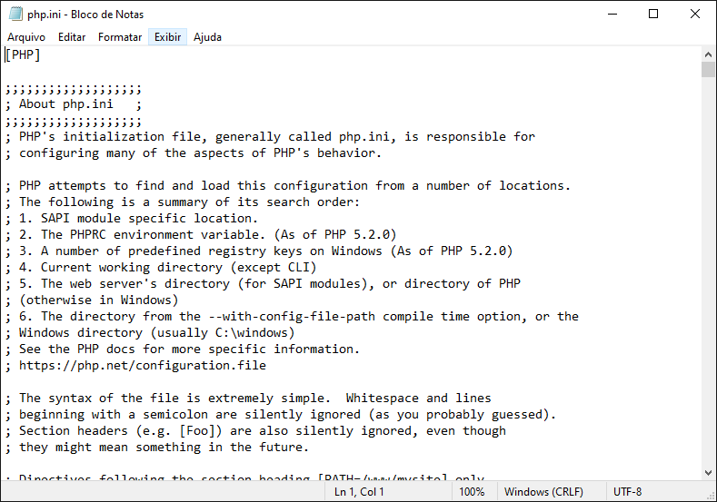

# Distribuição dos pacotes

Abra o link de instalação que será disponibilizado pela Equipe de Sustentação da Riversoft e extraia os arquivos do produto para iniciar o processo.

## Criação do Banco de Dados

O STCP OFTP Web Admin é compatível com diversos bancos de dados existentes no mercado, verifique mais informações na seção <a href="/database" target="_blank">Banco de Dados homologados</a>  &nbsp;.

Crie um banco de dados **STCPWEB_DB** no servidor utilizando a ferramenta adequada ao sistema.

A pasta **C:\Inetpub\wwwroot\STCPWEB_ADMIN\conf\scripts** contém os scripts para a criação das tabelas do banco de dados **STCPWEB_DB**.

<!--  -->


## Configuração do driver ODBC para acesso ao Banco de Dados

Os seguintes procedimentos devem ser executados para configuração do driver ODBC de acesso ao Banco de Dados.

<span style="display:inline-block; width: 25px; height: 25px; border-radius: 50%; background-color: #0095C7; color: white; text-align: center; line-height: 25px; font-size: 14px;">1</span> &nbsp;Acesse a ferramenta de configuração do ODBC.



<span style="display:inline-block; width: 25px; height: 25px; border-radius: 50%; background-color: #0095C7; color: white; text-align: center; line-height: 25px; font-size: 14px;">2</span> &nbsp; Selecione a guia **DSN de Sistema** para adicionar a fonte de dados e clique em **Adicionar**.



<span style="display:inline-block; width: 25px; height: 25px; border-radius: 50%; background-color: #0095C7; color: white; text-align: center; line-height: 25px; font-size: 14px;">3</span> &nbsp; Selecione o driver na lista e clique em **Concluir**.



<span style="display:inline-block; width: 25px; height: 25px; border-radius: 50%; background-color: #0095C7; color: white; text-align: center; line-height: 25px; font-size: 14px;">4</span> &nbsp; Na guia **Geral**, configure as opções conforme informadas (para Oracle8) e clique no botão **OK** para salvar.

<!--  -->

Clique no botão **OK** para finalizar a configuração da fonte de dados ODBC.

<!--  -->

## Instalação e configuração do PHP

Faça o download da última versão do processador de scripts PHP do site www.php.net e execute os passos seguintes:

<span style="display:inline-block; width: 25px; height: 25px; border-radius: 50%; background-color: #0095C7; color: white; text-align: center; line-height: 25px; font-size: 14px;">1</span> &nbsp;Extraia o arquivo do PHP no diretório “**< drive>:\php**”.

<span style="display:inline-block; width: 25px; height: 25px; border-radius: 50%; background-color: #0095C7; color: white; text-align: center; line-height: 25px; font-size: 14px;">2</span> &nbsp;Crie o diretório de controle de sessão **< drive>:\php\sessiondata**.

<span style="display:inline-block; width: 25px; height: 25px; border-radius: 50%; background-color: #0095C7; color: white; text-align: center; line-height: 25px; font-size: 14px;">3</span> &nbsp;Copie o arquivo **PHP-IIS.INI** do diretório **< drive>:\STCPWEB_ADMIN\conf** para o diretório **< drive>:\php** com o nome **PHP.INI**

<span style="display:inline-block; width: 25px; height: 25px; border-radius: 50%; background-color: #0095C7; color: white; text-align: center; line-height: 25px; font-size: 14px;">4</span> &nbsp;Altere o arquivo **PHP.INI** com os parâmetros abaixo e salve o arquivo.

<!--  -->

Os seguintes parâmetros devem ser alterados para refletir o ambiente de instalação:

```php {filename="PHP.INI"}
short_open_tag = On
allow_call_time_pass_reference = On
max_execution_time = 300
error_reporting = E_ALL & ~E_NOTICE
display_errors = On
register_globals = On
cgi.force_redirect =0
fastcgi.impersonate =1
cgi.rfc2616_headers = 1
include_path = ".;<drive>:\php\includes
session.save_path = "<drive>:\php\sessiondata"
session.use_cookies = 1
```

Obs: O caracter “;” (ponto e vírgula) no início da linha indica um comentário. Para os parâmetros acima o caracter deve ser removido.


