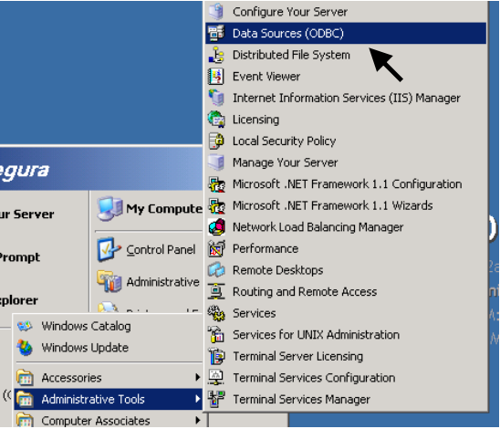

# Instalação

Abra o link de instalação e extraia os arquivos do produto para iniciar o processo.

### Criação do Banco de Dados Riversoft STCP OFTP Web Admin

O STCP OFTP é compatível com diversos bancos de dados existentes no mercado, tais como: Microsoft SQL Server, Oracle, Sybase e MySQL.

Crie um banco de dados “**STCPWEB_DB**” no servidor utilizando a ferramenta adequada ao sistema.

A pasta **“C:\Inetpub\wwwroot\STCPWEB_ADMIN\conf”** contém os scripts para a crição das
tabelas do banco de dados “STCPWEB_DB”.

<!--  -->

### Configuração do driver ODBC para acesso ao Banco de Dados

Os seguintes procedimentos devem ser executados para configuração do driver ODBC de acesso ao Banco de Dados.

Acesse a ferramenta de configuração do ODBC.

<!--  -->

Selecione a guia **System DSN** para adicionar a fonte de dados e clique em **Add**.

<!--  -->

Selecione o driver na lista e clique em **Concluir**.

<!--  -->

Na guia **General**, configure as opções conforme informadas (para Oracle8) e clique
no botão **OK** para salvar.

<!--  -->

Clique no botão **OK** para finalizar a configuração da fonte de dados ODBC.

<!--  -->

### Instalação e configuração do processador de scripts PHP

Faça o download da última versão do processador de scripts PHP do site www.php.net e execute os passos seguintes:

Extraia o arquivo do PHP no diretório “**< drive>:\php**”.

Crie o diretório de controle de sessão “**< drive>:\php\sessiondata**”.

Copie o arquivo PHP-IIS.INI do diretório “**< drive>:\STCPWEB_ADMIN\conf**” para o
diretório “**< drive>:\php**” com o nome **PHP.INI**

Altere o arquivo **PHP.INI** com os parâmetros abaixo e salve o arquivo.

<!--  -->

Os seguintes parâmetros devem ser alterados para refletir o ambiente de instalação:

```php
short_open_tag = On
allow_call_time_pass_reference = On
max_execution_time = 300
error_reporting = E_ALL & ~E_NOTICE
display_errors = On
register_globals = On
cgi.force_redirect =0
fastcgi.impersonate =1
cgi.rfc2616_headers = 1
include_path = ".;<drive>:\php\includes
session.save_path = "<drive>:\php\sessiondata"
session.use_cookies = 1
```

Obs: O caracter “;” (ponto e vírgula) no início da linha indica um comentário. Para os parâmetros acima o caracter deve ser removido.


