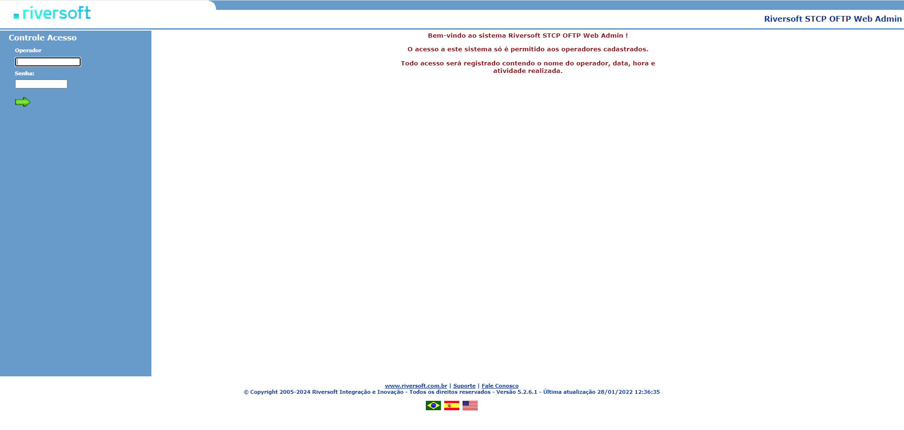
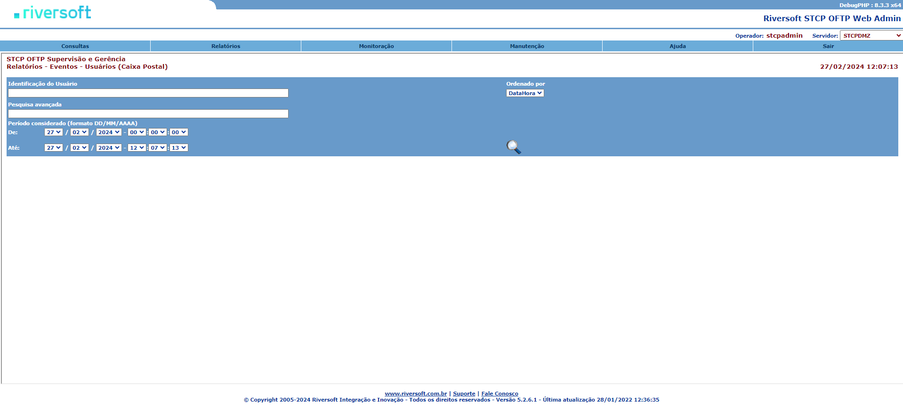
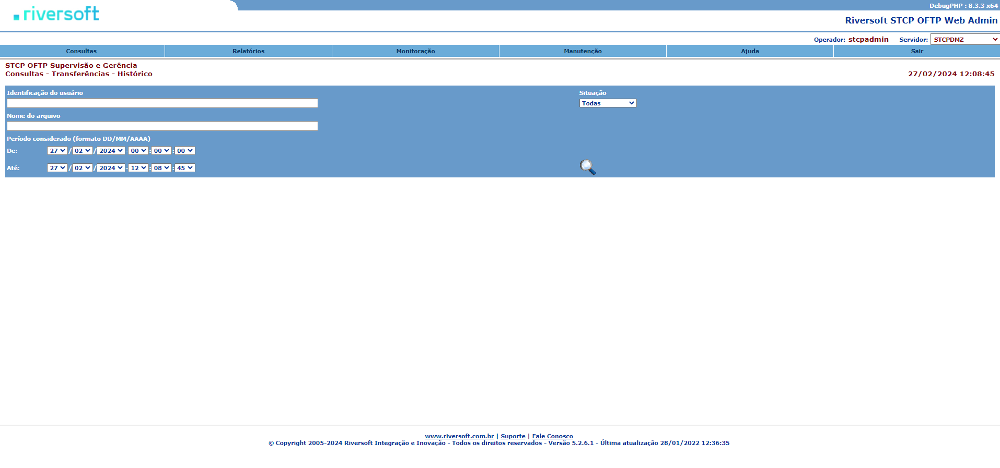

# Por que utilizar o STCP OFTP Web Admin?

A proposta da ferramenta STCP OFTP Web Admin é facilitar o acesso da monitoração das funcionalidades do STCP OFTP.

Através de uma interface web, um usuário previamente cadastrado pode gerenciar as transferências de dados, os eventos ocorridos, consultar os agendamentos do sistema, monitorar os servidores STCP OFTP remotamente e tantas outras funcionalidades que podem ser visualizadas na seção de <a href="/docs/stcpwebadmin/config/#funcionalidades">Funcionalidades</a>  &nbsp;

 

 

