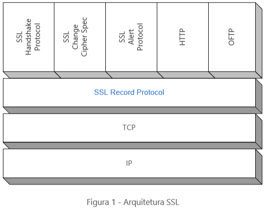
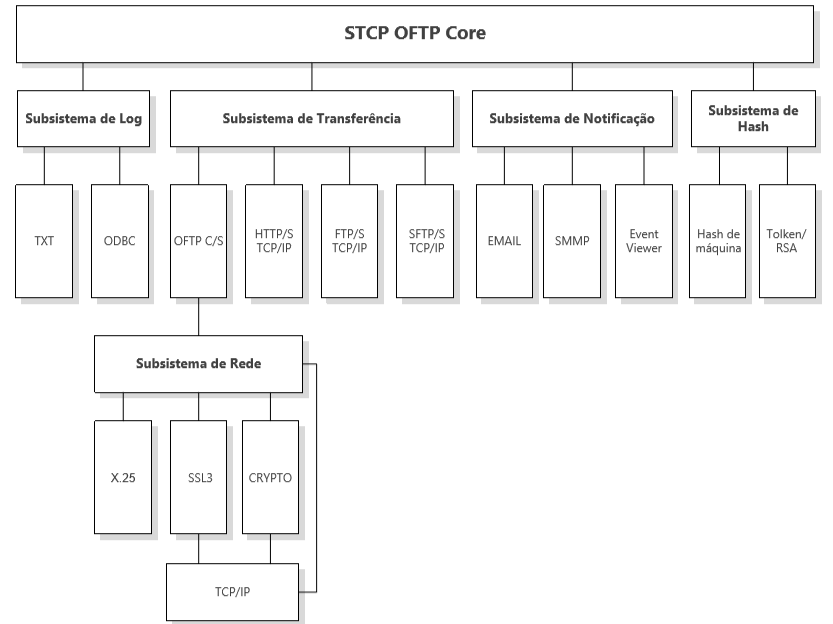

<!-- # Segurança -->
## Como é a segurança do STCP?

O STCP implementa a segurança em dois níveis: autenticação do usuário pela aplicação e a criptografia dos dados.

### Autenticação do usuário pela aplicação (ODETTE ID)

A autenticação do usuário é realizada pela aplicação através do reconhecimento de um usuário com até 26 (vinte e seis) caracteres e senha com até 8 (oito) caracteres antes do início da transferência.

### Criptografia

Criptografia é a codificação dos dados com o objetivo de proteger o seu conteúdo das pessoas indesejadas. Os algoritmos matemáticos usados para proteger os dados são chamados de codificadores.

Existem dois tipos de codificadores: assimétricos (chave pública) e simétricos (convencionais).

Os codificadores assimétricos operam com um par de chaves: pública e privada. A chave que codifica os dados não é a mesma que decodifica.

Os codificadores simétricos utilizam uma única chave. A chave que codifica os dados é a mesma que decodifica.

Os codificadores simétricos são mais rápidos do que os assimétricos e por isso são utilizados para codificar grandes volumes de dados, porém os assimétricos servem para manter a privacidade durante a troca das chaves simétricas e a assinatura digital.

## Message Digests (sumário da mensagem)

A representação de uma mensagem de tamanho variável em uma mensagem pequena de tamanho fixo é chamada de ‘hash’ ou ‘Message Digests’ (Sumário da Mensagem).

Os algoritmos de ‘hash’ foram desenhados de maneira a produzir uma representação única para cada mensagem e tornar extremamente difícil o processo de reconstrução da mensagem a partir do seu ‘hash’. É impossível diferentes mensagens produzirem o mesmo ‘hash’.

## Assinatura Digital

A Assinatura Digital é o processo de codificar o `hash` de uma determinada mensagem com a chave privativa do emissor. Qualquer um que receba a mensagem digitalmente assinada pode, através da chave pública do emissor, decodificar o `hash` e verificar a sua origem.

## Certificado

O Certificado é a associação da chave pública com a identificação do seu possuidor (nome do indivíduo, endereço do servidor ou outro) emitido e assinado por uma Autoridade Certificadora (CA).

O Certificado inclui também as informações da autoridade certificadora e o seu período de validade. Adicionalmente mais informações (extensões) podem ser associadas (número de série e outras).

## Autoridade Certificadora (CA)

A Autoridade Certificadora é a empresa responsável pela verificação e processamento das solicitações de certificado (certificate request), emissão e manutenção deles. Estas empresas mantêm uma lista de procedimentos e exigências para garantir a autenticidade do possuidor da chave pública.

É possível a criação de sua própria autoridade certificadora (CA), em geral, para ser utilizada dentro da própria rede (Intranet).

## Secure Socket Layer (SSL)

O SSL é uma camada de protocolo para utilização entre a aplicação e a camada de comunicação TCP/IP. O SSL fornece os serviços de comunicação segura entre a aplicação cliente e servidor, permitindo a mútua autenticação, assinatura digital (integridade) e criptografia (privacidade).



O SSL suporta a escolha específica dos algoritmos utilizados para criptografia, ‘hash’ e assinatura digital. A seleção dos algoritmos entre o cliente e servidor é realizada no estabelecimento da sessão do protocolo. O SSL tem diferentes versões, a adotada pelo STCP OFTP Client é a versão 3.0.

## Criptografia no STCP OFTP Client
O STCP OFTP Client utiliza a criptografia no nível de transporte onde um túnel seguro é estabelecido entre o cliente e o servidor, e todos os dados trafegados são codificados. A escolha do tipo de criptografia: Nativa ou SSL3 é realizada na configuração do produto.

## A Criptografia Nativa
A “criptografia nativa” é uma implementação proprietária de troca de chaves e criptografia dos dados utilizando os algoritmos de chaves simétricas e assimétricas onde as chaves são negociadas dinamicamente. São 3 (três) as opções de configuração para os níveis de criptografia: Normal, Média e Alta, com as seguintes características:

* Normal - Chave assimétrica de 512 bits e chave simétrica de 48 bits
* Média - Chave assimétrica de 1024 bits e chave simétrica de 56 bits
* Alta - Chave assimétrica de 2048 bits e chave simétrica de 128 bits


## A criptografia SSL3 no STCP OFTP Client

O STCP OFTP Client inicia o processo de comunicação segura com a solicitação para a camada SSL3 da abertura de uma nova sessão com a troca da chave pública (assimétrica) seguida da troca da chave de sessão (simétrica).

Estes são os passos realizados para a troca de chaves:

1. O cliente solicita a abertura de uma sessão segura com o servidor. O servidor tem um certificado (X.509), contendo a chave pública e uma chave privada.
2. O servidor envia uma cópia do seu certificado contendo a chave pública para o cliente.
3. O cliente gera uma nova chave simétrica para esta sessão.
4. O cliente codifica a chave de sessão com a chave pública do servidor e envia a chave de sessão codificada para o servidor.
5. O servidor utiliza a sua chave privativa para decodificar a chave de sessão.

O STCP OFTP Client possibilita a configuração do conjunto de algoritmos a serem utilizados para codificação na criptografia, assinatura digital e hash.



O **STCP OFTP Client** tem uma arquitetura modular e possibilita a configuração de diferentes tipos de comunicação.

O **STCP OFTP Client** permite a configuração de diferentes algoritmos e grupos de algoritmos para comunicação SSL3, abaixo segue a lista e definições:

Algoritmos | Descrição
:------    | :-----
ALL        | Todos os algoritmos.
HIGH       | Codificadores com chave maiores que 128 bits.
MEDIUM     | Codificadores com chave de 128 bits.
LOW        | Codificadores com chave de 56 ou 64 bits.
EXP EXPORT | Codificadores exportáveis com 40 ou 56 bits.
EXPORT40   | Codificadores exportáveis com 40 bits.
EXPORT56   | Codificadores exportáveis com 56 bits.
eNULL NULL | Sem codificadores (não recomendado).
aNULL      | Sem autenticação. Corresponde ao algoritmo DH anonymous. Esta configuração é vulnerável ao ataque “man in the middle” (não recomendado).
RSA        | Codificadores que utilizam RSA para troca de chave.
kEDH       | Codificadores que utilizam EDH (Ephemeral Diffie Helman) para validação da chave.
kDHr       | Codificadores que utilizam DH (Diffie Helman) para validação da chave e certificado DH assinado por uma CA com chave RSA.
kDHd       | Codificadores que utilizam DH para validação da chave e certificado DH assinado por uma CA com chave DSS.
aRSA       | Autenticação RSA com certificado com chave RSA.
aDSS DSS   | Autenticação DSS com certificado com chave DSS.
aDH        | Autenticação DH com certificado com chave DH.
kFZA aFZA eFZA FZA| Codificadores, autenticação com algoritmo FORTEZZA (não disponível).
DH         | Codificadores DH incluindo o DH anônimo.
ADH        | Codificadores DH anônimo.
3DES       | Codificadores triple DES.
DES        | Codificadores DES (Data Encryption Standard).
RC4        | Codificadores RC4.
RC2        | Codificadores RC2.
IDEA       | Codificadores IDEA.
AES        | Codificadores AES (Advanced Encryption Standard).
MD5        | MD5
SHA SHA1   | SHA1

----

## Licença OpenSSL

OpenSSL License

---------------

```
/* ================================================================= ===
*Copyright (c) 1998-2004 The OpenSSL Project.  All rights reserved.
*
*Redistribution and use in source and binary forms, with or without
*modification, are permitted provided that the following conditions
*are met:
*
*1. Redistributions of source code must retain the above copyright
*notice, this list of conditions and the following disclaimer.
*
*2. Redistributions in binary form must reproduce the above copyright
*notice, this list of conditions and the following disclaimer in
*the documentation and/or other materials provided with the
*distribution.
*
*3. All advertising materials mentioning features or use of this
*software must display the following acknowledgment:
*"This product includes software developed by the OpenSSL Project
*for use in the OpenSSL Toolkit. (http://www.openssl.org/)"
*
*4. The names "OpenSSL Toolkit" and "OpenSSL Project" must not be used to
*endorse or promote products derived from this software without
*prior written permission. For written permission, please contact
*openssl-core@openssl.org.
*
*5. Products derived from this software may not be called "OpenSSL"
*nor may "OpenSSL" appear in their names without prior written
*permission of the OpenSSL Project.
*
*6. Redistributions of any form whatsoever must retain the following
*acknowledgment:
*"This product includes software developed by the OpenSSL Project
*for use in the OpenSSL Toolkit (http://www.openssl.org/)"
*
*THIS SOFTWARE IS PROVIDED BY THE OpenSSL PROJECT ``AS IS'' AND ANY
*EXPRESSED OR IMPLIED WARRANTIES, INCLUDING, BUT NOT LIMITED TO, THE
*IMPLIED WARRANTIES OF MERCHANTABILITY AND FITNESS FOR A PARTICULAR
*PURPOSE ARE DISCLAIMED.  IN NO EVENT SHALL THE OpenSSL PROJECT OR
*ITS CONTRIBUTORS BE LIABLE FOR ANY DIRECT, INDIRECT, INCIDENTAL,
*SPECIAL, EXEMPLARY, OR CONSEQUENTIAL DAMAGES (INCLUDING, BUT
*NOT LIMITED TO, PROCUREMENT OF SUBSTITUTE GOODS OR SERVICES;
*LOSS OF USE, DATA, OR PROFITS; OR BUSINESS INTERRUPTION)
*HOWEVER CAUSED AND ON ANY THEORY OF LIABILITY, WHETHER IN CONTRACT,
*STRICT LIABILITY, OR TORT (INCLUDING NEGLIGENCE OR OTHERWISE)
*ARISING IN ANY WAY OUT OF THE USE OF THIS SOFTWARE, EVEN IF ADVISED
*OF THE POSSIBILITY OF SUCH DAMAGE.
*
================================================================= ===
*
*This product includes cryptographic software written by Eric Young
*(eay@cryptsoft.com).  This product includes software written by Tim
*Hudson (tjh@cryptsoft.com).
*


Original SSLeay License

-----------------------

/* Copyright (C) 1995-1998 Eric Young (eay@cryptsoft.com)
*All rights reserved.
*
*This package is an SSL implementation written
*by Eric Young (eay@cryptsoft.com).
*The implementation was written so as to conform with Netscapes SSL.
*
*This library is free for commercial and non-commercial use as long as
*the following conditions are aheared to.  The following conditions
*apply to all code found in this distribution, be it the RC4, RSA,
*lhash, DES, etc., code; not just the SSL code.  The SSL documentation
*included with this distribution is covered by the same copyright terms
*except that the holder is Tim Hudson (tjh@cryptsoft.com).
*
*Copyright remains Eric Young's, and as such any Copyright notices in
*the code are not to be removed.
*If this package is used in a product, Eric Young should be given attribution
*as the author of the parts of the library used.
*This can be in the form of a textual message at program startup or
*in documentation (online or textual) provided with the package.
*
*Redistribution and use in source and binary forms, with or without
*modification, are permitted provided that the following conditions
*are met:
*1. Redistributions of source code must retain the copyright
*notice, this list of conditions and the following disclaimer.
*2. Redistributions in binary form must reproduce the above copyright
*notice, this list of conditions and the following disclaimer in the
*documentation and/or other materials provided with the distribution.
*3. All advertising materials mentioning features or use of this software
*must display the following acknowledgement:
*"This product includes cryptographic software written by
*Eric Young (eay@cryptsoft.com)"
*The word 'cryptographic' can be left out if the rouines from the library
*being used are not cryptographic related :-).
*4. If you include any Windows specific code (or a derivative thereof) from
*the apps directory (application code) you must include an acknowledgement:
*"This product includes software written by Tim Hudson (tjh@cryptsoft.com)"
*
*THIS SOFTWARE IS PROVIDED BY ERIC YOUNG ``AS IS'' AND
*ANY EXPRESS OR IMPLIED WARRANTIES, INCLUDING, BUT NOT LIMITED TO, THE
*IMPLIED WARRANTIES OF MERCHANTABILITY AND FITNESS FOR A PARTICULAR PURPOSE
*ARE DISCLAIMED.  IN NO EVENT SHALL THE AUTHOR OR CONTRIBUTORS BE LIABLE
*FOR ANY DIRECT, INDIRECT, INCIDENTAL, SPECIAL, EXEMPLARY, OR CONSEQUENTIAL
*DAMAGES (INCLUDING, BUT NOT LIMITED TO, PROCUREMENT OF SUBSTITUTE GOODS
*OR SERVICES; LOSS OF USE, DATA, OR PROFITS; OR BUSINESS INTERRUPTION)
*HOWEVER CAUSED AND ON ANY THEORY OF LIABILITY, WHETHER IN CONTRACT, STRICT
*LIABILITY, OR TORT (INCLUDING NEGLIGENCE OR OTHERWISE) ARISING IN ANY WAY
*OUT OF THE USE OF THIS SOFTWARE, EVEN IF ADVISED OF THE POSSIBILITY OF
*SUCH DAMAGE.
*
*The licence and distribution terms for any publically available version or
*derivative of this code cannot be changed.  i.e. this code cannot simply be
*copied and put under another distribution licence
*[including the GNU Public Licence.]
```

----

## Referências

(www.openssl.org)
(www.modssl.org)
(http://oss-institute.org/newspdf/OSSIFIPSRef.pdf)
(www.odette.org)
(www.oftp.net)


