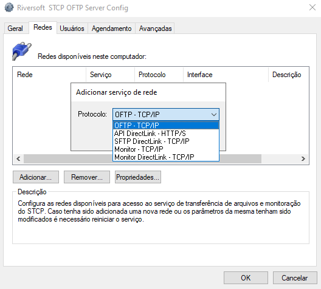
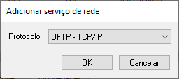
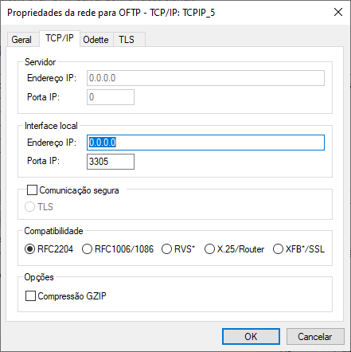
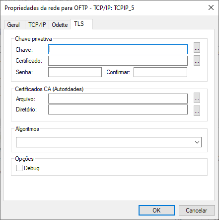
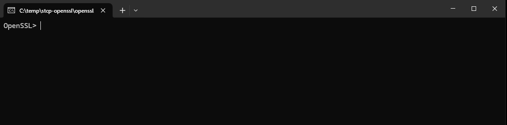
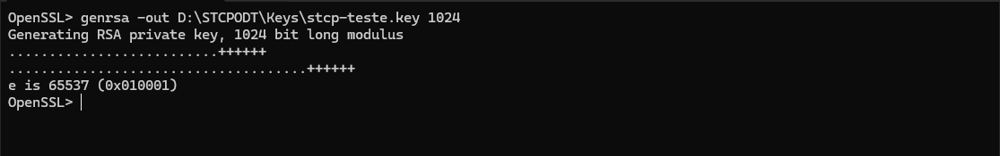
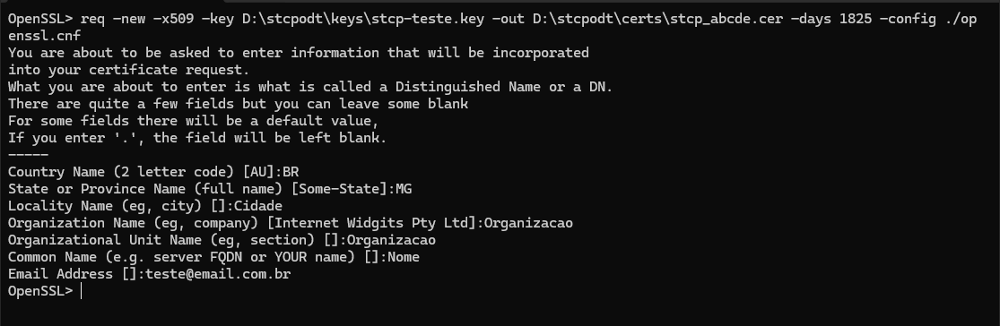

## Protocolo OFTP

No **OFTP (Odette File Transfer Protocol)**, temos um protocolo robusto e seguro amplamente utilizado na indústria automotiva e em outros setores para a troca de dados eletrônicos (EDI). A segurança oferecida pelo OFTP é uma de suas maiores vantagens, e aqui estão alguns dos principais benefícios:

**Criptografia e Autenticação:** O OFTP oferece suporte para criptografia avançada, garantindo que os dados trocados entre as partes sejam protegidos contra interceptação e acesso não autorizado. Além disso, a autenticação dos participantes assegura que apenas entidades confiáveis possam se comunicar, prevenindo fraudes e garantindo a integridade das transações.

**Confirmação de Recebimento:** Um dos diferenciais do OFTP é a capacidade de confirmar a recepção dos arquivos transferidos. Isso garante que as partes envolvidas tenham certeza de que os dados foram entregues e recebidos corretamente, reduzindo o risco de perda de informações e aumentando a confiança no processo.

**Transmissão Segura de Arquivos Grandes:** OFTP foi projetado para lidar eficientemente com a transferência de arquivos de grande volume. Com sua capacidade de retomar transferências interrompidas e assegurar que os dados cheguem ao destino completo e sem erros, o protocolo é ideal para indústrias onde o compartilhamento de grandes volumes de dados é comum.

**Compatibilidade e Flexibilidade:** O OFTP é amplamente compatível com diversos sistemas e plataformas, facilitando a integração entre diferentes parceiros comerciais. Isso permite que as empresas mantenham seus dados seguros sem a necessidade de grandes mudanças em sua infraestrutura tecnológica.

**Resiliência e Confiabilidade:** Além da segurança, o OFTP é conhecido por sua alta confiabilidade e resiliência. O protocolo inclui mecanismos para verificar a integridade dos dados durante a transferência e para retransmitir partes corrompidas, garantindo que a informação seja transferida corretamente mesmo em condições de rede adversas.

O OFTP traz **segurança**, **confiabilidade** e a **integridade** na troca de dados sensíveis. Ao implementar o OFTP, as organizações podem ter a tranquilidade de saber que suas comunicações estão protegidas contra ameaças e que seus dados chegarão ao destino de forma segura e intacta.

## Protocolo SFTP

Já no protocolo **SFTP (Secure File Transfer Protocol)**, temos um protocolo seguro para transferência de arquivos que combina a funcionalidade do FTP com a segurança do SSH (Secure Shell). Ele é amplamente utilizado por empresas e indivíduos que precisam transferir dados de forma segura pela internet ou redes privadas. 

Aqui estão algumas das principais vantagens do SFTP:

**Segurança Criptografada:** A principal vantagem do SFTP é a segurança. Todo o tráfego entre o cliente e o servidor é criptografado, o que impede que os dados sejam interceptados ou modificados por atacantes. Isso inclui tanto os dados transferidos quanto as credenciais de login.

**Autenticação Segura:** O SFTP utiliza a autenticação baseada em chaves SSH, que é muito mais segura do que as senhas tradicionais. Isso protege contra tentativas de login não autorizadas e garante que apenas usuários devidamente autenticados possam acessar o servidor.

**Integridade dos Dados:** O SFTP verifica a integridade dos dados durante a transferência, garantindo que os arquivos não sejam corrompidos ou alterados no processo. Isso é crucial para a confiabilidade das transferências, especialmente em ambientes onde a precisão dos dados é essencial.

**Firewall-Friendly:** Diferente do FTP tradicional, que requer múltiplas portas para a transferência de dados, o SFTP funciona sobre uma única conexão e porta, geralmente a porta 22. Isso simplifica a configuração de firewalls e reduz o risco de vulnerabilidades associadas a portas abertas.

**Transferências de Arquivos de Qualquer Tamanho:** O SFTP é capaz de lidar com transferências de arquivos de qualquer tamanho, seja ele pequeno ou extremamente grande. Isso o torna adequado para uma ampla gama de aplicações, desde o envio de pequenos documentos até grandes bases de dados ou backups.

**Continuação de Transferências Interrompidas:** Uma característica útil do SFTP é a capacidade de retomar transferências interrompidas. Se uma transferência for interrompida devido a problemas de conexão ou outros fatores, ela pode ser continuada de onde parou, economizando tempo e largura de banda.

**Controle de Acesso e Permissões:** SFTP oferece um controle granular sobre o acesso e as permissões dos arquivos. Os administradores podem definir quais usuários ou grupos têm acesso a determinados arquivos ou diretórios, garantindo que os dados sensíveis sejam acessados apenas por pessoas autorizadas.

**Compatibilidade e Flexibilidade:** O SFTP é amplamente suportado por uma variedade de sistemas operacionais e ferramentas de software, o que facilita sua implementação em diferentes ambientes de TI. Ele também pode ser facilmente integrado a scripts e processos automatizados, tornando-o uma solução flexível para diversas necessidades de transferência de arquivos.

O SFTP é uma solução **segura**, **confiável** e **fácil** de usar para a transferência de arquivos, especialmente em contextos onde a proteção de dados sensíveis é uma prioridade.

## Criptografia TLS

Alguns dos algoritmos mais atuais usados com TLS:

**1. AES (Advanced Encryption Standard):**

* AES-128: Utiliza uma chave de 128 bits, oferecendo um bom equilíbrio entre segurança e desempenho.
* AES-256: Utiliza uma chave de 256 bits, oferecendo um nível de segurança mais elevado.

**2. ChaCha20:**

* Um algoritmo de cifra rápida e eficiente, especialmente útil em dispositivos com hardware limitado ou em situações onde a velocidade é crucial.

**3. ECDHE (Elliptic Curve Diffie-Hellman Ephemeral):**

* Utilizado para o acordo de chaves, oferece uma segurança mais forte com menores chaves, graças ao uso de criptografia de curvas elípticas.

**4. RSA (Rivest-Shamir-Adleman):**

* Amplamente usado para troca de chaves e assinatura digital, embora esteja sendo gradualmente substituído por ECDHE em novas implementações devido a sua eficiência limitada em comparação com as curvas elípticas.

**5. SHA-256/384/512 (Secure Hash Algorithm):**

* Funções de hash que fornecem integridade dos dados. SHA-256 é o mais comum, mas SHA-384 e SHA-512 oferecem níveis mais elevados de segurança.

**6. GCM (Galois/Counter Mode):**

* Um modo de operação que oferece autenticação adicional e integridade dos dados, frequentemente usado com AES (AES-GCM).


| **Algoritmo**       | **Uso**                                | **Tamanho de Chave** | **Segurança**                    | **Comentário**                                  |
|---------------------|----------------------------------------|----------------------|----------------------------------|------------------------------------------------|
| AES-128             | Cifra de dados                         | 128 bits             | Alta                             | Boa combinação de segurança e desempenho       |
| AES-256             | Cifra de dados                         | 256 bits             | Muito Alta                       | Recomendado para segurança de longo prazo      |
| ChaCha20            | Cifra de dados                         | 256 bits             | Muito Alta                       | Alternativa rápida ao AES, especialmente em hardware limitado |
| ECDHE               | Acordo de chaves                       | 256 bits (EC curve)  | Muito Alta                       | Melhor eficiência comparado ao RSA             |
| RSA                 | Troca de chaves, assinatura digital    | 2048/4096 bits        | Alta                             | Usado historicamente, mas gradualmente substituído por ECDHE  |
| SHA-256/384/512     | Função de hash para integridade        | 256/384/512 bits     | Alta/Muito Alta                  | Proporciona integridade dos dados              |
| GCM (AES-GCM)       | Autenticação de dados, integridade     | Variável (depende do AES) | Alta                        | Oferece criptografia autenticada               |

## Configurar porta TLS

Para acessar o configurador do STCP OFTP Server, acesse o **Riversoft STCP OFTP Server Config**.

Acesse a guia **Redes** para adicionar as interfaces que ficarão disponíveis para o serviço de transferência e adicione uma interface do serviço de transferência.



Clique em **Adicionar** e selecione o protocolo **OFTP – TCP/IP**.

Clique em **OK** para entrar nas configurações.



Clique na guia **TCP/IP** e configure os parâmetros apresentados.



Clique na guia **TLS**, configure os parâmetros apresentados abaixo e pressione o botão **OK** para finalizar.



### Chave privativa e Certificado 

Os seguintes procedimentos devem ser executados para a geração da chave privativa e do certificado digital a serem utilizados na comunicação TLS.

No prompt de comando, execute a aplicação **openssl.exe** (Ex.: C:\STCPODT\Program\openssl.exe) para iniciar o processo de geração do par de chaves assimétricas (privada/pública).



Utilize o comando abaixo para gerar a chave privativa que será utilizada para criptografia da conexão.

```pshell
genrsa -out[unidade_disco][diretorio_instalação_stcp]\keys\[nome_da_chave].key 1024
```

Exemplo:

```pshell
genrsa –out c:\stcpodt\keys\stcp_abcde.key 1024
```



O próximo passo é gerar o Certificado Digital associado à chave gerada anteriormente. Para isso, utilize o comando abaixo.

```pshell
req –new –x509 –key [unidade_disco][diretório_instalação_stcp]\keys\[nome_da_chave].key –out [unidade_disco][diretório_instalação_stcp]\certs\[nome_do_certificado].cer –days 1825 –config ./openssl.cnf
```

Exemplo:

```pshell
req –new –x509 –key c:\stcpodt\keys\stcp_interprint.key –out c:\stcpodt\certs\stcp_abcde.cer –days 1825 –config ./openssl.cnf
```
Preencha as informações solicitadas para concluir o processo de geração do Certificado Digital.

