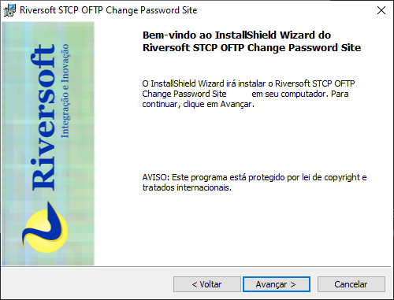
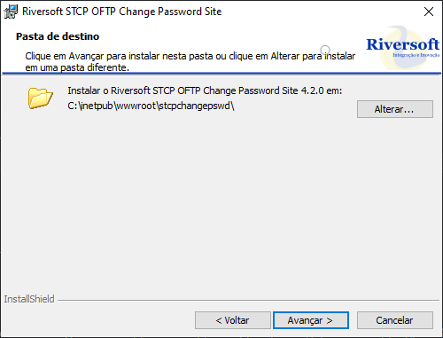
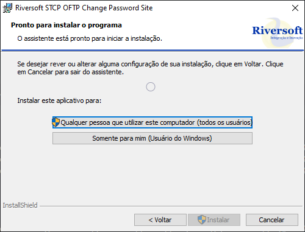

O pacote de instalação será distribuído através de um link pela Equipe de Sustentação da Riversoft.

Após extrair o zip com o arquivo executável, siga os seguintes passos para prosseguir com a instalação do STCP Change Password:

1 &nbsp; Clique no botão **Avançar** para prosseguir com a instalação.

2 &nbsp; Aceite os termos do contrato de licença e clique no botão **Avançar**.

3 &nbsp; Aceite ou modifique as informações do cliente e clique no botão **Avançar**.

4 &nbsp; Altere a informação do diretório de instalação e clique no botão **Avançar**.

5 &nbsp; Selecione a opção desejada e clique no botão **Instalar** para prosseguir.

6 &nbsp; Após a finalização do processo de instalação, clique no botão **Concluir**.

