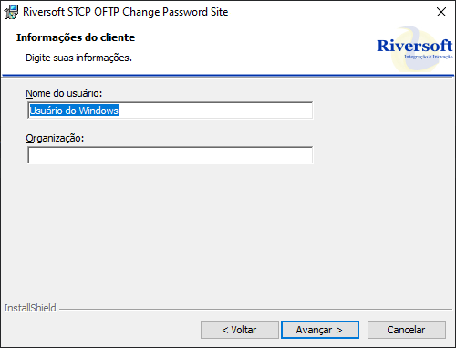

## Passos para instalação

O pacote de instalação será distribuído pela Riversoft.
 
Após descompactar o arquivo ZIP, procure pelo arquivo executável na pasta extraída, para prosseguir com a instalação do STCP Change Password:.

{}

### Execute o instalador 

Clique duas vezes no arquivo executável para iniciar o processo de instalação.

Uma janela de boas-vindas será exibida. Leia as informações e clique em “Avançar” para prosseguir.

A partir deste ponto, o processo de instalação guiará você por etapas adicionais.

As próximas etapas incluem a seleção do local de instalação, a configuração de componentes adicionais e a aceitação dos termos de licença.

Pressione “Voltar” para retornar à tela anterior ou “Cancelar” para interromper o processo de instalação.

### Contrato de licença

Leia cuidadosamente o Contrato de Licença de Uso do Usuário Final e caso concorde com os termos propostos, marque a opção correspondente e pressione o botão “Avançar” para prosseguir com a instalação.

Pressione “Voltar” para retornar à tela anterior ou “Cancelar” para interromper o processo de instalação.

### Identificação

Na tela "Informações do cliente", informe o Nome do usuário e a Organização.

### Diretório de instalação

Na tela “Pasta de destino”, clique em “Avançar” para instalar no diretório padrão ou “Alterar” para selecionar outro diretório ou criar um novo.

Pressione “Voltar” para retornar à tela anterior ou “Cancelar” para interromper o processo de instalação.

### Confirmação

Selecione a opção desejada e clique no botão "Instalar" para prosseguir.

### Concluir

Após a finalização do processo de instalação, clique no botão "Concluir".

{}