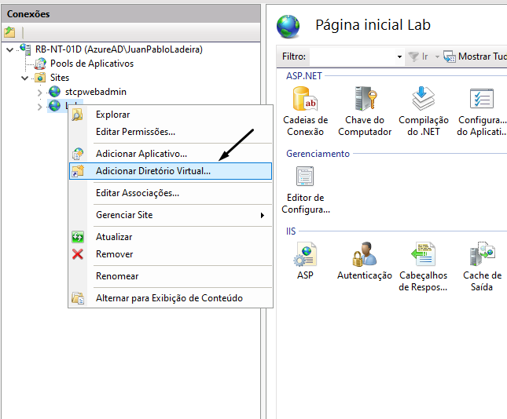
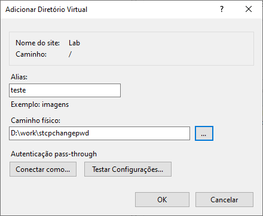
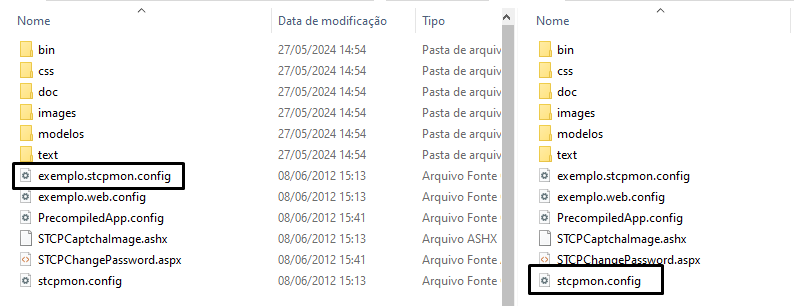

## Configuração do arquivo stcpmon.config

{}

### Renomear arquivo 

O arquivo "exemplo.stcpmon.config" serve como um modelo para as configurações da aplicação. Para aplicar as configurações, você precisa renomeá-lo para "stcpmon.config" e salvá-lo no diretório de instalação da aplicação. 



### Parâmetros

Configure o arquivo "stcpmon.config" com os parâmetros necessários, conforme especificado abaixo:


```xml {filename="stcpmon.config"}
<?xml version="1.0" encoding="utf-8"?>
<configuration>
    <configSections>
        <section name="Server1" type="Riversoft.NetLink.NetLinkTCPConnectionConfig, Riversoft.NetLink, Version=3.1.0.2053, Culture=neutral, PublicKeyToken=null" allowLocation="true" allowDefinition="Everywhere" allowExeDefinition="MachineToApplication" restartOnExternalChanges="true" requirePermission="true" />
    </configSections>
    <Server1 TCPRemoteAddress="192.168.0.220" TCPRemotePort="33050" TCPRfc2204="16" />
</configuration>
```

### ConfigSections

Na tag "configSections" configure os seguintes parâmetros:

```xml {filename="configSections"}
<configSections>
...
name = defina um nome para o servidor. Exemplo "Server1"
type = "Riversoft.NetLink.NetLinkTCPConnectionConfig, Riversoft.NetLink,
Version=3.1.0.2053, Culture=neutral, PublicKeyToken=null"

allowLocation = "true"
allowDefinition = "Everywhere"
allowExeDefinition = "MachineToApplication"
restartOnExternalChanges = "true"
requirePermission = "true"
...
</configSections>
```

### Crie uma nova Tag

Crie uma tag com o nome dado para o servidor, neste exemplo, chamamos "Server1" e configure suas características:

```xml {filename="configSections"}
<Server1 TCPRemoteAddress="172.20.30.213" TCPRemotePort="33050" TCPRfc2204="16" />

TCPRemoteAddress = endereço ip do servidor de monitoração do STCP.
TCPRemotePort = porta ip do servidor de monitoração do STCP.
TCPRfc2204 = "16"
```

{}

## Configuração do arquivo web.config

{}

### Renomear arquivo 

No diretório de instalação da aplicação, renomeie o arquivo **exemplo.web.config** para **web.config** e abra o arquivo já renomeado.


### Captcha Image 

Na seção "appSettings", realize as configurações da imagem de validação (Captcha Image).

```xml {filename="web.config"}
...
<!-- Inicio Configuracao do Captcha -->
<add key="STCPCaptcha:CharType" value="AlphaNum" />
<add key="STCPCaptcha:Len" value="4" />
<add key="STCPCaptcha:FontFamily0" value="Comic Sans MS" />
<add key="STCPCaptcha:FontFamily1" value="Times New Roman" />
<add key="STCPCaptcha:FontFamily2" value="Arial" />
<add key="STCPCaptcha:FontFamily3" value="Verdana" />
<add key="STCPCaptcha:FontFamily4" value="Georgia" />
<add key="STCPCaptcha:FontFamily5" value="Impact" />
<add key="STCPCaptcha:FontFamily6" value="Courier New" />
<add key="STCPCaptcha:FontFamily7" value="Book Antiqua" />
<add key="STCPCaptcha:FontFamily8" value="Garamond" />
<add key="STCPCaptcha:FontFamily9" value="Arial Narrow" />
<!-- Fim Configuracao do Captcha -->
...
```

### Texto da imagem

Configure na propriedade "value" o tipo de texto que deverá ser mostrado na imagem:

```xml {filename="value"}
<add key="STCPCaptcha:CharType" value="AlphaNum" />

"AlphaNum" = letras (maiúsculas ou minúsculas) e números.
"Numeric" = apenas números.
"Alpha" = apenas letras (maiúsculas ou minúsculas).
"AlphaLower" = apenas letras minúsculas.
"AlphaUpper" = apenas letras maiúsculas.
"AlphaLowerNum" = letras minúsculas e números.
"AlphaUpperNum" = letras maiúsculas e números.
```

### Caracteres

Configure na propriedade **value** a quantidade de caracteres que deve ser mostrada na imagem:

```xml {filename="value"}
<add key="STCPCaptcha:Len" value="4" />
```

### Tipo de fonte

Para alterar o tipo de fonte da imagem, use a seguinte tag:

```xml
<add key="STCPCaptcha:FontFamily0" value="Comic Sans MS" />
```

### Conexão com servidor

Configurações da conexão com o servidor STCP

```xml {filename="web.config"}
...
<!-- Inicio Configuracao de conexao com o Servidor STCP -->
<add key="STCPMonitor:Connection" value="Server1" />
<add key="STCPMonitor:Userid" value="stcpmon" />
<add key="STCPMonitor:Password" value="teste" />
<add key="STCPMonitor:Security" value="false" />
<!-- Fim Configuracao de conexao -->
...
```

Configure na propriedade **value** o nome do servidor informado no arquivo **stcpmon.config**.

```xml {filename="web.config"}
<add key="STCPMonitor:Connection" value="Server1" />
```

### Usuário de monitoração

Configure na propriedade **value** o nome do usuário de monitoração do STCP:

```xml {filename="web.config"}
<add key="STCPMonitor:Userid" value="stcpmon" />
```

Configure na propriedade **value** a senha do usuário de monitoração do STCP.

```xml {filename="web.config"}
<add key="STCPMonitor:Password" value="teste" />
```

Configure na propriedade **value** o valor **true** caso queira habilitar a comunicação através do protocolo TLS, caso contrário, utilize **false**.

```xml {filename="web.config"}
<add key="STCPMonitor:Security" value="false" />
```

### Idioma padrão

```xml {filename="web.config"}
...
<!-- Inicio Configuracao do idioma (DEFAULT) -->
<add key="STCPChangePassword:DefaultLanguage" value="ptb" />
...
```

O site do STCP OFTP Change Password pode ser exibido nos idiomas Português, Inglês e Espanhol. Configure na propriedade **value** o idioma padrão para o site.

```xml {filename="web.config"}
< add key="STCPChangePassword:DefaultLanguage" value="ptb" />

"ptb" = Idioma Português
"enu" = Idioma Inglês
"esp" = Idioma Espanhol
```

Configurações regionais:

```xml {filename="web.config"}
...
<add key="STCPChangePassword:ImageButtonFlagPTB"
value="~/images/btn_ptb.gif"/>
<add key="STCPChangePassword:ImageButtonFlagENU"
value="~/images/btn_enu.gif"/>
<add key="STCPChangePassword:ImageButtonFlagESP"
value="~/images/btn_esp.gif"/>
...
```

Caso não deseje exibir o site em um determinado idioma, comente a linha desejada utilizando as tags abaixo:

```
<!- - e -->.
```
Exemplo:
```xml {filename="web.config"}
< add key="STCPChangePassword:ImageButtonFlagPTB"
value="~/images/btn_ptb.gif"/>

< add key="STCPChangePassword:ImageButtonFlagENU"
value="~/images/btn_enu.gif" />

<!-- < add key="STCPChangePassword:ImageButtonFlagESP"
value="~/images/btn_esp.gif" /> -->
```

{}

## Configurações no IIS

{}

### Criar diretório virtual ou site

Acesse a ferramenta de configuração do IIS (Internet Information Services) e crie um novo **diretório virtual** e/ou **site** para a configuração da aplicação.



### Personalização

Informe o nome para o novo diretório virtual e o caminho físico, conforme figura abaixo e clique no botão **OK**.




### Documento Padrão

Nas propriedades do diretório virtual criado, selecione a aba **Documentos Padrão**. 


Selecione a opção **Adicionar**.


Informe o nome da página inicial do site conforme a figura abaixo e pressione **OK**.


### Finalizar

Clique com o botão direito no diretório virtual recém-criado e selecione a opção "Converter
para Aplicativo".


Para finalizar o processo de configuração clique no botão **OK**.

Para validar a configuração, selecione o novo diretório virtual e selecione "Gerenciar Aplicativo" e "Procurar". O site do STCP OFTP Change Password deverá ser apresentado.


{}

## Configurações dos botões

```xml {filename="web.config"}
...
<add key="STCPChangePassword:ptb:ImageButtonRefresh"
value="~/images/cmdRefresh_ptb_blue1.gif" />
<add key="STCPChangePassword:ptb:ImageButtonConfirm"
value="~/images/cmdCheck1_ptb_blue1.gif" />
<add key="STCPChangePassword:ptb:ImageButtonClose"
value="~/images/cmdClose_ptb_blue1.gif" />
<add key="STCPChangePassword:ptb:ImageButtonDownload3"
value="~/images/cmdDownload3_ptb_blue1.gif" />
<add key="STCPChangePassword:ptb:ImageButtonNext"
value="~/images/cmdNext_ptb_blue1.gif" />
<add key="STCPChangePassword:ptb:ImageButtonDownload"
value="~/images/cmd_download_ptb_blue1.gif" />
<add key="STCPChangePassword:ptb:ImageButtonFinish"
value="~/images/cmdFinish_ptb_blue1.gif" />
...
```

Configure na propriedade **value** o padrão de cores para os botões do site.

Exemplo:

```xml {filename="web.config"}
< add key="STCPChangePassword:ptb:ImageButtonRefresh"
value="~/images/cmdRefresh_ptb_PADRAO.gif" />
```

Onde **PADRAO** pode ser substituído pelas cores:

|  Cores  |                                                     Visualização                                                      |
| :-----: | :-------------------------------------------------------------------------------------------------------------------: |
|  blue1  | <span style="background-color:#025090; border-radius: 4px; padding: 4px;">&nbsp;&nbsp;&nbsp;&nbsp;&nbsp;&nbsp;</span> |
|  blue2  | <span style="background-color:#033361; border-radius: 4px; padding: 4px;">&nbsp;&nbsp;&nbsp;&nbsp;&nbsp;&nbsp;</span> |
| green1  | <span style="background-color:#009376; border-radius: 4px; padding: 4px;">&nbsp;&nbsp;&nbsp;&nbsp;&nbsp;&nbsp;</span> |
| green2  | <span style="background-color:#003A2C; border-radius: 4px; padding: 4px;">&nbsp;&nbsp;&nbsp;&nbsp;&nbsp;&nbsp;</span> |
| orange1 | <span style="background-color:#FE6F00; border-radius: 4px; padding: 4px;">&nbsp;&nbsp;&nbsp;&nbsp;&nbsp;&nbsp;</span> |
| orange2 | <span style="background-color:#F4AA2C; border-radius: 4px; padding: 4px;">&nbsp;&nbsp;&nbsp;&nbsp;&nbsp;&nbsp;</span> |
|   red   | <span style="background-color:#DA241B; border-radius: 4px; padding: 4px;">&nbsp;&nbsp;&nbsp;&nbsp;&nbsp;&nbsp;</span> |

Exemplo:

```xml {filename="web.config"}
< add key="STCPChangePassword:ptb:ImageButtonRefresh"
value="~/images/cmdRefresh_ptb_blue1.gif" />
```

## Instaladores e documentação

```xml {filename="web.config"}
...
 <add key="STCPChangePassword:enu:UrlHyperlinkDownload1"
value="downloads/STCPClient-appl-PTB.msi" />
 <add key="STCPChangePassword:enu:UrlHyperlinkDownload2"
value="downloads/STCPClient-appl-PTB.zip" />
 <add key="STCPChangePassword:enu:UrlHyperlinkDownload3" value="downloads/
STCPClient-appl-PTB.PDF" />
...
```

> [!NOTE] Info
>  Os procedimentos acima demonstram as configurações dos parâmetros para o idioma **Português**. Caso necessário, estes deverão ser realizadas também para os idiomas Inglês e Espanhol.

<br>

> Através do Change Password o usuário pode ter acesso ao download dos pacotes de instalação (MSI ou ZIP). Para estarem disponíveis para download, tais arquivos devem ser disponibilizados na pasta "**/download**" do diretório de instalação do site/diretório virtual e seguir a seguinte nomenclatura:

|     Pacote     |        Português        |         Inglês          |        Espanhol         |
| :------------: | :---------------------: | :---------------------: | :---------------------: |
| **Pacote MSI** | STCPClient-appl-PTB.msi | STCPClient-appl-ENU.msi | STCPClient-appl-ESP.msi |
| **Pacote ZIP** | STCPClient-appl-PTB.zip | STCPClient-appl-ENU.zip | STCPClient-appl-ESP.zip |
|   **Manual**   | STCPClient-appl-PTB.msi | STCPClient-appl-ENU.msi | STCPClient-appl-ESP.msi |

