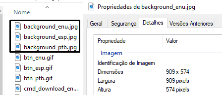
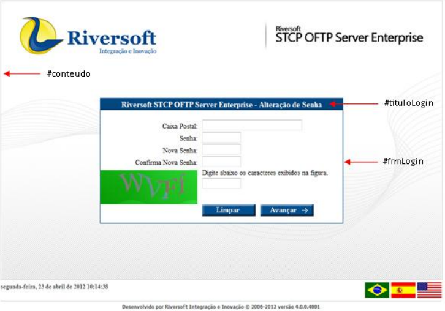

## Imagem de fundo e CSS

### Background (imagem de fundo)

As imagens de fundo do site deverão ser criadas seguindo as dimensões declaradas abaixo e estar no formato JPEG. Tais imagens devem seguir o padrão de nomenclatura:

```xml {filename="Português"}
background_ptb.jpg
```

```xml {filename="Inglês"}
background_enu.jpg
```

```xml {filename="Espanhol"}
background_esp.jpg
```
<br>



O diretório padrão para armazenamento das imagens de background é: "**/images**".

Veja a estrutura abaixo:


  

    
    

    
    

    
    

    
    

    
    

    
    

    
    
    
    
    

  



Um modelo para ser utilizado como a imagem de fundo, assim como as imagens originais do site padrão, está disponível no diretório "**/modelos**".

Veja a estrutura abaixo:


  

    
    

    
    

    
    

    
    

    
    

    
    

    
    
    
    
    

  


### Configurações CSS (cores das bordas e título)

O padrão de cores das bordas e cor de fundo do título do site padrão do STCP OFTP Change Password, pode ser realizado através da alteração das classes:

```css {filename="css/STCPChangePassword.css"}
#conteudo
#tituloLogin
#frmLogin
```
Nas classes _#conteudo_ e _#frmLogin_ as alterações devem ser realizadas no parâmetro **border**, alterando o valor **#XXXXXX**pela cor desejada.

Já na classe _#tituloLogin_ a alteração deverá ser realizada no parâmetro **background-color**, alterando o valor **#XXXXXX** pela cor desejada.



Seguem abaixo os exemplos das classe do arquivo CSS:

```css {linenos=table,hl_lines=[2,15,28],linenostart=1,filename="css/STCPChangePassword.css"}
#conteudo {
    border:solid 1px #CDCDCD; /*cor box externo*/
    background-repeat:no-repeat;
    position:relative;
    width:910px;
    height:574px;
    top:20px;
}

#frmLogin {
    position:relative;
    text-align:left;
    width:500px;
    top: 200px;
    border:solid 1px #024780;  /*cor box interno*/
    font:14px times new roman, roman, arial, verdana, helvetica;
    margin:0 auto;
    background-color:white;
    padding-bottom: 10px;
}

#tituloLogin {
    text-align:center;
    margin-bottom:20px;
    padding:2px;
    font-size:16px;
    font-weight:bold;
    background-color:#024780; /*cor titulo box interno*/
    color:White;
}
```