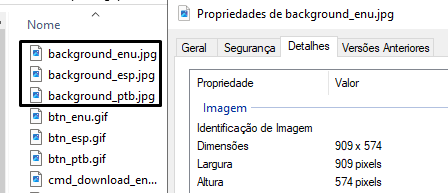

Nesta seção veremos os passos necessários para instalação e configuração do site de troca de senha, o STCP OFTP Change Password, do serviço **STCP OFTP Server Enterprise**.

> O STCP OFTP Change Password deverá ser configurado em um site ou diretório virtual no IIS utilizando SSL (HTTPS) e .Net Framework 2 ou superior.


## Instalação

<span style="display:inline-block; width: 25px; height: 25px; border-radius: 50%; background-color: #0095C7; color: white; text-align: center; line-height: 25px; font-size: 14px; font-family: Arial;">1</span> &nbsp; Clique no botão **Avançar** para prosseguir com a instalação.


<span style="display:inline-block; width: 25px; height: 25px; border-radius: 50%; background-color: #0095C7; color: white; text-align: center; line-height: 25px; font-size: 14px; font-family: Arial;">2</span> &nbsp; Aceite os termos do contrato de licença e clique no botão **Avançar**.


<span style="display:inline-block; width: 25px; height: 25px; border-radius: 50%; background-color: #0095C7; color: white; text-align: center; line-height: 25px; font-size: 14px; font-family: Arial;">3</span> &nbsp; Aceite ou modifique as informações do cliente e clique no botão **Avançar**.


<span style="display:inline-block; width: 25px; height: 25px; border-radius: 50%; background-color: #0095C7; color: white; text-align: center; line-height: 25px; font-size: 14px; font-family: Arial;">4</span> &nbsp; Altere a informação do diretório de instalação e clique no botão **Avançar**.


<span style="display:inline-block; width: 25px; height: 25px; border-radius: 50%; background-color: #0095C7; color: white; text-align: center; line-height: 25px; font-size: 14px; font-family: Arial;">5</span> &nbsp; Selecione a opção desejada e clique no botão **Instalar** para prosseguir.


<span style="display:inline-block; width: 25px; height: 25px; border-radius: 50%; background-color: #0095C7; color: white; text-align: center; line-height: 25px; font-size: 14px; font-family: Arial;">6</span> &nbsp; Após a finalização do processo de instalação, clique no botão **Concluir**.


## Configuração no IIS

<span style="display:inline-block; width: 25px; height: 25px; border-radius: 50%; background-color: #0095C7; color: white; text-align: center; line-height: 25px; font-size: 14px; font-family: Arial;">1</span> &nbsp; Acesse a ferramenta de configuração do IIS (Internet Information Services) e crie um novo **diretório virtual** e/ou **site** para a configuração da aplicação.


<span style="display:inline-block; width: 25px; height: 25px; border-radius: 50%; background-color: #0095C7; color: white; text-align: center; line-height: 25px; font-size: 14px; font-family: Arial;">2</span> &nbsp; Informe o nome para o novo diretório virtual e o caminho físico, conforme figura abaixo e clique no botão **OK**.


<!-- <span style="display:inline-block; width: 25px; height: 25px; border-radius: 50%; background-color: #0095C7; color: white; text-align: center; line-height: 25px; font-size: 14px; font-family: Arial;">3</span> &nbsp; Configure as permissões conforme apresentado e clique no botão "**Avançar**".


<span style="display:inline-block; width: 25px; height: 25px; border-radius: 50%; background-color: #0095C7; color: white; text-align: center; line-height: 25px; font-size: 14px; font-family: Arial;">4</span> &nbsp; Clique no botão "**Concluir**" para finalizar a criação do diretório virtual.


<span style="display:inline-block; width: 25px; height: 25px; border-radius: 50%; background-color: #0095C7; color: white; text-align: center; line-height: 25px; font-size: 14px; font-family: Arial;">5</span> &nbsp; Nas propriedades do diretório virtual criado, selecione a aba **Documentos** e pressione o botão **Adicionar**.


<span style="display:inline-block; width: 25px; height: 25px; border-radius: 50%; background-color: #0095C7; color: white; text-align: center; line-height: 25px; font-size: 14px; font-family: Arial;">6</span> &nbsp; Informe o nome da página inicial do site conforme a figura abaixo e pressione "**OK**". Remova as outras páginas utilizando o botão **Remover**.


<span style="display:inline-block; width: 25px; height: 25px; border-radius: 50%; background-color: #0095C7; color: white; text-align: center; line-height: 25px; font-size: 14px; font-family: Arial;">7</span> &nbsp; Na aba "**ASP .NET**" configure a versão conforme a figura abaixo:

<span style="display:inline-block; width: 25px; height: 25px; border-radius: 50%; background-color: #0095C7; color: white; text-align: center; line-height: 25px; font-size: 14px; font-family: Arial;">8</span> &nbsp; Para finalizar o processo de configuração clique no botão "**OK**". -->


## Configuração do arquivo stcpmon.config

<span style="display:inline-block; width: 25px; height: 25px; border-radius: 50%; background-color: #0095C7; color: white; text-align: center; line-height: 25px; font-size: 14px; font-family: Arial;">1</span> &nbsp; Vá até o diretório de instalação da aplicação e renomeie o arquivo "**exemplo.stcpmon.config**" para **stcpmon.config**.


<span style="display:inline-block; width: 25px; height: 25px; border-radius: 50%; background-color: #0095C7; color: white; text-align: center; line-height: 25px; font-size: 14px; font-family: Arial;">2</span> &nbsp; Configure o arquivo **stcpmon.config** conforme informado abaixo:


```xml {filename="stcpmon.config"}
<?xml version="1.0" encoding="utf-8"?>
<configuration>
    <configSections>
        <section name="Server1" type="Riversoft.NetLink.NetLinkTCPConnectionConfig, Riversoft.NetLink, Version=3.1.0.2053, Culture=neutral, PublicKeyToken=null" allowLocation="true" allowDefinition="Everywhere" allowExeDefinition="MachineToApplication" restartOnExternalChanges="true" requirePermission="true" />
    </configSections>
    <Server1 TCPRemoteAddress="192.168.0.220" TCPRemotePort="33050" TCPRfc2204="16" />
</configuration>
```


<span style="display:inline-block; width: 25px; height: 25px; border-radius: 50%; background-color: #0095C7; color: white; text-align: center; line-height: 25px; font-size: 14px; font-family: Arial;">3</span> &nbsp; Na tag "**configSections**" configure os seguintes parâmetros:

```xml {filename="configSections"}
<configSections>
...
name = defina um nome para o servidor. Exemplo "Server1"
type = "Riversoft.NetLink.NetLinkTCPConnectionConfig, Riversoft.NetLink,
Version=3.1.0.2053, Culture=neutral, PublicKeyToken=null"

allowLocation = "true"
allowDefinition = "Everywhere"
allowExeDefinition = "MachineToApplication"
restartOnExternalChanges = "true"
requirePermission = "true"
...
</configSections>
```

<span style="display:inline-block; width: 25px; height: 25px; border-radius: 50%; background-color: #0095C7; color: white; text-align: center; line-height: 25px; font-size: 14px; font-family: Arial;">4</span> &nbsp;Crie uma tag com o nome dado para o servidor, neste exemplo, chamamos **Server1** e configure suas características:

```xml {filename="configSections"}
< Server1 TCPRemoteAddress="172.20.30.213" TCPRemotePort="33050" TCPRfc2204="16" />

TCPRemoteAddress = endereço ip do servidor de monitoração do STCP.
TCPRemotePort = porta ip do servidor de monitoração do STCP.
TCPRfc2204 = "16"
```

## Configuração do arquivo web.config

<span style="display:inline-block; width: 25px; height: 25px; border-radius: 50%; background-color: #0095C7; color: white; text-align: center; line-height: 25px; font-size: 14px; font-family: Arial;">1</span> &nbsp; No diretório de instalação da aplicação STCP OFTP Change Password, renomeie o arquivo "**exemplo.web.config**" para "**web.config**" e abra o arquivo já renomeado.


<span style="display:inline-block; width: 25px; height: 25px; border-radius: 50%; background-color: #0095C7; color: white; text-align: center; line-height: 25px; font-size: 14px; font-family: Arial;">2</span> &nbsp; Na seção **appSettings**, realize as configurações da imagem de validação (Captcha Image).

<!-- Configurações da imagem de validação (Captcha Image). -->

```xml {filename="web.config"}
...
<!-- Inicio Configuracao do Captcha -->
<add key="STCPCaptcha:CharType" value="AlphaNum" />
<add key="STCPCaptcha:Len" value="4" />
<add key="STCPCaptcha:FontFamily0" value="Comic Sans MS" />
<add key="STCPCaptcha:FontFamily1" value="Times New Roman" />
<add key="STCPCaptcha:FontFamily2" value="Arial" />
<add key="STCPCaptcha:FontFamily3" value="Verdana" />
<add key="STCPCaptcha:FontFamily4" value="Georgia" />
<add key="STCPCaptcha:FontFamily5" value="Impact" />
<add key="STCPCaptcha:FontFamily6" value="Courier New" />
<add key="STCPCaptcha:FontFamily7" value="Book Antiqua" />
<add key="STCPCaptcha:FontFamily8" value="Garamond" />
<add key="STCPCaptcha:FontFamily9" value="Arial Narrow" />
<!-- Fim Configuracao do Captcha -->
...
```

<span style="display:inline-block; width: 25px; height: 25px; border-radius: 50%; background-color: #0095C7; color: white; text-align: center; line-height: 25px; font-size: 14px; font-family: Arial;">3</span> &nbsp; Configure na propriedade **value** o tipo de texto que deverá ser mostrado na imagem:

```xml {filename="value"}
< add key="STCPCaptcha:CharType" value="AlphaNum" />

"AlphaNum" = letras (maiúsculas ou minúsculas) e números.
"Numeric" = apenas números.
"Alpha" = apenas letras (maiúsculas ou minúsculas).
"AlphaLower" = apenas letras minúsculas.
"AlphaUpper" = apenas letras maiúsculas.
"AlphaLowerNum" = letras minúsculas e números.
"AlphaUpperNum" = letras maiúsculas e números.
```

<span style="display:inline-block; width: 25px; height: 25px; border-radius: 50%; background-color: #0095C7; color: white; text-align: center; line-height: 25px; font-size: 14px; font-family: Arial;">4</span> &nbsp; Configure na propriedade **value** a quantidade de caracteres que deve ser mostrada na imagem:

```xml {filename="value"}
< add key="STCPCaptcha:Len" value="4" />
```
<span style="display:inline-block; width: 25px; height: 25px; border-radius: 50%; background-color: #0095C7; color: white; text-align: center; line-height: 25px; font-size: 14px; font-family: Arial;">5</span> &nbsp; Para alterar o tipo de fonte da imagem, use a seguinte tag:

```
< add key="STCPCaptcha:FontFamily0" value="Comic Sans MS" />
```

<span style="display:inline-block; width: 25px; height: 25px; border-radius: 50%; background-color: #0095C7; color: white; text-align: center; line-height: 25px; font-size: 14px; font-family: Arial;">6</span> &nbsp; Configurações da conexão com o servidor STCP

```xml {filename="web.config"}
...
<!-- Inicio Configuracao de conexao com o Servidor STCP -->
<add key="STCPMonitor:Connection" value="Server1" />
<add key="STCPMonitor:Userid" value="stcpmon" />
<add key="STCPMonitor:Password" value="teste" />
<add key="STCPMonitor:Security" value="false" />
<!-- Fim Configuracao de conexao -->
...
```

<span style="display:inline-block; width: 25px; height: 25px; border-radius: 50%; background-color: #0095C7; color: white; text-align: center; line-height: 25px; font-size: 14px; font-family: Arial;">7</span> &nbsp; Configure na propriedade **value** o nome do servidor informado no arquivo **stcpmon.config**.

```xml {filename="web.config"}
< add key="STCPMonitor:Connection" value="Server1" />
```

<span style="display:inline-block; width: 25px; height: 25px; border-radius: 50%; background-color: #0095C7; color: white; text-align: center; line-height: 25px; font-size: 14px; font-family: Arial;">8</span> &nbsp; Configure na propriedade **value** o nome do usuário de monitoração do STCP:

```xml {filename="web.config"}
<add key="STCPMonitor:Userid" value="stcpmon" />
```

<span style="display:inline-block; width: 25px; height: 25px; border-radius: 50%; background-color: #0095C7; color: white; text-align: center; line-height: 25px; font-size: 14px; font-family: Arial;">9</span> &nbsp; Configure na propriedade **value** a senha do usuário de monitoração do STCP.

```xml {filename="web.config"}
< add key="STCPMonitor:Password" value="teste" />
```

<span style="display:inline-block; width: 25px; height: 25px; border-radius: 50%; background-color: #0095C7; color: white; text-align: center; line-height: 25px; font-size: 14px; font-family: Arial;">10</span> &nbsp; Configure na propriedade **value** o valor **true** caso queira habilitar a comunicação através do protocolo TLS, caso contrário, utilize **false**.

```xml {filename="web.config"}
< add key="STCPMonitor:Security" value="false" />
```


### Idioma padrão

```xml {filename="web.config"}
...
<!-- Inicio Configuracao do idioma (DEFAULT) -->
<add key="STCPChangePassword:DefaultLanguage" value="ptb" />
...
```

<span style="display:inline-block; width: 25px; height: 25px; border-radius: 50%; background-color: #0095C7; color: white; text-align: center; line-height: 25px; font-size: 14px; font-family: Arial;">1</span> &nbsp; O site do STCP OFTP Change Password pode ser exibido nos idiomas Português, Inglês e Espanhol. Configure na propriedade **value** o idioma padrão para o site.

```xml {filename="web.config"}
< add key="STCPChangePassword:DefaultLanguage" value="ptb" />

"ptb" = Idioma Português.
"enu" = Idioma Inglês.
"esp" = Idioma Espanhol.
```
<span style="display:inline-block; width: 25px; height: 25px; border-radius: 50%; background-color: #0095C7; color: white; text-align: center; line-height: 25px; font-size: 14px; font-family: Arial;">2</span> &nbsp; Configurações regionais.

```xml {filename="web.config"}
...
<add key="STCPChangePassword:ImageButtonFlagPTB"
value="~/images/btn_ptb.gif"/>
<add key="STCPChangePassword:ImageButtonFlagENU"
value="~/images/btn_enu.gif"/>
<add key="STCPChangePassword:ImageButtonFlagESP"
value="~/images/btn_esp.gif"/>
...
```

<span style="display:inline-block; width: 25px; height: 25px; border-radius: 50%; background-color: #0095C7; color: white; text-align: center; line-height: 25px; font-size: 14px; font-family: Arial;">3</span> &nbsp; Caso não deseje exibir o site em um determinado idioma, comente a linha desejada utilizando as tags abaixo:

```
<!- - e -->.
```
Exemplo:
```xml {filename="web.config"}
< add key="STCPChangePassword:ImageButtonFlagPTB"
value="~/images/btn_ptb.gif"/>

< add key="STCPChangePassword:ImageButtonFlagENU"
value="~/images/btn_enu.gif" />

<!-- < add key="STCPChangePassword:ImageButtonFlagESP"
value="~/images/btn_esp.gif" /> -->
```

### Configurações dos botões

```xml {filename="web.config"}
...
<add key="STCPChangePassword:ptb:ImageButtonRefresh"
value="~/images/cmdRefresh_ptb_blue1.gif" />
<add key="STCPChangePassword:ptb:ImageButtonConfirm"
value="~/images/cmdCheck1_ptb_blue1.gif" />
<add key="STCPChangePassword:ptb:ImageButtonClose"
value="~/images/cmdClose_ptb_blue1.gif" />
<add key="STCPChangePassword:ptb:ImageButtonDownload3"
value="~/images/cmdDownload3_ptb_blue1.gif" />
<add key="STCPChangePassword:ptb:ImageButtonNext"
value="~/images/cmdNext_ptb_blue1.gif" />
<add key="STCPChangePassword:ptb:ImageButtonDownload"
value="~/images/cmd_download_ptb_blue1.gif" />
<add key="STCPChangePassword:ptb:ImageButtonFinish"
value="~/images/cmdFinish_ptb_blue1.gif" />
...
```

<span style="display:inline-block; width: 25px; height: 25px; border-radius: 50%; background-color: #0095C7; color: white; text-align: center; line-height: 25px; font-size: 14px; font-family: Arial;">1</span> &nbsp;Configure na propriedade **value** o padrão de cores para os botões do site.

Exemplo:

```xml {filename="web.config"}
< add key="STCPChangePassword:ptb:ImageButtonRefresh"
value="~/images/cmdRefresh_ptb_PADRAO.gif" />
```

Onde **PADRAO** pode ser substituído pelas cores:

| Cores   | Visualização                                          |
| :---:    | :------------------------------------------------------------------------------------------: |
| blue1   | <span style="background-color:#025090; border-radius: 4px;">&nbsp;&nbsp;&nbsp;&nbsp;&nbsp;&nbsp;</span> |
| blue2   | <span style="background-color:#033361; border-radius: 4px;">&nbsp;&nbsp;&nbsp;&nbsp;&nbsp;&nbsp;</span> |
| green1  | <span style="background-color:#009376; border-radius: 4px;">&nbsp;&nbsp;&nbsp;&nbsp;&nbsp;&nbsp;</span> |
| green2  | <span style="background-color:#003A2C; border-radius: 4px;">&nbsp;&nbsp;&nbsp;&nbsp;&nbsp;&nbsp;</span> |
| orange1 | <span style="background-color:#FE6F00; border-radius: 4px;">&nbsp;&nbsp;&nbsp;&nbsp;&nbsp;&nbsp;</span> |
| orange2 | <span style="background-color:#F4AA2C; border-radius: 4px;">&nbsp;&nbsp;&nbsp;&nbsp;&nbsp;&nbsp;</span> |
| red     | <span style="background-color:#DA241B; border-radius: 4px;">&nbsp;&nbsp;&nbsp;&nbsp;&nbsp;&nbsp;</span> |


### Instaladores e documentação

```xml {filename="web.config"}
...
 <add key="STCPChangePassword:enu:UrlHyperlinkDownload1"
value="downloads/STCPClient-appl-PTB.msi" />
 <add key="STCPChangePassword:enu:UrlHyperlinkDownload2"
value="downloads/STCPClient-appl-PTB.zip" />
 <add key="STCPChangePassword:enu:UrlHyperlinkDownload3" value="downloads/
STCPClient-appl-PTB.PDF" />
...
```


  Os procedimentos acima demonstram as configurações dos parâmetros para o idioma **Português**. Caso necessário, estes deverão ser realizadas também para os idiomas Inglês e Espanhol.


<br>

> Através do Change Password o usuário pode ter acesso ao download dos pacotes de instalação (MSI ou ZIP). Para estarem disponíveis para download, tais arquivos devem ser disponibilizados na pasta "**/download**" do diretório de instalação do site/diretório virtual e seguir a seguinte nomenclatura:

| Pacote   | Português | Inglês | Espanhol |
| :---:    | :---------:| :---------:|  :---------:|
| **Pacote MSI**    | STCPClient-appl-PTB.msi| STCPClient-appl-ENU.msi|  STCPClient-appl-ESP.msi|
| **Pacote ZIP**    | STCPClient-appl-PTB.zip| STCPClient-appl-ENU.zip|  STCPClient-appl-ESP.zip|
<!-- | Manual   | STCPClient-appl-PTB.msi| STCPClient-appl-ENU.msi|  STCPClient-appl-ESP.msi| -->


## Imagem de fundo e CSS

### Background (imagem de fundo)

As imagens de fundo do site deverão ser criadas seguindo as dimensões declaradas abaixo e estar no formato JPEG. Tais imagens devem seguir o padrão de nomenclatura:

```xml {filename="Português"}
background_ptb.jpg
```

```xml {filename="Inglês"}
background_enu.jpg
```

```xml {filename="Espanhol"}
background_esp.jpg
```
<br>



<!--  -->

O diretório padrão para armazenamento das imagens de background é: "**/images**".

Veja a estrutura abaixo:


  

    
    

    
    

    
    

    
    

    
    

    
    

    
    
    
    
    

  



Um modelo para ser utilizado como a imagem de fundo, assim como as imagens originais do site padrão, está disponível no diretório "**/modelos**".

Veja a estrutura abaixo:


  

    
    

    
    

    
    

    
    

    
    

    
    

    
    
    
    
    

  


### Configurações CSS (cores das bordas e título)

O padrão de cores das bordas e cor de fundo do título do site padrão do STCP OFTP Change Password, pode ser realizado através da alteração das classes:

```css {filename="css/STCPChangePassword.css"}
#conteudo
#tituloLogin
#frmLogin
```
<span style="display:inline-block; width: 25px; height: 25px; border-radius: 50%; background-color: #0095C7; color: white; text-align: center; line-height: 25px; font-size: 14px; font-family: Arial;">1</span> &nbsp;Nas classes _#conteudo_ e _#frmLogin_ as alterações devem ser realizadas no parâmetro **border**, alterando o valor **#XXXXXX**pela cor desejada.

<span style="display:inline-block; width: 25px; height: 25px; border-radius: 50%; background-color: #0095C7; color: white; text-align: center; line-height: 25px; font-size: 14px; font-family: Arial;">2</span> &nbsp; Já na classe _#tituloLogin_ a alteração deverá ser realizada no parâmetro **background-color**, alterando o valor **#XXXXXX** pela cor desejada.


Seguem abaixo os exemplos das classe do arquivo CSS:

```css {linenos=table,hl_lines=[2,15,28],linenostart=1,filename="css/STCPChangePassword.css"}
#conteudo {
    border:solid 1px #CDCDCD; /*cor box externo*/
    background-repeat:no-repeat;
    position:relative;
    width:910px;
    height:574px;
    top:20px;
}

#frmLogin {
    position:relative;
    text-align:left;
    width:500px;
    top: 200px;
    border:solid 1px #024780;  /*cor box interno*/
    font:14px times new roman, roman, arial, verdana, helvetica;
    margin:0 auto;
    background-color:white;
    padding-bottom: 10px;
}

#tituloLogin {
    text-align:center;
    margin-bottom:20px;
    padding:2px;
    font-size:16px;
    font-weight:bold;
    background-color:#024780; /*cor titulo box interno*/
    color:White;
}
```


