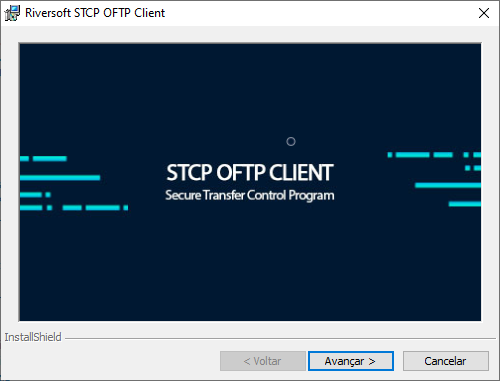
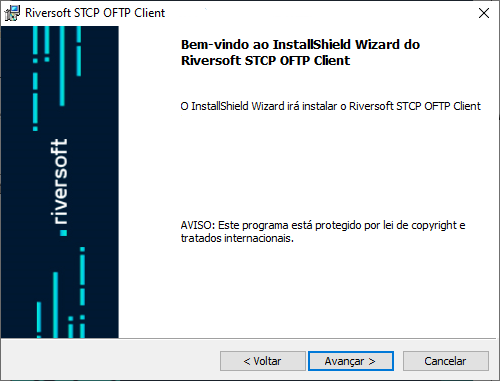
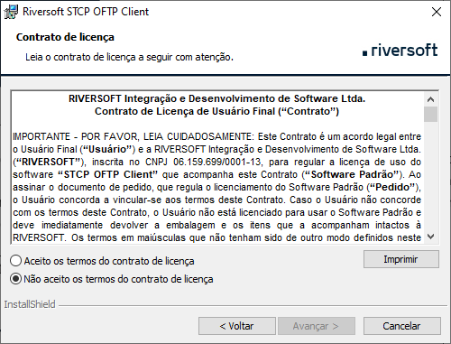
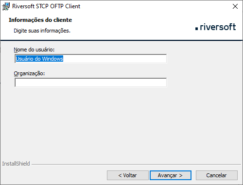
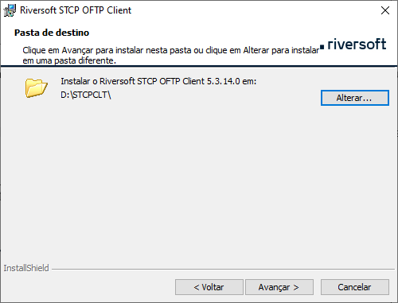
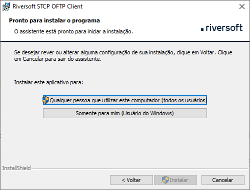
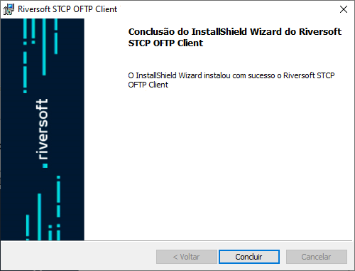

## Distribuição dos pacotes

O pacote de instalação será distribuído através de um link pela Equipe de Sustentação da Riversoft.

Após extrair o zip com o executável, os seguintes passos devem ser executados:

Clique em **Avançar**

 

Esta é a tela de boas-vindas, clique no botão **Avançar** para continuar.

Pressione **Voltar** para retornar à tela anterior ou **Cancelar** para interromper o processo de instalação.

Leia cuidadosamente o **Contrato de Licença de Uso do Usuário Final** e caso concorde com os termos propostos, marque a opção correspondente e pressione o botão **Avançar** para prosseguir com a instalação.

Pressione **Voltar** para retornar à tela anterior ou **Cancelar** para interromper o processo de instalação.

Na tela **Informações do Cliente**, informe o Nome do usuário e Organização (Empresa).

Clique no botão **Avançar** para continuar a instalação.

Pressione **Voltar** para retornar à tela anterior ou **Cancelar** para cancelar todo o processo de instalação.

Na tela **Pasta de Destino**, clique em **Avançar** para instalar no diretório padrão ou **Alterar** para selecionar outro diretório ou criar um novo.

Pressione **Voltar** para retornar à tela anterior ou **Cancelar** para interromper o processo de instalação.

Na tela **Pronto para Instalar o Programa**, clique em **Qualquer pessoa que utilizar este computador (todos os usuários)** ou **Somente para mim (Riversoft)** para instalar.

Pressione **Voltar** para retornar à tela anterior ou **Cancelar** para interromper o processo de instalação.

Na tela de **Conclusão**, clique no botão **Concluir** para finalizar a instalação.

