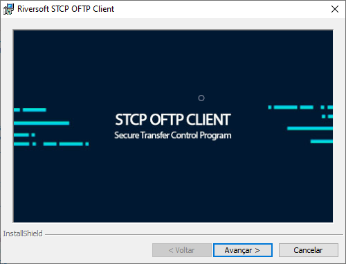

## Requisitos

- Processador de 2 gigahertz (GHz)
- 2 gigabytes (GB) de RAM
- 100 megabytes (MB) de espaço disponível em disco rígido para o aplicativo 1
- Sistema operacional Windows 10/11/2012/2016/2019/2022 2


  1 O espaço disponível para os arquivos transferidos dependerá do volume e política de armazenamento de dados adotada.



  2 Server with Desktop Experience.


## Distribuição dos Pacotes

O pacote de instalação será distribuído através de um link pela Equipe de Sustentação da Riversoft.

Após extrair o zip com o executável, os seguintes passos devem ser executados:

Clique em **Avançar**

 

Esta é a tela de boas-vindas, clique no botão **Avançar** para continuar.

Pressione **Voltar** para retornar à tela anterior ou **Cancelar** para interromper o processo de instalação.

Leia cuidadosamente o **Contrato de Licença de Uso do Usuário Final** e caso concorde com os termos propostos, marque a opção correspondente e pressione o botão **Avançar** para prosseguir com a instalação.

Pressione **Voltar** para retornar à tela anterior ou **Cancelar** para interromper o processo de instalação.

Na tela **Informações do Cliente**, informe o Nome do usuário e Organização (Empresa).

Clique no botão **Avançar** para continuar a instalação.

Pressione **Voltar** para retornar à tela anterior ou **Cancelar** para cancelar todo o processo de instalação.

Na tela **Pasta de Destino**, clique em **Avançar** para instalar no diretório padrão ou **Alterar** para selecionar outro diretório ou criar um novo.

Pressione **Voltar** para retornar à tela anterior ou **Cancelar** para interromper o processo de instalação.

Na tela **Pronto para Instalar o Programa**, clique em **Qualquer pessoa que utilizar este computador (todos os usuários)** ou **Somente para mim (Riversoft)** para instalar.

Pressione **Voltar** para retornar à tela anterior ou **Cancelar** para interromper o processo de instalação.

Na tela de **Conclusão**, clique no botão **Concluir** para finalizar a instalação.

## Estrutura dos Diretórios

Após a instalação, teremos a seguinte árvore de diretórios, onde serão armazenadas as informações de **configuração**, **logs** e **controle**.


  
    

    
    

    
      
      
    

    
    

    

      
      

      
      
    

    

  
  

  
    
    
  

  
  
  
  
  
  

  
    
    
    
    
    
    
    
    
    
    
    
    
    
    
    
    
    
    
    
    
    
    
    
    
    
    
    
    

  

  
    
    
    
  

  
  

  
    
    
    
    
    
    
    
    

  

  
  

  



## Diretórios de Perfis

O STCP OFTP Client cria um conjunto individual de subdiretórios para cada Perfil configurado no serviço para controle das transferências e integração com as aplicações externas.

Veja:


  
    

    
    

    
      
      
    

    
    

    

      
      

      
      
    

    

  

  



| <Diretório de Dados>\  | Subdiretório de dados configurado.                                                                                      |
| :--------------------- | :---------------------------------------------------------------------------------------------------------------------- |
| <Diretório do Perfil>\ | Subdiretório individual do Perfil.                                                                                      |
| CONTROLE               | Subdiretório de controle da aplicação.                                                                                  |
| ENTRADA\               | Subdiretório onde os arquivos recebidos com sucesso serão disponibilizados.                                             |
| RESTART                | Subdiretório onde os arquivos que estão em processo de recepção são armazenados temporariamente.                        |
| FORMATO                | Subdiretório que contém as definições dos tipos de arquivos.                                                            |
| LOG                    | Subdiretório onde serão armazenados os arquivos de eventos e registro das transferências.                               |
| SAIDA\                 | Subdiretório onde os arquivos a serem enviados devem ser disponibilizados.                                              |
| BACKUP                 | Subdiretório onde os arquivos enviados com sucesso serão armazenados se a opção de backup do Perfil estiver habilitada. |
| PENDENTE               | Subdiretório onde o arquivo de controle da transmissão será armazenado temporariamente.                                 |
| TEMP                   | Subdiretório de uso geral.                                                                                              |

Para transmitir, os arquivos devem ser disponibilizados no subdiretório **SAIDA** e os arquivos recebidos estarão no subdiretório **ENTRADA**.

