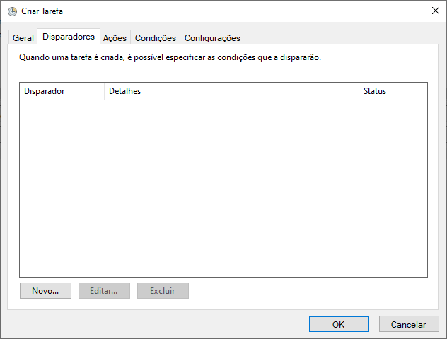
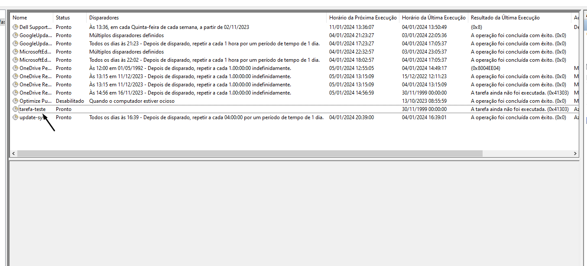

## Linha de comando

A sintaxe para executar o STCP OFTP através de uma linha de comando é a seguinte:

```
STCPCLT.EXE <Arquivo de configuração> [-p –r –t –m –f –w]
```
| Parâmetro                      | Descrição                                                                                                                                             |
| :----------------------------- | :---------------------------------------------------------------------------------------------------------------------------------------------------- |
| `<arquivo de configuração>`    | Define o nome do arquivo de configuração de instalação “CTCP.INI” com o caminho completo.                                                             |
| -p `<nome do perfil>`          | Define o nome do perfil de conexão.                                                                                                                   |
| -r `<número de tentativas>`    | Define a quantidade de tentativas de conexão.                                                                                                         |
| -t `<intervalo de tentativas>` | Define o intervalo em segundos entre as tentativas.                                                                                                   |
| -m `<modo>`                    | Define o modo de transferência a ser executado: B, S ou R. /B = Transmissão e recepção /S = Somente transmissão /R = Somente recepção                 |
| -f `<filtro de arquivos>`      | Define o filtro de arquivos através da utilização de expressão regular.                                                                               |
| -w `<Fecha caixa de dialogo>`  | Define se a caixa de dialogo será fechada automaticamente no final da execução: 0 ou 1. /0 = Fecha caixa de diálogo /1 = Não fecha a caixa de diálogo |

Exemplo:

```pshell
C:\STCPCLT\STCPCLT.EXE C:\STCPCLT\CTCP.INI –p TESTE
```
No exemplo acima, será executada a conexão para o Perfil TESTE para envio e recepção.

Ao término da execução do STCP OFTP, o arquivo _**CLCP.ERR.TXT**_ será criado no subdiretório de instalação, contendo a seguinte linha:
**<código de erro>**

## Configurar um agendamento

Nesta seção veremos como configurar a execução automática do Riversoft STCP OFTP Client no **Windows** e **Windows Server**.

Para executar automaticamente a aplicação de transferência de arquivos, devemos realizar os seguintes passos de configuração das tarefas agendadas do sistema operacional:

&nbsp; Acesse o **Agendador de Tarefas** dentro de **Ferramentas Administrativas**.

&nbsp; Clique em **Criar Tarefa** no painel **Ações**.


{}

### Configurações

Na guia **Geral** da janela de criação da tarefa configure os campos conforme a sua necessidade. Observe atentamente as opções de segurança conforme as configurações do seu ambiente.

Na guia **Disparadores** clique no botão **Novo**.



### Agendamento

Na janela **Novo Disparador** configure o agendamento conforme desejado e clique no botão **OK** para salvar as informações.


Na guia **Ações** clique no botão **Novo**


### Programa/script

No campo **Programa/script** informe a linha de comando utilizada para executar o STCP OFTP Client (vide exemplo abaixo) e clique no botão **OK**.

```
C:\STCPCLT\program\stcpclt.exe "C:\STCPCLT\CTCP.INI" -p PERFIL-TESTE -r 5 -t 30 -m B
```

> [!TIP] Dica  
> Para obter a linha de comando utilizada, clique com o botão direito do mouse no atalho do STCP OFTP Client, que foi criado na área de trabalho no momento da instalação e configuração do software. Na guia **Atalho**, copie o conteúdo do campo **Destino**


Ao ser apresentada a mensagem abaixo clique no botão **Sim**.


Após a criação da tarefa, esta será exibida na janela principal do **Agendador de Tarefas**.



{}


