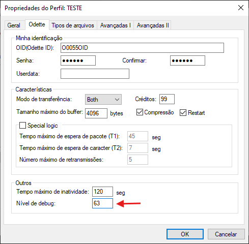

## Habilitar ou Alterar o nível de Debug

Em alguns casos, para se obter uma análise mais detalhada de problemas relacionados ao intercâmbio de arquivos, torna-se necessária a depuração dos processos de conexão e transferência, realizadas pelo *STCP OFTP Client*.

Através da configuração do parâmetro *Nível de debug* é possível gerar um arquivo de depuração na pasta **DEBUG** (Ex. C:\STCPCLT\Debug) do diretório de instalação do STCP.

Acesse o STCP OFTP Client Config (Iniciar – Todos os programas – Riversoft STCP OFTP Client). Selecione o perfil desejado na guia Perfis e clique no botão Propriedades. Na janela Propriedades do perfil, na guia Odette, altere o valor do campo *Nível de debug* para 63 (outros valores podem ser utilizados – vide Tabela 2). 

Após a alteração, disponibilize um arquivo de teste na pasta SAIDA do perfil, que apresenta o erro, e inicie uma nova conexão. O arquivo de debug será gerado no diretório **DEBUG** (Ex. C:\STCPCLT\Debug).


  NOTA: Uma vez gerado o erro, você pode voltar o nível de debug para o seu valor padrão (0).




Para cada tentativa de conexão será criado um novo arquivo de depuração no diretório **DEBUG** com a seguinte sintaxe:

```{filename="Arquivo de debug"}

ODTDEB.<Protocolo>.<Usuario>.YYYYMMDDhhmmssnnn
```

| Informação |        Descrição        |
| :--------- | :-----------------------: |
| Protocolos | **TCP/IP, TLS, SFTP OU HTTP/S** |
| Perfil     | Nome do perfil utilizado  |
| YYYY       |            Ano            |
| MM         |            Mês            |
| DD         |            Dia            |
| hh         |           Hora            |
| mm         |          Minuto           |
| ss         |         Segundos          |
| nnn        |   Milésimos de segundos   |

A tabela a seguir contém a relação entre o nível de detalhamento e as informações que serão geradas.

| Nível |                                    Descrição                                     |
| :---- | :------------------------------------------------------------------------------: |
| 0     |                        Não grava o arquivo de depuração.                         |
| 1     |             Grava as informações de entrada e saída das sub-rotinas              |
| 2     |             Grava as informações de mudanças do estado do protocolo.             |
| 4     |   Grava as informações dos pacotes recebidos e enviados, formatado por campo.    |
| 8     | Grava as informações dos pacotes recebidos e enviados, formatado em hexadecimal. |
| 16    |   Grava as informações dos eventos ocorridos (Somente se ocorrer algum erro).    |
| 32    |                     Grava as informações dos sub-registros.                      |
| 63    |                 Grava as informações completas (Debug completo)                  |


Somente habilite ou altere esta opção quando for solicitado por uma equipe especializada.

