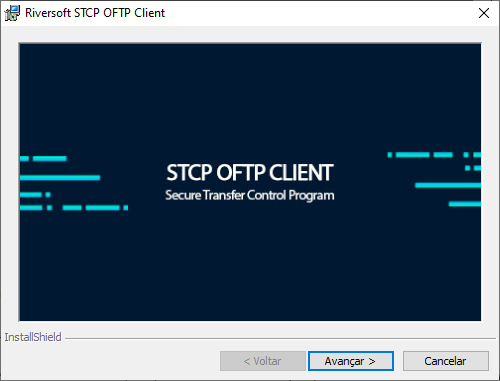
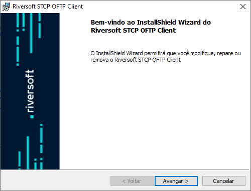
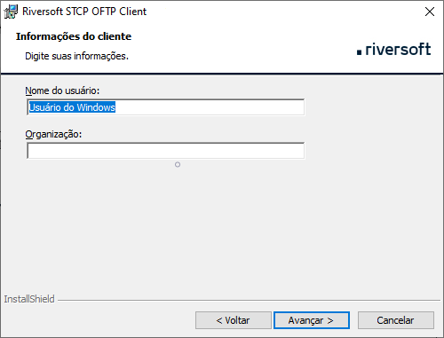

## Antes de iniciar

Ao atualizar o STCP OFTP Client, para que não seja necessária a reconfiguração da aplicação e dos perfis já existentes, deverá ser feito um **backup** do arquivo de configuração da aplicação **CTCP.INI**, dos diretórios dos perfis (Ex.: **O0055RIVERSOFT**) e dos arquivos de configuração dos perfis (Ex.: **O0055RIVERSOFT.INI**) presentes no diretório de instalação da aplicação (Ex.: **C:\STCPCLT**).

## Instalar a nova versão

Clique no botão **Avançar**.

Esta é a tela de boas-vindas, clique no botão **Avançar** para continuar. Pressione **Voltar** para retornar à tela anterior ou **Cancelar** para interromper o processo de instalação.

Leia cuidadosamente o Contrato de Licença de Uso do Usuário Final e caso concorde com os termos propostos, marque a opção correspondente e pressione o botão **Avançar** para prosseguir com a instalação.

Pressione **Voltar** para retornar à tela anterior ou **Cancelar** para interromper o processo de instalação.

Na tela **Informações do Cliente**, informe o Nome do usuário e Organização (Empresa).

Pressione **Voltar** para retornar à tela anterior ou **Cancelar** para cancelar todo o processo de instalação.

Na tela **Pasta de Destino**, clique em **Avançar** para instalar no diretório padrão ou **Alterar** para selecionar outro diretório ou criar um novo. Pressione **Voltar** para retornar à tela anterior ou **Cancelar** para interromper o processo de instalação.

Na tela **Pronto para Instalar o Programa**, clique em **Qualquer pessoa que utilizar este computador (todos os usuários)** ou **Somente para mim (Riversoft)** para instalar. Pressione **Voltar** para retornar à tela anterior ou **Cancelar** para interromper o processo de instalação.

Na tela de conclusão do **Installshield**, clique no botão **Concluir** para finalizar a instalação.

Após a instalação do STCP OFTP Client, o arquivo de configuração **CTCP.INI**, os diretórios dos perfis (Ex.: **O0055RIVERSOFT**) e os arquivos de configuração dos perfis (Ex.: **O0055RIVERSOFT.INI**) deverão ser copiados e substituídos no diretório de instalação da aplicação (Ex.: **C:\STCPCLT**).