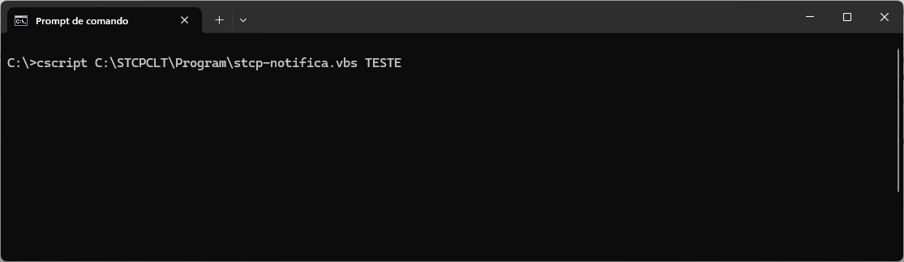
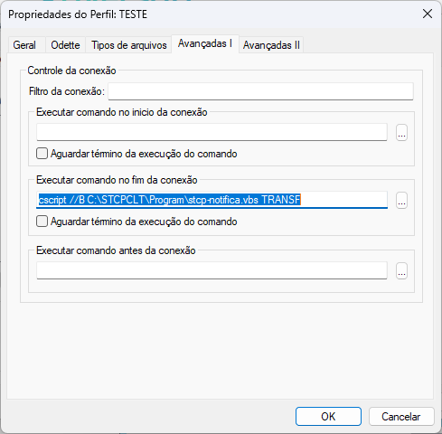
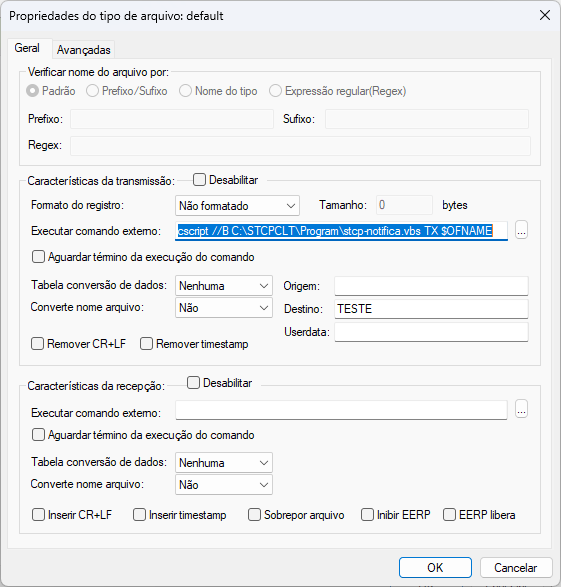
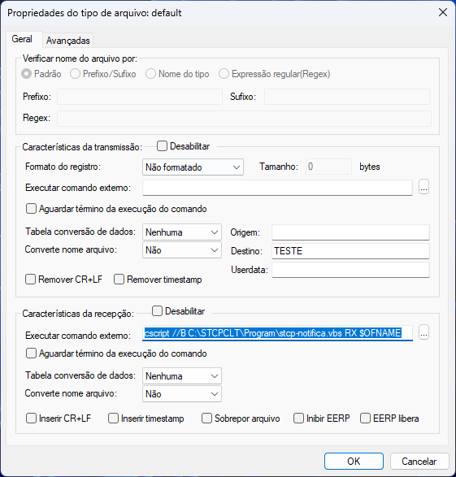
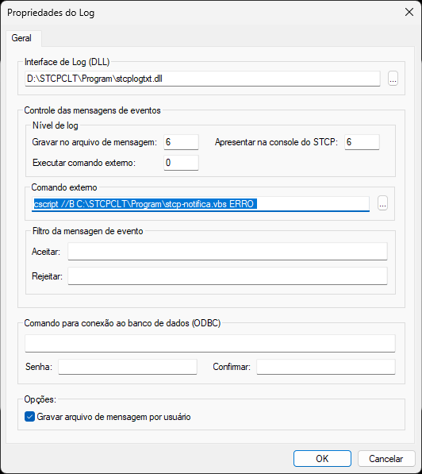

## Introdução

Nesta seção veremos os procedimentos necessários para a configuração e execução do **script VBS**, que pode ser utilizado para enviar, por e-mail, notificações de transferências de arquivos e/ou erros.
Por se tratar de um script que utiliza uma linguagem universal (Visual Basic Scripting) e distribuída gratuitamente pela Microsoft, podemos customizá-lo para atender as mais diversas necessidades da área de monitoração, assim como filtrar as notificações e erros desejados.

## Download do script VBS

O envio das notificações por e-mail é realizado através do script **stcp-notifica.vbs**. Após o download, o conteúdo do arquivo zipado deverá ser copiado para a pasta Program do diretório de instalação do STCP OFTP Client.

`(Ex. C:\STCPCLT\Program)`

> [!NOTE]  
> O link para download do script é disponibilizado pela Equipe de Sustentação da Riversoft.


## Configuração do script VBS

Os parâmetros básicos a serem configurados nesse arquivo são:

```vb.net
1. '* -------------------------------------------------------------------------------
2. '* Configuracao diretorios e perfil
3. '*
4. '* appDir => Diretorio de instalacao da aplicacao
5. '* appPerfil => Nome do perfil utilizado
6. '*
7. '* -------------------------------------------------------------------------------
8. appDir = "C:\STCPCLT\"
9. appPerfil = "NOME-PERFIL"
```

Esses parâmetros definem os diretórios de instalação da aplicação e nome do perfil utilizado.

| PARÂMETROS |               DESCRIÇÃO               |
| :--------- | :-----------------------------------: |
| appDir     | Diretório de instalação da aplicação. |
| appPerfil  |       Nome do perfil utilizado.       |

```vb.net
1. '* -------------------------------------------------------------------------------
2. '* Configuracao do e-mail
3. '*
4. '* varFrom => Endereco e-mail do remetente
5. '* varTo => Endereco e-mail do destinatario
6. '* varCC => Endereco e-mail dos destinatarios (com copia)
7. '* varSubject => Assunto do e-mail
8. '*
9. '* -------------------------------------------------------------------------------
10. varFrom = "email@empresa.com.br"
11. varTo = "email@empresa.com.br"
12. varCC = ""
13. varSubject = "STCP - Log de transferencia de arquivos"
```

Esses parâmetros fornecem as informações de configuração para o servidor **SMTP remoto**.

| PARÂMETROS |                                                     DESCRIÇÃO                                                      |
| :--------- | :----------------------------------------------------------------------------------------------------------------: |
| varSMTP    |                                             Endereço do servidor SMTP                                              |
| varPort    |                             Porta do servidor SMTP (Utilizada geralmente a porta 465).                             |
| varUseSSL  |       Uso da Encriptação SSL/TLS. As opções disponíveis são: HABILITADO: **TRUE** e DESABILITADO: **FALSE**        |
| varUserID  |                                        Usuário utilizado para autenticação                                         |
| varPasswd  |                                   Senha do usuário utilizado para autenticação.                                    |
| varAuth    | Tipo de autenticação do servidor SMTP. As opções disponíveis são: NONE: **NONE** BASIC (base64): **1** NTLM: **2** |

## Teste do envio de e-mail

Para realizar a validação das configurações realizadas no item anterior **(CONFIGURAÇÃO DO SCRIPT VBS)**, acesse o Prompt de Comando e digite o comando abaixo.

```sh
cscript C:/STCPCLT/Program/stcp-notifica.vbs TESTE
```



Caso nenhuma mensagem de erro seja apresentada, verifique se um e-mail de teste foi recebido nos endereços de e-mails configurados.

## Notificação envio e recebimento de arquivos (consolidado)

Neste tipo de notificação, os logs de envio e recebimento de arquivos são enviados no corpo do e-mail de maneira consolidada, registrando os eventos de inicio e fim de conexão com sucesso ou erro, início e fim de transmissão com sucesso ou erro e início e fim de recepção com sucesso ou erro

> [!IMPORTANT] Nota: 
> O prefixo [ALERTA ERRO] será inserido automaticamente no assunto do e-mail enviado, caso um evento de erro seja registrado.


Após as configurações e testes do script serem realizados, acesse o _STCP OFTP Client Config_, na guia Perfis, selecione o perfil desejado e clique no botão _Propriedades_. Na janela _Propriedades do Perfil_, guia _Avançadas I_, preencha o campo _Executar comando no fim da conexão_, conforme exemplo abaixo:

```powershell
cscript //B C:\STCPCLT\Program\stcp-notifica.vbs TRANSF
```



## Notificação envio de arquivos (por arquivo)

Neste tipo de notificação, é enviado um e-mail para cada arquivo transmitido (TX) com sucesso.

Após as configurações e testes do script serem realizados, acesse o _STCP OFTP Client Config_, na guia _Perfis_, selecione o perfil desejado e clique no botão _Propriedades_.

Na janela _Propriedades do Perfil_, guia _Tipos de arquivos_, selecione o tipo de arquivo desejado e clique no botão _Propriedades_. Em _Características da transmissão_, preencha o campo _Executar comando externo_, conforme exemplo abaixo:

```powershell
cscript //B C:\STCPCLT\Program\stcp-notifica.vbs TX $OFNAME
```



> [!NOTE] Nota
> O parâmetro **$OFNAME** refere-se a uma variável interna do STCP OFTP que retorna o nome do arquivo enviado com sucesso.


## Notificação recebimento de arquivos (por arquivo)

Neste tipo de notificação, é enviado um e-mail para cada arquivo recebido (RX) com sucesso. Após as configurações e testes do script serem realizados, acesse o _STCP OFTP Client Config_, na guia _Perfis_, selecione o perfil desejado e clique no botão _Propriedades_.

Na janela _Propriedades do Perfil_, guia _Tipos de arquivos_, selecione o tipo de arquivo desejado e clique no botão _Propriedades_. Em _Características da recepção_, preencha o campo _Executar comando externo_, conforme exemplo abaixo:

```
cscript //B C:\STCPCLT\Program\stcp-notifica.vbs RX $OFNAME
```



> [!NOTE] Nota
> O parâmetro **$OFNAME** refere-se a uma variável interna do STCP OFTP que retorna o nome do arquivo recebido com sucesso.

## Notificação de erro

Neste tipo de notificação, é enviado um e-mail para cada erro gerado no processo de transferência de arquivos.

Após as configurações e testes do script serem realizados, acesse o _STCP OFTP Client Config_, e na guia _Avançadas_ clique no botão _Log_. Na janela _Propriedades do Log_, em _Nível de Log_, configure o campo _Executar comando externo_ com o valor 1 e o campo _Comando externo_ conforme exemplo abaixo:

```
cscript //B C:\STCPCLT\Program\stcp-notifica.vbs ERRO
```




