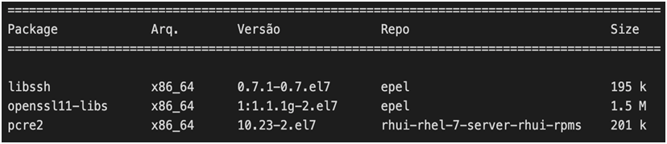

## Requisitos

O STCP Gemini Client está homologado para as distribuições Linux RHEL (versões 7 e 8), Ubuntu (versões 18.04 e 20.04), Amazon Linux, Oracle Linux (versões 7, 8 e 9), CentOS (versões 7 e 8), Rocky Linux e outros.

Por questões de segurança, o STCP Gemini Client utiliza versões mais recentes das bibliotecas **OPENSSL**, **LIBSSH** e **PCRE2**.

Essas bibliotecas são dependências (pré-requisitos) para que o STCP Gemini Client possa ser implantado corretamente e deverão estar instaladas no servidor em que o software será implantado.

A instalação do STCP Gemini Client será realizada através do repositório oficial da Riversoft, de acordo com a distribuição Linux utilizada.

## Distribuições Linux

As distribuições disponíveis para instalação são:
* CentOS;
* Red Hat Enterprise Linux;
* Rocky Linux;
* Oracle Linux;
* Amazon Linux.

### Instalação das dependências



As dependências para o STCP Gemini Client podem ser instaladas através do repositório EPEL, assim como, através dos seus respectivos pacotes RPM e conforme padrão e práticas adotadas por cada organização.

```bash
yum install epel-release
```

> **Nota:** O EPEL (Extra Packages for Enterprise Linux) é um repositório utilizado por administradores de sistemas Linux que necessitam instalar no servidor, pacotes mais recentes e versões atualizadas de bibliotecas, visto que esses pacotes mais novos não são imediatamente adicionados aos repositórios oficiais.

No Amazon Linux o acesso ao EPEL pode ser habilitado através do
comando:

```bash
amazon-linux-extras enable epel
```

No Oracle Linux, de acordo com a versão utilizada, o acesso ao EPEL pode ser habilitado através do comando abaixo. Para mais informações consulte a documentação da Oracle (https://yum.oracle.com/).

<!-- ```
yum install Oracle-epel-release-el7.x86_64
yum install Oracle-epel-release-el8.x86_64
yum install Oracle-epel-release-el9.x86_64
``` -->



  
  ```
  yum install Oracle-epel-release-el7.x86_64
  ```
  
  
  ```
  yum install Oracle-epel-release-el8.x86_64
  ```
  
  ```
  yum install Oracle-epel-release-el9.x86_64
  ```



Mais informações sobre como configurar o EPEL, podem ser obtidas através do link abaixo ou na documentação da distribuição utilizada.

[Epel documentation](https://fedoraproject.org/wiki/EPEL)

## Instalação

Para instalar o STCP Gemini Client será necessária a configuração do repositório oficial e da chave pública de assinatura de pacotes da Riversoft.

Utilizando o terminal, execute os passos a seguir:

```
$ apt-get install gnupg2
$ wget -O - -q
http://apt.riversoft.com.br/riversoft_repo/apt.riversoft.pub | apt-key
add -
```

O próximo passo será criar o arquivo de configuração de acesso ao repositório oficial dos pacotes da Riversoft.

```
$ vi /etc/apt/sources.list.d/apt-riversoft.list
```

Este comando criará um arquivo chamado *apt-riversoft.list*, insira nele os seguintes dados:



  
  ```
  deb http://apt.riversoft.com.br/riversoft_repo/debian/ bionic main
  ```
  
  
  ```
  deb http://apt.riversoft.com.br/riversoft_repo/debian/ focal main
  ```



Após a configuração do repositório, utilize os comandos padrão do APT para instalar o STCP Gemini Client.

```
$ apt-get update
$ apt-get install stcpgemini-client
```

Confirme as informações exibidas na tela para concluir a instalação e logo após siga a seção de [Configuração](/stcpgeminiclient/configuracao)
