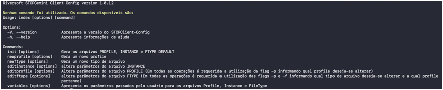
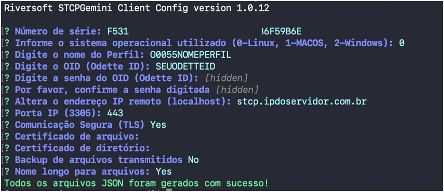

Toda a configuração da aplicação será realizada através do *STCP Gemini Client Config*. Não é necessária a utilização do super-usuário (root) para a configuração.



## Arquivo JSON

Siga os passos abaixo para criar o arquivo de configuração da aplicação.

```
$ cd /usr/local/stcpclient/configs/
$ cp example-stcpclient.config.json stcpclient.config.json
```
Execute o configurador do STCP Gemini Client e siga os passos exibidos na tela para concluir a configuração.

```
$ stcpclient-config init
```


