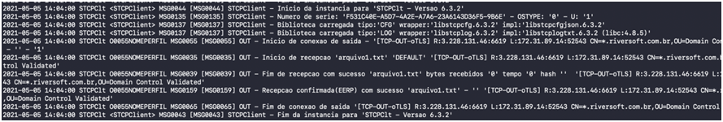

Todo o processo de conexão e transferência de arquivos do STCP Gemini Client é registrado em arquivos de log.

A aplicação cria um conjunto de arquivos de texto diário contendo as informações de cada conexão, envio e recepção de arquivos.

Através dos arquivos de log é possível auditar todos os eventos de comunicação e ocorrências de sucesso e/ou falhas no processo de transferência.



Os arquivos de log são armazenados na pasta *LOG*.

```sh
/usr/local/stcpclient/logs
```


