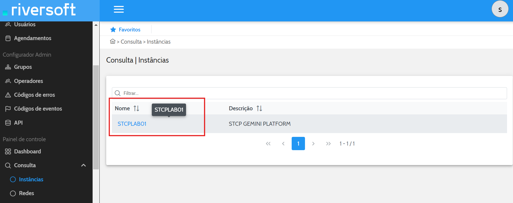
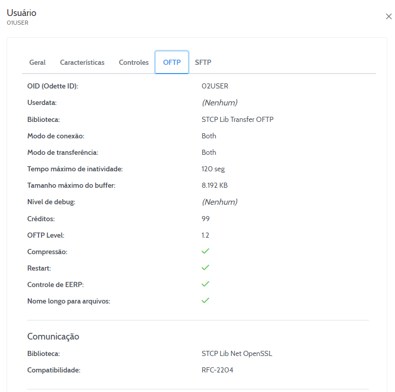
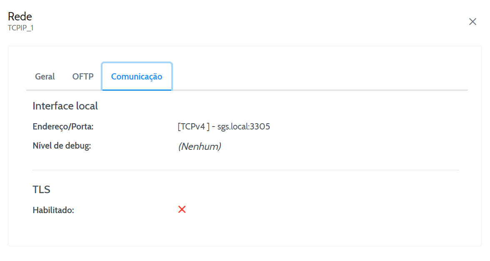
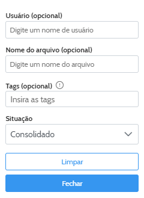

Nesta seção vamos detalhar as possibilidades de configuração do módulo Serviço Web Admin no Portal Gemini.

## Módulo Serviço Web Admin

O Serviço Web Admin permite que o Operador realize as funções de Consulta dos cadastros no sistema como: Instâncias, Usuários, Transferência de Arquivos, tenha acesso a Relatórios de: Eventos, Frequência e Transferências, faça **Monitoração** de: Agendamentos, Instâncias e Usuários, além de possibilitar Manutenção de: Instâncias, Agendamentos, Operadores e Usuários.

Além das funções descritas anteriormente há outras disponíveis, como Iniciar Conexões, e todas serão descritas a seguir.


  **AVISO:** Para que os recursos abordados por este manual funcionem corretamente é **NECESSÁRIO** que haja pelo menos um nó de monitoração criado e atribuído a um Serviço de **Monitoração da Instância**. Estas configurações podem ser consultadas nos Manuais dos Configuradores Web Admin e STCP.


## Menu Consulta

O Menu de consultas permite a visualização de todos os cadastros realizados no sistema. A divisão deste menu e dado por:

* Instâncias;
* Agendamentos;
* Usuários;
* Serviços;
* Código de Erros;
* Código de Eventos;
* Grupos;
* Operadores;
* Configurações API.

### Instâncias

A **consulta de Instâncias** permite que o Operador visualize os principais parâmetros cadastrados para as Instâncias do sistema.

Para buscar por uma instância específica insira seu nome e, se desejar, sua descrição. 

Ao localizar a instância pesquisada, clique sobre seu nome.

A partir de então os parâmetros cadastrados serão listados como mostrado a seguir:

**Tabela de descrição de Nível do evento**

| Nível do evento   | Descrição |
| ----------- | ----------- |
|  0   | Os eventos de início e término da aplicação.  |
|  1   | Os eventos que contenham algum erro.         |
|  2   | Os eventos de término da operação de cancelamento de espera de uma conexão.   |
|  3   | Os eventos de início e término de cancelamento das conexões.                  |
|  4   | Os eventos de início e término de com sucesso, início e término de sessão, início e término de transmissão ou início e término de recepção.    |
|  5   | Não definido.        |
|  6   | Não definido.        |
|  7   | Os eventos de início e término da unidade de processamento (threads)        |
|  8   | Os eventos de início e término da agenda.         |

### Agendamentos

A consulta de Agendamentos permite que o Operador visualize os principais parâmetros cadastrados para os Agendamentos no sistema.

Para buscar por um agendamento específico, informe seu **Nome** e/ou **Descrição**. Após preencher o campos descrito, o agendamento cadastrado será listado conforme mostra a imagem.

Ao localizar o agendamento pesquisado, clique em **"Editar"**. A partir de então, os parâmetros cadastrados serão listados.

### Usuários

A consulta de Usuários permite que o Operador visualize os principais parâmetros cadastrados para os usuários do sistema.

Para buscar por um usuário específico, informe seu **Nome** e/ou **Descrição**. Após preencher o campos descrito, o usuário cadastrado será listado conforme mostra a imagem.

Ao localizar o usuário pesquisado, clique sobre seu nome. A partir de então, os parâmetros cadastrados serão listados.

### Redes 

A consulta de Redes permite que o Operador visualize os principais parâmetros cadastrados para os usuários do sistema.

Para buscar por uma rede específica, informe seu **Nome** e/ou **Descrição**. Após preencher o campos descrito, a rede cadastrada será listado conforme mostra a imagem.

### Código de Erros

A consulta de Código de erros permite que o Operador visualize os principais parâmetros cadastrados para os Códigos de erro do sistema.

Para buscar por um erro específico, pode-se informar seu **Código:** e/ou sua **Descrição**. Como não há nenhum parâmetro obrigatório para esta pesquisa, ao clicar filtrar sem preencher nenhuma informação, todos os erros serão apresentados.

Ao localizar o erro desejado, clique sobre seu Código. A partir de então, os parâmetros cadastrados serão listados.

A partir de então os parâmetros cadastrados serão listados como mostrado a seguir:

### Código de Eventos

A consulta de Código de eventos permite que o Operador visualize os principais parâmetros cadastrados para os Códigos de eventos do sistema.

Para buscar por um evento específico pode-se informar seu **"Código:" e/ou sua Descrição**. Como não há
nenhum parâmetro obrigatório para esta pesquisa, ao filtrar sem preencher nenhuma informação, todos os eventos serão apresentados.

A partir de então os parâmetros cadastrados serão listados como mostrado a seguir:

### Grupos

A consulta de Grupos permite que o Operador visualize os principais parâmetros cadastrados para os Grupos do sistema.

Para buscar por um grupo específico pode-se informar seu **Nome e/ou sua Descrição**. Como não há nenhum parâmetro obrigatório para esta pesquisa, ao filtrar sem preencher nenhuma informação, todos os grupos existentes serão apresentados.

Ao localizar o grupo desejado, clique sobre seu nome.

### Operadores

A consulta de Operadores permite visualizar os principais parâmetros cadastrados para os Operadores do sistema.

Para buscar por um operador específico pode-se informar seu **Nome e/ou sua Descrição**. Como não há nenhum parâmetro obrigatório para esta pesquisa, ao filtrar sem preencher nenhuma informação, todos os operadores existentes serão apresentados.

A partir de então os parâmetros cadastrados serão listados como mostrado a seguir:

### API 

A consulta de APIs permite visualizar os principais parâmetros cadastrados para as APIs do sistema.

Para buscar por uma API específico pode-se informar seu **Nome e/ou sua Descrição**. 

Não há nenhum parâmetro obrigatório para esta pesquisa, portanto, ao filtrar sem preencher nenhuma informação, todas as APIs existentes serão apresentadas.

Ao localizar o operador desejado, clique sobre seu nome.

A partir de então os parâmetros cadastrados serão listados como mostrado a seguir:

## Menu Relatórios

O Menu de Relatórios permite que o Operador obtenha relatórios detalhados de diversas entidades do portal.

Existem 3 tipos de relatórios, os de [Eventos do sistema](#relatórios-de-eventos), os de [Frequência](#frequência) de conexão e de transferência e os relatórios de [Transferências](#transferências), todos eles serão abordados a seguir.

### Relatórios de Eventos

Nos relatórios de eventos será possível analisar os eventos ocorridos tanto em intervalos de tempo como em entidades específicas.

#### Eventos de Instância

É possível obter os relatórios de eventos das Instâncias utilizando diversos parâmetros como filtro, entre eles:

| **Campo**         | **Descrição**                                                                                                                                             |
|-------------------|-----------------------------------------------------------------------------------------------------------------------------------------------------------|
| **Usuário** | Filtra os eventos ocorridos na instância para determinados usuários ou pelos módulos que registram os tipos de interações                                 |
| **Mensagem**      | Filtragem dos eventos através de suas mensagens. Ex: Concluído, Falha, etc.                                                                                |
| **De**            | Pesquisa por intervalo de tempo: Data de início do período de pesquisa. Formato (DIA/MÊS/ANO)                                                             |
| **Até**           | Pesquisa por intervalo de tempo: Data de término do período de pesquisa. Formato (DIA/MÊS/ANO)                                                            |
| **Quantidade máxima de registros**  | Definir a quantidade máxima de registros de logs dos eventos (100, 250, 500 e 1000). |

Clique em **Pesquisar** para visualizar as informações dos eventos do sistema. Caso deseje visualizá-los em uma ferramenta de planilhas, clique no ícone **Exportar**:

#### Eventos do Sistema

Os relatórios de eventos do sistema podem ser obtidos utilizando os seguintes critérios de filtragem:

| **Campo**         | **Descrição**                                                                                                                                             |
|-------------------|-----------------------------------------------------------------------------------------------------------------------------------------------------------|
| **Módulo** | Filtra os eventos pelo módulo que os registrou. |
| **Mensagem**      | Filtragem dos eventos através de suas mensagens. Ex: Concluído, Falha, etc.                                                                                |
| **De**            | Pesquisa por intervalo de tempo: Data de início do período de pesquisa. Formato (DIA/MÊS/ANO)                                                             |
| **Até**           | Pesquisa por intervalo de tempo: Data de término do período de pesquisa. Formato (DIA/MÊS/ANO)                                                            |
| **Quantidade máxima de registros**  | Definir a quantidade máxima de registros de logs dos eventos (100, 250, 500 e 1000). |

Clique em **Pesquisar** para visualizar as informações dos eventos do sistema. Caso deseje visualizá-los em uma ferramenta de planilhas, clique no ícone **Exportar**:

#### Eventos dos Usuários

É possível obter os relatórios de eventos dos usuários utilizando diversos parâmetros como filtro, entre eles:

| **Campo**         | **Descrição**                                                                                                                                             |
|-------------------|-----------------------------------------------------------------------------------------------------------------------------------------------------------|
| **Usuário** | Filtra os eventos ocorridos na instância para determinados usuários ou pelos módulos que registram os tipos de interações                                 |
| **Mensagem**      | Filtragem dos eventos através de suas mensagens. Ex: Concluído, Falha, etc.                                                                                |
| **De**            | Pesquisa por intervalo de tempo: Data de início do período de pesquisa. Formato (DIA/MÊS/ANO)                                                             |
| **Até**           | Pesquisa por intervalo de tempo: Data de término do período de pesquisa. Formato (DIA/MÊS/ANO)                                                            |
| **Quantidade máxima de registros**  | Definir a quantidade máxima de registros de logs dos eventos (100, 250, 500 e 1000). |


**DICA:** Caso nenhum usuário seja informado, todos os eventos de todos os usuários quem cumpram
os filtros restantes serão apresentados.


Após inserir as informações desejadas clique em **Pesquisar**. Ao fazer isto uma sequência de eventos serão apresentados em sua tela, caso deseje visualizá-los em uma ferramenta de planilhas clique em **Exportar**:

#### Eventos dos Operadores

Os relatórios de eventos dos operadores podem ser obtidos utilizando os seguintes critérios de filtragem:

| **Campo**         | **Descrição**                                                                                                                                             |
|-------------------|-----------------------------------------------------------------------------------------------------------------------------------------------------------|
| **Operador** | Filtra os eventos ocorridos na instância para determinados usuários ou pelos módulos que registram os tipos de interações                                 |
| **Mensagem**      | Filtragem dos eventos através de suas mensagens. Ex: Concluído, Falha, etc.                                                                                |
| **De**            | Pesquisa por intervalo de tempo: Data de início do período de pesquisa. Formato (DIA/MÊS/ANO)                                                             |
| **Até**           | Pesquisa por intervalo de tempo: Data de término do período de pesquisa. Formato (DIA/MÊS/ANO)                                                            |
| **Quantidade máxima de registros**  | Definir a quantidade máxima de registros de logs dos eventos (100, 250, 500 e 1000). |

Clique em **Pesquisar** para visualizar as informações dos eventos do sistema. Caso deseje visualizá-los em uma ferramenta de planilhas, clique no ícone **Exportar**:

### Relatórios de Frequência

Nos relatórios de frequência será possível analisar a frequência com que conexões e transferências foram realizadas.

#### Frequência de Conexão

É possível obter os relatórios de conexão utilizando diversos parâmetros como filtro, entre eles:

| **Campo**   | **Descrição**                                                                                         |
|-------------|-------------------------------------------------------------------------------------------------------|
| **Instância** | Seleção da instância para a qual deseja-se obter o relatório. Parâmetro obrigatório.                 |
| **Usuário**   | Inserção do nome de um usuário como filtro durante a pesquisa.                                       |
| **Situação**  | Status da conexão realizada pelo Usuário, seja entrada, saída ou ambos.                              |
| **De**        | Pesquisa por intervalo de tempo: Data de início do período de pesquisa. Formato (DIA/MÊS/ANO)        |
| **Até**       | Pesquisa por intervalo de tempo: Data de término do período de pesquisa. Formato (DIA/MÊS/ANO)       |

Após inserir as informações desejadas clique em **Pesquisar**. Ao fazer isto uma sequência de eventos serão apresentados em sua tela, caso deseje visualizá-los em uma ferramenta de planilhas clique em **Exportar**:

#### Frequência de Transferências

Os relatórios de eventos dos operadores podem ser obtidos utilizando os seguintes critérios de filtragem:

| **Campo**          | **Descrição**                                                                                     |
|--------------------|---------------------------------------------------------------------------------------------------|
| **Usuário**        | Inserção do nome de um usuário como filtro durante a pesquisa.                                     |
| **Situação**       | Modo de transmissão. Ex: Transmissão, Recepção ou ambos.                                           |
| **Tags**           | Filtro das transferências pela Tag associada aos arquivos transmitidos.                            |
| **De**             | Pesquisa por intervalo de tempo: Data de início do período de pesquisa. Formato (DIA/MÊS/ANO)      |
| **Até**            | Pesquisa por intervalo de tempo: Data de término do período de pesquisa. Formato (DIA/MÊS/ANO)     |

Após inserir as informações desejadas clique em **Pesquisar**. Ao fazer isto uma sequência de eventos serão apresentados em sua tela, caso deseje visualizá-los em uma ferramenta de planilhas clique em **Exportar**:

### Relatórios de Transferências

Nos relatórios de transferências será possível analisar detalhes das transferências ocorridas, entre eles: **Estatísticas** dos dados das transmissões, **Gráficos** da taxa das transmissões sucedidas, **Histórico** das transmissões realizadas e outras funcionalidades.

#### Auditoria das Transferências

Ao fazer a auditoria das transferências, será possível visualizar relatórios com as informações mais importantes de cada transmissão.

Para gerar este relatório pode-se preencher os seguintes campos de filtragem:

| **Campo**       | **Descrição**                                                                                                                                          |
|-----------------|--------------------------------------------------------------------------------------------------------------------------------------------------------|
| **Usuário**     | Inserção do nome de um usuário como filtro durante a pesquisa.                                                                                          |
| **Mensagem**    | Filtragem através de mensagens. Ex: Início de sessão de entrada, Fim da sessão de saída, etc.                                                           |
| **Tags**        | Filtro das transferências pela Tag associada aos arquivos transmitidos.                                                                                 |
| **De**          | Pesquisa por intervalo de tempo: Data de início do período de pesquisa. Formato (DIA/MÊS/ANO)                                                           |
| **Até**         | Pesquisa por intervalo de tempo: Data de término do período de pesquisa. Formato (DIA/MÊS/ANO)
| **Quantidade máxima de registros**  | Definir a quantidade máxima de registros de logs dos eventos (100, 250, 500 e 1000). |
                                                          |

Após inserir as informações desejadas clique em **Pesquisar**. Ao fazer isto uma sequência de transferências serão apresentados em sua tela.

Caso deseje visualizá-las em uma ferramenta de planilhas clique em:

#### Estatísticas das Transferências

Para buscar as estatísticas das transferências há alguns filtros que podem ser utilizados, eles são:

| **Campo**         | **Descrição**                                                                                                         |
|-------------------|-----------------------------------------------------------------------------------------------------------------------|
| **Usuário**       | Inserção do nome de um usuário como filtro durante a pesquisa.                                                        |
| **Situação**      | Divisão por período das estatísticas apresentadas. Ex: Por Hora, semanal, etc.                                        |
| **Mensagem**      | Filtragem através de mensagens. Ex: Início de sessão de entrada, Fim da sessão de saída, etc.                         |
| **Nome do arquivo**| Definição do nome do arquivo como filtro para apresentação das estatísticas.                                          |
| **Tags**          | Filtro das transferências pela Tag associada aos arquivos transmitidos.                                               |
| **De**            | Pesquisa por intervalo de tempo: Data de início do período de pesquisa. Formato (DIA/MÊS/ANO)                          |
| **Até**           | Pesquisa por intervalo de tempo: Data de término do período de pesquisa. Formato (DIA/MÊS/ANO)                         |

Após inserir as informações desejadas clique em **Pesquisar**. Ao fazer isto, uma lista com as estatísticas das transferências será apresentada.

Caso deseje visualizá-las em uma ferramenta de planilhas clique em:

#### Gráficos de Transferência

Os gráficos das transferências ocorridas são diferentes entre si a depender dos filtros utilizados, eles são:

| **Campo**         | **Descrição**                                                                                             |
|-------------------|-----------------------------------------------------------------------------------------------------------|
| **Usuário**       | Inserção do nome de um usuário como filtro durante a pesquisa.                                            |
| **Situação**      | Divisão por período das informações apresentadas. Ex: Por Hora, semanal, etc.                             |
| **Nome de arquivo**| Definição de um nome de arquivo como filtro.                                                             |
| **Tags**          | Filtro das transferências pela Tag associada aos arquivos transmitidos.                                   |
| **De**            | Pesquisa por intervalo de tempo: Data de início do período de pesquisa. Formato (DIA/MÊS/ANO)             |
| **Até**           | Pesquisa por intervalo de tempo: Data de término do período de pesquisa. Formato (DIA/MÊS/ANO)            |

Após inserir as informações desejadas e clicar em **Pesquisar**. será possível visualizar os seguintes tipos de gráficos:

#### Histórico das transferências

Para filtrar o histórico de transferências segundo sua necessidade, há os seguintes campos de preenchimento:

| Campos     | Descrição                                                                                                                                 |
|------------|-------------------------------------------------------------------------------------------------------------------------------------------|
| **Instâncias**   | Seleção da instância para a qual deseja-se obter o histórico de transferências. Parâmetro obrigatório.                                         |
| **Usuário**      | Inserção do nome de um usuário como filtro durante pesquisa.                                                                                   |
| **Situação**     | Divisão por status da transferência. Ex: Recebidas/Ok, Enviadas/Ok                                                                             |
| **Nome de arquivo** | Definição de um nome de arquivo como filtro.                                                                                                  |
| **Tags**         | Filtro das transferências pela Tag associada aos arquivos transmitidos.                                                                        |
| **De**           | Pesquisa por intervalo de tempo: Data de início do período de pesquisa. Formato (DIA/MÊS/ANO)                                                  |
| **Até**          | Pesquisa por intervalo de tempo: Data de término do período de pesquisa. Formato (DIA/MÊS/ANO)                                                 |
| **Ordenado por** | Método de ordenação utilizado para apresentação dos dados. Pode assumir os critérios especificados para o campo Usuário ou pelos campos de Data/Hora inseridos. Além disso, também oferece a opção de ordenação por ordem alfabética (A↑Z) ou alfabética invertida (Z↓A). |
| **Quantidade máxima de registros**  | Definir a quantidade máxima de registros de logs dos eventos (100, 250, 500 e 1000). |

Após inserir as informações desejadas e clicar em **Pesquisar**.

Caso deseje visualizar as transferências apresentadas em uma ferramenta de planilhas, clique em:

