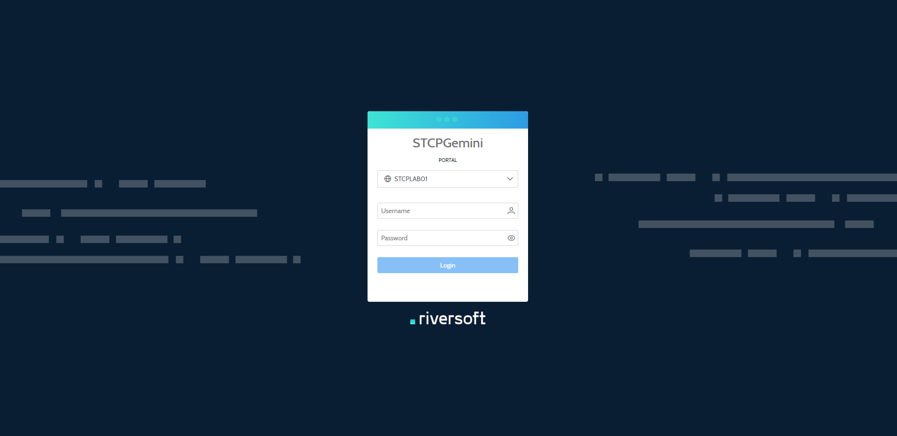
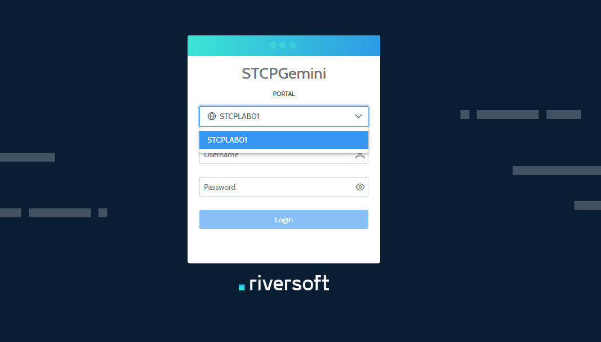
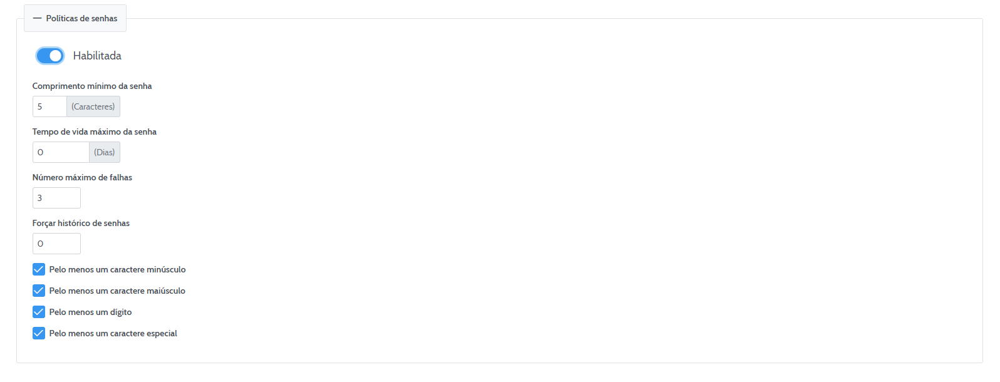
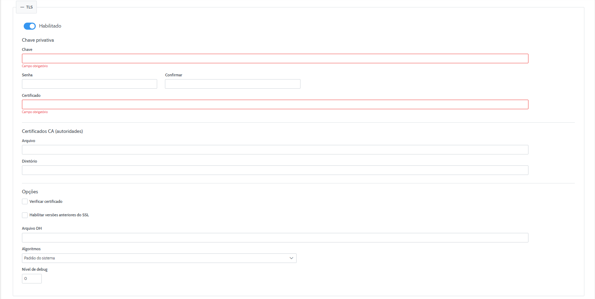
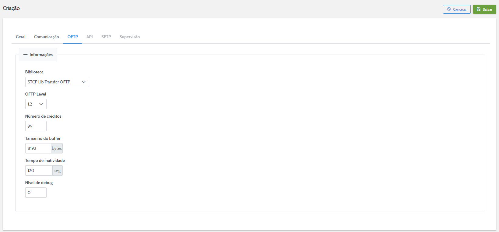
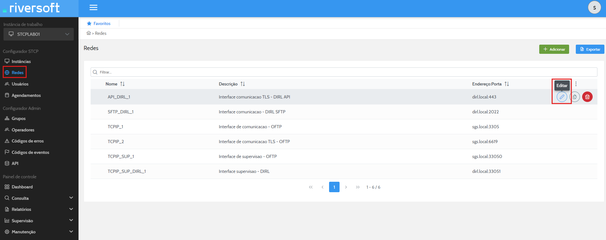
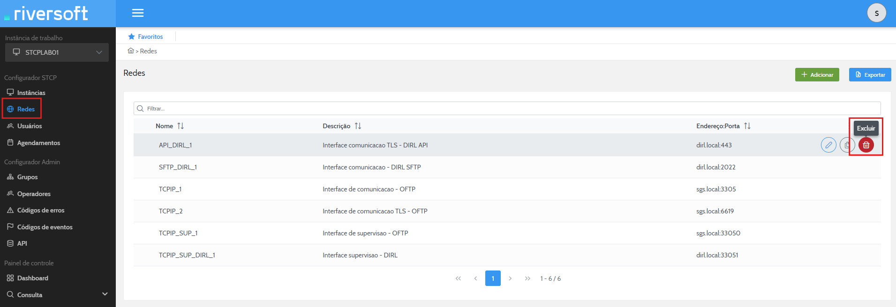
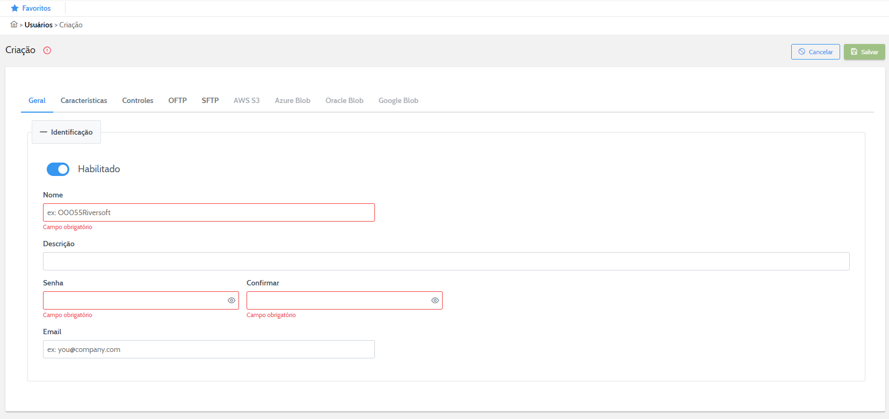
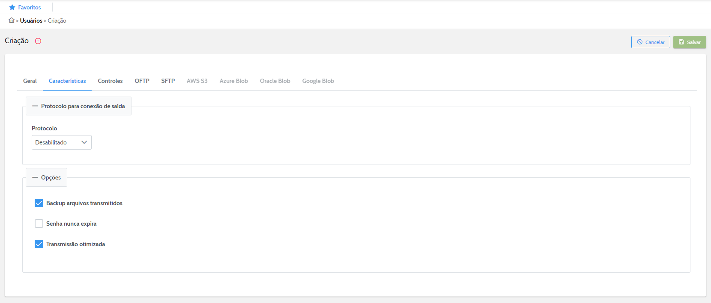

# Funcionalidades do Portal

O portal STCP Gemini é uma aplicação que facilita a configuração do STCP Gemini Server por possuir funcionalidades que vão desde o gerenciamento de instâncias, usuários, agendamentos, etc, até a possibilidade de iniciar conexões entre usuários e checar relatórios de comunição.

# Página do Portal

A instalação do portal pode ser consultada no Procedimento de Implantação do STCP Gemini Server. Após instalá-lo, acesse em seu navegador o Endereço/IP em que foi configurado.

## Seleção do EntryPoint

Para realizar o login será necessário selecionar um EntryPoint na caixa de seleção como mostra a imagem:

Caso não haja nenhum Entrypoint cadastrado ou mais de uma opção, consulte o administrador da rede e verifique qual utilizar.


O EntryPoint é essencial para logar no sistema!


## Login

Durante o primeiro login utilize o operador **stcpadmin** e a senha **Admin**.


O operador stcpadmin possui permissões de acesso e configuração a todas as entidadoes do portal, contudo ao logar com outros operadores o acesso às funcionalidades descritas neste documento poderá estar disponível ou indisponível.


Ao fazer isso a listagem dos módulos será exibida, sendo eles: Configurador STCP, Admin, e Painel de Controle.

# Módulo Configurador STCP

O módulo Configurador STCP permite ao operador manipular: Configuração de instâncias, serviços de rede, usuários (caixas postais), agendamentos, tipos de arquivos para transferência.


A instância é uma peça chave, por isso não será possível acessar os menus Usuários, Serviços e Agendamentos antes de se selecionar ou criar uma Instância.


Para estabelecer uma conexão são necessários ao menos:

* Uma instância
* Um usuário
* Um serviço de autenticação
* Uma rede de supervisão
* Um nó de supervisão

## Instâncias

As instâncias são as entidades fundamentais para efetuar conexões pois à elas são associados Usuários, Serviços, Tipos de arquivos e Agendamentos.

A seguir encontram-se os passos necessários para criar uma Instância.

Todas as ações do tópico serão explicadas a partir da listagem de instâncias presente no canto esquerdo da tela.

### Adicionar Instâncias

Durante o primeiro login no portal não haverá nenhuma instância cadastrada e por isso algumas mensagens de aviso serão apresentadas.

O cadastro de uma nova instância é realizado clicando em "+ Adicionar" no canto superior direito da tela.


Para facilitar a compreensão e definição dos campos e atributos, o cadastro é dividido em seções e subseções como mostrado nas imagens a seguir:


#### Seção Geral

O primeiro passo para cadastrar uma instância é definir seus atributos de **Identificação**. Segue uma tabela contendo os campos presentes nesta seção e suas especificações:

| Campos                  | Descrição                       | Valores Permitidos           |
|-------------------------|---------------------------------|------------------------------|
| Nome (Obrigatório)      | Nome da Instância               |    -                          |
| Descrição               | Descrição da Instância          |     -                         |
| Sistema Operacional     | Sistema Operacional utilizado. (Linux, MAC OS ou Windows)   |  -    |
| Número de Série (Obrigatório) | Número serial do STCP      | Valores hexadecimais         |

#### Seção Diretórios

**Diretórios de dados:** O segundo passo é definir os atributos para os diretórios de envio e recepção de arquivos, e controles do sistema. Segue abaixo uma tabela explicativa dos campos e suas especificações:

| Campos      | Descrição                                                                                                                                      | Valores Permitidos                        |
|-------------|------------------------------------------------------------------------------------------------------------------------------------------------|-------------------------------------------|
| Raiz (Obrigatório) | Caminho onde a estrutura de pastas da Instância será criada após o início da conexão.                                                   | Alfanuméricos, " / ", " _ ", " . ", " - " |
| Controle    | Nome para a pasta responsável por armazenar arquivos de controle da sessão e conexões realizadas. Nome padrão: CONTROLE                        | Alfanuméricos                             |
| Formatos    | Nome para a pasta que armazenará os formatos do sistema. Nome padrão: FORMATOS                                                                 | Alfanuméricos                             |
| Temporário  | Nome para a pasta onde serão armazenados os arquivos temporários do sistema. Nome padrão: TEMP                                                  | Alfanuméricos                             |
| Entrada     | Nome para a pasta onde os arquivos recebidos serão salvos. Nome padrão: ENTRADA                                                                 | Alfanuméricos                             |
| Restart     | Nome para a pasta onde os arquivos que tiveram seu envio interrompido serão armazenados. Nome padrão: RESTART                                   | Alfanuméricos                             |
| Saída       | Nome para a pasta onde deve-se inserir os arquivos que serão transmitidos. Nome padrão: SAIDA                                                   | Alfanuméricos                             |
| Backup      | Nome para a pasta onde uma cópia dos arquivos enviados e recebidos são armazenados a fim de garantir que haja um backup caso seja necessário. Nome padrão: BACKUP | Alfanuméricos                 |
| Pendentes   | Nome para a pasta onde os arquivos que ainda estão sendo recebidos ficam temporariamente salvos. Nome padrão: PENDENTES                         | Alfanuméricos                             |

#### Seção Controles

**Controle de Agenda:** O terceiro passo ao cadastrar uma instância é configurar alguns atributos do agendamento, entre eles: 

* Habilitar ou desabilitar o controle dos agendamentos cadastrados para os usuários da instância.
* Definir o intervalo em que o controle da agenda entrará em ação. Este intervalo de tempo é dado em **milissegundos**.

**Controle de Lock:** O quarto passo é configurar atributos de reinicialização de conexões e transmissões de arquivos. Segue abaixo a tabela explicativa dos campos e suas especificações:

| Campos                          | Descrição                                                                              | Valores Permitidos        |
|---------------------------------|----------------------------------------------------------------------------------------|---------------------------|
| Habilitar                       | Chave para habilitar ou desabilitar o "Controle de Lock" da instância                  | Habilitado / Desabilitado |
| Tempo de espera para nova tentativa de lock | Tempo entre tentativas de lock, dado em milissegundos.                           | Numéricos                 |
| Máximo de tentativas de lock    | Número máximo de tentativas de lock realizadas pelo sistema.                           | Numéricos                 |
| Timeout de lock de sessão       | Tempo máximo, em milissegundos, em que o sistema permanecerá realizando tentativas de lock. | Numéricos                 |

**Controle de sessões simultâneas:** Em seguida configura-se o numero máximo de sessões abertas simultaneamente para a instância.

**Outros controles:** A última configuração da seção **Controles** é a definição dos seguinte parâmetros:

| Campos                        | Descrição                                                                 | Valores Permitidos              |
|-------------------------------|---------------------------------------------------------------------------|---------------------------------|
| Máximo de Mensagens no Console | Número máximo de mensagens que serão apresentadas nos logs do Portal      | Numéricos maiores ou iguais a 50 |
| Máximo de Processos Assíncronos| Número máximo de processos assíncronos que serão permitidos na Instância  | Numéricos                       |

#### Autenticação de Usuários

As configurações da seção de autenticação são responsáveis por definir qual banco de dados será utilizado pela instância e quais políticas de senha deverão ser seguidas.

**Configurações Básicas:** Inicialmente, deve-se configurar a biblioteca utilizada para o banco de dados e
qual será o tipo de autenticação, como pode ser observado na tabela a seguir:

| Campos                        | Descrição                                                                                      | Valores Permitidos          |
|-------------------------------|------------------------------------------------------------------------------------------------|-----------------------------|
| Biblioteca (Obrigatório)       | Biblioteca utilizada para o carregamento do banco de dados no início da conexão.              | No momento "MYSQL/MARIADB"  |
| Tipo Autenticação              | Formato utilizado na autenticação do banco de dados da instância quando a conexão for iniciada.| No momento "STCP"           |

**Base de Dados:** Em seguida configura-se a **Base de Dados**, nela são inseridas informações do banco de dados utilizado. Veja seus campos e especificações na tabela a seguir:

| Campos                      | Descrição                                                        | Valores Permitidos       |
|-----------------------------|------------------------------------------------------------------|--------------------------|
| Nome do banco de dados       | Nome do banco de dados que será utilizado para configuração      |                          |
| Endereço                    | Endereço do Banco de dados                                       |                          |
| Porta                       | Porta para o acesso ao banco de dados. Valor padrão: 3306        | Somente números           |
| Usuário                     | Usuário do banco de dados para acessá-lo.                        |                          |
| Senha                       | Senha do usuário do banco de dados.                              |                          |
| Confirmar                   | Confirmação da senha do banco de dados.                          |                          |


**Nesta subseção todos os parâmetros são obrigatórios!**


**Políticas de senhas:** Também podem ser alteradas as **Políticas de senha**, sua utilização não é obrigatória, porém recomenda-se aplicá-las por questões de segurança. Segue uma tabela explicativa dos campos desta subseção e suas especificações:

| Campos                          | Descrição                                                                                                          | Valores Permitidos       |
|---------------------------------|--------------------------------------------------------------------------------------------------------------------|--------------------------|
| Habilitar                        | Chave para habilitar/desabilitar as políticas de senha para os usuários dessa instância.                           | Habilitado / Desabilitado |
| Comprimento mínimo da senha      | Quantidade mínima de caracteres da senha                                                                           | Comprimento mínimo de 5 e máximo 8 |
| Tempo de vida máximo da senha    | Quantidade de tempo, em dias, em que a senha dos usuários poderá ser utilizada antes que seja necessário resetá-las | Numéricos                 |
| Número máximo de falhas          | Quantidade de vezes em que o usuário poderá errar a senha sem que seja bloqueado                                   | Numéricos                 |
| Forçar histórico de senhas     | Quantidade de senhas já utilizadas anteriormente e que não podem ser reutilizadas durante a criação de uma nova     | Numéricos                 |
| Pelo menos um caractere minúsculo| Caso seja habilitada, esta opção obrigará que a senha do usuário possua pelo menos um caractere minúsculo           | Habilitado / Desabilitado |
| Pelo menos um caractere maiúsculo| Caso seja habilitada, esta opção obrigará que a senha do usuário possua pelo menos um caractere maiúsculo           | Habilitado / Desabilitado |
| Pelo menos um dígito             | Caso seja habilitada, esta opção obrigará que a senha do usuário possua pelo menos um dígito                        | Habilitado / Desabilitado |
| Pelo menos um caractere especial | Caso seja habilitada, esta opção obrigará que a senha do usuário possua pelo menos um caractere especial            | Habilitado / Desabilitado |

#### Log 

A sessão Log é responsável pelo gerenciamento das mensagens de eventos. Segue abaixo suas subseções:

**Configurações Básicas:** Inicialmente, deve-se configurar a biblioteca utilizada para o banco de dados e
qual será o tipo de autenticação, como pode ser observado na tabela abaixo:

| Campos                        | Descrição                                                                                      | Valores Permitidos          |
|-------------------------------|------------------------------------------------------------------------------------------------|-----------------------------|
| Biblioteca       | Biblioteca utilizada para o carregamento do banco de dados no início da conexão.              | No momento "MYSQL/MARIADB"  |

**Base de dados:** Nesta subseção configura-se o banco de dados que armazenará os logs da aplicação.

| Campos    | Descrição                                                         | Valores Permitidos          |
|-----------|-------------------------------------------------------------------|-----------------------------|
| Nome do banco de dados | Nome do Banco de dados que armazenará os Logs.                    |                             |
| Endereço      | Endereço do Banco de dados                                        |                             |
| Porta     | Porta de acesso ao banco. Valor padrão: 3306                      | Somente números             |
| Usuário   | Usuário do banco de dados.                                        |                             |
| Senha     | Senha do usuário do banco de dados.                               |                             |
| Confirmar | Confirmação da senha do banco de dados.                           |                             |


**Nesta subseção todos os campos são obrigatórios.**



O banco de dados utilizado para os Logs não precisa ser o mesmo definido na autenticação.


**Nível de log das mensagens de eventos:** No cadastro dos logs também há essa subseção, onde são definidos quais logs serão gravados no banco de dados, quais serão mostrados no próprio Console Log do sistema e os comandos externos a serem executados.

| Campos                  | Descrição                                                                                                                                 | Valores Permitidos        |
|-------------------------|-------------------------------------------------------------------------------------------------------------------------------------------|---------------------------|
| Gravar no Banco de dados | Define quais logs serão salvos no banco de dados de acordo com o número escolhido. Cada número possui tipos de logs definidos, que podem ser consultados através das mensagens em azul ao lado direito do campo. | Numerais dentre 0 e 8      |
| Apresentar na console do STCP | Define quais logs serão mostrados no console do sistema, porém estes não serão salvos no banco de dados.                                      | Numerais dentre 0 e 8      |
| Executar comando externo | Nível de evento que disparará um comando (programa ou bat) externo.                                                                       | Numerais dentre 0 e 8      |
| Comando Externo          | Campo de cadastro do script com o comando externo que será executado.                                                                     | Insira o caminho onde o script com o comando está salvo. |

**Filtros de mensagem de evento:** Os últimos campos antes de concluir o cadastro da Instância são:

| Campos  | Descrição                                                                                                                                   | Valores Permitidos |
|---------|---------------------------------------------------------------------------------------------------------------------------------------------|--------------------|
| Aceitar | Campo utilizado para criar um filtro das mensagens mostradas nos logs. Pode-se criar um filtro para que apenas mensagens de um determinado usuário sejam mostradas. |                    |
| Rejeitar | Campo utilizado para criar um filtro das mensagens que não serão mostradas nos logs. Pode-se criar um filtro para que apenas mensagens de um determinado usuário sejam rejeitadas. |                    |

Finalmente, para adicionar a Instância e concluir o cadastro, clique em **Salvar**.

### Editar Instâncias

Caso precise editar algum parâmetro de uma instância já criada, acesse a lista de Instâncias e clique no ícone de edição presente à direita.

Já na página de edição, altere os atributos desejados e salve as modificações ao final. Em caso de dúvidas leia
a descrição dos campos novamente no tópico de Adicionar Instâncias


O campo **Nome:** da Instância não pode ser alterado!


### Copiar Instâncias

A cópia ou exibição das instâncias é realizada através do menu de opções indicado por uma seta ao lado direito
da tela. Para executar uma dessas ações, clique neste ícone a função **Copiar** como mostrado na imagem a seguir:


Ao selecionar a função copiar você será direcionado a uma tela semelhante a de edição, nela já
constarão as informações da instância copiada exceto o nome. Modifique os campos que julgar
necessário, digite o nome da nova instância e salve-a.


### Remover Instâncias

Para remover uma Instância existente, deve-se acessar as opções ao lado direito da Instância a ser removida e clicar em **Excluir**. Remover instâncias é um procedimento que deve ser realizado com cautela pois, como dito anteriormente, à elas estão associados Usuários, Tipos de arquivo e Agendamentos.

### Adicionar tipos de arquivo

Os tipos de arquivo são utilizados tanto na transmissão quanto recepção de arquivos em uma conexão. Sua função é realizar tratativas como conversões de nome, formato, etc.

Para criar um novo tipo de arquivo acesse o menu de opções indicado pela seta.

Em seguida, clique em **+ Adicionar**.

**Identificação**

As primeiras informações a serem cadastradas na criação dos Tipos de Arquivo são seu nome, descrição e Tags que serão adicionadas ao nome dos arquivos tratados.

**Informações**

Nesta seção serão descritas as **Informações** do tipo de arquivo criado, entre elas se o tipo de arquivo fará tratativas **Padrão** ou através de uma **Expressão Regular**.

* **Tratativas Padrão**: Apesar de constar tal campo como possível seleção, ao criar uma instância o sistema atribuirá a ela um tipo de arquivo com tratativas padrão automaticamente. Por não ser possível existir 2 padrões, esta seleção se encontrará sempre bloqueada.

* **Tratativas por Expressão Regular:** Este tipo de tratativa será feita baseando-se no nome do arquivo transmitido, incluindo seu formato. Por exemplo, caso deseje que arquivos no formato TXT crie uma tratativa que busque pela expressão "txt" no campo Regex.

* **Tipo de Arquivo Expressão Regular (Regex)**.
  

**Transmissão:** Nesta subseção configuram-se os parâmetros dos arquivos verificados pela tratativa durante o envio. Segue abaixo uma tabela explicativa contento tais parâmetros e suas especificidades:

| Atributo                    | Descrição                                                                                                                                                      | Valores Permitidos                        |
|-----------------------------|----------------------------------------------------------------------------------------------------------------------------------------------------------------|-------------------------------------------|
| Desabilitar                 | Desabilitação de todas as tratativas realizadas durante a transmissão de um arquivo                                                                             | Desabilitar/Manter                        |
| Executar comando externo    | Campo utilizado para inserir o caminho de scripts de comandos que devem ser executados na transmissão dos arquivos                                              |                                           |
| Aguardar o término da execução do comando | Opção utilizada para que o sistema possa aguardar a execução do comando externo definido acima ao transmitir os arquivos                          |                                           |
| Origem                      | Odette ID da origem da transmissão                                                                                                                              |                                           |
| Destino                     | Odette ID de destino da transmissão                                                                                                                             |                                           |
| Userdata                    | Inserção de dados de transmissão que podem ser úteis para outras aplicações                                                                                     |                                           |
| Formato de registro         | Escolha do formato de registro utilizado                                                                                                                        | Não Formatado; Stream (SFTP); Fixo; Variável; Texto |
| Tamanho de registro         | Tamanho dos registros armazenados                                                                                                                               | Numerais                                  |
| Converte nome de arquivo    | Seleção da conversão do nome do arquivo antes de transmitir.                                                                                                    | Não; Maiúscula; Minúscula                 |
| Remover CRLF                | Habilitação/Desabilitação da remoção dos caracteres CR (Carriage Return) e LF (Line Feed) na transmissão do arquivo                                              | -.                                        |
| CR                          | Número na tabela de caracteres referente ao Carriage Return                                                                                                     | Numerais                                  |
| LF                          | Número na tabela de caracteres referente ao Line Feed                                                                                                           | Numerais                                  |
| Tabela de conversão de dados| Tabela de conversão dos dados entre os tipos de formatos                                                                                                        | -.                                        |
| Remover timestamp           | Habilita/Desabilita a remoção de timestamp do arquivo transmitido                                                                                               | Chave selecionável                        |
| Backup                      | Habilita/Desabilita Backup dos arquivos transmitidos                                                                                                            | Chave selecionável                        |

**NOTAS**:
> Somente utilize a opção Remover CRLF quando o formato do registro for Fixo ou Variável.
> Ao escolher um formato de registro Fixo será necessário informar o Tamanho do registro.

<!-- 
**NOTAS:**
* Somente utilize a opção Remover CRLF quando o formato do registro for Fixo ou Variável.
* Ao escolher um formato de registro **Fixo** será necessário informar o **Tamanho do registro**. 
 -->

**OFTP2:** Nesta subseção configuram-se os parâmetros dos arquivos que utilizam o protocolo OFTP 2 na comunicação com foco na segurança dos arquivos que serão transmitidos. Segue a tabela com os parâmetros e suas funcionalidades:

| Atributo        | Descrição                                                                                            | Valores Permitidos                                 |
|-----------------|------------------------------------------------------------------------------------------------------|---------------------------------------------------|
| Nível de Segurança | Seleção do tipo nível do arquivo de transmissão                                                       | Níveis disponíveis: Desabilitado; Encriptado; Assinado; Encriptado e Assinado |
| Cipher Level    | Cifra de criptografia utilizada                                                                        |                                                   |
| Comprimido      | Parâmetro de informação referente ao protocolo OFTP2 do arquivo a ser transmitido.                     | Chave selecionável                                |
| Envelopado      | Parâmetro de informação referente ao protocolo OFTP2 constando se o arquivo foi criptografado          | Chave selecionável                                |
| EERP Signed     | Habilitação/Desabilitação de assinatura na resposta de arquivo recebido pelo Destino                    | Chave selecionável                                |

**Recepção:** Nesta subseção configuram-se os parâmetros dos arquivos verificados pela tratativa durante a recepção. Segue abaixo uma tabela explicativa contendo suas especificidades:

| Atributo                      | Descrição                                                                                                    | Valores Permitidos                  |
|-------------------------------|--------------------------------------------------------------------------------------------------------------|-------------------------------------|
| Desabilitar                   | Desabilitação de todas as tratativas realizadas durante a recepção de um arquivo                              | Desabilitar/Manter                  |
| Executar comando externo      | Campo utilizado para inserir o caminho de scripts de comandos que devem ser executados na transmissão dos arquivos |                                     |
| Aguardar término da execução do comando | Opção utilizada para que o sistema possa aguardar a execução do comando externo ao receber os arquivos    |                                     |
| Tabela de conversão de dados  | A expressão regular que irá definir qual extensão de arquivos seguirá as condições definidas neste tipo de arquivo | -                                   |
| Converte nome de arquivo      | Seleção da conversão do nome do arquivo ao recebê-lo                                                           | Não; Maiúscula; Minúscula           |
| Inserir CRLF                  | -                                                                                                             |                                     |
| Caracter CR RX                | -                                                                                                             |                                     |
| Caracter LF RX                | -                                                                                                             |                                     |
| Inserir timestamp             | Opção utilizada para que o sistema adicione um timestamp com as informações de horário ao receber arquivos     |                                     |
| Sobrepor arquivo              | -                                                                                                             |                                     |
| Desabilitar log de arquivo duplicado | -                                                                                                     |                                     |
| Marcar arquivo recebido com data e hora local | -                                                                                          |                                     |

**Execução de comando externo de validação**

Nesta seção, informa-se sobre a execução de comandos externos após a validação dos arquivos.

| Atributo                        | Descrição                                                          |
|---------------------------------|--------------------------------------------------------------------|
| Validar o arquivo antes de transmitir | Caminho para o arquivo contendo os scripts de validação           |
| Validar o arquivo antes de receber    | Caminho para o arquivo contendo os scripts de validação           |
| Validar o arquivo após receber        | Caminho para o arquivo contendo os scripts de validação           |

**Período de transferência**

A última seção define os períodos de transferência de arquivos na instância. Segue uma tabela contendo os
campos que devem ser configurados:

| Atributo    | Descrição                                                                             | Valores Permitidos |
|-------------|---------------------------------------------------------------------------------------|--------------------|
| Início      | Horário de início em que será permitido transferir arquivos.                          | Numéricos          |
| Término     | Horário de término em que será permitido transferir arquivos.                         | Numéricos          |
| Dias da Semana | Define em quais dias a transferência de arquivos será permitida.                     | Seleção            |

Finalmente, para adicionar o novo Tipo de Arquivo à Instância e concluir o cadastro, clique em **Salvar**.


**NOTA:** Os tipos de arquivos são mostrados separadamente de acordo com a Instância em que foram criados.


### Editar Tipos de Arquivo

Para editar um tipo de arquivo de uma instância, clique no ícone de edição como mostrado abaixo.

Após acessar a edição, altere os atributos desejados e salve as alterações.


**NOTA:** Não é possível alterar o nome de um tipo de arquivo definido como Padrão.


### Copiar Tipos de Arquivo

Para copiar um tipo de arquivo de uma instância, acesse o menu de seleção clicando na seta e selecione o campo desejado


**NOTA:** Ao clicar em **Copiar**, os campos do Tipo de Aquivo ficarão desabilitados.


### Remover Tipos de Arquivo

Para remover um tipo de arquivo acesse o menu de seleção clicando na seta e selecionando a opção **Excluir**

Clique em **Sim** ao ser questionado.


Obs.: Não é possível remover o Tipo de Arquivo padrão da Instância.


## Configurações de Redes

Redes são utilizadas nos processos de transferência em diversos âmbitos. Para configurá-las utilize o módulo STCP, nele será possível **Adicionar**, **Editar**, **Copiar**, **Exibir** e **Remover Redes**.

### Adicionar Rede OFTP

Para adicionar um serviço clique em **+Adicionar**. 

Ao fazer isso, será apresentada a tela para criar uma nova: 


**NOTA:** A divisão do formulário entre Seções e Subseções continuará sendo utilizada da mesma forma
que durante o cadastro de Instâncias.


#### Aba Geral

**Identificação da nova Rede**

A primeira subseção a ser preenchida é a **Identificação**.


**NOTA:** As Redes podem ser do tipo OFTP, Supervisão (Gemini e DirectLink), API (DirectLink) sendo que a primeira é utilizada durante transferências de arquivos entre usuários, autenticação das Instâncias, etc, e a segunda para visualizar
logs do sistema no console do Portal.


Siga a tabela abaixo para facilitar a inserção de dados:

| Campo       | Descrição                                      | Valores Permitidos    |
|-------------|------------------------------------------------|-----------------------|
| Desabilitado| Habilita/Desabilita a Rede                     | Chave selecionável    |
| Tipo        | Seleção do tipo de Rede entre OFTP, SFTP, API e Supervisão | Chave selecionável    |
| Nome        | Nome da Rede                                   | Auto atribuído pelo sistema |
| Descrição   | Descrição da Rede                              |                       |


**AVISOS:**
* Caso uma Rede seja bloqueada nenhuma conexão poderá ser inicializada por ela.
* O nome da Rede é automaticamente atribuído pelo sistema, seguindo o padrão:
   * Redes do tipo OFTP: TCPIP_<Numero_da _rede>
   * Redes do tipo SUPERVISÃO: TCPIP_SUP_<Numero_da_rede>


#### Aba Comunicação

Na aba de **Comunicação** as subseções a serem preenchidas são: **Interface local**, **Opções** e **TLS**.

| Atributo   | Descrição                                                                                     | Valores Permitidos    |
|------------|------------------------------------------------------------------------------------------------|-----------------------|
| TCP v4 ou v6     | Habilitação/Desabilitação do protocolo IPv6 para a Rede.                                        | Chave selecionável    |
| Endereço IP| Endereço IP da Interface Local utilizada para comunicar-se com o serviço OFTP. Parâmetro obrigatório |                       |
| Porta IP   | Porta IP habilitada na Interface local para comunicação com a Rede. Parâmetro obrigatório       | Numerais              |
| Nível de debug | Informa o nível de detalhamento em que os logs serão capturados na Interface Local         |                       |


**DICA:** Para que o sistema busque qualquerInterface Local disponível, preencha o campo Endereço IP
com o valor "0.0.0.0"


| Atributo        | Descrição                                                                                                      | Valores Permitidos                         |
|-----------------|----------------------------------------------------------------------------------------------------------------|--------------------------------------------|
| Biblioteca      | Biblioteca utilizada para a comunicação da Rede. (Padrão STCPLib Net OpenSSL)                                   |                                            |
| Compressão GZIP | Habilitação/Desabilitação da compressão dos arquivos ao enviá-los.                                              | Chave selecionável                         |
| TCP Max Listen  | Número máximo de processos que serão executados na fila do protocolo TCP/IP. Este campo é utilizado para controlar todos os processos que são executados simultaneamente na conexão. | Numerais                                   |
| Compatibilidade | Define o padrão de compatibilidade da Rede com outras aplicações.                                               | Seleção entre: RFC2204, RFC 1006/1086, RVS*, X.25/Router e XFB*/SSL |

**TLS - Chave Privativa**

| Atributo  | Descrição                                                                                           | Valores Permitidos                 |
|-----------|-----------------------------------------------------------------------------------------------------|------------------------------------|
| TLS       | Habilita/Desabilita o cadastro da chave privativa TLS para a Rede.                                   | Chave selecionável                 |
| Chave     | Chave TLS utilizada para a comunicação da Rede.                                                      | Quaisquer valores exceto espaço    |
| Certificado| Certificado utilizado para a validação da Chave TLS.                                                |                                    |
| Senha     | Senha da chave TLS que será verificada na comunicação da Rede.                                       | Quaisquer valores exceto espaço    |
| Confirmar | Confirmação da senha da chave TLS                                                                    | Mesmo valor inserido como Senha    |


**AVISO:** Os campos Chave e certificado são obrigatórios caso a chave TLS esteja habilitada.


**TLS- Certificados CA (Autoridades)**

| Atributo  | Descrição                                                           | Valores Permitidos         |
|-----------|---------------------------------------------------------------------|----------------------------|
| Arquivo   | Nome do arquivo que contém o certificado TLS utilizado na Rede.     | Formato do arquivo: .cer   |
| Diretório | Diretório onde o arquivo do certificado TLS está salvo.             | Caracteres de caminho de arquivo |

**TLS- Opções**

| Atributo                  | Descrição                                                                                                       | Valores Permitidos       |
|---------------------------|-----------------------------------------------------------------------------------------------------------------|--------------------------|
| Verificar certificado      | Opção utilizada para forçar a Rede a checar o certificado dos usuários que se conectarem a ele.                 | Chave selecionável        |
| Habilitar versões anteriores do SSL | Opção utilizada para que os certificados em versões antigas do SSL sejam habilitados para uso. É recomendado que essa opção não seja habilitada. | Chave selecionável        |
| Arquivo DH                | Campo utilizado para cadastrar um arquivo DH na Rede. É recomendado que essa opção não seja habilitada.          |                          |
| Algoritmos                | Caixa de seleção dos tipos de algoritmos usados para a Rede. Pode-se selecionar qualquer um dos algoritmos disponíveis ou deixar em branco para que o melhor algoritmo seja definido automaticamente. |                          |
| Nível de debug            | Campo de definição do nível de debug dos eventos de TLS da Rede.                                                 | Numerais                 |

A terceira seção a ser preenchida varia a depender do tipo de Rede escolhida, segue abaixo tabelas explicativas para facilitar o preenchimento das informações em ambos os casos.

#### Rede OFTP

| Atributo            | Descrição                                                                                                      | Valores Permitidos                          |
|---------------------|---------------------------------------------------------------------------------------------------------------|---------------------------------------------|
| Biblioteca          | Biblioteca utilizada para a Rede OFTP. Padrão: STCP Lib Transfer OFTP ou Lib Transfer SFTP.                    |                                             |
| OFTP Level          | Seleção do nível do protocolo OFTP utilizado                                                                   | Opções disponíveis: 1.2, 1.3, 1.4, 2.0     |
| Créditos            | Número de pacotes de dados enviados de forma a controlar a banda utilizada na transmissão.                     | Numerais                                    |
| Tamanho do buffer   | Tamanho, em bytes, dos pacotes de dados enviados.                                                              | Numerais                                    |
| Tempo de inatividade| Tempo, em segundos, em que a Rede permanecerá inativa e aceitará reabrir a transmissão caso haja interrupção.  | Numerais                                    |
| Nível de debug      | Informa o nível de detalhamento em que os logs da Rede serão listados pelo sistema no Console Info e arquivos de log. | Numerais                                    |


**AVISO:** Em uma transferência, o emissor poderá enviar o número de pacotes de dados informados para o parâmetro créditos antes de o receptor confirmar que está apto para receber a transmissão e que os dados serão recebidos com sucesso.


Para concluir o processo de cadastro da Rede, clique em **Salvar** como mostrado na imagem a seguir.

### Editar Redes

Para editar uma Rede, acesse a lista de Redes em: **Redes** e depois **Editar**, como mostra a imagem.

Após acessar a edição, altere os campos desejados e salve as alterações.


**AVISO:** O campo **Nome** da Rede não pode ser alterado!


### Copiar Redes

A cópia ou exibição das Redes é realizada através do menu de opções ao lado da Rede desejada na lista de Redes. Para executar uma dessas ações, clique no ícone de opções ao lado de uma Rede e escolha a função **Copiar** como mostrado na imagem a seguir:

### Remover Redes

Para remover uma Rede, siga os passos:

* Acesse a lista de Redes;
* Acesse os menus de seleção em uma Rede desejada clicando na seta e selecionando a opção **Excluir** 

* Clique em **Sim** ao ser questionado por *Tem certeza que deseja remover a rede [Nome_da_rede]?*
  

## Configurações de Usuários

### Adicionar Usuário

O STCP Gemini Portal permite criar novos Usuários acessando o menu lateral em **Usuários** e clicando em **+Adicionar**.


**NOTA:** Para facilitar a compreensão e definição dos campos e atributos, o cadastro é dividido em seções e subseções como mostrado na imagem a seguir:


#### Seção Geral

**Identificação do Usuário**

A primeira seção a ser preenchida é a de identificação. Segue uma tabela descrevendo quais informações do usuário devem ser inseridas e suas especificidades:

| Campo             | Descrição                                                            | Valores Permitidos                |
|-------------------|----------------------------------------------------------------------|-----------------------------------|
| Desabilitado      | Bloqueia o usuário de realizar conexões e transferir arquivos.        | Chave selecionável                |
| Nome (Obrigatório)| Nome do Usuário a ser cadastrado.                                     | Quaisquer valores exceto espaço   |
| Descrição         | Descrição do usuário que está sendo criado.                          |                                   |
| E-mail            | E-mail válido do usuário                                              | Email no formato nome@email.com   |
| Senha (Obrigatório) | Senha para o usuário                                                |                                   |
| Confirmar (Obrigatório) | Confirmação da senha definida anteriormente.                   | Mesmo valor inserido para a senha |


**NOTA:** Ao criar a senha do usuário, deve-se seguir as políticas de senha definidas na criação de Instâncias. Pode-se visualizar abaixo que as políticas estão sendo seguidas nos campos **Senha** e **Confirmar**.


#### Seção Características 

**Protocolo para conexão de saída**

A segunda seção a ser cadastrada é a de características. Segue abaixo uma tabela explicativa dos campos que devem ser preenchidos:

| Campo                     | Descrição                                                                                               | Valores Permitidos            |
|---------------------------|---------------------------------------------------------------------------------------------------------|-------------------------------|
| Protocolo     | Definição de qual protocolo será utilizado na conexão                               |  Chave selecionável  |
| Backup arquivos transmitidos          | Chave utilizada para que os arquivos enviados pelo usuário sejam
salvos na pasta BACKUP do sistema.                                             | Chave selecionável                      |
| Senha nunca expira | Permite que a senha do usuário nunca expire e não tenha
necessidade de ser alterada.     | Chave selecionável             |
| Transmissão otimizada | Permite que usuário envie arquivos de sua pasta Saída ao receber uma conexão     | Chave selecionável             |

#### Seção Controles 

A terceira seção a ser preenchido é a de Controle de Conexão, que  possibilita a utilização de filtros de conexão, execução de comandos antes, ao iniciar e ao finalizar conexões e requisição de espera por parte do sistema até o términode execução de um comando.

<!-- 
**NOTA:** Só é possível adicionar um tipo de arquivo previamente criado.



Os tipos de arquivo do usuário possuem prioridade em relação aos da instância, ou seja, as
tratativas definidas na instância só ocorrerão caso não haja nenhuma tratativa definida para o usuário
utilizado na transferência.
 -->

