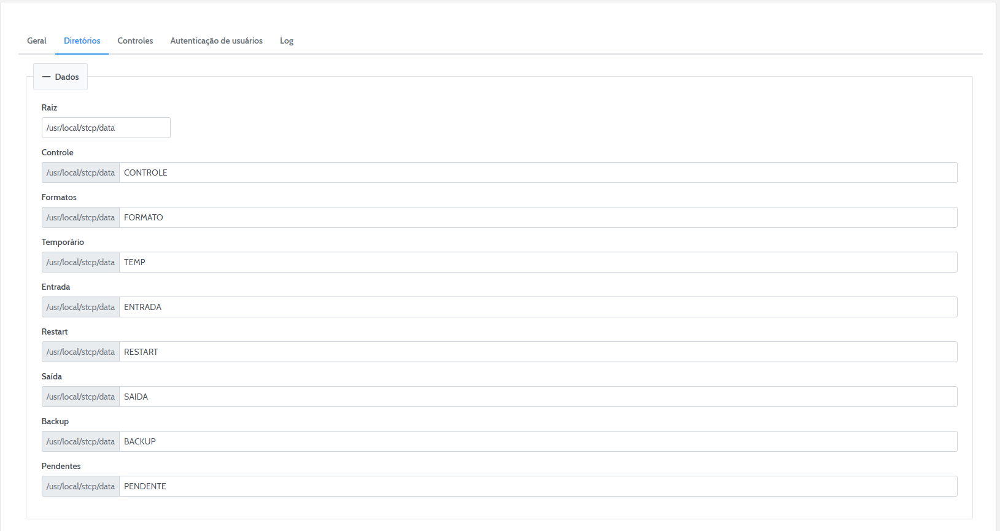
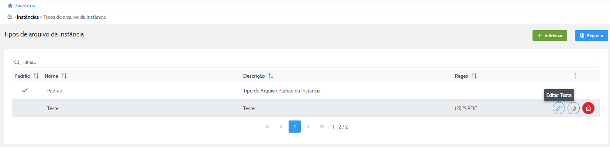
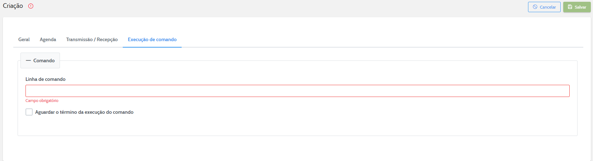

# Funcionalidades do Portal

O portal STCP Gemini é uma aplicação que facilita a configuração do STCP Gemini Server por possuir funcionalidades que vão desde o gerenciamento de instâncias, usuários, agendamentos, etc, até a possibilidade de iniciar conexões entre usuários e checar relatórios de comunição.

# Página do Portal

A instalação do portal pode ser consultada no Procedimento de Implantação do STCP Gemini Server. Após instalá-lo, acesse em seu navegador o Endereço/IP em que foi configurado.

## Seleção do EntryPoint

Para realizar o login será necessário selecionar um EntryPoint na caixa de seleção como mostra a imagem:

Caso não haja nenhum Entrypoint cadastrado ou mais de uma opção, consulte o administrador da rede e verifique qual utilizar.

> [!NOTE] Nota: 
> O EntryPoint é essencial para logar no sistema!

## Login

Durante o primeiro login utilize o operador **stcpadmin** e a senha **Admin**.

> [!NOTE]
> O operador stcpadmin possui permissões de acesso e configuração a todas as entidadoes do portal, contudo ao logar com outros operadores o acesso às funcionalidades descritas neste documento poderá estar disponível ou indisponível.

Ao fazer isso a listagem dos módulos será exibida, sendo eles: Configurador STCP, Admin, e Painel de Controle.

# Módulo Configurador STCP

O módulo Configurador STCP permite ao operador manipular: Configuração de instâncias, serviços de rede, usuários (caixas postais), agendamentos, tipos de arquivos para transferência.

> [!NOTE] Nota: 
> A instância é uma peça chave, por isso não será possível acessar os menus Usuários, Serviços e Agendamentos antes de se selecionar ou criar uma Instância.

Para estabelecer uma conexão são necessários ao menos:

* Uma instância
* Um usuário
* Um serviço de autenticação
* Uma rede de supervisão
* Um nó de supervisão

## Instâncias

As instâncias são as entidades fundamentais para efetuar conexões pois à elas são associados Usuários, Serviços, Tipos de arquivos e Agendamentos.

A seguir encontram-se os passos necessários para criar uma Instância.

Todas as ações do tópico serão explicadas a partir da listagem de instâncias presente no canto esquerdo da tela.

### Adicionar Instâncias

Durante o primeiro login no portal não haverá nenhuma instância cadastrada e por isso algumas mensagens de aviso serão apresentadas.

O cadastro de uma nova instância é realizado clicando em "+ Adicionar" no canto superior direito da tela.

> [!IMPORTANT] Nota: 
> Para facilitar a compreensão e definição dos campos e atributos, o cadastro é dividido em seções e subseções como mostrado nas imagens a seguir:

#### Seção Geral

O primeiro passo para cadastrar uma instância é definir seus atributos de **Identificação**. Segue uma tabela contendo os campos presentes nesta seção e suas especificações:

| Campos                  | Descrição                       | Valores Permitidos           |
|-------------------------|---------------------------------|------------------------------|
| Nome (Obrigatório)      | Nome da Instância               |    -                          |
| Descrição               | Descrição da Instância          |     -                         |
| Sistema Operacional     | Sistema Operacional utilizado. (Linux, MAC OS ou Windows)   |  -    |
| Número de Série (Obrigatório) | Número serial do STCP      | Valores hexadecimais         |

#### Seção Diretórios

**Diretórios de dados:** O segundo passo é definir os atributos para os diretórios de envio e recepção de arquivos, e controles do sistema. Segue abaixo uma tabela explicativa dos campos e suas especificações:

| Campos      | Descrição                                                                                                                                      | Valores Permitidos                        |
|-------------|------------------------------------------------------------------------------------------------------------------------------------------------|-------------------------------------------|
| Raiz (Obrigatório) | Caminho onde a estrutura de pastas da Instância será criada após o início da conexão.                                                   | Alfanuméricos, " / ", " _ ", " . ", " - " |
| Controle    | Nome para a pasta responsável por armazenar arquivos de controle da sessão e conexões realizadas. Nome padrão: CONTROLE                        | Alfanuméricos                             |
| Formatos    | Nome para a pasta que armazenará os formatos do sistema. Nome padrão: FORMATOS                                                                 | Alfanuméricos                             |
| Temporário  | Nome para a pasta onde serão armazenados os arquivos temporários do sistema. Nome padrão: TEMP                                                  | Alfanuméricos                             |
| Entrada     | Nome para a pasta onde os arquivos recebidos serão salvos. Nome padrão: ENTRADA                                                                 | Alfanuméricos                             |
| Restart     | Nome para a pasta onde os arquivos que tiveram seu envio interrompido serão armazenados. Nome padrão: RESTART                                   | Alfanuméricos                             |
| Saída       | Nome para a pasta onde deve-se inserir os arquivos que serão transmitidos. Nome padrão: SAIDA                                                   | Alfanuméricos                             |
| Backup      | Nome para a pasta onde uma cópia dos arquivos enviados e recebidos são armazenados a fim de garantir que haja um backup caso seja necessário. Nome padrão: BACKUP | Alfanuméricos                 |
| Pendentes   | Nome para a pasta onde os arquivos que ainda estão sendo recebidos ficam temporariamente salvos. Nome padrão: PENDENTES                         | Alfanuméricos                             |

#### Seção Controles

**Controle de Agenda:** O terceiro passo ao cadastrar uma instância é configurar alguns atributos do agendamento, entre eles: 

* Habilitar ou desabilitar o controle dos agendamentos cadastrados para os usuários da instância.
* Definir o intervalo em que o controle da agenda entrará em ação. Este intervalo de tempo é dado em **milissegundos**.

**Controle de Lock:** O quarto passo é configurar atributos de reinicialização de conexões e transmissões de arquivos. Segue abaixo a tabela explicativa dos campos e suas especificações:

| Campos                          | Descrição                                                                              | Valores Permitidos        |
|---------------------------------|----------------------------------------------------------------------------------------|---------------------------|
| Habilitar                       | Chave para habilitar ou desabilitar o "Controle de Lock" da instância                  | Habilitado / Desabilitado |
| Tempo de espera para nova tentativa de lock | Tempo entre tentativas de lock, dado em milissegundos.                           | Numéricos                 |
| Máximo de tentativas de lock    | Número máximo de tentativas de lock realizadas pelo sistema.                           | Numéricos                 |
| Timeout de lock de sessão       | Tempo máximo, em milissegundos, em que o sistema permanecerá realizando tentativas de lock. | Numéricos                 |

**Controle de sessões simultâneas:** Em seguida configura-se o numero máximo de sessões abertas simultaneamente para a instância.

**Outros controles:** A última configuração da seção **Controles** é a definição dos seguinte parâmetros:

| Campos                        | Descrição                                                                 | Valores Permitidos              |
|-------------------------------|---------------------------------------------------------------------------|---------------------------------|
| Máximo de Mensagens no Console | Número máximo de mensagens que serão apresentadas nos logs do Portal      | Numéricos maiores ou iguais a 50 |
| Máximo de Processos Assíncronos| Número máximo de processos assíncronos que serão permitidos na Instância  | Numéricos                       |

#### Autenticação de Usuários

As configurações da seção de autenticação são responsáveis por definir qual banco de dados será utilizado pela instância e quais políticas de senha deverão ser seguidas.

**Configurações Básicas:** Inicialmente, deve-se configurar a biblioteca utilizada para o banco de dados e
qual será o tipo de autenticação, como pode ser observado na tabela a seguir:

| Campos                        | Descrição                                                                                      | Valores Permitidos          |
|-------------------------------|------------------------------------------------------------------------------------------------|-----------------------------|
| Biblioteca (Obrigatório)       | Biblioteca utilizada para o carregamento do banco de dados no início da conexão.              | No momento "MYSQL/MARIADB"  |
| Tipo Autenticação              | Formato utilizado na autenticação do banco de dados da instância quando a conexão for iniciada.| No momento "STCP"           |

**Base de Dados:** Em seguida configura-se a **Base de Dados**, nela são inseridas informações do banco de dados utilizado. Veja seus campos e especificações na tabela a seguir:

| Campos                      | Descrição                                                        | Valores Permitidos       |
|-----------------------------|------------------------------------------------------------------|--------------------------|
| Nome do banco de dados       | Nome do banco de dados que será utilizado para configuração      |                          |
| Endereço                    | Endereço do Banco de dados                                       |                          |
| Porta                       | Porta para o acesso ao banco de dados. Valor padrão: 3306        | Somente números           |
| Usuário                     | Usuário do banco de dados para acessá-lo.                        |                          |
| Senha                       | Senha do usuário do banco de dados.                              |                          |
| Confirmar                   | Confirmação da senha do banco de dados.                          |                          |

> [!CAUTION] Atenção
> Nesta subseção todos os parâmetros são obrigatórios!

**Políticas de senhas:** Também podem ser alteradas as **Políticas de senha**, sua utilização não é obrigatória, porém recomenda-se aplicá-las por questões de segurança. Segue uma tabela explicativa dos campos desta subseção e suas especificações:

| Campos                          | Descrição                                                                                                          | Valores Permitidos       |
|---------------------------------|--------------------------------------------------------------------------------------------------------------------|--------------------------|
| Habilitar                        | Chave para habilitar/desabilitar as políticas de senha para os usuários dessa instância.                           | Habilitado / Desabilitado |
| Comprimento mínimo da senha      | Quantidade mínima de caracteres da senha                                                                           | Comprimento mínimo de 5 e máximo 8 |
| Tempo de vida máximo da senha    | Quantidade de tempo, em dias, em que a senha dos usuários poderá ser utilizada antes que seja necessário resetá-las | Numéricos                 |
| Número máximo de falhas          | Quantidade de vezes em que o usuário poderá errar a senha sem que seja bloqueado                                   | Numéricos                 |
| Forçar histórico de senhas     | Quantidade de senhas já utilizadas anteriormente e que não podem ser reutilizadas durante a criação de uma nova     | Numéricos                 |
| Pelo menos um caractere minúsculo| Caso seja habilitada, esta opção obrigará que a senha do usuário possua pelo menos um caractere minúsculo           | Habilitado / Desabilitado |
| Pelo menos um caractere maiúsculo| Caso seja habilitada, esta opção obrigará que a senha do usuário possua pelo menos um caractere maiúsculo           | Habilitado / Desabilitado |
| Pelo menos um dígito             | Caso seja habilitada, esta opção obrigará que a senha do usuário possua pelo menos um dígito                        | Habilitado / Desabilitado |
| Pelo menos um caractere especial | Caso seja habilitada, esta opção obrigará que a senha do usuário possua pelo menos um caractere especial            | Habilitado / Desabilitado |

#### Log 

A sessão Log é responsável pelo gerenciamento das mensagens de eventos. Segue abaixo suas subseções:

**Configurações Básicas:** Inicialmente, deve-se configurar a biblioteca utilizada para o banco de dados e
qual será o tipo de autenticação, como pode ser observado na tabela abaixo:

| Campos                        | Descrição                                                                                      | Valores Permitidos          |
|-------------------------------|------------------------------------------------------------------------------------------------|-----------------------------|
| Biblioteca       | Biblioteca utilizada para o carregamento do banco de dados no início da conexão.              | No momento "MYSQL/MARIADB"  |

**Base de dados:** Nesta subseção configura-se o banco de dados que armazenará os logs da aplicação.

| Campos    | Descrição                                                         | Valores Permitidos          |
|-----------|-------------------------------------------------------------------|-----------------------------|
| Nome do banco de dados | Nome do Banco de dados que armazenará os Logs.                    |                             |
| Endereço      | Endereço do Banco de dados                                        |                             |
| Porta     | Porta de acesso ao banco. Valor padrão: 3306                      | Somente números             |
| Usuário   | Usuário do banco de dados.                                        |                             |
| Senha     | Senha do usuário do banco de dados.                               |                             |
| Confirmar | Confirmação da senha do banco de dados.                           |                             |

> [!CAUTION] Atenção
> Nesta subseção todos os parâmetros são obrigatórios!

> [!WARNING] Aviso
> O banco de dados utilizado para os Logs não precisa ser o mesmo definido na autenticação.

**Nível de log das mensagens de eventos:** No cadastro dos logs também há essa subseção, onde são definidos quais logs serão gravados no banco de dados, quais serão mostrados no próprio Console Log do sistema e os comandos externos a serem executados.

| Campos                  | Descrição                                                                                                                                 | Valores Permitidos        |
|-------------------------|-------------------------------------------------------------------------------------------------------------------------------------------|---------------------------|
| Gravar no Banco de dados | Define quais logs serão salvos no banco de dados de acordo com o número escolhido. Cada número possui tipos de logs definidos, que podem ser consultados através das mensagens em azul ao lado direito do campo. | Numerais dentre 0 e 8      |
| Apresentar na console do STCP | Define quais logs serão mostrados no console do sistema, porém estes não serão salvos no banco de dados.                                      | Numerais dentre 0 e 8      |
| Executar comando externo | Nível de evento que disparará um comando (programa ou bat) externo.                                                                       | Numerais dentre 0 e 8      |
| Comando Externo          | Campo de cadastro do script com o comando externo que será executado.                                                                     | Insira o caminho onde o script com o comando está salvo. |

**Filtros de mensagem de evento:** Os últimos campos antes de concluir o cadastro da Instância são:

| Campos  | Descrição                                                                                                                                   | Valores Permitidos |
|---------|---------------------------------------------------------------------------------------------------------------------------------------------|--------------------|
| Aceitar | Campo utilizado para criar um filtro das mensagens mostradas nos logs. Pode-se criar um filtro para que apenas mensagens de um determinado usuário sejam mostradas. |                    |
| Rejeitar | Campo utilizado para criar um filtro das mensagens que não serão mostradas nos logs. Pode-se criar um filtro para que apenas mensagens de um determinado usuário sejam rejeitadas. |                    |

Finalmente, para adicionar a Instância e concluir o cadastro, clique em **Salvar**.

### Editar Instâncias

Caso precise editar algum parâmetro de uma instância já criada, acesse a lista de Instâncias e clique no ícone de edição presente à direita.

Já na página de edição, altere os atributos desejados e salve as modificações ao final. Em caso de dúvidas leia
a descrição dos campos novamente no tópico de Adicionar Instâncias

> [!WARNING] Aviso
> O campo **Nome:** da Instância não pode ser alterado!

### Copiar Instâncias

A cópia ou exibição das instâncias é realizada através do menu de opções indicado por uma seta ao lado direito
da tela. Para executar uma dessas ações, clique neste ícone a função **Copiar** como mostrado na imagem a seguir:

> [!IMPORTANT] Nota: 
> Ao selecionar a função copiar você será direcionado a uma tela semelhante a de edição, nela já constarão as informações da instância copiada exceto o nome. Modifique os campos que julgar necessário, digite o nome da nova instância e salve-a.

### Remover Instâncias

Para remover uma Instância existente, deve-se acessar as opções ao lado direito da Instância a ser removida e clicar em **Excluir**. Remover instâncias é um procedimento que deve ser realizado com cautela pois, como dito anteriormente, à elas estão associados Usuários, Tipos de arquivo e Agendamentos.

### Adicionar tipos de arquivo

Os tipos de arquivo são utilizados tanto na transmissão quanto recepção de arquivos em uma conexão. Sua função é realizar tratativas como conversões de nome, formato, etc.

Para criar um novo tipo de arquivo acesse o menu de opções indicado pela seta.

Em seguida, clique em **+ Adicionar**.

**Identificação**

As primeiras informações a serem cadastradas na criação dos Tipos de Arquivo são seu nome, descrição e Tags que serão adicionadas ao nome dos arquivos tratados.

**Informações**

Nesta seção serão descritas as **Informações** do tipo de arquivo criado, entre elas se o tipo de arquivo fará tratativas **Padrão** ou através de uma **Expressão Regular**.

* **Tratativas Padrão**: Apesar de constar tal campo como possível seleção, ao criar uma instância o sistema atribuirá a ela um tipo de arquivo com tratativas padrão automaticamente. Por não ser possível existir 2 padrões, esta seleção se encontrará sempre bloqueada.

* **Tratativas por Expressão Regular:** Este tipo de tratativa será feita baseando-se no nome do arquivo transmitido, incluindo seu formato. Por exemplo, caso deseje que arquivos no formato TXT crie uma tratativa que busque pela expressão "txt" no campo Regex.

* **Tipo de Arquivo Expressão Regular (Regex)**.
  

**Transmissão:** Nesta subseção configuram-se os parâmetros dos arquivos verificados pela tratativa durante o envio. Segue abaixo uma tabela explicativa contento tais parâmetros e suas especificidades:

| Atributo                    | Descrição                                                                                                                                                      | Valores Permitidos                        |
|-----------------------------|----------------------------------------------------------------------------------------------------------------------------------------------------------------|-------------------------------------------|
| Desabilitar                 | Desabilitação de todas as tratativas realizadas durante a transmissão de um arquivo                                                                             | Desabilitar/Manter                        |
| Executar comando externo    | Campo utilizado para inserir o caminho de scripts de comandos que devem ser executados na transmissão dos arquivos                                              |                                           |
| Aguardar o término da execução do comando | Opção utilizada para que o sistema possa aguardar a execução do comando externo definido acima ao transmitir os arquivos                          |                                           |
| Origem                      | Odette ID da origem da transmissão                                                                                                                              |                                           |
| Destino                     | Odette ID de destino da transmissão                                                                                                                             |                                           |
| Userdata                    | Inserção de dados de transmissão que podem ser úteis para outras aplicações                                                                                     |                                           |
| Formato de registro         | Escolha do formato de registro utilizado                                                                                                                        | Não Formatado; Stream (SFTP); Fixo; Variável; Texto |
| Tamanho de registro         | Tamanho dos registros armazenados                                                                                                                               | Numerais                                  |
| Converte nome de arquivo    | Seleção da conversão do nome do arquivo antes de transmitir.                                                                                                    | Não; Maiúscula; Minúscula                 |
| Remover CRLF                | Habilitação/Desabilitação da remoção dos caracteres CR (Carriage Return) e LF (Line Feed) na transmissão do arquivo                                              | -.                                        |
| CR                          | Número na tabela de caracteres referente ao Carriage Return                                                                                                     | Numerais                                  |
| LF                          | Número na tabela de caracteres referente ao Line Feed                                                                                                           | Numerais                                  |
| Tabela de conversão de dados| Tabela de conversão dos dados entre os tipos de formatos                                                                                                        | -.                                        |
| Remover timestamp           | Habilita/Desabilita a remoção de timestamp do arquivo transmitido                                                                                               | Chave selecionável                        |
| Backup                      | Habilita/Desabilita Backup dos arquivos transmitidos                                                                                                            | Chave selecionável                        |

> [!NOTE] Notas: 
> Somente utilize a opção Remover CRLF quando o formato do registro for Fixo ou Variável.
> Ao escolher um formato de registro Fixo será necessário informar o Tamanho do registro.

**OFTP2:** Nesta subseção configuram-se os parâmetros dos arquivos que utilizam o protocolo OFTP 2 na comunicação com foco na segurança dos arquivos que serão transmitidos. Segue a tabela com os parâmetros e suas funcionalidades:

| Atributo        | Descrição                                                                                            | Valores Permitidos                                 |
|-----------------|------------------------------------------------------------------------------------------------------|---------------------------------------------------|
| Nível de Segurança | Seleção do tipo nível do arquivo de transmissão                                                       | Níveis disponíveis: Desabilitado; Encriptado; Assinado; Encriptado e Assinado |
| Cipher Level    | Cifra de criptografia utilizada                                                                        |                                                   |
| Comprimido      | Parâmetro de informação referente ao protocolo OFTP2 do arquivo a ser transmitido.                     | Chave selecionável                                |
| Envelopado      | Parâmetro de informação referente ao protocolo OFTP2 constando se o arquivo foi criptografado          | Chave selecionável                                |
| EERP Signed     | Habilitação/Desabilitação de assinatura na resposta de arquivo recebido pelo Destino                    | Chave selecionável                                |

**Recepção:** Nesta subseção configuram-se os parâmetros dos arquivos verificados pela tratativa durante a recepção. Segue abaixo uma tabela explicativa contendo suas especificidades:

| Atributo                      | Descrição                                                                                                    | Valores Permitidos                  |
|-------------------------------|--------------------------------------------------------------------------------------------------------------|-------------------------------------|
| Desabilitar                   | Desabilitação de todas as tratativas realizadas durante a recepção de um arquivo                              | Desabilitar/Manter                  |
| Executar comando externo      | Campo utilizado para inserir o caminho de scripts de comandos que devem ser executados na transmissão dos arquivos |                                     |
| Aguardar término da execução do comando | Opção utilizada para que o sistema possa aguardar a execução do comando externo ao receber os arquivos    |                                     |
| Tabela de conversão de dados  | A expressão regular que irá definir qual extensão de arquivos seguirá as condições definidas neste tipo de arquivo | -                                   |
| Converte nome de arquivo      | Seleção da conversão do nome do arquivo ao recebê-lo                                                           | Não; Maiúscula; Minúscula           |
| Inserir CRLF                  | -                                                                                                             |                                     |
| Caracter CR RX                | -                                                                                                             |                                     |
| Caracter LF RX                | -                                                                                                             |                                     |
| Inserir timestamp             | Opção utilizada para que o sistema adicione um timestamp com as informações de horário ao receber arquivos     |                                     |
| Sobrepor arquivo              | -                                                                                                             |                                     |
| Desabilitar log de arquivo duplicado | -                                                                                                     |                                     |
| Marcar arquivo recebido com data e hora local | -                                                                                          |                                     |

**Execução de comando externo de validação**

Nesta seção, informa-se sobre a execução de comandos externos após a validação dos arquivos.

| Atributo                        | Descrição                                                          |
|---------------------------------|--------------------------------------------------------------------|
| Validar o arquivo antes de transmitir | Caminho para o arquivo contendo os scripts de validação           |
| Validar o arquivo antes de receber    | Caminho para o arquivo contendo os scripts de validação           |
| Validar o arquivo após receber        | Caminho para o arquivo contendo os scripts de validação           |

**Período de transferência**

A última seção define os períodos de transferência de arquivos na instância. Segue uma tabela contendo os
campos que devem ser configurados:

| Atributo    | Descrição                                                                             | Valores Permitidos |
|-------------|---------------------------------------------------------------------------------------|--------------------|
| Início      | Horário de início em que será permitido transferir arquivos.                          | Numéricos          |
| Término     | Horário de término em que será permitido transferir arquivos.                         | Numéricos          |
| Dias da Semana | Define em quais dias a transferência de arquivos será permitida.                     | Seleção            |

Finalmente, para adicionar o novo Tipo de Arquivo à Instância e concluir o cadastro, clique em **Salvar**.

> [!NOTE] Nota: 
> Os tipos de arquivos são mostrados separadamente de acordo com a Instância em que foram criados.

### Editar Tipos de Arquivo

Para editar um tipo de arquivo de uma instância, clique no ícone de edição como mostrado abaixo.

Após acessar a edição, altere os atributos desejados e salve as alterações.

> [!WARNING] Atenção: 
> Não é possível alterar o nome de um tipo de arquivo definido como Padrão.

### Copiar Tipos de Arquivo

Para copiar um tipo de arquivo de uma instância, acesse o menu de seleção clicando na seta e selecione o campo desejado

> [!NOTE] Nota:
> Ao clicar em **Copiar**, os campos do Tipo de Aquivo ficarão desabilitados.

### Remover Tipos de Arquivo

Para remover um tipo de arquivo acesse o menu de seleção clicando na seta e selecionando a opção **Excluir**

Clique em **Sim** ao ser questionado.

> [!WARNING] Aviso
> Obs.: Não é possível remover o Tipo de Arquivo padrão da Instância.

## Configurações de Redes

Redes são utilizadas nos processos de transferência em diversos âmbitos. Para configurá-las utilize o módulo STCP, nele será possível **Adicionar**, **Editar**, **Copiar**, **Exibir** e **Remover Redes**.

### Adicionar Rede OFTP

Para adicionar um serviço clique em **+Adicionar**. 

Ao fazer isso, será apresentada a tela para criar uma nova: 

> [!NOTE] Nota: 
> A divisão do formulário entre Seções e Subseções continuará sendo utilizada da mesma forma que durante o cadastro de Instâncias.

#### Aba Geral

**Identificação da nova Rede**

A primeira subseção a ser preenchida é a **Identificação**.

> [!NOTE] Nota: 
> As Redes podem ser do tipo OFTP, Supervisão (Gemini e DirectLink), API (DirectLink) sendo que a primeira é utilizada durante transferências de arquivos entre usuários, autenticação das Instâncias, etc, e a segunda para visualizar logs do sistema no console do Portal.

Siga a tabela abaixo para facilitar a inserção de dados:

| Campo       | Descrição                                      | Valores Permitidos    |
|-------------|------------------------------------------------|-----------------------|
| Desabilitado| Habilita/Desabilita a Rede                     | Chave selecionável    |
| Tipo        | Seleção do tipo de Rede entre OFTP, SFTP, API e Supervisão | Chave selecionável    |
| Nome        | Nome da Rede                                   | Auto atribuído pelo sistema |
| Descrição   | Descrição da Rede                              |                       |

> [!WARNING] Avisos:
> Caso uma Rede seja bloqueada nenhuma conexão poderá ser inicializada por ela.
> O nome da Rede é automaticamente atribuído pelo sistema, seguindo o padrão:
> - Redes do tipo OFTP: TCPIP_<Numero_da _rede>
> - Redes do tipo SUPERVISÃO: TCPIP_SUP_<Numero_da_rede>

#### Aba Comunicação

Na aba de **Comunicação** as subseções a serem preenchidas são: **Interface local**, **Opções** e **TLS**.

| Atributo   | Descrição                                                                                     | Valores Permitidos    |
|------------|------------------------------------------------------------------------------------------------|-----------------------|
| TCP v4 ou v6     | Habilitação/Desabilitação do protocolo IPv6 para a Rede.                                        | Chave selecionável    |
| Endereço IP| Endereço IP da Interface Local utilizada para comunicar-se com o serviço OFTP. Parâmetro obrigatório |                       |
| Porta IP   | Porta IP habilitada na Interface local para comunicação com a Rede. Parâmetro obrigatório       | Numerais              |
| Nível de debug | Informa o nível de detalhamento em que os logs serão capturados na Interface Local         |                       |

> [!TIP] Dica: 
> Para que o sistema busque qualquer Interface Local disponível, preencha o campo Endereço IP com o valor "0.0.0.0"

| Atributo        | Descrição                                                                                                      | Valores Permitidos                         |
|-----------------|----------------------------------------------------------------------------------------------------------------|--------------------------------------------|
| Biblioteca      | Biblioteca utilizada para a comunicação da Rede. (Padrão STCPLib Net OpenSSL)                                   |                                            |
| Compressão GZIP | Habilitação/Desabilitação da compressão dos arquivos ao enviá-los.                                              | Chave selecionável                         |
| TCP Max Listen  | Número máximo de processos que serão executados na fila do protocolo TCP/IP. Este campo é utilizado para controlar todos os processos que são executados simultaneamente na conexão. | Numerais                                   |
| Compatibilidade | Define o padrão de compatibilidade da Rede com outras aplicações.                                               | Seleção entre: RFC2204, RFC 1006/1086, RVS*, X.25/Router e XFB*/SSL |

**TLS - Chave Privativa**

| Atributo  | Descrição                                                                                           | Valores Permitidos                 |
|-----------|-----------------------------------------------------------------------------------------------------|------------------------------------|
| TLS       | Habilita/Desabilita o cadastro da chave privativa TLS para a Rede.                                   | Chave selecionável                 |
| Chave     | Chave TLS utilizada para a comunicação da Rede.                                                      | Quaisquer valores exceto espaço    |
| Certificado| Certificado utilizado para a validação da Chave TLS.                                                |                                    |
| Senha     | Senha da chave TLS que será verificada na comunicação da Rede.                                       | Quaisquer valores exceto espaço    |
| Confirmar | Confirmação da senha da chave TLS                                                                    | Mesmo valor inserido como Senha    |

> [!WARNING] Aviso
> Os campos Chave e certificado são obrigatórios caso a chave TLS esteja habilitada.

**TLS- Certificados CA (Autoridades)**

| Atributo  | Descrição                                                           | Valores Permitidos         |
|-----------|---------------------------------------------------------------------|----------------------------|
| Arquivo   | Nome do arquivo que contém o certificado TLS utilizado na Rede.     | Formato do arquivo: .cer   |
| Diretório | Diretório onde o arquivo do certificado TLS está salvo.             | Caracteres de caminho de arquivo |

**TLS- Opções**

| Atributo                  | Descrição                                                                                                       | Valores Permitidos       |
|---------------------------|-----------------------------------------------------------------------------------------------------------------|--------------------------|
| Verificar certificado      | Opção utilizada para forçar a Rede a checar o certificado dos usuários que se conectarem a ele.                 | Chave selecionável        |
| Habilitar versões anteriores do SSL | Opção utilizada para que os certificados em versões antigas do SSL sejam habilitados para uso. É recomendado que essa opção não seja habilitada. | Chave selecionável        |
| Arquivo DH                | Campo utilizado para cadastrar um arquivo DH na Rede. É recomendado que essa opção não seja habilitada.          |                          |
| Algoritmos                | Caixa de seleção dos tipos de algoritmos usados para a Rede. Pode-se selecionar qualquer um dos algoritmos disponíveis ou deixar em branco para que o melhor algoritmo seja definido automaticamente. |                          |
| Nível de debug            | Campo de definição do nível de debug dos eventos de TLS da Rede.                                                 | Numerais                 |

A terceira seção a ser preenchida varia a depender do tipo de Rede escolhida, segue abaixo tabelas explicativas para facilitar o preenchimento das informações em ambos os casos.

#### Rede OFTP

| Atributo            | Descrição                                                                                                      | Valores Permitidos                          |
|---------------------|---------------------------------------------------------------------------------------------------------------|---------------------------------------------|
| Biblioteca          | Biblioteca utilizada para a Rede OFTP. Padrão: STCP Lib Transfer OFTP ou Lib Transfer SFTP.                    |                                             |
| OFTP Level          | Seleção do nível do protocolo OFTP utilizado                                                                   | Opções disponíveis: 1.2, 1.3, 1.4, 2.0     |
| Créditos            | Número de pacotes de dados enviados de forma a controlar a banda utilizada na transmissão.                     | Numerais                                    |
| Tamanho do buffer   | Tamanho, em bytes, dos pacotes de dados enviados.                                                              | Numerais                                    |
| Tempo de inatividade| Tempo, em segundos, em que a Rede permanecerá inativa e aceitará reabrir a transmissão caso haja interrupção.  | Numerais                                    |
| Nível de debug      | Informa o nível de detalhamento em que os logs da Rede serão listados pelo sistema no Console Info e arquivos de log. | Numerais                                    |

> [!WARNING] Aviso: 
> Em uma transferência, o emissor poderá enviar o número de pacotes de dados informados para o parâmetro créditos antes de o receptor confirmar que está apto para receber a transmissão e que os dados serão recebidos com sucesso.

Para concluir o processo de cadastro da Rede, clique em **Salvar** como mostrado na imagem a seguir.

### Editar Redes

Para editar uma Rede, acesse a lista de Redes em: **Redes** e depois **Editar**, como mostra a imagem.

Após acessar a edição, altere os campos desejados e salve as alterações.

> [!CAUTION] Aviso: 
> O campo **Nome** da Rede não pode ser alterado!

### Copiar Redes

A cópia ou exibição das Redes é realizada através do menu de opções ao lado da Rede desejada na lista de Redes. Para executar uma dessas ações, clique no ícone de opções ao lado de uma Rede e escolha a função **Copiar** como mostrado na imagem a seguir:

### Remover Redes

Para remover uma Rede, siga os passos:

* Acesse a lista de Redes;
* Acesse os menus de seleção em uma Rede desejada clicando na seta e selecionando a opção **Excluir** 

* Clique em **Sim** ao ser questionado por *Tem certeza que deseja remover a rede [Nome_da_rede]?*
  

## Configurações de Usuários

### Adicionar Usuário

O STCP Gemini Portal permite criar novos Usuários acessando o menu lateral em **Usuários** e clicando em **+Adicionar**.

> [!NOTE] Nota:
> Para facilitar a compreensão e definição dos campos e atributos, o cadastro é dividido em seções e subseções como mostrado na imagem a seguir:

#### Seção Geral

**Identificação do Usuário**

A primeira seção a ser preenchida é a de identificação. Segue uma tabela descrevendo quais informações do usuário devem ser inseridas e suas especificidades:

| Campo             | Descrição                                                            | Valores Permitidos                |
|-------------------|----------------------------------------------------------------------|-----------------------------------|
| Desabilitado      | Bloqueia o usuário de realizar conexões e transferir arquivos.        | Chave selecionável                |
| Nome (Obrigatório)| Nome do Usuário a ser cadastrado.                                     | Quaisquer valores exceto espaço   |
| Descrição         | Descrição do usuário que está sendo criado.                          |                                   |
| E-mail            | E-mail válido do usuário                                              | Email no formato nome@email.com   |
| Senha (Obrigatório) | Senha para o usuário                                                |                                   |
| Confirmar (Obrigatório) | Confirmação da senha definida anteriormente.                   | Mesmo valor inserido para a senha |

> [!NOTE] Nota: 
> Ao criar a senha do usuário, deve-se seguir as políticas de senha definidas na criação de Instâncias. Pode-se visualizar abaixo que as políticas estão sendo seguidas nos campos **Senha** e **Confirmar**.

#### Seção Características 

**Protocolo para conexão de saída**

A segunda seção a ser cadastrada é a de características. Segue abaixo uma tabela explicativa dos campos que devem ser preenchidos:

| Campo                     | Descrição                                                                                               | Valores Permitidos            |
|---------------------------|---------------------------------------------------------------------------------------------------------|-------------------------------|
| Protocolo     | Definição de qual protocolo será utilizado na conexão                               |  Chave selecionável  |
| Backup arquivos transmitidos          | Chave utilizada para que os arquivos enviados pelo usuário sejam
salvos na pasta BACKUP do sistema.                                             | Chave selecionável                      |
| Senha nunca expira | Permite que a senha do usuário nunca expire e não tenha
necessidade de ser alterada.     | Chave selecionável             |
| Transmissão otimizada | Permite que usuário envie arquivos de sua pasta Saída ao receber uma conexão     | Chave selecionável             |

> [!WARNING] Aviso: 
> Só é possível adicionar um tipo de arquivo previamente criado.

> [!WARNING] Aviso: 
> Os tipos de arquivo do usuário possuem prioridade em relação aos da instância, ou seja, as tratativas definidas na instância só ocorrerão caso não haja nenhuma tratativa definida para o usuário utilizado na transferência.

#### Seção Controles 

A terceira seção a ser preenchido é a de **Controle de Conexão**, que  possibilita a utilização de filtros de conexão, execução de comandos antes, ao iniciar e ao finalizar conexões e requisição de espera por parte do sistema até o términode execução de um comando.

| Campo                        | Descrição                                                                                                      | Valores Permitidos                |
|------------------------------|----------------------------------------------------------------------------------------------------------------|-----------------------------------|
| Máximo de sessões             | Configura-se o numero máximo de sessões abertas simultaneamente para o usuário.   | Numerais |
| Filtro de Conexão             | Expressão regular que filtra os arquivos transferidos em uma conexão                                            | Deve-se inserir uma expressão regular para que os arquivos sejam filtrados na conexão |
| Executar comando antes da conexão | Definir um comando que será executado antes da conexão do usuário ser iniciada                              | Deve-se inserir o caminho do script que executará a conexão |
| Aguardar o término da execução do comando | Habilita/Desabilita que o sistema aguarde o término da execução do comando definido no campo anterior | Chave selecionável                |
| Executar comando no início da conexão | Habilita/Desabilita que o sistema aguarde o término da execução do comando definido no campo anterior | Chave selecionável                |
| Executar comando no fim da conexão | Definir um comando que será executado ao finalizar a conexão do Usuário                                    | Deve-se inserir o caminho do script que executará a conexão |
| Aguardar o término da execução do comando | Habilita/Desabilita que o sistema aguarde o término da execução do comando definido no campo anterior | Chave selecionável                |

**Período de Conexão**

A próxima subseção a ser preenchida é a de **Período de Conexão**, ela permite definir um período de tempo em que a conexão pode ser realizada pelo Usuário. Segue abaixo uma tabela explicativa contendo os campos e suas especificidades.

| Campo        | Descrição                                                                       | Valores Permitidos                                               |
|--------------|---------------------------------------------------------------------------------|------------------------------------------------------------------|
| Hora Início  | Define a partir de qual horário a conexão do Usuário poderá ser realizada.       | Numerais                                                         |
| Hora Término | Define o horário final, ou até quando a conexão do Usuário poderá ser realizada. | Numerais                                                         |
| Dias da Semana | Define os dias da semana em que poderá iniciar-se uma conexão                    | Valores permitidos: Dom., Seg., Ter., Qua., Qui., Sex. e Sáb.     |
| Padrão       | Reseta o período de conexão padrão do sistema.                                   | Define o horário de início como **00:00:00**, o Horário de Término para **23:59:59** e todos os dias da semana serão selecionados |

As últimas subseções de cadastro dos Usuários são responsáveis pelas configurações dos arquivos transmitidos e recebidos pelo Usuário. Segue as tabelas das subseções contendo os campos e suas especificidades:

**Controle de arquivos na transmissão**

| Campo                        | Descrição                                                                    | Valores Permitidos  |
|------------------------------|-------------------------------------------------------------------------------|---------------------|
| Filtro de arquivos            | Expressão regular que filtra os arquivos transmitidos pelo usuário em uma conexão |                     |
| Tamanho mínimo                | Define o tamanho mínimo dos arquivos enviados em pacotes de 1024 Bytes.       | Numerais            |
| Tamanho máximo                | Define o tamanho máximo dos arquivos enviados em pacotes de 1024 Bytes.       | Numerais            |
| Enviar ID local do arquivo no campo Userdata | Esta opção permite que o ID local do arquivo seja enviado no campo Userdata. |                     |

> [!NOTE] Nota: 
> Cálculo do tamanhos mínimo e máximo dos arquivos:  
> A definição dos tamanhos de arquivos e a análise dos arquivos transmitidos e recebidos são realizadas a partir de pacotes de **1024 Bytes**. Configurando o campo "Tamanho mínimo:" com um valor x , o sistema realizará o seguinte cálculo:

| Campo             | Descrição                                                                                                                |
|-------------------|--------------------------------------------------------------------------------------------------------------------------|
| Tamanho Mínimo    | Valor em pacotes de 1024 Bytes                                                                                           |
| Valor múltiplo de 1024 Bytes | O sistema irá considerar o valor exatamente como está no campo "Tamanho Mínimo".                                |
| Valor não múltiplo de 1024 Bytes | O sistema irá pegar o valor do cálculo valor/1024 = (valor arredondado para o próximo número inteiro acima do número decimal * 1024), e este será o valor do tamanho mínimo considerado pelo sistema. |

> [!NOTE] Nota: 
> Ou seja, definindo o **Tamanho mínimo** como **1 Byte**, o sistema irá fazer o cálculo de **1/1024 = 0,00097** aproximadamente. Esse número será arredondado para 1 (número inteiro mais próximo acima do número decimal) e porfim, irá multiplicá-lo por 1024 (1*1024), logo, o **tamanho mínimo** deverá ser 1024 Bytes.

* Exemplos de Configurações dos Arquivos: 

| Tamanho Mínimo                   | Tamanho do Arquivo a ser Transferido | Resultado                                                                                                                      |
|----------------------------------|--------------------------------------|--------------------------------------------------------------------------------------------------------------------------------|
| Qualquer valor entre 1 e 1024 inclusive  | Arquivo com tamanho menor ou igual a 1023 | A transferência será bloqueada, pois o arquivo tem menos de 1024 Bytes, que é o resultado da conta [(1 ≤ número ≤ 1023) / 1024] RESULTADO ARREDONDADO PARA CIMA ATÉ O PRIMEIRO NÚMERO INTEIRO (neste caso será 1) * 1024. |
| Qualquer valor entre 1024 e 2048 inclusive | Arquivo com tamanho menor ou igual a 2047 | A transferência será bloqueada, pois o arquivo tem menos de 2048 Bytes, que é o resultado da conta [(1025 ≤ número ≤ 2047) / 1024] RESULTADO ARREDONDADO PARA CIMA ATÉ O PRIMEIRO NÚMERO INTEIRO (neste caso será 2) * 1024. |
| Qualquer valor entre 2049 e 3071 inclusive | Arquivo com tamanho menor ou igual a 3071 | A transferência será bloqueada, pois o arquivo tem menos de 3072 Bytes, que é o resultado da conta [(2049 ≤ número ≤ 3071) / 1024] RESULTADO ARREDONDADO PARA CIMA ATÉ O PRIMEIRO NÚMERO INTEIRO (neste caso será 3) * 1024. |

| Tamanho Máximo                   | Tamanho do Arquivo a ser Transferido | Resultado                                                                                                                      |
|----------------------------------|--------------------------------------|--------------------------------------------------------------------------------------------------------------------------------|
| Qualquer valor entre 1 e 1024 inclusive  | Arquivo com tamanho maior que 1024       | A transferência será bloqueada, pois o arquivo é maior ou igual a 1024 Bytes, que é o resultado da conta [(1024 ≥ número) / 1024] RESULTADO ARREDONDADO PARA CIMA ATÉ O PRIMEIRO NÚMERO INTEIRO (neste caso será 1) * 1024. |
| Qualquer valor entre 1024 e 2048 inclusive | Arquivo com tamanho maior que 2048       | A transferência será bloqueada, pois o arquivo é maior ou igual a 2048 Bytes, que é o resultado da conta [(1024 ≥ número) / 1024] RESULTADO ARREDONDADO PARA CIMA ATÉ O PRIMEIRO NÚMERO INTEIRO (neste caso será 2) * 1024. |
| Qualquer valor entre 1 e 1024 inclusive  | Arquivo com tamanho maior que 1023       | A transferência será bloqueada, pois o arquivo é maior ou igual a 1024 Bytes, que é o resultado da conta [(1024 ≥ número) / 1024] RESULTADO ARREDONDADO PARA CIMA ATÉ O PRIMEIRO NÚMERO INTEIRO (neste caso será 1) * 1024. |

**Controle de arquivos na recepção**

| Campo                         | Descrição                                                              | Valores Permitidos                        |
|-------------------------------|------------------------------------------------------------------------|-------------------------------------------|
| Filtro de arquivos             | Expressão regular que filtra os arquivos recebidos pelo usuário em uma conexão |                                           |
| Tamanho mínimo                 | Define o tamanho mínimo dos arquivos recebidos.                        | Numerais                                  |
| Tamanho máximo                 | Define o tamanho máximo dos arquivos recebidos.                        | Numerais                                  |
| Criar referência de arquivo recebido | Opção para criar uma referência do arquivo recebido.              | **Não**, **Sim - Com timestamp**, **Sim - Sem timestamp** |

**Controle de Hash da Máquina**

Nesta seção, pode-se habilitar a funcionalidade de verificaçãodos Usuários através do **Hash de Máquina**. Esta funcionalidade impõe que um usuário possa se conectar ao Server apenas através de uma máquina. Segue abaixo uma tabela explicativa:

| Campo                         | Descrição                                                                                                      | Valores Permitidos |
|-------------------------------|----------------------------------------------------------------------------------------------------------------|--------------------|
| Verificar na conexão de entrada| Funcionalidade utilizada para que o usuário verifique o Hash de Máquina das conexões recebidas por ele.         | Chave seletora     |
| Enviar na conexão de saída     | Esta funcionalidade ativa o envio do Hash de Máquina pelo usuário quando ele realiza uma solicitação de conexão de saída. | Caso habilitada, o Usuário irá enviar o Hash de máquina ao realizar a conexão de saída para outro usuário. Se não for habilitada, nenhum Hash será enviado. |

#### Seção OFTP

A próxima seção caso a opção OFTP seja habilitada é a OFTP, dividida nas subseções **Identificação da comunicação**, **Opções**, **Comunicação**, **Interface Primária/Secundária** e por fim, **TLS**.

| Campo           | Descrição                                                           | Valores Permitidos                            |
|-----------------|---------------------------------------------------------------------|-----------------------------------------------|
| OID (Odette ID) | Identificação do usuário com quem se fará a comunicação.             |                                               |
| Senha (Obrigatório) | Senha do Odette ID com quem se fará a comunicação.               |                                               |
| Confirmar       | Confirmação da senha definida anteriormente                         | Deve-se inserir a mesma senha definida anteriormente. |
| Userdata        | Dados extra associados à identificação Odette informada.            |                                               |

> [!NOTE] Aviso: 
> Preencha o campo **Userdata** somente se for requerido pelo servidor.

| Campo                    | Descrição                                                                                                  | Valores Permitidos                                  |
|--------------------------|------------------------------------------------------------------------------------------------------------|-----------------------------------------------------|
| Biblioteca                | Biblioteca utilizada para o usuário. Valor padrão: "STCP Lib Transfer OFTP"                                 |                                                     |
| OFTP Level                | Seleção do nível do protocolo OFTP que será utilizado para o Usuário.                                       | Opções disponíveis: 1.2, 1.3, 1.4, 2.0              |
| Modo de Conexão           | Seleção se o Usuário poderá Iniciar uma conexão, Receber uma conexão (Responder) ou Ambos.                  | Opções disponíveis: "Initiator", "Responder", "Both" |
| Modo de Transferência     | Seleção se o Usuário poderá Enviar arquivos, Receber arquivos ou Ambos.                                     | Opções disponíveis: "Both", "Sender", "Receiver"    |
| Créditos                  | Número de pacotes de dados enviados de forma a controlar a banda utilizada na transmissão.                  | Numerais                                            |
| Tamanho máximo do buffer  | Tamanho em bytes dos pacotes utilizados na transmissão de arquivos. Recomendação: Valores maiores que 1024  | Numerais                                            |
| Compressão                | Habilita/Desabilita a compressão dos arquivos enviados e recebidos                                          | Chave selecionável                                  |
| Restart                   | Habilita/Desabilita que os arquivos sejam salvos na pasta RESTART enquanto estão sendo recebidos            | Chave selecionável                                  |
| Controle de EERP          | Habilita/Desabilita a resposta de sucesso EERP ao fim de uma transmissão                                    | Chave selecionável                                  |
| Tempo máximo de inatividade | Tempo máximo de inatividade caso a conexão com algum usuário falhe, em segundos.                          | Numerais                                            |
| Nível de Debug            | Nível dos debugs obtidos no Usuário e mostrados nos logs do sistema.                                        | Numerais                                            |
| Nome longo para arquivos            |    Chave utilizada para permitir que arquivos com mais de 26 caracteres com até 128 caracteres possam ser transferidos                                  | Chave selecionável                                            |

> [!NOTE] Nota: 
> Em uma transferência o emissor poderá enviar o número de pacotes de dados informados para o parâmetro créditos antes de o receptor confirmar que está apto para receber a transmissão e que os dados serão recebidos com sucesso.

| Campo          | Descrição                                                                                          | Valores Permitidos                                      |
|----------------|----------------------------------------------------------------------------------------------------|---------------------------------------------------------|
| Biblioteca      | Biblioteca utilizada na comunicação OFTP. A biblioteca Padrão é STCP Lib Net OpenSSL.                |                                                         |
| Compatibilidade| Define o padrão de compatibilidade do serviço com outras aplicações.                               | Seleção entre: RFC-2204, RFC 1006/1086, RVS*, X.25/Router e XFB*/SSL |
| Compressão GZIP| Habilitação/Desabilitação da compressão dos arquivos ao enviá-los. | Chave selecionável |

| Campo                  | Descrição                                                                                          | Valores Permitidos              |
|------------------------|----------------------------------------------------------------------------------------------------|---------------------------------|
| Habilitar               | Habilitação/Desabilitação da interface primária                                                    | Chave selecionável              |
| Versão TCP             | Definição de qual versão de protocolo IP será utilizado                                             | Escolha entre IPv4 e IPv6       |
| Endereço remoto (Obrigatório) | Endereço IP do servidor remoto com o qual se fará a comunicação                                   | Valores dentro do padrão FQDN   |
| Porta  (Obrigatório)  | Porta IP do servidor remoto inserido no campo anterior                                             | Numerais                        |
| Endereço local       | Endereço IP Local utilizado pelo Usuário                                                           | Valores dentro do padrão FQDN   |
| Porta                | Porta IP do Endereço IP Local definido anteriormente                                               | Numerais                        |
| Nível de debug          | Indicação de quais logs serão capturados                                                           | Numerais                        |

**TLS-Chave Privativa**

| Atributo   | Descrição                                                                                           | Valores Permitidos                  |
|------------|-----------------------------------------------------------------------------------------------------|-------------------------------------|
| Habilitar        | Habilita/Desabilita o cadastro da chave privativa TLS para a Rede.                                   | Chave selecionável                  |
| Chave      | Chave TLS utilizada para a comunicação da Rede.                                                      | Quaisquer valores exceto espaço     |
| Certificado| Certificado utilizado para a validação da Chave TLS.                                                 |                                     |
| Senha      | Senha da chave TLS que será verificada na comunicação da Rede.                                       | Quaisquer valores exceto espaço     |
| Confirmar  | Confirmação da senha da chave TLS                                                                    | Mesmo valor inserido como Senha     |

**Certificados CA (Autoridades)**

 - TLS")

| Campo    | Descrição                                                                 | Valores Permitidos                   |
|----------|---------------------------------------------------------------------------|--------------------------------------|
| Arquivo  | Arquivo que contém o certificado TLS utilizado para o Usuário no formato .cer | Arquivo com o formato de um certificado TLS |
| Diretório| Diretório onde o arquivo do certificado TLS está salvo.                    | Caminho válido no sistema            |

**TLS - Opções**

| Campo                        | Descrição                                                                                          | Valores Permitidos    |
|------------------------------|----------------------------------------------------------------------------------------------------|-----------------------|
| Verificar Certificado         | Habilitação/Desabilitação da funcionalidade de análise do certificado do Usuário.                  | Chave selecionável     |
| Habilitar versões anteriores do SSL | Possibilita que as versões mais antigas do SSL sejam utilizadas ou não.                       | Chave selecionável     |
| Arquivo DH | Campo utilizado para cadastrar um arquivo DH na Rede. **É recomendado que essa opção não seja habilitada.**      | Caracteres de caminho de arquivo    |
| Algoritmos                    | Campo de seleção dos Algoritmos para verificação dos certificados                                  | Menu selecionável      |
| Nível de debug                | Define o nível de debug para verificação dos logs relacionados ao TLS.                             | Numerais               |

#### Seção SFTP

A quinta seção caso a opção SFTP seja habilitada teremos as seguintes subseções **Identificação da Comunicação**, **Autenticação de chave pública**, **Opções**, **Interface Primária/Secundária**,  **Autenticação de servidor** e **Controle de Download/Upload**.

Abaixo temos cada uma e suas respectivas tabelas explicativas:

**Identificação da Comunicação**

| Campo           | Descrição                                                                  | Valores Permitidos                           |
|-----------------|----------------------------------------------------------------------------|----------------------------------------------|
| OID (SFTP ID)   | Identificação do Usuário de acordo com as credenciais passadas pelo Servidor SFTP (Usuário SFTP para acesso). |                                              |
| Senha (Obrigatório) | Senha do SFTP ID com quem se fará a comunicação.                       |                                              |
| Confirmar       | Confirmação da senha definida anteriormente                               | Deve-se inserir a mesma senha definida anteriormente. |
| Userdata        | Dados extra associados à identificação Odette informada.                  |                                              |

> [!WARNING] Aviso
> Preencha o campo Userdata somente se for requerido pelo servidor.

**Autenticação de chave pública**

A próxima subseção a ser cadastrada é a *Autenticação de Chave Pública* que é o local onde pode-se inserir uma Chave de Autenticação fornecida pelo Servidor SFTP para realizar a conexão corretamente e uma Senha, caso a Chave possua uma Senha definida.

| Campo           | Descrição                                                             | Valores Permitidos                          |
|-----------------|-----------------------------------------------------------------------|---------------------------------------------|
| Chave privada   | Chave privada fornecida pelo Servidor SFTP para conectar-se corretamente. | Colocar o caminho e o arquivo da Chave.     |
| Chave pública   | Chave pública fornecida pelo Servidor SFTP para conectar-se corretamente. | Colocar o caminho e o arquivo da Chave.     |
| Senha           | Senha definida para a Chave, caso ela tenha sido definida.            |                                             |
| Confirmar       | Confirmar a Senha inserida anteriormente.                             | Deve-se inserir a mesma senha definida anteriormente. |

> [!WARNING] Aviso
> A Autenticação pela Chave não é obrigatória, o Usuário pode escolher se irá conectar-se pela Chave Pública ou pelo SFTP ID e Senha.

**Opções**

| Campo           | Descrição                                                             | Valores Permitidos                          |
|-----------------|-----------------------------------------------------------------------|---------------------------------------------|
| Biblioteca      | Biblioteca utilizada para o usuário. Valor padrão: **STCP Lib Transfer SFTP** | Chave selecionável     |
| Modo de Conexão | Seleção se o Usuário poderá **Iniciar uma conexão**, **Receber uma conexão (Responder)** ou **Ambos** | Opções disponíveis: **Initiator**, **Responder** e **Both**.     |
| Modo de transferência    | Seleção se o Usuário poderá **Sender** arquivos, **Receiver** arquivos ou **Both**. | Colocar o caminho e o arquivo da Chave.  |
| Tempo de inatividade     | Senha definida para a Chave, caso ela tenha sido definida.  | Numerais  |
| Tamanho máximo do buffer | Tamanho, em bytes, dos pacotes de dados enviados.           | Numerais  |
| Nível de debug           | Informa o nível de detalhamento em que os logs da Rede serão listados pelo sistema no Console Info e arquivos de log. | Numerais |

**Interface Primária/Secundária**

* Interface primária: Representa o usuário com quem deseja-se fazer a transmissão.

* Interface secundária: A interface secundária tem o propósito de ser uma precaução caso a conexão seja interrompida com a interface primária. Ela só se ativará no caso descrito e os campos de cadastro são podem ser os mesmos da interface primária ou outro configurado.

| Campo           | Descrição                                                             | Valores Permitidos                          |
|-----------------|-----------------------------------------------------------------------|---------------------------------------------|
| Habilitar | Habilitação/Desabilitação da interface primária. | Chave selecionável   |
| Endereço remoto **(Obrigatório)** | Endereço IP do servidor remoto com o qual se fará a comunicação. | Valores dentro do padrão FQDN   |
| Porta   **(Obrigatório)**         | Porta IP do servidorremoto inserido no campo anterior. | Numerais   |

**Autenticação de servidor**

| Campo        | Descrição                                                             | Valores Permitidos            |
|--------------|-----------------------------------------------------------------------|-------------------------------|
| FingerPrint  | Código para verificação da conexão do Usuário com o Servidor SFTP.    | Caracteres do Código FingerPrint |

> [!WARNING] Aviso
> A Autenticação pelo FingerPrint não é obrigatória

**Controle de Download/Upload**

* Controle de Download: Nesta seção, são preenchidos os campos relacionados aos arquivos que serão
baixados do Servidor SFTP para o Usuário ao realizar a conexão.

| Campo             | Descrição                                                                                                         | Valores Permitidos                           |
|-------------------|-------------------------------------------------------------------------------------------------------------------|----------------------------------------------|
| Diretório remoto  | Local de onde os Usuários irão baixar os arquivos do Servidor SFTP para suas pastas de ENTRADA                     | Colocar o caminho do diretório que está no Servidor SFTP |
| Diretório de backup | Local onde é realizado o backup dos arquivos baixados do Servidor SFTP                                            | Caminho do diretório de backup no Servidor SFTP |
| Extensão de backup  | Extensão que será adicionada ao arquivo salvo no diretório de backup do Servidor SFTP. Exemplo: "teste.txt"       | Qualquer extensão desejada                   |
| Máscara de arquivo  | Um "Regex" utilizado para filtrar os arquivos que serão baixados pelo Usuário do diretório remoto do Servidor SFTP | Um Regex válido                              |
| Apagar arquivo     | Opção utilizada para apagar os arquivos após serem baixados do Servidor SFTP ou não                               | Chave seletora, habilitar ou desabilitar     |

* Controle de Upload: Nesta seção, são preenchidos os campos relacionados aos arquivos que serão enviados do Usuário do Gemini para o Servidor SFTP ao realizar a conexão.
  

| Campo               | Descrição                                                                                       | Valores Permitidos                              |
|---------------------|-------------------------------------------------------------------------------------------------|-------------------------------------------------|
| Diretório remoto    | Local de onde os Usuários irão enviar os arquivos de sua pasta de SAÍDA para o Servidor SFTP.    | Colocar o caminho do diretório remoto que está no Servidor SFTP |
| Diretório temporário | Local onde os arquivos ficam enquanto estão sendo enviados do Usuário para o Servidor SFTP.      | Caminho do diretório temporário no Servidor SFTP |
| Extensão temporária  | Extensão que será adicionada ao arquivo quando ele estiver na pasta temporária do Servidor SFTP | Inserir uma extensão para ser adicionada         |

### Editar Usuário

Para editar um Usuário, acesse a lista de Usuários em **Usuários -> Editar**

Após acessar a edição, altere os campos desejados e salve as alterações.

### Copiar Usuário

A cópia ou exibição dos Usuários é realizada através do menu de opções ao lado esquerdo da lista de Usuários.

Para executar uma dessas ações, clique no ícone de opções e escolha a função **Copiar** como mostrado na imagem a seguir:

### Remover Usuário

Por fim, para remover um Usuário existente, deve-se acessar as opções, clicar em **Excluir** e quando a mensagem de aviso for mostrada clique em **Sim** para removê-lo.

### Adicionar Tipos de Arquivo de Usuário

O processo de criação dos tipos de arquivo para um Usuário é idêntico ao cadastro de Tipos de arquivo das Instâncias. Para adicionar um tipo de arquivo de usuário, acesse **Usuários-> Tipos de arquivo de usuário**:

Ao acessar a tela de Tipos de Arquivo, clique em **+ Adicionar** e cadastre os campos do Tipo de Arquivo da mesma forma que o cadastro do Tipo de Arquivo de Instâncias.

**Seção Geral** 

**Seção Informações** 

**Seção Execução de comando externo de validação** 

**Seção Período de transferência** 

> [!WARNING] Aviso
> É importante destacar que os tipos de arquivo só ficam disponíveis para o usuário que os criou.

### Editar Tipos de Arquivo de Usuário

Para editar um tipo de arquivo de um Usuário, acesse a lista de Usuários em **Usuários -> Tiposde Arquivo -> Editar**

Após acessar a edição, altere os atributos desejados e salve as alterações.

### Copiar Tipos de Arquivo

A cópia ou exibição dos Tipos de Arquivo é realizada através do menu de opções ao lado do Tipo de Arquivo desejado na respectiva listagem. 

Para executar uma dessas ações, clique no ícone de opções ao lado de um Tipo de Arquivo e escolha a função **Copiar** como mostrado na imagem a seguir:

### Remover Tipos de Arquivo

Porfim, para remover um Tipo de Arquivo existente, deve-se acessar as opções ao lado do Tipo de Arquivo desejado, clicar em **Excluir** e ao ser apresentada a mensagem de confirmação, clique em **Sim**.

## Configurações de Agendamento

A funcionalidade de Agendamento é utilizada para que o sistema possa iniciar as conexões dos usuários sem a necessidade de iniciá-las manualmente. 

É possível **+Adicionar**, **Editar**, **Copiar** e **Remover** os Agendamentos.

Os Agendamentos são atribuídos a Usuários específicos, e com as datas e horários definidos de acordo com o Usuário.

### Adicionar Agendamentos

O cadastro de agendamentos é realizado dentro da seção Agendamentos no módulo STCP. Para cadastrar um novo agendamento, clique em **+Adicionar** e aguarde a abertura da tela de cadastro:

**Seção Geral**

A primeira seção de cadastro dos Agendamentos é a **Geral**, nela são definidos o estado do Agendamento em **Habilitado**, seu **Nome:** e **Descrição:**

**Seção Agenda**

O cadastro de datas e horários do Agendamento é realizado na seção Agenda, que é dividida nas subseções **Tipo de agenda**, **Intervalo** e **Período**.

*Tipo de Agenda*

| Campo               | Descrição                                                                                       | Valores Permitidos                              |
|---------------------|-------------------------------------------------------------------------------------------------|-------------------------------------------------|
| Recepção    | Definir agenda para apenas **RECEBER** arquivos.            | Caixa de seleção |
| Transmissão | Definir a agenda para apenas **TRANSMISSÃO** de arquivos.   | Caixa de seleção |
| Executar comando externo | Opção que disparará um comando (programa ou bat) externo. | Caixa de seleção  |
| DirectLink  | Opção que indica a execução de agenda do *DirectLink* | Caixa de seleção  |

*Intervalo*

A subseção Intervalo contém os campos necessários para definir qual o modo de Agendamento, ou seja, a forma que o mesmo será executado. Esta subseção contém os campos: **Modo**, **Dias da Semana**, e **Período de Conexão**.

*Período*

Nesta subseção são cadastrados os parâmetros para o início e término do Agendamento, ou seja, quando o Agendamento irá iniciar e parar a sua execução. 

**Seção Transmissão/Recepção**

*Identificação*

| Campo              | Descrição                                                        | Valores Permitidos                             |
|--------------------|------------------------------------------------------------------|------------------------------------------------|
| Usuário (Obrigatório) | Definição do Usuário para o qual o Agendamento será executado.  | Deve-se selecionar um Usuário existente na caixa de seleção |
| Sessões            | Número de sessões máximas do Agendamento.                        | Apenas números são permitidos neste campo      |

Temos agora as configurações dos arquivos transmitidos e recebidos no agendamento. Segue as tabelas das subseções contendo os campos e suas
especificidades:

*Controle de arquivos na transmissão*

| Campo             | Descrição                                                              | Valores Permitidos  |
|-------------------|------------------------------------------------------------------------|---------------------|
| Filtro de arquivos | Expressão regular que filtra os arquivos transmitidos pelo usuário em uma conexão |                     |
| Tamanho mínimo     | Define o tamanho mínimo dos arquivos enviados em pacotes de 1024 Bytes.| Numerais            |
| Tamanho máximo     | Define o tamanho máximo dos arquivos enviados em pacotes de 1024 Bytes.| Numerais            |

*Controle de arquivos na recepção*

| Campo             | Descrição                                                              | Valores Permitidos  |
|-------------------|------------------------------------------------------------------------|---------------------|
| Filtro de arquivos | Expressão regular que filtra os arquivos recebidos pelo usuário em uma conexão |                     |
| Tamanho mínimo     | Define o tamanho mínimo dos arquivos recebidos.                        | Numerais            |
| Tamanho máximo     | Define o tamanho máximo dos arquivos recebidos.                        | Numerais            |

*Opções*

| Campo             | Descrição                                                              | Valores Permitidos  |
|-------------------|------------------------------------------------------------------------|---------------------|
| Otimizar conexão de saída | Utilizada para que ao iniciar uma conexão do *usuário-1* para o *usuário-2*, a sessão seja otimizada para que ambos possam enviar e receber seus arquivos sem a necessidade de iniciar manualmente a conexão do usuário-2 para o usuário-1, ele irá aproveitar a conexão do usuário-1. |    Chave selecionável  |

**Seção Executar comando externo**

Esta seção é dividida nas subseções **Executar comando externo** e **Aguardar término da execução do comando**.

> [!IMPORTANT] Aviso: 
> Obs.: Para está seção ser habilitada para cadastro, a chave **Executar comando externo** na subseção Agenda deve estar habilitada.

| Campo                          | Descrição                                                                                                        |
|--------------------------------|------------------------------------------------------------------------------------------------------------------|
| Executar comando externo        | Configura um comando ou um arquivo contendo os comandos para executar durante o agendamento.                     |
| Aguardar término da execução do comando | Habilita a opção de aguardar a execução do comando para dar continuidade nos processos do agendamento.     |

### Editar Agendamentos

Para editar um Agendamento , acesse a lista de Agendamentos em **Agendamentos -> Editar**.

Após acessar a edição, altere os atributos desejados e salve as alterações.

### Copiar Agendamentos

A cópia dos Agendamentos é realizada através do menu de opções ao lado do Agendamento desejado na lista de Agendamentos. Para executar uma dessas ações, clique no ícone de opções ao lado de um Agendamento e escolha a função **Copiar** como mostrado na imagem a seguir:

### Excluir Agendamentos

Porfim, para remover um Agendamento existente, deve-se acessar as opções ao lado do Agendamento desejado, clicar em **Excluir** e ao aparecer a mensagem de aviso (Imagem abaixo) clique em **Sim** para removê-lo.

