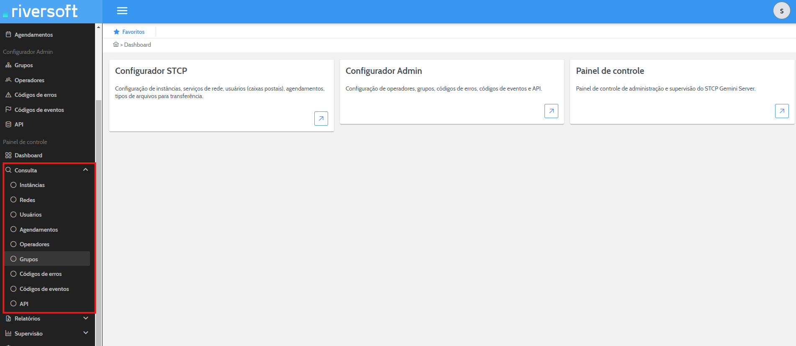

Nesta seção vamos detalhar as possibilidades de configuração do módulo Serviço Web Admin no
Portal Gemini.

## Módulo Serviço Web Admin

O Serviço Web Admin permite que o Operador realize as funções de Consulta dos cadastros no sistema como: Instâncias, Usuários, Transferência de Arquivos, tenha acesso a Relatórios de: Eventos, Frequência e Transferências, faça **Monitoração** de: Agendamentos, Instâncias e Usuários, além de possibilitar Manutenção de: Instâncias, Agendamentos, Operadores e Usuários.

Além das funções descritas anteriormente há outras disponíveis, como Iniciar Conexões, e todas serão descritas a seguir.


  **AVISO:** Para que os recursos abordados por este manual funcionem corretamente é **NECESSÁRIO** que haja pelo menos um nó de monitoração criado e atribuído a um Serviço de **Monitoração da Instância**. Estas configurações podem ser consultadas nos Manuais dos Configuradores Web Admin e STCP.


## Menu Consulta

O Menu de consultas permite a visualização de todos os cadastros realizados no sistema. A divisão deste menu e dado por:

* Instâncias;
* Agendamentos;
* Usuários;
* Serviços;
* Código de Erros;
* Código de Eventos;
* Grupos;
* Operadores;
* Configurações API.

### Instâncias

A **consulta de Instâncias** permite que o Operador visualize os principais parâmetros cadastrados para as Instâncias do sistema.

Para buscar por uma instância específica insira seu nome e, se desejar, sua descrição. 

Ao localizar a instância pesquisada, clique sobre seu nome.

A partir de então os parâmetros cadastrados serão listados como mostrado a seguir:

**Tabela de descrição de Nível do evento**

| Nível do evento   | Descrição |
| ----------- | ----------- |
|  0   | Os eventos de início e término da aplicação.  |
|  1   | Os eventos que contenham algum erro.         |
|  2   | Os eventos de término da operação de cancelamento de espera de uma conexão.   |
|  3   | Os eventos de início e término de cancelamento das conexões.                  |
|  4   | Os eventos de início e término de com sucesso, início e término de sessão, início e término de transmissão ou início e término de recepção.    |
|  5   | Não definido.        |
|  6   | Não definido.        |
|  7   | Os eventos de início e término da unidade de processamento (threads)        |
|  8   | Os eventos de início e término da agenda.         |

### Agendamentos

A consulta de Agendamentos permite que o Operador visualize os principais parâmetros cadastrados para os Agendamentos no sistema.

Para buscar por um agendamento específico, informe seu **Nome** e/ou **Descrição**. Após preencher o campos descrito, o agendamento cadastrado será listado conforme mostra a imagem.

Ao localizar o agendamento pesquisado, clique em **"Editar"**. A partir de então, os parâmetros cadastrados serão listados.

### Usuários

A consulta de Usuários permite que o Operador visualize os principais parâmetros cadastrados para os usuários do sistema.

Para buscar por um usuário específico, informe seu **Nome** e/ou **Descrição**. Após preencher o campos descrito, o usuário cadastrado será listado conforme mostra a imagem.

Ao localizar o usuário pesquisado, clique sobre seu nome. A partir de então, os parâmetros cadastrados serão listados.

### Redes 

A consulta de Redes permite que o Operador visualize os principais parâmetros cadastrados para os usuários do sistema.

Para buscar por uma rede específica, informe seu **Nome** e/ou **Descrição**. Após preencher o campos descrito, a rede cadastrada será listado conforme mostra a imagem.

### Código de Erros

A consulta de Código de erros permite que o Operador visualize os principais parâmetros cadastrados para os Códigos de erro do sistema.

Para buscar por um erro específico, pode-se informar seu **Código:** e/ou sua **Descrição**. Como não há nenhum parâmetro obrigatório para esta pesquisa, ao clicar em "Pesquisar..." sem preencher nenhuma informação, todos os erros serão apresentados.

Ao localizar o erro desejado, clique sobre seu Código. A partir de então, os parâmetros cadastrados serão listados.

