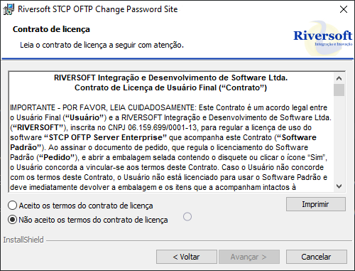
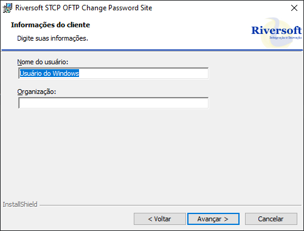
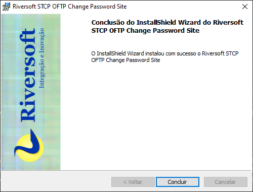

O pacote de instalação será distribuído através de um link pela Equipe de Sustentação da Riversoft.

Após extrair o zip com o arquivo executável, siga os seguintes passos para prosseguir com a instalação do STCP Change Password:

Clique no botão **Avançar** para prosseguir com a instalação.

Aceite os termos do contrato de licença e clique no botão **Avançar**.

Aceite ou modifique as informações do cliente e clique no botão **Avançar**.

Altere a informação do diretório de instalação e clique no botão **Avançar**.

Selecione a opção desejada e clique no botão **Instalar** para prosseguir.

Após a finalização do processo de instalação, clique no botão **Concluir**.

