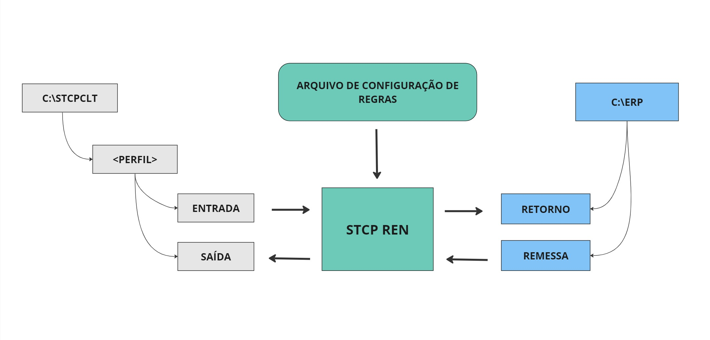

## O que é o STCPRen?

O STCPRen é uma aplicação que possibilita o renomeio e cópia de arquivos, varredura em diretórios e execução de processo, baseado na configuração de regras de validação dos nomes destes arquivos.

O STCPRen pode ser utilizado na integração do STCP OFTP Server ou STCP OFTP Client com diferentes outras aplicações (ERPs, EDI, etc...) de forma simples e direta.

No cenário apresentado abaixo, mostramos a integração da estrutura de diretórios de transferência do STCP OFTP Client com a de incorporação e geração de arquivos financeiros de um sistema de ERP.

As regras de validação e das ações (renomeio, cópia, backup, etc) deverão ser armazenadas em um ou mais arquivos de configuração.

## Características Gerais

* Renomeio de arquivo(s);
* Cópia para múltiplos diretórios;
* Conversão de formato texto (Unix/Dos);
* Validação do nome do arquivo por expressão regular;
* Remoção do arquivo por data do último acesso;
* Execução de processo (.BAT, .EXE, etc...);
* Registro de log das ações realizadas;
* Geração de timestamp com data e hora do computador ou do arquivo;
* Mapeamento dinâmico de recursos de rede;
* Varredura de diretório e subdiretório;
* Validação de diretório por expressão regular;
* Conversão maiúscula e minúscula do nome do arquivo.

## Glossário

  

    <h3>E</h3>
    
<strong>Endereço IP</strong> - Este endereço é um número único para cada computador conectado à Internet, composto por uma sequência de 4 números que variam de 0 até 255, separados por “.”.

  

  

    <h3>F</h3>
    
<strong><em>Firewall</em></strong> - Dispositivo constituído pela combinação de software e hardware, utilizado para dividir e controlar o acesso entre redes de computadores.

  

  

    <h3>H</h3>
    
<strong>HTTP</strong> - Do Inglês <em><strong>H</strong>yper<strong>T</strong>ext <strong>T</strong>ransfer <strong>P</strong>rotocol</em>. Protocolo usado para transferir páginas <em>Web</em> entre um servidor e um cliente, por exemplo, o <em>browser</em>.

  

  

    <h3>I</h3>
    
<strong>ISDN</strong> - O ISDN (Integrated Services Digital Network) é um sistema de conexões de telefone digital.

  

  

    <h3>L</h3>
    
<strong>Log</strong> - Registro de atividades por programas de computador. No caso de logs relativos a incidentes de segurança, eles normalmente são gerados por <em>firewalls</em> ou por IDSs.

  

  

    <h3>M</h3>
    
<strong>Macro</strong> - É sinônimo para um grupo de instruções que pode ser usado como uma instrução ao longo do código-fonte.

  

  

    <h3>P</h3>
    
<strong>Protocolo OFTP (ODETTE File Transfer Protocol)</strong> - O OFTP foi primeiramente especificado com premissas do modelo interconexão de sistemas abertos (OSI) utilizando o serviço de rede recomendado pela norma CCITT X.25. Com o crescimento da utilização do OFTP por diferentes setores, a organização ODETTE ampliou o escopo de padronização e incorporou a utilização do protocolo TCP/IP.

    
<strong>PPP</strong> - O PPP (Point-to-Point Protocol) é o método mais usado para transportar pacotes do IP sobre uma ligação de série entre o usuário e o Internet Service Provider (ISP).

  

  

    <h3>R</h3>
    
<strong>RAS</strong> - Um protocolo para configuração de uma VPN.

  

  

    <h3>S</h3>
    
<strong>Scan</strong> - Técnica normalmente implementada por um tipo de programa, projetado para efetuar varreduras em redes de computadores.

    
<strong>SMM</strong> - System Management Module (Módulo de Gerenciamento de Sistema).

    
<strong>SSL</strong> - Do Inglês <em><strong>S</strong>ecure <strong>S</strong>ockets <strong>L</strong>ayer</em>. Protocolo que fornece confidencialidade e integridade na comunicação entre um cliente e um servidor, através do uso de criptografia.

  

  

    <h3>U</h3>
    
<strong>UNC</strong> - Este é um formato de nome de arquivo que é usado para especificar a localização dos arquivos, pastas e recursos na rede local (LAN).

  

  

    <h3>V</h3>
    
<strong>VPN</strong> - É uma rede de comunicação privada normalmente utilizada por uma empresa ou um conjunto de empresas e/ou instituições, construída em cima de uma rede de comunicação pública, por exemplo, a Internet.

  

<!-- ## Referências

Disponível em: (<http://www.tech-faq.com/lang/pt/ppp.shtml>)
 
Disponível em: (<http://cartilha.cert.br/glossario/>)
 
Disponível em: (<http://www.iwebtool.com/what_is_unc.html>) -->

