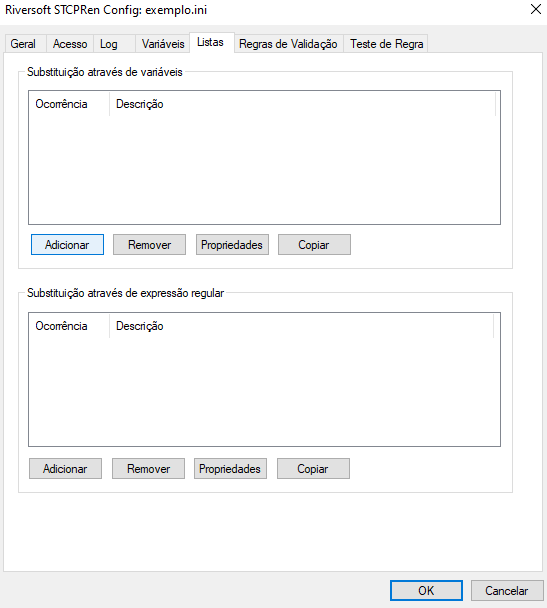

A configuração das regras de validação do nome de arquivo e as ações executadas pelo STCPRen podem ser criadas com o auxílio do programa *STCPRenCfg.EXE* ou de um editor de texto, por exemplo, *NOTEPAD.EXE*.

Nesta seção veremos como utilizar o programa *STCPRenCfg.EXE* para criar ou editar o arquivo de configuração de regras.

## Adicionar ou criar um arquivo de configuração de regras

1 &nbsp; Acesse a pasta de instalação do STCPRen e execute o programa **STCPRenCfg.exe**.

2 &nbsp;Clique no botão **Adicionar** para selecionar o arquivo de configuração ou criar um novo.

3 &nbsp;Clique no botão indicado para localizar o arquivo.

4 &nbsp;Para criar um novo arquivo, digite um novo nome e clique no botão **Abrir**.

5 &nbsp;Clique no botão **OK** para adicionar ou criar o arquivo de configuração de regras.

6 &nbsp;Caso o arquivo de configuração não exista, uma janela de aviso será apresentada, clique no botão **Sim** para confirmar.

## Alterar os parâmetros de configuração do arquivo de regras

1 &nbsp;Selecione o arquivo de configuração desejado e clique no botão **Propriedades**.

2 &nbsp;Na guia **Geral**, configure os parâmetros desejados.

Parâmetro| Descrição
:---     | :---
**ScanDir**  | Define o nome do diretório para varredura.   Obs.: Este parâmetro será utilizado somente se a opção –scan for definida na linha de comando do STCPRen.
**ScanDirRegEx**| Define uma expressão regular para validar os subdiretórios que serão processados na varredura.
**ScanDirRegExNeg**| Define uma expressão regular para validar os diretórios que não serão excluídos da varredura.
**ScanLockSem**| Define um nome de semáfora para sincronização do modo de varredura.   Obs.: Utilizado para sincronizar a execução de múltiplos processos do STCPREN. Válido somente com o uso da opção -scan.
**ScanLockSemTimeout**| Intervalo entre as execuções das instâncias do STCPRen.
**ScanLockSemOptions**| Executa uma instância por vez.
**ScanFirstRule**     | Define a primeira regra de validação do nome do arquivo a ser executada.
**ScanSubDir**        | Define se os subdiretórios serão verificados.   0 = Não   1 = Sim
**ScanCheckFileInUse**| Habilita/desabilita a verificação se o arquivo está em uso.   0 = Não   1 = Sim
**MaxRetries**        | Define o número de tentativas a serem realizadas antes de abandonar a operação (cópia, criação de diretório e apagar).
**DelayRetry**        | Define o tempo de espera (em milisegundos) antes de realizar uma nova tentativa de operação (cópia, criação de diretório e apagar).
**LogErrorOption**    | Define a opção de registro dos eventos de falha na localização de um diretório ou arquivo.   0 = Não registra   1 = Registra se o arquivo não existir   2 = Registra se o diretório não existir   3 = Registra se arquivo ou diretório não existirem

3 &nbsp;Na guia **Acesso**, é possível configurar os parâmetros para utilização de um compartilhamento de rede.

Parâmetro     | Descrição
:---          | :---
**LocalName** | Define o nome do recurso local (não é obrigatório).
**RemoteName**| Define o nome do recurso de rede para ter acesso.
**UserName**  | Define o nome do usuário para acesso ao recurso.
**UserPswd**  | Define a senha do usuário para acesso ao recurso.
**Confirmar** | Confirma a senha digitada anteriormente.

4 &nbsp;Na guia **Log**, é possível configurar os parâmetros para gravação dos registros de eventos de execução do STCPRen.

Parâmetro | Descrição
:---      | :---
**LogIni**| Define o nome do arquivo contendo as diretivas de log.
**LogLevelOnSucess**| Define o nível de log dos eventos de sucesso da aplicação.
**LogLevelOnInfo**  | Define o nível de log dos eventos de informação da aplicação.
**LogLevelOnWarning**| Define o nível de log dos eventos de alerta da aplicação.
**LogLevelOnError**| Define o nível de log dos eventos de erro da aplicação.
**MessageFile** | Define o diretório para criação do arquivo de mensagem geral.
**MessageFileUser**| Define o diretório para criação do arquivo de mensagem do usuário.
**Verbose** | Define o nível de informação a ser armazenada.
**UserLog**| Define se as mensagens serão geradas por usuário:   0 = Log geral   1 = Log por usuário

5 &nbsp;Na guia **Variáveis**, você pode definir regras de substituição dos valores informados nas variáveis (–var0 à –var9) utilizados na linha de comando do STCPRen.

6 &nbsp;Clique no botão **Adicionar** para configurar uma nova **regra de substituição dos valores de uma variável**.

7 &nbsp;Configure os parâmetros da regra de substituição e clique no botão **OK** para salvar.

Parâmetro | Descrição
:---      | :---
**$Var**  | Define a identificação da variável que será utilizada.   Valor: 0 a 9.
**Ocorrência**| Define a sequência de execução da substituição.   Valor: 0 a 999
**Descrição**| Define o nome da regra de substituição.
**RegExReplaceFrom**| Define a expressão regular para selecionar o que será substituído.
**RegExReplaceTo**| Define o valor para substituição.
**RegExReplaceOcorr**| Define a quantidade de repetições da substituição:   0 = Todas

8 &nbsp;Na guia **Listas**, você pode substituir as linhas do arquivo pelos valores das variáveis (-var0 à -var9) ou através de uma expressão regular criando regras de substituição.

O arquivo de lista pode conter nomes de diretórios ou arquivos que serão processados. As regras de substituição serão aplicadas às linhas do arquivo.

9 &nbsp;Clique no botão **Adicionar** para configurar uma nova **regra de substituição através de uma variável**.

10 &nbsp;Configure os parâmetros da regra de substituição e clique no botão **OK** para salvar.

Parâmetro | Descrição
:---      | :---
**Ocorrência**| Define a sequência de execução da substituição.   Valor: 0 a 999
**Descrição** | Define o nome da regra de substituição.
**VarReplaceFileNamePosFrom**| Modifica o novo nome do arquivo com parte do valor da variável (var0,var1, ..., varn) a partir da posição de origem definida.
**VarReplaceFileNamePosTo**  | Modifica o novo nome do arquivo com parte do valor da variável (var0,var1, ..., varn) para a posição de destino definida.
**VarReplaceFileNameLen**    | Modifica o novo nome do arquivo com parte do valor da variável (var0,var1, ..., varn) com o tamanho definido.
**VarReplaceFileNameValue**  | Define o valor da variável quando não for informado na linha de comando (-varn).

11 &nbsp;Clique no botão **Adicionar** para configurar uma nova **regra de substituição através de uma expressão regular**.

12 &nbsp;Configure os parâmetros da regra de substituição e clique no botão **OK** para salvar.

Parâmetro     | Descrição
:---          | :---
**Ocorrência**| Define a sequência de execução da substituição.   Valor: 0 a 999
**Descrição** | Define o nome da regra de substituição.
**RegExReplaceFrom**| Define a expressão regular para selecionar os dados que serão substituídos.
**RegExReplaceTo**  | Define o valor para substituição.
**RegExReplaceOcorr**| Define a quantidade de repetições da substituição:   0 = Todas

## Criar e modificar as Regras de Validação dos nomes de arquivos

1 &nbsp;Na guia **Regras de Validação**, clique no botão **Adicionar** para criar uma nova regra ou selecione uma regra e clique no botão **Propriedades** para modificá-la.

2 &nbsp;Clique no botão **Adicionar** para criar uma nova regra.

3 &nbsp;Configure a identificação da regra e clique no botão **OK** para salvar.

Parâmetro| Descrição
:---     | :---
**Regra**| Define o número da regra (ordem de execução).
**Nome** | Define o nome da regra.

4 &nbsp;Selecione uma regra e clique no botão **Ordenar regras**.

5 &nbsp; Nesta tela, selecione o intervalo de ordenação das regras:

6 &nbsp;Selecione uma regra e clique no botão **Propriedades** para modificar os seus parâmetros.

Para mudar o número da regra (ordem de execução), selecione-a e pressione um dos botões abaixo:

7 &nbsp;Na guia **Geral**, configure os parâmetros de identificação da regra, validação do arquivo e outros:

Parâmetro | Descrição
:---      | :---
**Regra** | Define o número da regra (ordem de execução).
**Nome**  | Define o nome da regra.
**DirRegEx**| Define a expressão regular para validar o nome do diretório.
**FileRegEx**| Define a expressão regular para validar o nome do arquivo.
**SrcRegEx**| Define a expressão regular para validar o nome do usuário de origem (opção –src da linha de comando).
**ContentRegEx**| Habilita a validação do arquivo através de seu conteúdo.
**Description**| Define a descrição da regra.
**ExecProgBefore**| Define o nome do programa ou batch que deve ser executado antes de processar o arquivo.
**ExecProgAfter**| Define o nome do programa ou batch que deve ser executado após processar o arquivo.
**ExecProgError**| Define o nome do programa ou batch que deve ser executado quando ocorrer um erro.
**DestinationUser**| Nome do usuário/módulo de destino do STCP OFTP (opcional).
**SourceUser**| Nome do usuário/módulo de origem do STCP OFTP (opcional).
**NextSection**| Define a próxima seção de processamento a ser executada para esta regra. O nome do arquivo para processamento é o mesmo do início da regra.
**RemoveAfterCopy**| Ativa ou inibe a remoção do arquivo:   Não = Não remove o arquivo   Sim = Remove o arquivo
**RemoveAfterHours**| Remove o arquivo somente se o último acesso tiver ocorrido antes da quantidade de horas estabelecida neste parâmetro:   0 = Remove imediatamente   0 = Remove após a quantidade de horas especificada.
**Overwrite**| Ativa ou inibe a sobreposição do arquivo:   Não = Não sobrepõe   Sim = Sobrepõe   Obs: Veja a opção de CopyFileOption e BackupFileOption para habilitar a sobreposição em cada operação individualmente.
**ProcessAfterSeconds**| Processa o arquivo somente se o último acesso tiver ocorrido após a quantidade de segundos estabelecida neste parâmetro.

8 &nbsp;Na guia **Renomeio de Arquivo I**, configure os parâmetros que serão utilizados na definição do **Novo Nome do Arquivo**.

Parâmetro | Descrição
:---      | :---
**RenameFileTo**| Define o novo nome para o arquivo.   Obs.: Se este parâmetro não for definido, o nome original será utilizado.
**InsertTimestamp**| Define a utilização do timestamp na nova nomenclatura:   0 = Não insere   1 = Insere no final do nome do arquivo   2 = Insere no início do nome do arquivo   4 = Insere customizado (através das opções de substituição)   
**InsertTimestampPart**| Define o tipo de timestamp a ser utilizado pela opção InsertTimestamp:   0 = Data e hora do sistema (computador local)   1 = Data e hora da criação do arquivo   2 = Data e hora da última modificação do arquivo   4 = Data e hora do último acesso ao arquivo   

9 &nbsp; Na guia **Renomeio de Arquivo I**, clique em **Adicionar** e configure as regras de renomeio do **Novo Nome do Arquivo** com as opções de **Substituição através do nome original**.

10 &nbsp;Configure as opções de substituição através do nome original do arquivo e do diretório, variáveis, número de sequência, timestamp e clique no botão **OK** para salvar.

Parâmetro | Descrição
:---      | :---
**Ocorrência**| Define a sequência de execução da substituição. Valor: 0 a 999
**Descrição**| Define a identificação da regra de renomeio.
**ReplaceFileNamePosFrom**| Modifica o novo nome do arquivo com parte do nome antigo a partir da posição de origem definida.
**ReplaceFileNamePosTo**| Modifica o novo nome do arquivo com parte do nome antigo para a posição de destino definida.
**ReplaceFileNameLen**| Modifica o novo nome do arquivo com parte do nome antigo com o tamanho definido.
**ReplaceFileNameFromPathPosFrom**| Modifica o novo nome do arquivo com parte do path do arquivo original a partir da posição de origem definida.
**ReplaceFileNameFromPathPosTo**| Modifica o novo nome do arquivo com parte do path do arquivo original para a posição de destino definida.
**ReplaceFileNameFromPathLen**| Modifica o nome do arquivo com parte do path do arquivo original com o tamanho definido.
**VarReplaceFileNamePosFrom**| Modifica o novo nome do arquivo com parte do valor da variável (var0,var1, ..., varn) a partir da posição de origem definida.
**VarReplaceFileNamePosTo**| Modifica o novo nome do arquivo com parte do valor da variável (var0,var1, ..., varn) para a posição de destino definida.
**VarReplaceFileNameLen**| Modifica o novo nome do arquivo com parte do valor da variável (var0,var1, ..., varn) com o tamanho definido.
**VarReplaceFileNameValue**| Define o valor da variável quando não for informado na linha de comando (-varn).
**InsertSeqNumberTo**| Insere um número de sequência no novo nome a partir da posição de destino definida.
**InsertSeqNumberLen**| Insere um número de sequência no novo nome com o tamanho definido.
**InsertSeqNumberMIn**| Número de sequência inicial.
**InsertSeqNumberMax**| Número de sequência final.
**InsertSeqNumberSeq**| Número de sequência atual.
**InsertTimestampPosFrom**| Modifica o novo nome com parte do Timestamp a partir da posição de origem definida.
**InsertTimestampPosTo**| Modifica o novo nome com parte do Timestamp para a posição de destino definida.
**InsertTimestampLen**| Modifica o novo nome com parte do Timestamp com o tamanho.

11 &nbsp;Na guia **Renomeio de Arquivo II**, configure as regras de renomeio do **Novo Nome do Arquivo** através do conteúdo do arquivo original ou de uma expressão regular:

Parâmetro | Descrição
:---      | :---
**ReplaceFromFileOption**| Habilita/Desabilita a utilização do conteúdo do arquivo original para fazer o renomeio.

12 &nbsp;Clique em **Adicionar** para configurar as regras de **Substituição através do conteúdo do arquivo original** que serão aplicadas no **Novo Nome do Arquivo**:

13 &nbsp;Configure os parâmetros de substituição e clique no botão **OK** para salvar.

Parâmetro | Descrição
:---      | :---
**Ocorrência**| Define a sequência de execução.   Valor: 0 a 999
**Descrição**| Define a identificação da regra.
**ReplaceFromFileRegEx**| Define uma expressão regular para validar a linha que contém a informação que deverá ser utilizada na substituição.
**ReplaceFromFilePosFrom**| Define a coluna inicial da linha selecionada.
**ReplaceFromFilePosTo**| Define a posição inicial do novo nome para onde serão copiados.
**RepalceFromFileLen**| Quantidade de caracteres que serão copiados a partir da coluna inicial.

14 &nbsp;Clique em **Adicionar** para configurar as regras de **Substituição através de uma expressão regular** que serão aplicadas no **Novo Nome do Arquivo**:

15 &nbsp;Configure os parâmetros de substituição e clique no botão **OK** para salvar.

Parâmetro | Descrição
:---      | :---
**Ocorrência**| Define a sequência de execução.   Valor: 0 a 999
**Descrição**| Define a identificação da regra.
**RegExReplaceFrom**| Define uma expressão regular para selecionar os dados que deverão ser .
**RegExReplaceTo**| Define o valor para substituição.
**RegExReplaceOcorr**| Define a quantidade de repetições da substituição:   0 = Todas

16 &nbsp;Na guia **Cópia**, configure os parâmetros que serão utilizados na definição do **Novo Nome do Diretório** para onde será copiado o arquivo original.

Parâmetro| Descrição
:---     | :---
**CopyToDir**| Define o nome do diretório de destino para onde deverá ser copiado o arquivo.
**CopyFileOption**| Define as opções de cópia que deverão ser utilizadas.   
**CopyTempExtension**| Define uma extensão temporária para o arquivo enquanto o processo de cópia não é finalizado.

17 &nbsp;Clique em **Adicionar** para configurar as regras de **Substituição através do nome original** que serão aplicadas no **Novo Nome do Diretório**.

18 &nbsp;Configure os parâmetros de substituição e clique no botão **OK** para salvar.

Parâmetro | Descrição
:---      | :---
**Ocorrência**| Define a sequência de execução.   Valor: 0 a 999
**Descrição**| Define a identificação da regra.
**CopyPathReplacePosFrom**| Modifica o nome do path da cópia com parte do path original a partir da posição de origem definida.
**CopyPathReplacePosTo**| Modifica o nome do path da cópia com parte do path original para a posição de destino definida.
**CopyPathReplaceLen**| Modifica o nome do path da cópia com parte do path original com o tamanho definido.
**CopyPathVarReplacePosFrom**| Modifica o nome do path da cópia com parte da variável a partir da posição de origem definida.
**CopyPathVarReplacePosTo**| Modifica o nome do path da cópia com parte da variável para a posição de destino definida.
**CopyPathVarReplaceLen**| Modifica o nome do path da cópia com parte da variável com o tamanho definido.
**CopyPathVarReplaceValue**| Define o valor variável.
**CopyPathReplaceFFNPosFrom**| Modifica o nome do path da cópia com parte do nome original do arquivo (FFN) a partir da posição de origem definida.
**CopyPathReplaceFFNPosTo**| Modifica o nome do path da cópia com parte do nome original do arquivo (FFN) para a posição de destino definida.
**CopyPathReplaceFFNLen**| Modifica o nome do path da cópia com parte do nome original do arquivo (FFN) com o tamanho definido.
**CopyPathInsertTMPPosFrom**| Modifica o nome do path da cópia com o timestamp (TMP) a partir da posição de origem definida.
**CopyPathInsertTMPPosTo**| Modifica o nome do path da cópia com o timestamp (TMP) a partir da posição de origem definida.
**CopyPathInsertTMPLen**| Modifica o nome do path da cópia com o timestamp (TMP) considerando o tamanho definido.

19 &nbsp; Clique em **Adicionar** para configurar as regras de **Substituição através de expressão regular** que serão aplicadas no **Novo Nome do Diretório**.

20 &nbsp;Configure os parâmetros de substituição e clique no botão **OK** para salvar.

Parâmetro| Descrição
:---     | :---
**Ocorrência**| Define a sequência de execução.   Valor: 0 a 999
**Descrição**| Define a identificação da regra.
**CopyPathRegExReplaceFrom**| Define uma expressão regular para selecionar os dados que deverão ser .
**CopyPathRegExReplaceTo**| Define o valor para substituição.
**CopyPathRegExReplaceOcorr**| Define a quantidade de repetições da substituição:   0 = Todas

21 &nbsp;Na guia **Backup**, configure os parâmetros que serão utilizados na definição do **Novo Nome do Diretório**, para onde será copiado o arquivo original:

Parâmetro| Descrição
:---     | :---
**BkpToDir**| Define o nome do diretório destino para onde deverá ser copiado o arquivo de backup.
**BkpFileOption**| Define as opções de backup que deverão ser utilizadas. 

22 &nbsp;Clique em **Adicionar** para configurar as regras de **Substituição através do nome original** que serão aplicadas no **Novo Nome do Diretório** de backup.

23 &nbsp;Configure os parâmetros de substituição e clique no botão **OK** para salvar.

Parâmetro| Descrição
:---     | :----
**Ocorrência**| Define a sequência de eventos.
**Descrição**| Identifica a regra de Backup.
**BkpPathReplacePosFrom**| Modifica o nome do path de backup com parte do path original a partir da posição de origem definida.
**BkpPathReplacePosTo**| Modifica o nome do path de backup com parte do path original para a posição de destino definida.
**BkpPathReplaceLen**| Modifica o nome do path de backup com parte do path original com o tamanho definido.
**BkpPathReplaceVarReplacePosFrom**| Modifica o nome do path de backup com parte da variável a partir da posição de origem definida.
**BkpPathVarReplacePosTo**| Modifica o nome do path de backup com parte da variável para a posição de destino definida.
**BkpPathVarReplaceLen**| Modifica o nome do path de backup com parte da variável com o tamanho definido.
**BkpPathVarReplaceValue**|  Define o valor variável.
**BkpPathReplaceFFNPosFrom**| Modifica o nome do path de backup com parte do nome original do arquivo (FFN) a partir da posição de origem definida.
**BkpPathFFNPosTo**| Modifica o nome do path de backup com parte do nome original do arquivo (FFN) para a posição de destino definida.
**BkpPathReplaceFFNLen**| Modifica o nome do path de backup com parte do nome original do arquivo (FFN) com o tamanho definido.
**BkpPathInsertTMPPosFrom**| Modifica o nome do path de backup com o timestamp(TMP) a partir da posição de origem definida.
**BkpPathInsertTMPPosTo**| Modifica o nome do path de backup com o timestamp (TMP) a partir da posição de origem definida.
**BkpPathInsertTMPLen**| Modifica o nome do path da cópia com o timestamp (TMP) considerando o tamanho definido.

24 &nbsp;Clique em **Adicionar** para configurar as regras de **Substituição através de expressão regular** que serão aplicadas no **Novo Nome do Diretório** de
backup.

25 &nbsp;Configure os parâmetros de substituição e clique no botão **OK** para salvar.

Parâmetro| Descrição
:---     | :---
**Ocorrência**| Define a sequência de execução.   Valor: 0 a 999
**Descrição**| Define a identificação da regra.
**BkpPathRegExReplaceFrom**| Define uma expressão regular para selecionar os dados que deverão ser .
**BkpPathRegExReplaceTo**| Define o valor para substituição.
**BkpPathRegExReplaceOcorr**| Define a quantidade de repetições da substituição:   0 = Todas

26 &nbsp;Na guia **Avançadas**, configure os parâmetros:

Parâmetro| Descrição
:---     | :---
**CheckLockUnlockOption**| Define as opções de criação/utilização do arquivo de sincronização de acesso ao arquivo que está sendo processado. 
**CheckLockUnlockFileName**| Define o nome do arquivo de bloqueio/desbloqueio que deverá ser verificado.
**CreateLockUnlockFileName**| Define o nome do arquivo de bloqueio/desbloqueio que deverá ser criado.
**Controle de tamanho de arquivos**| Define o tamanho mínimo e máximo que o arquivo pode ter para ser processado pela regra.
**Período de execução**| Define o período (Início, Fim e Dias da Semana) em que uma regra deverá ser executada.
**DelayNextFileProcess**| Define o intervalo mínimo (em milisegundos) para processar o próximo arquivo na mesma regra.
**ContentLinesToRead**| Se o parâmetro ContentRegEx estiver setado esta opção valida o número de linhas que serão lidas do arquivo.
**ResetSeqNumberDaily**| Zera diariamente o número de sequência informado no parâmetro *InsertSeqNumberSeq* (Renomeio de Arquivo I).
