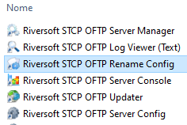

Por padrão, o configurador do STCP Rename vem integrado na pasta *Program* do *STCP OFTP Server/Client*. Para acessá-lo e fazer as devidas configurações, adicionar novas regras e roteamentos, procure pela aplicação *Riversoft STCP OFTP Rename Config* conforme a imagem abaixo:


  
    
       
        
      
    
  

 

