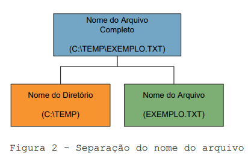
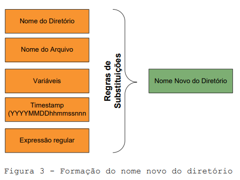
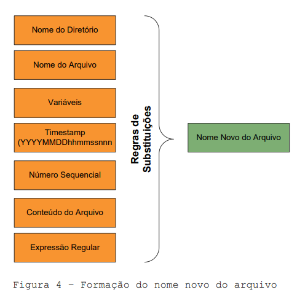
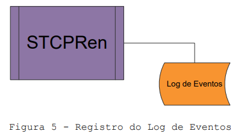

## Utilização

### Modos de operação e opções de execução

O STCPRen pode ser executado diretamente na linha de comando do sistema operacional, através do agendador de tarefas ou por outras aplicações: STCP OFTP Server ou Client.

O STCPRen possui quatro modos de operação distintos e a seleção será realizada através da linha de comando, são eles:

Modo | Linha de Comando
:--- | :---
**Arquivo específico**| Stcpren_3_2.exe –rules [nome do arquivo de regras] [nome do arquivo específico]
**Lista de arquivos**| Stcpren_3_2.exe –rules [nome do arquivo de regras] -filelist [nome do arquivo de lista]
**Varredura de um diretório específico**| Stcpren_3_2.exe –rules [nome do arquivo de regras] -scan [nome do diretório]
**Varredura de uma lista de diretórios**| Stcpren_3_2.exe –rules [nome do arquivo de regras] -dirlist [nome do arquivo de lista]


Quando o modo de varredura é utilizado, a opção **-subdir** habilita a procura nos subdiretórios.


### Formação do novo nome do diretório e do arquivo

Quando o STCPRen localiza um arquivo, separa o nome do diretório do nome do arquivo e possibilita a utilização destas informações pelas regras de substituição (Figura abaixo).

A seleção das informações para formar um novo nome de diretório e de arquivo nas ações de “Cópia” e ou de “Backup” serão configuradas através das regras de substituição (Figura abaixo).

### Variávies internas

O STCPRen possui um conjunto de variáveis internas que poderão ser utilizadas nas opções de configuração: `ExeProgBefore`, `ExecProgAfter`, `ExecProgError`, `CheckLockUnlockFileName`, `CreateLockUnlockFileName`, etc...

Variável | Descrição
:---     | :---
**$FILENEWNAME**| Novo nome do arquivo com o diretório (após as substituições).
**$FILEOLDNAME**| Nome original do arquivo com o diretório.
**$PATHNEWNAME**| Nome novo do diretório (após as substituições).
**$PATHOLDNAME**| Nome original do diretório.
**$NEWNAME**    | Nome novo do arquivo.
**$OLDNAME**    | Nome do arquivo original.
**$NEW2NAME**   | Novo nome do arquivo (após as substituições) sem a extensão.
**$OLD2NAME**   | Nome do arquivo original sem a extensão.
**$FILESIZE**   | Tamanho do arquivo em bytes.
**$TIMESTAMP**  | Timestamp no formato: YYYYMMDDhhmmssnnn   YYYY = ano   MM = mês   DD = dia   hh = hora (formato 24h)   mm = minuto   ss = segundos   nnn = milésimos de segundos
**$RULENAME**   | Nome da regra executada
**$DESCR**      | Descrição da regra
**$ERROR**      | Último código de erro
**$VAR0 até $VAR9**| Variáveis utilizadas na linha de comando –var0 até – var9.
**$SRCUSER**    | Identificação de origem
**$DSTUSER**    | Identificação de destino

### Registro de Log dos Eventos

O STCPRen irá registrar as ações executadas em um arquivo diário de log dos eventos contendo: data e hora, nome do arquivo original, novo nome do arquivo, etc.

Os dados poderão ser armazenados em arquivo texto ou banco de dados.

