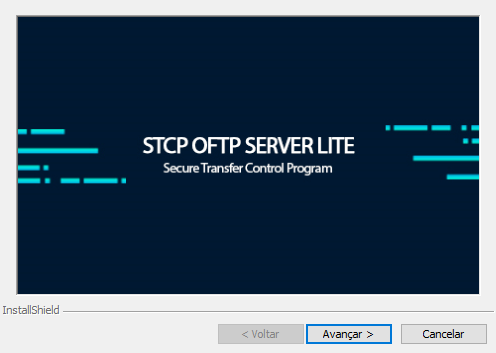
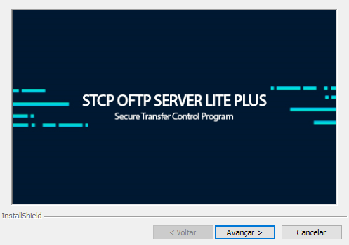
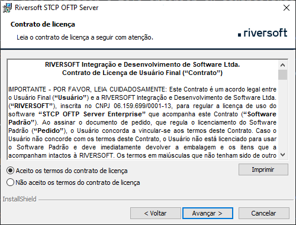
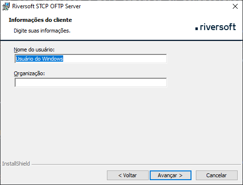
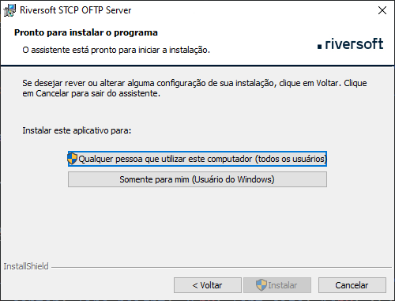
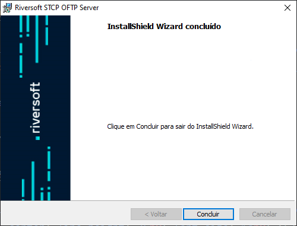

## Distribuição dos pacotes

O pacote de instalação será distribuído através de um link, disponibilizado pela Equipe de Sustentação da Riversoft.

Após extrair o zip com o arquivo executável, os seguintes passos devem ser executados:

Clique no executável para iniciar o processo de instalação.

Esta é a tela de boas-vindas, clique em **Avançar** para continuar.

Pressione **Voltar** para retornar à tela anterior ou **Cancelar** para interromper o processo de instalação.

Leia cuidadosamente o Contrato de Licença de Uso do Usuário Final e caso concorde com os termos propostos, marque a opção correspondente e pressione o botão **Avançar** para prosseguir com a instalação.

Pressione **Voltar** para retornar à tela anterior ou **Cancelar** para interromper o processo de instalação.

Na tela **Informações do Cliente**, informe o Nome do usuário e Empresa.

Clique em **Avançar** para continuar a instalação.

Pressione **Voltar** para retornar à tela anterior ou **Cancelar** para cancelar todo o processo de instalação.

Na tela **Pasta de Destino**, clique em **Avançar** para instalar no diretório padrão ou **Alterar** para selecionar outro diretório ou criar um novo.

Pressione **Voltar** para retornar à tela anterior ou **Cancelar** para interromper o processo de instalação.

Na tela **Pronto para Instalar** o Programa, verifique se as configurações escolhidas estão corretas e clique em **Instalar** para continuar.

Pressione **Voltar** para retornar à tela anterior ou **Cancelar** para interromper o processo de instalação.

Na tela **Conclusão do Installshield**, clique em **Concluir** para finalizar a instalação.

## Estrutura dos diretórios

Após a instalação da aplicação, a seguinte árvore de diretórios será criada onde serão armazenadas as informações de configuração, logs e controle.


  

    
      
      

      
        
        
      

      
        
      

      
      

      
        
        

        
        
      

      
      

    

    
    

    
    

    
    

    
      
    

    
      
      
      
      
      
      
      
      
    

    
      
      
      
      
      
      
      
      
      
      
      
      
      
      
      
      
      
      
      
      
      
      
      
      
      
      
      
      
      
      
      
      
      
      
      
      
      
    

    
    

    
    

    
    
    
    
    

  



