## Configurador

O programa de configuração do STCP OFTP Server foi instalado na pasta selecionada durante o processo de instalação e pode ser acessado através do menu **Iniciar**. Caso você não tenha alterado a pasta padrão, execute os seguintes passos:

&nbsp; No menu **Iniciar**, **Todos os Programas**, selecione **Riversoft STCP OFTP Client**.

 &nbsp; Clique no programa **Riversoft STCP OFTP Client Config**.

O programa de configuração pode ser acessado também na pasta **Program** da aplicação, conforme exemplo de estrutura abaixo:

```
*:\STCPODT\Program\Riversoft STCP OFTP Server Config
```


  
    
       
        
      
    
  


## Informações gerais

Na guia **Geral** preencha os campos com as informações descritas abaixo.


Campos | Descrição
:----  | :----
Nome   | Este campo informa o nome do serviço do STCP OFTP Server.
Descrição| Este campo informa a descrição do serviço do STCP OFTP Server.
Utilizar login| Esta opção assinalada habilita a utilização de uma conta do sistema operacional pelo serviço STCP OFTP Server. <br> Obs.: Sempre que o diretório de dados selecionado for uma unidade de rede, esta opção deverá ser habilitada.
Usuário| Preencha este campo com o nome do usuário que deve ser utilizado pelo serviço STCP OFTP Server.
Senha  | Preencha este campo com a senha do usuário que deve ser utilizado pelo serviço STCP OFTP Server.
Confirmar| Preencha este campo com a senha do usuário para ser validada.
Diretório de controle| Este campo informa o nome do diretório de instalação do STCP OFTP Server onde serão armazenadas as configurações dos usuários, logs e arquivos de depuração da comunicação. <br> Obs.: Para a versão STCP OFTP Server, este parâmetro não pode ser modificado.
Diretório de dados| Preencha este campo com o diretório, onde a estrutura de subdiretórios para envio e recepção dos arquivos de cada usuário deverá ser criada.  <br> Obs.: Esta configuração deve ser alterada antes da criação dos usuários.
Número de série*| Preencha este campo com o número de série que está localizado no "Contrato de Licença de Uso" ou na parte traseira da embalagem do CD. <br>
----


 *Obs.: O preenchimento deste campo é obrigatório.


## Redes

Nesta guia, você poderá adicionar, remover ou modificar os parâmetros das interfaces de redes controladas pelo serviço do STCP OFTP Server.

<span style="display:inline-block; width: 25px; height: 25px; border-radius: 50%; background-color: #0095C7; color: white; text-align: center; line-height: 25px; font-size: 14px; font-family: Arial;">1</span> &nbsp; Clique em **Adicionar**.


> O STCP OFTP Server oferece a capacidade de configurar múltiplas interfaces de redes com diferentes protocolos de comunicação, como TCP/IP, além da opção de implementar medidas de segurança adicionais através de protocolos como SFTP, HTTPS e TLS.


  As configurações de Redes somente serão utilizadas para as conexões entrantes (inbound).


<span style="display:inline-block; width: 25px; height: 25px; border-radius: 50%; background-color: #0095C7; color: white; text-align: center; line-height: 25px; font-size: 14px; font-family: Arial;">2</span> &nbsp; Selecione um serviço de rede e clique em **OK**.

Protocolo     | Descrição
:---------    | :-----
OFTP - TCP/IP | Configura o STCP OFTP Server para utilizar o protocolo de comunicação TCP/IP.
API DirectLink - HTTP/S | Configura o STCP Server para comunicar com com a API do Directlink. <br>  <a href="/stcpdirectlink/05-api/" target="_blank">Acesse a seção da API do Directlink para mais informações</a>  &nbsp;
SFTP DirectLink – TCP/IP | Configura o STCP Server para se comunicar via protocolo SFTP com o Directlink.
Monitor – TCP/IP | Habilita a rede para supervisão do STCP através do protocolo TCP/IP.
Monitor Directlink - TCP/IP | Habilita a rede para supervisão do Directlink através do protocolo TCP/IP.
----

### OFTP

<span style="display:inline-block; width: 25px; height: 25px; border-radius: 50%; background-color: #0095C7; color: white; text-align: center; line-height: 25px; font-size: 14px; font-family: Arial;">1</span> &nbsp; Na guia **Geral**, preencha as seguintes opções de configuração:


Campos | Descrição
:----  | :----
Nome   | Campo com o nome da interface de rede configurada.
Descrição| Preencha este campo com a descrição da interface de rede.
Desabilitar| Esta opção assinalada desabilita a interface de rede.

<span style="display:inline-block; width: 25px; height: 25px; border-radius: 50%; background-color: #0095C7; color: white; text-align: center; line-height: 25px; font-size: 14px; font-family: Arial;">2</span> &nbsp; Na guia **TCP/IP**, configure as seguintes opções para o protocolo **OFTP: TCP/IP_1**.


Campos     | Descrição
:----      | :----
Endereço IP| Preencha este campo com o endereço TCP/IP ou nome (DNS) da interface local para a qual o serviço STCP OFTP Server deve ser disponibilizado. <br> Obs.: Utilize o endereço 0.0.0.0 para habilitar o serviço sobre todas as interfaces de rede.
Porta IP   | Preencha este campo com a porta IP da interface local para a qual o serviço STCP OFTP Server deve ser disponibilizado. <br> Obs.: A porta padrão do serviço OFTP é a 3305.
Comunicação Segura| Esta opção assinalada habilita a utilização de criptografia na comunicação com o servidor STCP OFTP Server, você pode escolher entre a opção Nativa ou TLS. <br> Obs.: Antes de habilitar esta opção, leia atentamente o capítulo sobre Segurança.
TLS       | Configura a comunicação segura com criptografia e certificação digital, com a utilização da padronização definida na RFC2246 (TLS1/SSL3). O TLS1/SSL3 é comumente encontrado nos servidores de sites seguros (HTTPS) e oferece o maior grau de segurança atualmente disponível. <br> Obs.: Antes de habilitar esta opção, confirme se o servidor com o qual você deseja se comunicar suporta esta característica.
Compatibilidade| Esta opção possibilita compatibilizar o STCP OFTP Server com diferentes produtos atualmente existentes no mercado.
RFC2204    | Esta opção de compatibilidade permite a comunicação do STCP OFTP Server com outros produtos que seguem a recomendação RFC2204.
RFC1006/RFC1086| Esta opção de compatibilidade permite a comunicação do STCP OFTP Server através de gateways de comunicação TCP-IP/X.25, que seguem a recomendação RFC1006/1086.
RVS*       | Esta opção de compatibilidade permite a comunicação do STCP OFTP Server com o produto RVS*. <br> Obs.: Esta opção não deve ser habilitada quando o servidor RVS* for uma versão do mainframe (grande porte).
X.25/Router | Esta opção de compatibilidade permite a comunicação do STCP OFTP Server através de roteadores com suporte à comunicação X.25 através de socket. <br> Obs.: Consulte a Riversoft sobre esta configuração se você estiver em dúvidas.
XFB*/SSL   | Habilita a compatibilidade do STCP com o XFB em conexões seguras SSL.
Compressão GZIP| Esta opção assinalada habilita a utilização da compressão GZIP onthe-fly (durante a transferência).  <br> Obs.: Antes de habilitar esta opção, confirme se o servidor com o qual você deseja se comunicar suporta esta característica.


  \*As marcas citadas são propriedade dos seus respectivos donos.


<span style="display:inline-block; width: 25px; height: 25px; border-radius: 50%; background-color: #0095C7; color: white; text-align: center; line-height: 25px; font-size: 14px; font-family: Arial;">3</span> &nbsp; Na guia **Odette**, configure as seguintes opções para o protocolo **OFTP: TCP/IP_1**.

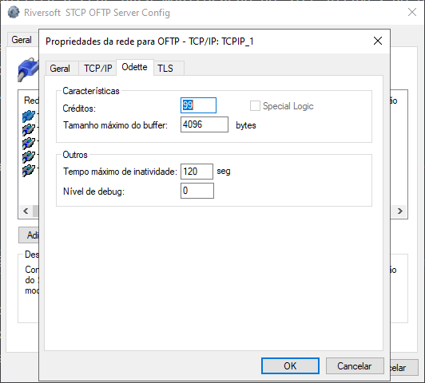

Campos         | Descrição
:--------      | :-----
Características| As opções definidas neste grupo serão utilizadas pelo STCP OFTP Server na comunicação com o servidor Odette. <br> Obs.: Não modifique estas características sem ler atentamente o que significa cada uma delas e ter certeza que realmente deseja fazê-lo.
Créditos       | Preencha este campo com a quantidade de blocos de dados que serão transferidos até aguardar uma nova autorização para envio. O intervalo válido é de 1 até 99.
Special Logic  | Esta opção assinalada habilita o controle do regime de comunicação lógica especial. Somente deve ser habilitado para comunicação através do protocolo PAD ou SERIAL. <br> Obs.: Não habilite esta opção quando não for utilizado o Protocolo PAD ou SERIAL.
Tamanho máximo do buffer| Preencha este campo com o tamanho máximo dos blocos de dados que serão transferidos. O intervalo válido é de 1 até 65535.
Outros         | As opções definidas neste grupo serão utilizadas localmente pelo STCP OFTP Server para controlar o tempo de inatividade e a geração do arquivo de depuração da comunicação.
Tempo máximo de inatividade| Preencha este campo com o tempo máximo de inatividade de comunicação entre o STCP OFTP Server e o computador remoto.
Nível de debug | Preencha este campo com o nível de detalhamento das informações que serão gravadas no arquivo de depuração. Para obter no mesmo arquivo de depuração a informação dos diferentes níveis, preencha este campo com a soma dos níveis desejados. <br> Obs.: Veja a tabela dos níveis de debug na configuração dos usuários.

<span style="display:inline-block; width: 25px; height: 25px; border-radius: 50%; background-color: #0095C7; color: white; text-align: center; line-height: 25px; font-size: 14px; font-family: Arial;">4</span> &nbsp; Na guia **TLS**, configure as seguintes opções para o protocolo **OFTP – TCP/IP**.

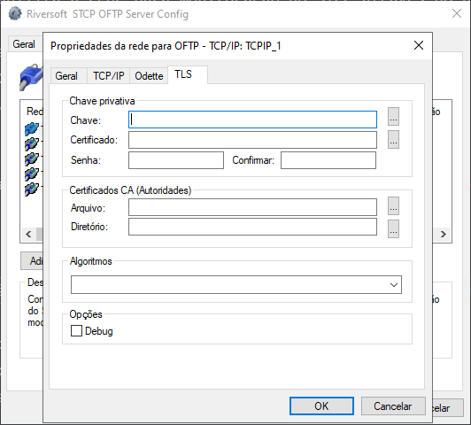

Campos         | Descrição
:------------  | :------
Chave Privativa| As opções deste grupo estão relacionadas às chaves pública e privada utilizadas pelo protocolo TLS1/SSL3 para autenticação e criptografia dos dados. <br> Obs.: O arquivo da chave privativa deve estar no formato PKCS#12 e os certificados, no formato DER ou PEM.
Chave          | Preencha este campo com o nome do arquivo (caminho completo) onde se encontra instalada a chave privativa.
Certificado    | Preencha este campo com o nome do arquivo (caminho completo) onde se encontra instalado o certificado digital (X509) associado à chave privativa.
Senha          | Preencha este campo com a senha que protege o arquivo de chave privativa.
Confirmar      | Preencha este campo com a senha informada no campo senha para validação.
Certificados CA (Autoridade)| As opções deste grupo estão relacionadas aos certificados digitais das autoridades certificadoras (CA) que servirão para validar a autenticidade do certificado apresentado pelo servidor. <br> Obs.: O arquivo da chave privativa deve estar no formato PKCS#12 e os certificados no formato DER ou PEM.
Arquivo        | Preencha este campo com o nome do arquivo (caminho completo) onde se encontra instalado o certificado digital (X509) contendo a chave pública que assina o certificado apresentado pelo servidor.
Diretório      | Preencha este campo com o nome do diretório (caminho completo) onde se encontram instalados os certificados digitais (X509) contendo a chave pública que assina o certificado apresentado pelo servidor.
Algoritmos     | Preencha este campo com os nomes dos algoritmos suportados para assinatura digital, hashing e criptografia dos dados. <br> Obs.: Caso este campo não seja configurado, o protocolo TLS será selecionado automaticamente.
Debug          | Esta opção permite gerar um arquivo de depuração na pasta Debug do diretório de instalação do STCP.


Pressione o botão **OK** para prosseguir ou **Cancelar** para abandonar sem alterar as configurações.

### API DirectLink

<span style="display:inline-block; width: 25px; height: 25px; border-radius: 50%; background-color: #0095C7; color: white; text-align: center; line-height: 25px; font-size: 14px; font-family: Arial;">1</span> &nbsp; Na guia **Geral**, preencha as seguintes opções de configuração:


Campos | Descrição
:----  | :----
Nome   | Campo com o nome da interface de rede configurada.
Descrição| Preencha este campo com a descrição da interface de rede.
Desabilitar| Esta opção assinalada desabilita a interface de rede.

<span style="display:inline-block; width: 25px; height: 25px; border-radius: 50%; background-color: #0095C7; color: white; text-align: center; line-height: 25px; font-size: 14px; font-family: Arial;">2</span> &nbsp; Na guia **TCP/IP**, configure as seguintes opções:


Campos     | Descrição
:----      | :----
Endereço IP| Preencha este campo com o endereço TCP/IP ou nome (DNS) da interface local para a qual o serviço STCP OFTP Server deve ser disponibilizado. <br> Obs.: Utilize o endereço 0.0.0.0 para habilitar o serviço sobre todas as interfaces de rede.
Porta IP   | Preencha este campo com a porta IP da interface local para a qual o serviço STCP OFTP Server deve ser disponibilizado. <br> Obs.: A porta padrão do serviço OFTP é a 3305.
Comunicação Segura| Esta opção assinalada habilita a utilização de criptografia na comunicação com o servidor STCP OFTP Server, você pode escolher entre a opção Nativa ou TLS. <br> Obs.: Antes de habilitar esta opção, leia atentamente o capítulo sobre Segurança.
TLS       | Configura a comunicação segura com criptografia e certificação digital, com a utilização da padronização definida na RFC2246 (TLS1/SSL3). O TLS1/SSL3 é comumente encontrado nos servidores de sites seguros (HTTPS) e oferece o maior grau de segurança atualmente disponível. <br> Obs.: Antes de habilitar esta opção, confirme se o servidor com o qual você deseja se comunicar suporta esta característica.
Compatibilidade| Esta opção possibilita compatibilizar o STCP OFTP Server com diferentes produtos atualmente existentes no mercado.
RFC2204    | Esta opção de compatibilidade permite a comunicação do STCP OFTP Server com outros produtos que seguem a recomendação RFC2204.
RFC1006/RFC1086| Esta opção de compatibilidade permite a comunicação do STCP OFTP Server através de gateways de comunicação TCP-IP/X.25, que seguem a recomendação RFC1006/1086.
RVS*       | Esta opção de compatibilidade permite a comunicação do STCP OFTP Server com o produto RVS*. <br> Obs.: Esta opção não deve ser habilitada quando o servidor RVS* for uma versão do mainframe (grande porte).
X.25/Router | Esta opção de compatibilidade permite a comunicação do STCP OFTP Server através de roteadores com suporte à comunicação X.25 através de socket. <br> Obs.: Consulte a Riversoft sobre esta configuração se você estiver em dúvidas.
XFB*/SSL   | Habilita a compatibilidade do STCP com o XFB em conexões seguras SSL.
Compressão GZIP| Esta opção assinalada habilita a utilização da compressão GZIP onthe-fly (durante a transferência).  <br> Obs.: Antes de habilitar esta opção, confirme se o servidor com o qual você deseja se comunicar suporta esta característica.


  \*As marcas citadas são propriedade dos seus respectivos donos.


<span style="display:inline-block; width: 25px; height: 25px; border-radius: 50%; background-color: #0095C7; color: white; text-align: center; line-height: 25px; font-size: 14px; font-family: Arial;">3</span> &nbsp; Na guia **TLS**, configure as seguintes opções:

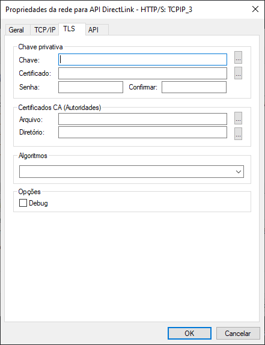

Campos         | Descrição
:------------  | :------
Chave Privativa| As opções deste grupo estão relacionadas às chaves pública e privada utilizadas pelo protocolo TLS para autenticação e criptografia dos dados. <br> Obs.: O arquivo da chave privativa deve estar no formato PKCS#12 e os certificados, no formato DER ou PEM.
Chave          | Preencha este campo com o nome do arquivo (caminho completo) onde se encontra instalada a chave privativa.
Certificado    | Preencha este campo com o nome do arquivo (caminho completo) onde se encontra instalado o certificado digital (X509) associado à chave privativa.
Senha          | Preencha este campo com a senha que protege o arquivo de chave privativa.
Confirmar      | Preencha este campo com a senha informada no campo senha para validação.
Certificados CA (Autoridade)| As opções deste grupo estão relacionadas aos certificados digitais das autoridades certificadoras (CA) que servirão para validar a autenticidade do certificado apresentado pelo servidor. <br> Obs.: O arquivo da chave privativa deve estar no formato PKCS#12 e os certificados no formato DER ou PEM.
Arquivo        | Preencha este campo com o nome do arquivo (caminho completo) onde se encontra instalado o certificado digital (X509) contendo a chave pública que assina o certificado apresentado pelo servidor.
Diretório      | Preencha este campo com o nome do diretório (caminho completo) onde se encontram instalados os certificados digitais (X509) contendo a chave pública que assina o certificado apresentado pelo servidor.
Algoritmos     | Preencha este campo com os nomes dos algoritmos suportados para assinatura digital, hashing e criptografia dos dados. <br> Obs.: Caso este campo não seja configurado, o protocolo TLS será selecionado automaticamente.
Debug          | Esta opção permite gerar um arquivo de depuração na pasta Debug do diretório de instalação do STCP.
----
<span style="display:inline-block; width: 25px; height: 25px; border-radius: 50%; background-color: #0095C7; color: white; text-align: center; line-height: 25px; font-size: 14px; font-family: Arial;">4</span> &nbsp; Na guia **API**, configure as seguintes opções:


Campos         | Descrição
:------------  | :------
URL de acesso  | Preencha este campo com a URL de requisição.
Estáticas      | Preencha este campo com o diretório (caminho completo) onde se encontram páginas estáticas do Directlink.
Templates      | Preencha este campo com o diretório (caminho completo) onde se encontram os templates do Directlink.
Versão TLS     | Preencha estes campos com a versão mínima e máxima escolhida do TLS.
Headers Customizados (json)  | Preencha este campo com os headers customizados no formato json.
Log requisições HTTP/S    | Preencha este campo com o nome do arquivo (caminho completo) onde se encontra o log das requisções https.


Pressione o botão **OK** para prosseguir ou **Cancelar** para abandonar sem alterar as configurações.

### SFTP DirectLink

<span style="display:inline-block; width: 25px; height: 25px; border-radius: 50%; background-color: #0095C7; color: white; text-align: center; line-height: 25px; font-size: 14px; font-family: Arial;">1</span> &nbsp; Na guia **Geral**, configure as seguintes opções:


Campos | Descrição
:----  | :----
Nome   | Campo com o nome da interface de rede configurada.
Descrição| Preencha este campo com a descrição da interface de rede.
Desabilitar| Esta opção assinalada desabilita a interface de rede.
-----

<span style="display:inline-block; width: 25px; height: 25px; border-radius: 50%; background-color: #0095C7; color: white; text-align: center; line-height: 25px; font-size: 14px; font-family: Arial;">2</span> &nbsp; Na guia **TCP/IP**, configure as seguintes opções:


Campos     | Descrição
:----      | :----
Endereço IP| Preencha este campo com o endereço TCP/IP ou nome (DNS) da interface local para a qual o serviço STCP OFTP Server deve ser disponibilizado. <br> Obs.: Utilize o endereço 0.0.0.0 para habilitar o serviço sobre todas as interfaces de rede.
Porta IP   | Preencha este campo com a porta IP da interface local para a qual o serviço STCP OFTP Server deve ser disponibilizado. <br> Obs.: A porta padrão do serviço OFTP é a 3305.
Comunicação Segura| Esta opção assinalada habilita a utilização de criptografia na comunicação com o servidor STCP OFTP Server, você pode escolher entre a opção Nativa ou TLS. <br> Obs.: Antes de habilitar esta opção, leia atentamente o capítulo sobre Segurança.
TLS       | Configura a comunicação segura com criptografia e certificação digital, com a utilização da padronização definida na RFC2246 (TLS). O TLS é comumente encontrado nos servidores de sites seguros (HTTPS) e oferece o maior grau de segurança atualmente disponível. <br> Obs.: Antes de habilitar esta opção, confirme se o servidor com o qual você deseja se comunicar suporta esta característica.
Compatibilidade| Esta opção possibilita compatibilizar o STCP OFTP Server com diferentes produtos atualmente existentes no mercado.
RFC2204    | Esta opção de compatibilidade permite a comunicação do STCP OFTP Server com outros produtos que seguem a recomendação RFC2204.
RFC1006/RFC1086| Esta opção de compatibilidade permite a comunicação do STCP OFTP Server através de gateways de comunicação TCP-IP/X.25, que seguem a recomendação RFC1006/1086.
RVS*       | Esta opção de compatibilidade permite a comunicação do STCP OFTP Server com o produto RVS*. <br> Obs.: Esta opção não deve ser habilitada quando o servidor RVS* for uma versão do mainframe (grande porte).
X.25/Router | Esta opção de compatibilidade permite a comunicação do STCP OFTP Server através de roteadores com suporte à comunicação X.25 através de socket. <br> Obs.: Consulte a Riversoft sobre esta configuração se você estiver em dúvidas.
XFB*/SSL   | Habilita a compatibilidade do STCP com o XFB em conexões seguras SSL.
Compressão GZIP| Esta opção assinalada habilita a utilização da compressão GZIP onthe-fly (durante a transferência).  <br> Obs.: Antes de habilitar esta opção, confirme se o servidor com o qual você deseja se comunicar suporta esta característica.
----


  \*As marcas citadas são propriedade dos seus respectivos donos.


<span style="display:inline-block; width: 25px; height: 25px; border-radius: 50%; background-color: #0095C7; color: white; text-align: center; line-height: 25px; font-size: 14px; font-family: Arial;">3</span> &nbsp; Na guia **SSH/SFTP**, configure as seguintes opções:

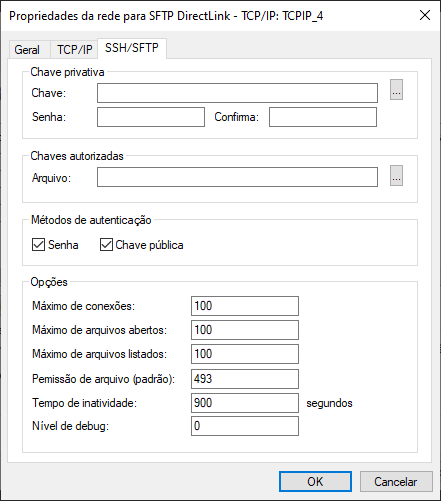

Campos         | Descrição
:------------  | :------
Chave Privativa| Este grupo está relacionado à chave privada utilizada pelo protocolo para autenticação e criptografia dos dados.
Chave          | Preencha este campo com o nome do arquivo (caminho completo) onde se encontra instalada a chave privativa.
Senha          | Preencha este campo com a senha que protege o arquivo de chave privativa.
Confirma      | Preencha este campo com a senha informada no campo senha para validação.
Chaves autorizadas     | As opções deste grupo estão relacionadas à chave autorizada para validação da conexão.
Arquivo     | Preencha este campo com o caminho do arquivo da chave autorizada para validação da conexão.
Métodos de autenticação     | Preencha este campo com o(s) método(s) que serão utilizados para conexão.
Máximo de conexões      | Preencha este campo com a quantidade máxima de conexões.
Máximo de arquivos abertos    | Preencha este campo com a quantidade máxima de arquivos que serão abertos nas conexões.
Máximo de arquivos listados   | Preencha este campo com a quantidade máxima de arquivos que serão listados nas conexões.
Permissão de arquivo  (padrão)  | Preencha este campo com a permissão dos arquivos (Read, Write, Execute).
Tempo de inatividade    | Preencha este campo com o tempo (em segundos) de inatividade da conexão.
Nível de debug   | Preencha este campo com o nível de detalhamento das informações que serão gravadas no arquivo de depuração.
----

Pressione o botão **OK** para prosseguir ou **Cancelar** para abandonar sem alterar as configurações.

### Monitor - TCP/IP

<span style="display:inline-block; width: 25px; height: 25px; border-radius: 50%; background-color: #0095C7; color: white; text-align: center; line-height: 25px; font-size: 14px; font-family: Arial;">1</span> &nbsp; Na guia **Geral**, configure as seguintes opções:

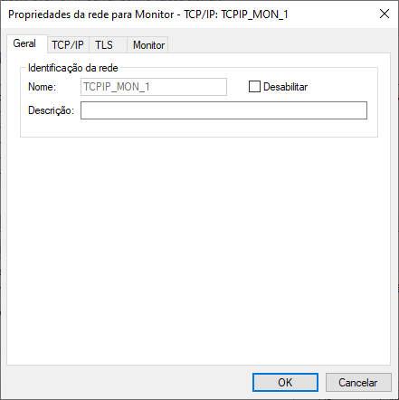

Campos | Descrição
:----  | :----
Nome   | Campo com o nome da interface de rede configurada.
Descrição| Preencha este campo com a descrição da interface de rede.
Desabilitar| Esta opção assinalada desabilita a interface de rede.
---

<span style="display:inline-block; width: 25px; height: 25px; border-radius: 50%; background-color: #0095C7; color: white; text-align: center; line-height: 25px; font-size: 14px; font-family: Arial;">2</span> &nbsp; Na guia **TCP/IP**, configure as seguintes opções:

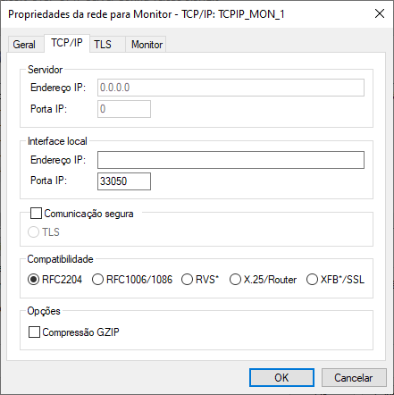

Campos     | Descrição
:----      | :----
Endereço IP| Preencha este campo com o endereço TCP/IP ou nome (DNS) da interface local para a qual o serviço STCP OFTP Server deve ser disponibilizado. <br> Obs.: Utilize o endereço 0.0.0.0 para habilitar o serviço sobre todas as interfaces de rede.
Porta IP   | Preencha este campo com a porta IP da interface local para a qual o serviço STCP OFTP Server deve ser disponibilizado. <br> Obs.: A porta padrão do serviço OFTP é a 3305.
Comunicação Segura| Esta opção assinalada habilita a utilização de criptografia na comunicação com o servidor STCP OFTP Server, você pode escolher entre a opção Nativa ou TLS. <br> Obs.: Antes de habilitar esta opção, leia atentamente o capítulo sobre Segurança.
TLS       | Configura a comunicação segura com criptografia e certificação digital, com a utilização da padronização definida na RFC2246 (TLS). O TLS é comumente encontrado nos servidores de sites seguros (HTTPS) e oferece o maior grau de segurança atualmente disponível. <br> Obs.: Antes de habilitar esta opção, confirme se o servidor com o qual você deseja se comunicar suporta esta característica.
Compatibilidade| Esta opção possibilita compatibilizar o STCP OFTP Server com diferentes produtos atualmente existentes no mercado.
RFC2204    | Esta opção de compatibilidade permite a comunicação do STCP OFTP Server com outros produtos que seguem a recomendação RFC2204.
RFC1006/RFC1086| Esta opção de compatibilidade permite a comunicação do STCP OFTP Server através de gateways de comunicação TCP-IP/X.25, que seguem a recomendação RFC1006/1086.
RVS*       | Esta opção de compatibilidade permite a comunicação do STCP OFTP Server com o produto RVS*. <br> Obs.: Esta opção não deve ser habilitada quando o servidor RVS* for uma versão do mainframe (grande porte).
X.25/Router | Esta opção de compatibilidade permite a comunicação do STCP OFTP Server através de roteadores com suporte à comunicação X.25 através de socket. <br> Obs.: Consulte a Riversoft sobre esta configuração se você estiver em dúvidas.
XFB*/SSL   | Habilita a compatibilidade do STCP com o XFB em conexões seguras SSL.
Compressão GZIP| Esta opção assinalada habilita a utilização da compressão GZIP onthe-fly (durante a transferência).  <br> Obs.: Antes de habilitar esta opção, confirme se o servidor com o qual você deseja se comunicar suporta esta característica.
----


  \*As marcas citadas são propriedade dos seus respectivos donos.


<span style="display:inline-block; width: 25px; height: 25px; border-radius: 50%; background-color: #0095C7; color: white; text-align: center; line-height: 25px; font-size: 14px; font-family: Arial;">3</span> &nbsp; Na guia **TLS**, configure as seguintes opções:

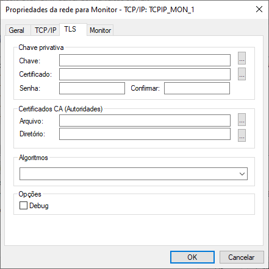

Campos         | Descrição
:------------  | :------
Chave Privativa| As opções deste grupo estão relacionadas às chaves pública e privada utilizadas pelo protocolo TLS para autenticação e criptografia dos dados. <br> Obs.: O arquivo da chave privativa deve estar no formato PKCS#12 e os certificados, no formato DER ou PEM.
Chave          | Preencha este campo com o nome do arquivo (caminho completo) onde se encontra instalada a chave privativa.
Certificado    | Preencha este campo com o nome do arquivo (caminho completo) onde se encontra instalado o certificado digital (X509) associado à chave privativa.
Senha          | Preencha este campo com a senha que protege o arquivo de chave privativa.
Confirmar      | Preencha este campo com a senha informada no campo senha para validação.
Certificados CA (Autoridade)| As opções deste grupo estão relacionadas aos certificados digitais das autoridades certificadoras (CA) que servirão para validar a autenticidade do certificado apresentado pelo servidor. <br> Obs.: O arquivo da chave privativa deve estar no formato PKCS#12 e os certificados no formato DER ou PEM.
Arquivo        | Preencha este campo com o nome do arquivo (caminho completo) onde se encontra instalado o certificado digital (X509) contendo a chave pública que assina o certificado apresentado pelo servidor.
Diretório      | Preencha este campo com o nome do diretório (caminho completo) onde se encontram instalados os certificados digitais (X509) contendo a chave pública que assina o certificado apresentado pelo servidor.
Algoritmos     | Preencha este campo com os nomes dos algoritmos suportados para assinatura digital, hashing e criptografia dos dados. <br> Obs.: Caso este campo não seja configurado, o protocolo TLS será selecionado automaticamente.
Debug          | Esta opção permite gerar um arquivo de depuração na pasta Debug do diretório de instalação do STCP.
----

<span style="display:inline-block; width: 25px; height: 25px; border-radius: 50%; background-color: #0095C7; color: white; text-align: center; line-height: 25px; font-size: 14px; font-family: Arial;">4</span> &nbsp; Na guia **Monitor**, configure as seguintes opções:

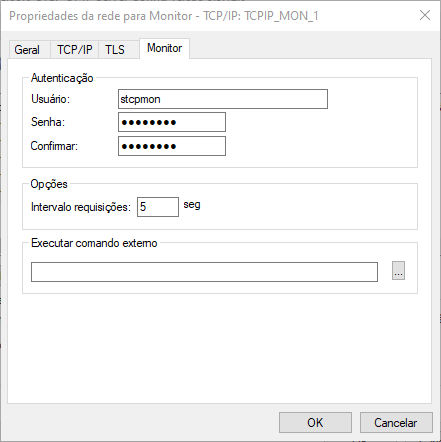

Campos         | Descrição
:------------  | :------
Usuário   | Preencha este campo com o nome do usuário da rede de supervisão.
Senha  | Preencha este campo com a senha do usuário que deve ser utilizada pelo rede de supervisão.
Confirmar      | Preencha este campo com a senha informada no campo senha para validação.
Intervalo de requisições | Esta opção assinalada o tempo (em segundos) de intervalo entre as requisições feitas.
Executar comando externo | Esta opção habilita a execução de um comando externo dentro do STCP <br> Exemplo: ````notepad````Abrir bloco de notas no Windows.
----

Pressione o botão **OK** para prosseguir ou **Cancelar** para abandonar sem alterar as configurações.

### Monitor - DirectLink

<span style="display:inline-block; width: 25px; height: 25px; border-radius: 50%; background-color: #0095C7; color: white; text-align: center; line-height: 25px; font-size: 14px; font-family: Arial;">1</span> &nbsp; Na guia **Geral**, configure as seguintes opções:


Campos | Descrição
:----  | :----
Nome   | Campo com o nome da interface de rede configurada.
Descrição| Preencha este campo com a descrição da interface de rede.
Desabilitar| Esta opção assinalada desabilita a interface de rede.
---

<span style="display:inline-block; width: 25px; height: 25px; border-radius: 50%; background-color: #0095C7; color: white; text-align: center; line-height: 25px; font-size: 14px; font-family: Arial;">2</span> &nbsp; Na guia **TCP/IP**, configure as seguintes opções:


Campos     | Descrição
:----      | :----
Endereço IP| Preencha este campo com o endereço TCP/IP ou nome (DNS) da interface local para a qual o serviço STCP OFTP Server deve ser disponibilizado. <br> Obs.: Utilize o endereço 0.0.0.0 para habilitar o serviço sobre todas as interfaces de rede.
Porta IP   | Preencha este campo com a porta IP da interface local para a qual o serviço STCP OFTP Server deve ser disponibilizado. <br> Obs.: A porta padrão do serviço OFTP é a 3305.
Comunicação Segura| Esta opção assinalada habilita a utilização de criptografia na comunicação com o servidor STCP OFTP Server, você pode escolher entre a opção Nativa ou TLS. <br> Obs.: Antes de habilitar esta opção, leia atentamente o capítulo sobre Segurança.
TLS       | Configura a comunicação segura com criptografia e certificação digital, com a utilização da padronização definida na RFC2246 (TLS). O TLS é comumente encontrado nos servidores de sites seguros (HTTPS) e oferece o maior grau de segurança atualmente disponível. <br> Obs.: Antes de habilitar esta opção, confirme se o servidor com o qual você deseja se comunicar suporta esta característica.
Compatibilidade| Esta opção possibilita compatibilizar o STCP OFTP Server com diferentes produtos atualmente existentes no mercado.
RFC2204    | Esta opção de compatibilidade permite a comunicação do STCP OFTP Server com outros produtos que seguem a recomendação RFC2204.
RFC1006/RFC1086| Esta opção de compatibilidade permite a comunicação do STCP OFTP Server através de gateways de comunicação TCP-IP/X.25, que seguem a recomendação RFC1006/1086.
RVS*       | Esta opção de compatibilidade permite a comunicação do STCP OFTP Server com o produto RVS*. <br> Obs.: Esta opção não deve ser habilitada quando o servidor RVS* for uma versão do mainframe (grande porte).
X.25/Router | Esta opção de compatibilidade permite a comunicação do STCP OFTP Server através de roteadores com suporte à comunicação X.25 através de socket. <br> Obs.: Consulte a Riversoft sobre esta configuração se você estiver em dúvidas.
XFB*/SSL   | Habilita a compatibilidade do STCP com o XFB em conexões seguras SSL.
Compressão GZIP| Esta opção assinalada habilita a utilização da compressão GZIP onthe-fly (durante a transferência).  <br> Obs.: Antes de habilitar esta opção, confirme se o servidor com o qual você deseja se comunicar suporta esta característica.
----


  \*As marcas citadas são propriedade dos seus respectivos donos.


<span style="display:inline-block; width: 25px; height: 25px; border-radius: 50%; background-color: #0095C7; color: white; text-align: center; line-height: 25px; font-size: 14px; font-family: Arial;">3</span> &nbsp; Na guia **TLS**, configure as seguintes opções:

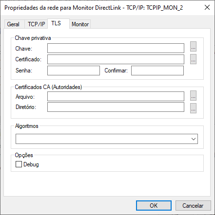

Campos         | Descrição
:------------  | :------
Chave Privativa| As opções deste grupo estão relacionadas às chaves pública e privada utilizadas pelo protocolo TLS para autenticação e criptografia dos dados. <br> Obs.: O arquivo da chave privativa deve estar no formato PKCS#12 e os certificados, no formato DER ou PEM.
Chave          | Preencha este campo com o nome do arquivo (caminho completo) onde se encontra instalada a chave privativa.
Certificado    | Preencha este campo com o nome do arquivo (caminho completo) onde se encontra instalado o certificado digital (X509) associado à chave privativa.
Senha          | Preencha este campo com a senha que protege o arquivo de chave privativa.
Confirmar      | Preencha este campo com a senha informada no campo senha para validação.
Certificados CA (Autoridade)| As opções deste grupo estão relacionadas aos certificados digitais das autoridades certificadoras (CA) que servirão para validar a autenticidade do certificado apresentado pelo servidor. <br> Obs.: O arquivo da chave privativa deve estar no formato PKCS#12 e os certificados no formato DER ou PEM.
Arquivo        | Preencha este campo com o nome do arquivo (caminho completo) onde se encontra instalado o certificado digital (X509) contendo a chave pública que assina o certificado apresentado pelo servidor.
Diretório      | Preencha este campo com o nome do diretório (caminho completo) onde se encontram instalados os certificados digitais (X509) contendo a chave pública que assina o certificado apresentado pelo servidor.
Algoritmos     | Preencha este campo com os nomes dos algoritmos suportados para assinatura digital, hashing e criptografia dos dados. <br> Obs.: Caso este campo não seja configurado, o protocolo TLS será selecionado automaticamente.
Debug          | Esta opção permite gerar um arquivo de depuração na pasta Debug do diretório de instalação do STCP.
----

<span style="display:inline-block; width: 25px; height: 25px; border-radius: 50%; background-color: #0095C7; color: white; text-align: center; line-height: 25px; font-size: 14px; font-family: Arial;">4</span> &nbsp; Na guia **Monitor**, configure as seguintes opções:

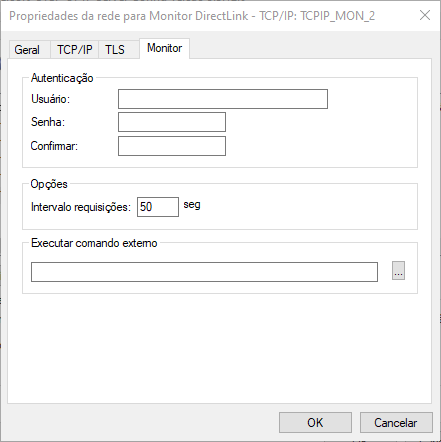

Campos         | Descrição
:------------  | :------
Usuário   | Preencha este campo com o nome do usuário da rede de supervisão.
Senha  | Preencha este campo com a senha do usuário que deve ser utilizada pelo rede de supervisão.
Confirmar      | Preencha este campo com a senha informada no campo senha para validação.
Intervalo de requisições | Esta opção assinalada o tempo (em segundos) de intervalo entre as requisições feitas.
Executar comando externo | Preencha este campo com o nome de um comando externo (programa ou bat) que deve ser executado.
----

Pressione o botão **OK** para prosseguir ou **Cancelar** para abandonar sem alterar as configurações.

## Usuários

Na guia **Usuários**, você poderá adicionar, remover, modificar ou copiar os parâmetros de configuração de um usuário do serviço STCP OFTP Server.

<span style="display:inline-block; width: 25px; height: 25px; border-radius: 50%; background-color: #0095C7; color: white; text-align: center; line-height: 25px; font-size: 14px; font-family: Arial;">1</span> &nbsp; Clique em **Adicionar**.

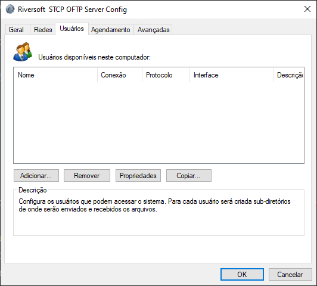


  Para um novo usuário adicionado, automaticamente, será criada uma estrutura de subdiretórios [(veja a estrutura de diretórios)](./#estrutura-dos-diretórios) para o envio e recepção dos arquivos, dentro do **Diretório de Dados** que foi previamente configurado na guia **Geral**.


<br>

<span style="display:inline-block; width: 25px; height: 25px; border-radius: 50%; background-color: #0095C7; color: white; text-align: center; line-height: 25px; font-size: 14px; font-family: Arial;">2</span> &nbsp; Preencha os campos com as informações descritas abaixo e clique em **OK**.

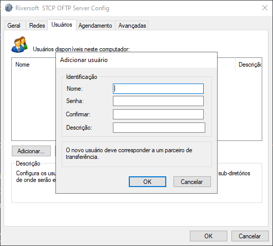

Campos | Descrição
:---   | :---
Nome   | Preencha este campo com o nome desejado para este usuário, que corresponde à identificação ODETTE (OID) do parceiro. <br> Obs.: Não utilize caracteres especiais.
Senha  | Preencha este campo com a senha de autenticação associada ao usuário. <br> Obs.: Tamanho máximo de oito (8) caracteres.
Confirmar| Preencha este campo com a senha de autenticação associada ao usuário para validação.
Descrição| Preencha este campo com a descrição de sua livre escolha.

Pressione o botão **OK** para gravar as configurações ou **Cancelar** para abandonar sem alterar as configurações.

### Geral

<!-- <span style="display:inline-block; width: 25px; height: 25px; border-radius: 50%; background-color: #0095C7; color: white; text-align: center; line-height: 25px; font-size: 14px; font-family: Arial;">3</span> &nbsp; -->

Nesta guia, configure as seguintes opções descritas abaixo:


Campos    | Descrição
:---      | :---
Descrição | Preencha este campo com a descrição de sua livre escolha.
Alterar senha| Esta opção permite alterar a senha do Usuário criado.
Email     | Este email deve estar associado à Caixa Postal e serve para o sistema de notificação.
Máximo de sessões| Este campo informa a quantidade máxima de sessões simultâneas de transferência que podem ser ativadas.
Bloquear usuário| Esta opção assinalada bloqueia temporariamente este usuário de realizar as operações de transferência.
Backup arquivos transmitidos| Esta opção assinalada habilita temporariamente este usuário a mover os arquivos transmitidos com sucesso para o subdiretório de backup. <br> Obs.: Os arquivos movidos para o diretório de backup contêm uma extensão no final do nome com a seguinte característica: YYYYMMDDhhmmss, onde YYYY é o ano, MM é o mês, DD é o dia, hh é a hora, mm são os segundos do término da transferência.
Nome longo para arquivos| Esta opção assinalada habilita temporariamente este usuário a transferir arquivos com nome maior que 26 (vinte e seis) posições. <br> Obs.: Não habilite esta opção se você não tiver absoluta certeza de que o parceiro remoto é outro STCP OFTP Server e que esteja também com esta característica habilitada.
Senha nunca expira| Esta opção assinalada impede que a senha expire.
Conexão automática| Esta opção assinalada habilita este usuário a iniciar uma conexão.
Protocolo| Este campo seleciona o tipo de protocolo de comunicação que este usuário irá utilizar para conexão. Após selecionar, pressione o botão Configurar para acessar a tela de configuração específica do protocolo de comunicação.

Selecione a opção de **Protocolo** desejada e clique em **Configurar**.

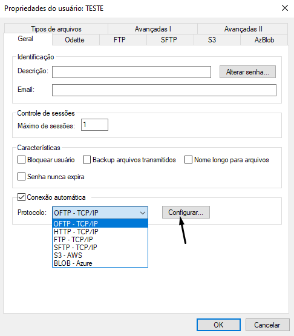

| Protocolo     |                                                Descrição                                                |
| :------------ | :-----------------------------------------------------------------------------------------------------: |
| OFTP - TCP/IP | Configura o STCP OFTP Server para utilizar o protocolo de comunicação TCP/IP através de uma rede local. |
| HTTP – TCP/IP |               Configura o STCP OFTP  para utilizar o protocolo de comunicação HTTP.               |
| FTP – TCP/IP  |               Configura o STCP OFTP Server para utilizar o protocolo de comunicação FTP.                |
| SFTP – TCP/IP |               Configura o STCP OFTP Server para utilizar o protocolo de comunicação SFTP.               |
| S3 – AWS      |            Configura o STCP OFTP Server para utilizar o protocolo de comunicação S3, da AWS.            |
| Blob – Azure  |        Configura o STCP OFTP Server para utilizar o protocolo de comunicação Blob, da Microsoft.        |
---


Clique [aqui](https://docs.aws.amazon.com/pt_br/AmazonS3/latest/userguide/Welcome.html) para mais informações sobre o **Amazon Simple Storage Service (S3)**.



  Clique [aqui](https://azure.microsoft.com/pt-br/products/storage/blobs) para mais informações sobre o **Armazenamento de Blobs do Azure**.


#### Protocolo OFTP

<span style="display:inline-block; width: 25px; height: 25px; border-radius: 50%; background-color: #0095C7; color: white; text-align: center; line-height: 25px; font-size: 14px; font-family: Arial;">1</span> &nbsp; Configure as seguintes opções na guia **TCP/IP**.

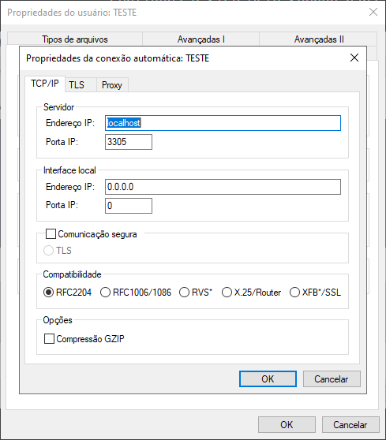

Campos     | Descrição
:---       | :---
Endereço IP| Preencha este campo com o endereço TCP/IP ou nome (DNS) do servidor STCP OFTP Server.
Porta IP   | Preencha este campo com a porta TCP/IP do servidor STCP OFTP Server.
Comunicação Segura| Esta opção assinalada habilita a utilização de criptografia na comunicação com o servidor STCP OFTP Server. Você pode escolher entre a opção Nativa ou SSL3. <br> Obs.: Antes de habilitar esta opção, leia atentamente o capítulo sobre Segurança.
TLS         | Configura a comunicação segura com criptografia e certificação digital, com a utilização da padronização definida na RFC2246 (TLS1/SSL3). O TLS1/SSL3 é comumente encontrado nos servidores de sites seguros (HTTPS) e oferece o maior grau de segurança atualmente disponível. <br> Obs.: Antes de habilitar esta opção, confirme se o servidor com o qual você deseja se comunicar suporta esta característica.
Compatibilidade| Esta opção possibilita compatibilizar o STCP OFTP Server com diferentes produtos atualmente existentes no mercado.
RFC2204      | Esta opção de compatibilidade permite a comunicação do STCP OFTP Server com outros produtos que seguem a recomendação RFC2204.
RFC1006/RFC1086| Esta opção de compatibilidade permite a comunicação do STCP OFTP Server através de gateways de comunicação TCP-IP/X.25, que seguem a recomendação RFC1006/1086.
RVS*| Esta opção de compatibilidade permite a comunicação do STCP OFTP Server com o produto RVS*. <br> Obs.: Esta opção não deve ser habilitada quando o servidor RVS* for uma versão do mainframe (grande porte).  * As marcas citadas são propriedade dos seus respectivos donos.
X25/Router| Esta opção de compatibilidade permite a comunicação do STCP OFTP Server através de roteadores com suporte à comunicação X.25 através de socket. <br> Obs.: Consulte a Riversoft sobre esta configuração se você estiver em dúvida.
XFB*/SSL  | Habilita a compatibilidade do STCP com o XFB em conexões seguras SSL.
Compressão GZIP| Esta opção assinalada habilita a utilização da compressão GZIP onthe-fly (durante a transferência).<br> Obs.: Antes de habilitar esta opção, confirme se o servidor com o qual você deseja se comunicar suporta esta característica.

<span style="display:inline-block; width: 25px; height: 25px; border-radius: 50%; background-color: #0095C7; color: white; text-align: center; line-height: 25px; font-size: 14px; font-family: Arial;">2</span> &nbsp; Na guia **TLS**, configure as seguintes opções para o protocolo **OFTP – TCP/IP**.

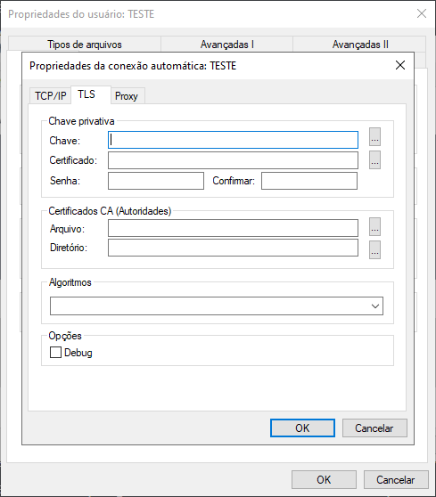

Campos | Descrição
:---   | :---
Chave Privativa| As opções deste grupo estão relacionadas às chaves pública e privada, utilizadas pelo protocolo TLS para autenticação e criptografia dos dados. <br> Obs.: O arquivo da chave privativa deve estar no formato PKCS#12 e os certificados, no formato DER ou PEM.
Chave  | Preencha este campo com o nome do arquivo (caminho completo) onde se encontra instalada a chave privativa.
Certificado| Preencha este campo com o nome do arquivo (caminho completo) onde se encontra instalado o certificado digital (X509) associado à chave privativa.
Senha  |Preencha este campo com a senha que protege o arquivo da chave privativa.
Confirmar| Preencha este campo com a senha informada no campo Senha para validação.
Certificados CA (Autoridade)| As opções deste grupo estão relacionadas aos certificados digitais das autoridades certificadoras (CA) que servirão para validar a autenticidade do certificado apresentado pelo servidor. <br> Obs.: O arquivo da chave privativa deve estar no formato PKCS#12 e os certificados, no formato DER ou PEM.
Arquivo  | Preencha este campo com o nome do arquivo (caminho completo) onde se encontra instalado o certificado digital (X509) contendo a chave pública que assina o certificado apresentado pelo servidor.
Diretório| Preencha este campo com o nome do diretório (caminho completo) onde se encontram instalados os certificados digitais (X509) contendo a chave pública que assina o certificado apresentado pelo servidor.
Algoritmos | Preencha este campo com os nomes dos algoritmos suportados para assinatura digital, hashing e criptografia dos dados. <br> Obs.: Caso este campo não seja configurado, o protocolo TLS1/SSL3 irá selecionar automaticamente.
Debug      | Esta opção permite criar um arquivo de depuração.

<span style="display:inline-block; width: 25px; height: 25px; border-radius: 50%; background-color: #0095C7; color: white; text-align: center; line-height: 25px; font-size: 14px; font-family: Arial;">3</span> &nbsp; Na guia **Proxy**, configure as seguintes opções para o protocolo **OFTP – TCP/IP**.

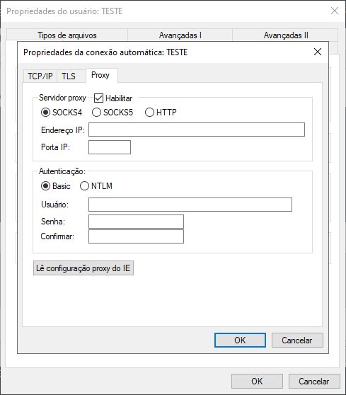

Campos | Descrição
:---   | :---
Servidor Proxy| As opções deste grupo possibilitam a configuração da comunicação através de um servidor Proxy.
Habilitar| Esta opção assinalada habilita a utilização de um servidor Proxy.
SOCKS4   | Esta opção habilita a utilização de um servidor Proxy em conformidade com a especificação SOCKS4.
SOCKS5   | Esta opção habilita a utilização de um servidor Proxy em conformidade com a recomendação RFC1928 (SOCKS5) e RFC1929. Obs.: O processo de autenticação utilizado é o definido na RFC1929.
HTTP     | Esta opção habilita a utilização de um servidor Proxy em conformidade com a recomendação RFC2817 (HTTP). <br> Obs.: O processo de autenticação utilizado é o Basic.
Endereço IP| Preencha este campo com o endereço TCP/IP ou nome (DNS) do servidor STCP Proxy.
Porta IP | Preencha este campo com a porta TCP/IP do servidor Proxy.
Autenticação| As opções deste grupo possibilitam a configuração do usuário e senha que serão informados ao servidor Proxy.
Basic    | Marque esta opção se o seu servidor Proxy suporta o modo de autenticação Basic.
NTLM     | Marque esta opção se o seu servidor Proxy suporta o modo de autenticação NTLM. Caso você utilize servidores Proxy da Microsoft, esta deve ser a opção preferencial.
Usuário  | Preencha este campo com o nome do usuário autorizado a utilizar o serviço de Proxy.
Senha    | Preencha este campo com a senha do usuário autorizado a utilizar o serviço de Proxy.
Confirmar |Preencha este campo com a senha informada no campo Senha para validação.
Lê configuração Proxy do IE |Pressione este botão para ler as configurações de Proxy configuradas no Internet Explorer. <br> Obs.: As informações de autenticação não serão lidas do IE.

Pressione o botão **OK** para prosseguir ou **Cancelar** para abandonar sem alterar as configurações.

Na guia **Avançadas**, configure as seguintes opções.

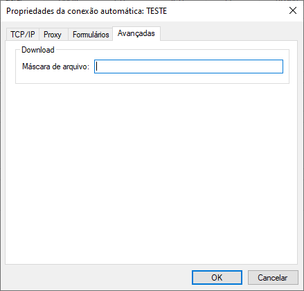

Campos | Descrição
:---   | :---
Máscara de arquivo| Através de expressão regular, esta opção serve para filtrar o que se deseja baixar.

#### Protocolo FTP

<span style="display:inline-block; width: 25px; height: 25px; border-radius: 50%; background-color: #0095C7; color: white; text-align: center; line-height: 25px; font-size: 14px; font-family: Arial;">1</span> &nbsp; Configure as seguintes opções na guia **TCP/IP**.


Campos | Descrição
:---   | :---
Endereço IP| Preencha este campo com o endereço TCP/IP ou nome (DNS) do servidor STCP OFTP Server.
Porta IP| Preencha este campo com a porta TCP/IP do servidor STCP OFTP Server. Obs.: A porta padrão do protocolo FTP é a 21.
TLS  | Configura a comunicação segura com criptografia e certificação digital, com a utilização da padronização definida na RFC2246 (TLS1/SSL3). O TLS1/SSL3 é comumente encontrado nos servidores de sites seguros (HTTPS) e oferece o maior grau de segurança atualmente disponível. <br> Obs.: Antes de habilitar esta opção, confirme se o servidor com o qual você deseja se comunicar suporta esta característica.
AUTH TLS| Habilita o processo de autenticação criptografado, garantindo a segurança na troca de senha.
AUTH SSL| Habilita o envio de um comando explícito para o servidor FTP a fim de utilizar a segurança SSL.
Tamanho máximo do buffer| Preencha este campo com o tamanho máximo dos blocos de dados que serão transferidos. O intervalo válido é de 1 até 65535.
FTP Passivo | XXXXXXXXXXXXXXXX.
------------------

<span style="display:inline-block; width: 25px; height: 25px; border-radius: 50%; background-color: #0095C7; color: white; text-align: center; line-height: 25px; font-size: 14px; font-family: Arial;">2</span> &nbsp; Na guia **Proxy**, configure as seguintes opções:

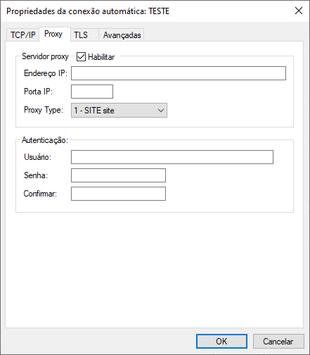

Campos     | Descrição
:---       | :---
Habilitar  | Esta opção assinalada habilita a utilização de um servidor Proxy.
Endereço IP| Preencha este campo com o endereço TCP/IP ou nome (DNS) do servidor STCP Proxy.
Porta IP   | Preencha este campo com a porta TCP/IP do servidor Proxy.
Proxy Type | Parâmetro utilizado para gerenciar as configurações do Firewall caso este seja utilizado na conexão FTP.
Usuário    | Preencha este campo com o nome do usuário autorizado a utilizar o serviço de Proxy.
Senha      |  Preencha este campo com a senha do usuário autorizado a utilizar o serviço de Proxy.
Confirmar  | Preencha este campo com a senha informada no campo Senha para validação.

<span style="display:inline-block; width: 25px; height: 25px; border-radius: 50%; background-color: #0095C7; color: white; text-align: center; line-height: 25px; font-size: 14px; font-family: Arial;">3</span> &nbsp; Na guia **TLS**, configure as seguintes opções:

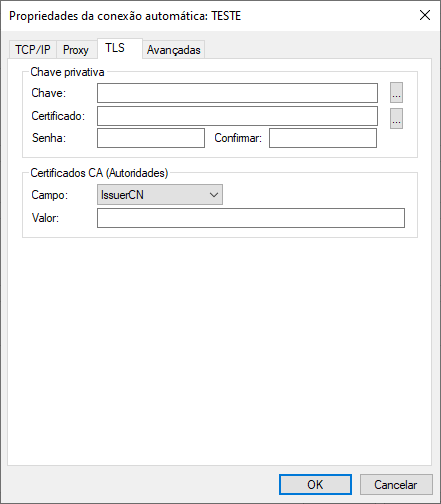

Campos         | Descrição
:---           | :---
Chave Privativa| As opções deste grupo estão relacionadas às chaves pública e privada utilizadas pelo protocolo TLS1/SSL3 para autenticação e criptografia dos dados. Obs.: O arquivo da chave privativa deve estar no formato PKCS#12 e os certificados, no formato DER ou PEM.
Chave          | Preencha este campo com o nome do arquivo (caminho completo) onde se encontra instalada a chave privativa. Certificado    | Preencha este campo com o nome do arquivo (caminho completo) onde se encontra instalado o certificado digital (X509) associado à chave privativa.
Senha          | Preencha este campo com a senha que protege o arquivo de chave privativa.
Confirmar      | Preencha este campo com a senha informada no campo senha para validação.
Certificados CA (Autoridade)| As opções deste grupo estão relacionadas aos certificados digitais das autoridades certificadoras (CA) que servirão para validar a autenticidade do certificado apresentado pelo servidor. <br> Obs.: O arquivo da chave privativa deve estar no formato PKCS#12 e os certificados no formato DER ou PEM.
Campo          | IssuerCN: Emissor do certificado. IssuerDN: Detalhes sobre o emissor. SubjectCN: Para quem foi emitido o certificado. SubjectDN: Detalhes sobre o usuário para quem foi emitido o certificado.
Valor          | O valor deste campo está relacionado aos certificados digitais das autoridades certificadoras (CA) que servirão para validar a autenticidade do certificado apresentado pelo servidor FTP.

<span style="display:inline-block; width: 25px; height: 25px; border-radius: 50%; background-color: #0095C7; color: white; text-align: center; line-height: 25px; font-size: 14px; font-family: Arial;">4</span> &nbsp; Na guia **Avançadas**, configure as seguintes opções:


Campos | Descrição
:---   | :---
Diretório remoto| Configura o diretório remoto de onde se deseja baixar o arquivo.
Diretório de backup| Configura o diretório de backup, que controla o processo de download e o torna eficaz, evitando a duplicidade de arquivos.
Extensão de backup |  Configura extensão para arquivo de backup no servidor remoto (FTP).
Máscara de arquivo | Através de expressão regular, esta opção serve para filtrar o que se deseja baixar.
Remover arquivo    | Esta opção permite ou não remover o arquivo do diretório do servidor de FTP.
Diretório remoto   | Configura o diretório remoto para onde se deseja subir o arquivo.
Diretório temporário| Configura o diretório temporário, que garante a integridade dos arquivos durante o upload.
Extensão temporária | Configura uma extensão temporária para arquivo no servidor remoto (FTP).

Pressione o botão **OK** para prosseguir ou **Cancelar** para abandonar sem alterar as configurações.

#### Protocolo SFTP

<span style="display:inline-block; width: 25px; height: 25px; border-radius: 50%; background-color: #0095C7; color: white; text-align: center; line-height: 25px; font-size: 14px; font-family: Arial;">1</span> &nbsp; Configure as seguintes opções na guia **TCP/IP**.

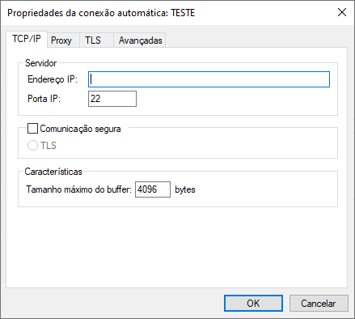

Campos      | Descrição
:---        | :---
Endereço IP | Preencha este campo com o endereço TCP/IP ou nome (DNS) do servidor STCP OFTP Server.
Porta IP    | Preencha este campo com a porta TCP/IP do servidor STCP OFTP Server.
SSL3        | Configura a comunicação segura com criptografia e certificação digital, com a utilização da padronização definida na RFC2246 (TLS1/SSL3). O TLS1/SSL3 é comumente encontrado nos servidores de sites seguros (HTTPS) e oferece o maior grau de segurança atualmente disponível. <br> Obs.: Antes de habilitar esta opção, confirme se o servidor com o qual você deseja se comunicar suporta esta característica.
Tamanho máximo do buffer| Preencha este campo com o tamanho máximo dos blocos de dados que serão transferidos. O intervalo válido é de 1 até 65535.

<span style="display:inline-block; width: 25px; height: 25px; border-radius: 50%; background-color: #0095C7; color: white; text-align: center; line-height: 25px; font-size: 14px; font-family: Arial;">2</span> &nbsp; Na guia **Proxy**, configure as seguintes opções.


Campos     | Descrição
:---       | :---
Habilitar  | Esta opção assinalada habilita a utilização de um servidor Proxy.
Endereço IP| Preencha este campo com o endereço TCP/IP ou nome (DNS) do servidor STCP Proxy.
Porta IP   | Preencha este campo com a porta TCP/IP do servidor Proxy.
Proxy Type | Parâmetro utilizado para gerenciar as configurações do Firewall caso este seja utilizado na conexão SFTP.
Usuário    | Preencha este campo com o nome do usuário autorizado a utilizar o serviço de Proxy.
Senha      | Preencha este campo com a senha do usuário autorizado a utilizar o serviço de Proxy.
Confirmar  | Preencha este campo com a senha informada no campo Senha para validação.

<span style="display:inline-block; width: 25px; height: 25px; border-radius: 50%; background-color: #0095C7; color: white; text-align: center; line-height: 25px; font-size: 14px; font-family: Arial;">3</span> &nbsp; Na guia **TLS**, configure as seguintes opções.


Campos   | Descrição
:---     | :---
Chave    | Preencha este campo com o nome do arquivo (caminho completo) onde se encontra instalada a chave privativa.
Senha    | Preencha este campo com a senha que protege o arquivo de chave privativa.
Confirmar| Preencha este campo com a senha informada no campo Senha para validação.
FingerPrint| Assinatura digital da chave privativa.

<span style="display:inline-block; width: 25px; height: 25px; border-radius: 50%; background-color: #0095C7; color: white; text-align: center; line-height: 25px; font-size: 14px; font-family: Arial;">4</span> &nbsp; Na guia **Avançadas**, configure as seguintes opções.


Campos             | Descrição
:---               | :---
Diretório remoto   | Configura o diretório remoto de onde se deseja baixar o arquivo.
Diretório de backup| Configura o diretório de backup, que controla o processo de download e o torna eficaz, evitando a duplicidade de arquivos.
Extensão de backup | Configura extensão para arquivo de backup no servidor remoto (SFTP).
Máscara de arquivo | Através de expressão regular, esta opção serve para filtrar o que se deseja baixar.
Remover arquivo    | Esta opção permite ou não remover o arquivo do diretório do servidor de SFTP.
Diretório remoto   | Configura o diretório remoto para onde se deseja subir o arquivo.
Diretório temporário| Configura o diretório temporário, que garante a integridade dos arquivos durante o upload.
Extensão temporária| Configura uma extensão temporária para arquivo no servidor remoto (SFTP).


### Odette

<span style="display:inline-block; width: 25px; height: 25px; border-radius: 50%; background-color: #0095C7; color: white; text-align: center; line-height: 25px; font-size: 14px; font-family: Arial;">4</span> &nbsp; Na guia **Odette**, preencha os campos com as informações descritas abaixo.


Campos | Descrição
:---   | :---
OID (Odette ID)| Preencha este campo com a identificação Odette associada a este usuário. Este campo poderá ter no máximo 25 (vinte e cinco) caracteres.
Senha  | Preencha este campo com a senha associada à identificação Odette. Este campo poderá ter no máximo oito (8) caracteres.
Confirmar | Preencha este campo com a senha informada no campo Senha para validação.
Userdata| Preencha este campo com os dados extras associados à identificação Odette informada. <br> Obs.: Preencha este campo somente se for requerido pelo servidor.
Características| As opções definidas neste grupo serão utilizadas pelo STCP OFTP Server na comunicação com o servidor Odette. <br> Obs.: Não modifique estas características sem ler atentamente o que significa cada uma delas e ter certeza de que realmente deseja fazê-lo.
Modo de transferência| Esta opção permite selecionar o modo de transferência que será utilizado para comunicação com o servidor, são eles: Both (transmissão e recepção de arquivos), Sender (somente transmissão de arquivos) e Receiver (somente recepção de arquivos).
Créditos| Preencha este campo com a quantidade de blocos de dados que serão transferidos até aguardar uma nova autorização para envio. <br> Obs.: O intervalo válido é de 1 até 99.
Tamanho máximo do buffer| Preencha este campo com o tamanho máximo dos blocos de dados que serão transferidos. O intervalo válido é de 1 até 65535.
Compressão| Esta opção assinalada habilita a compressão dos dados (padrão Odette) de uma transferência.
Restart| Esta opção assinalada habilita o controle de recuperação automática na interrupção de uma transferência. Com esta opção habilitada, o STCP OFTP Server irá recuperar a transferência do ponto de interrupção.
Special Logic| Esta opção assinalada habilita o controle do regime de comunicação lógica especial. Somente deve ser habilitado para comunicação através do protocolo PAD ou SERIAL. Obs.: Não habilite esta opção quando não for utilizado o Protocolo PAD ou SERIAL.
Tempo máximo de espera de pacote (T1)| Tempo máximo para detectar timeout de processo.
Tempo máximo de espera de pacote (T2)| Tempo máximo para detectar erros na recepção dos caracteres individuais.
Número máximo de retransmissões| Número máximo de retransmissões utilizando o controle do regime de comunicação de lógica especial.
Outros| As opções definidas neste grupo serão utilizadas localmente pelo STCP OFTP Server para controlar o tempo de inatividade e a geração do arquivo de depuração da comunicação.
Tempo máximo de inatividade| Preencha este campo com o tempo máximo de inatividade de comunicação entre o STCP OFTP Server e o computador remoto.
Nível de debug* | Preencha este campo com o nível de detalhamento das informações que serão gravadas no arquivo de depuração. Para obter no mesmo arquivo de depuração a informação dos diferentes níveis, preencha este campo com a soma dos níveis desejados. <br> Para acessar as informações detalhadas sobre o debug acesse a página de <a href="/utils/debug" target="_blank">Debug</a>  &nbsp;


*Somente habilite esta opção quando for solicitado por uma equipe especializada.


### FTP

Nesta seção, configure as seguintes opções.

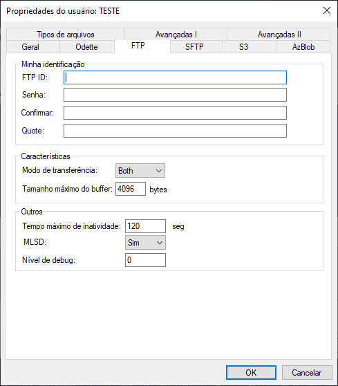

Campos   | Descrição
:---     | :---
FTP ID   |Identificação de acesso ao FTP.
Senha    | Senha de acesso ao FTP.
Confirmar| Preencha este campo com a senha informada no campo Senha para validação.
Userdata | Preencha este campo com os dados extras associados à identificação Odette informada. <br> Obs.: Preencha este campo somente se for requerido pelo servidor.
Modo de transferência| Esta opção permite selecionar o modo de transferência que será utilizado para comunicação com o servidor, são eles: Both (transmissão e recepção de arquivos), Sender (somente transmissão de arquivos) e Receiver (somente recepção de arquivos).
Tamanho máximo do buffer| Preencha este campo com o tamanho máximo dos blocos de dados que serão transferidos. O intervalo válido é de 1 até 65535
Tempo máximo de inatividade| Preencha este campo com o tempo máximo de inatividade de comunicação entre o STCP OFTP Server e o computador remoto.
Nível de Debug| Preencha este campo com o nível de detalhamento das informações que serão gravadas no arquivo de depuração. Para obter no mesmo arquivo de depuração a informação dos diferentes níveis, preencha este campo com a soma dos níveis desejados. <br> Obs.: Veja a tabela dos níveis de debug na configuração dos usuários.

### SFTP

Nesta seção, configure as seguintes opções.


Campos   | Descrição
:---     | :---
SFTP ID  | Identificação de acesso ao SFTP.
Senha    | Senha de acesso ao SFTP.
Confirmar| Preencha este campo com a senha informada no campo Senha para validação.
Userdata | Preencha este campo com os dados extras associados à identificação Odette informada. <br> Obs.: Preencha este campo somente se for requerido pelo servidor.
Modo de transferência| Esta opção permite selecionar o modo de transferência que será utilizado para comunicação com o servidor, são eles: Both (transmissão e recepção de arquivos), Sender (somente transmissão de arquivos) e Receiver (somente recepção de arquivos).
Tamanho máximo do buffer| Preencha este campo com o tamanho máximo dos blocos de dados que serão transferidos. O intervalo válido é de 1 até 65535.
Tempo máximo de inatividade| Preencha este campo com o tempo máximo de inatividade de comunicação entre o STCP OFTP Server e o computador remoto.
Nível de Debug| Preencha este campo com o nível de detalhamento das informações que serão gravadas no arquivo de depuração. Para obter no mesmo arquivo de depuração a informação dos diferentes níveis, preencha este campo com a soma dos níveis desejados. Obs.: Veja a tabela dos níveis de debug na configuração dos usuários.

### S3

Nesta seção, configure as seguintes opções:


Campos   | Descrição
:---     | :---
Chave de acesso ID (Access Key ID)  | Preencha este campo com a sequência de caracteres única associada a conta da AWS.
Segredo da chave  (Secret Access Key)  | Preencha este campo com a sequência de caracteres única associada a uma conta da AWS usada para provar a identidade do usuário ou da aplicação que está tentando acessar os recursos da AWS.
Token de acesso | Preencha este campo com a credencial temporária, utilizado como parte do processo de autenticação para acessar recursos na AWS. O token de acesso é fornecido juntamente com a Access Key ID e a Secret Access Key sempre que você usa credenciais temporárias.
Userdata | Preencha este campo com os dados extras associados à identificação Odette informada.
Modo de transferência | Esta opção permite selecionar o modo de transferência que será utilizado para comunicação com o servidor, são eles: **Both** (transmissão e recepção de arquivos), **Sender** (somente transmissão de arquivos) e **Receiver** (somente recepção de arquivos).
Tamanho máximo do buffer | Preencha este campo com o tamanho máximo dos blocos de dados que serão transferidos. O intervalo válido é de 1 até 65535.
Tempo máximo de inatividade | Preencha este campo com o tempo máximo de inatividade de comunicação entre o STCP OFTP Server e o servidor remoto.
Nível de Debug | Preencha este campo com o nível de detalhamento das informações que serão gravadas no arquivo de depuração. Para obter no mesmo arquivo de depuração a informação dos diferentes níveis, preencha este campo com a soma dos níveis desejados. <br> Obs.: Veja a <a href="/debug" target="_blank"> tabela dos níveis de debug </a>  na configuração dos usuários.

### AzBlob

Nesta seção, configure as seguintes opções:

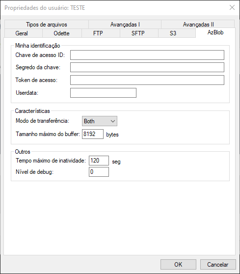

Campos   | Descrição
:---     | :---
Chave de acesso ID  | Preencha este campo com a chave para acessar a conta de armazenamento do Azure.
Segredo da chave    | Preencha este campo com a sequência de caracteres para autenticação.
Token de acesso | Preencha este campo com a credencial temporária, utilizado como parte do processo de autenticação.
Userdata | Preencha este campo com os dados extras associados à identificação informada.
Modo de transferência | Esta opção permite selecionar o modo de transferência que será utilizado para comunicação com o servidor, são eles: **Both** (transmissão e recepção de arquivos), **Sender** (somente transmissão de arquivos) e **Receiver** (somente recepção de arquivos).
Tamanho máximo do buffer | Preencha este campo com o tamanho máximo dos blocos de dados que serão transferidos. O intervalo válido é de 1 até 65535.
Tempo máximo de inatividade | Preencha este campo com o tempo máximo de inatividade de comunicação entre o STCP OFTP Server e o servidor remoto.
Nível de Debug | Preencha este campo com o nível de detalhamento das informações que serão gravadas no arquivo de depuração. Para obter no mesmo arquivo de depuração a informação dos diferentes níveis, preencha este campo com a soma dos níveis desejados. <br> Obs.: Veja a <a href="/debug" target="_blank"> tabela dos níveis de debug </a>  na configuração dos usuários.

### Avançadas I

Nesta seção, configure as seguintes opções para o usuário.


Campos              | Descrição
:---                | :---
Controle da conexão | As opções definidas neste grupo serão utilizadas pelo STCP OFTP Server para validar as informações da conexão (endereço IP, porta, endereço X.25, certificado SSL3 etc.).
Filtro da conexão   | Preencha este campo com uma expressão regular para validar as informações da conexão.
Executar comando no início da conexão|Preencha este campo com o nome de um comando externo (programa ou bat) que deve ser executado no início da conexão, imediatamente, após a identificação do usuário e antes de transferir (enviar ou receber) os arquivos.
Aguardar término da execução do comando| Esta opção assinalada habilita o STCP OFTP Server a aguardar o encerramento do comando externo. <br> Obs.: Utilize esta opção com cautela. Caso a aplicação necessite realizar operações complexas, mantenha esta opção desabilitada.
Executar comando no fim da conexão| Preencha este campo com o nome de um comando externo (programa ou bat) que deve ser executado ao final da conexão.
Aguardar término da execução do comando| Esta opção assinalada habilita o STCP OFTP Server a aguardar o encerramento do comando externo. <br> Obs.: Utilize esta opção com cautela. Caso a aplicação necessite realizar operações complexas, mantenha esta opção desabilitada.
Período de conexão| Início e término de uma conexão.
Início            | Início do intervalo do período de conexão.
Término           | Término do intervalo do período de conexão.
Dias da semana    | Informa os dias da semana em que a conexão poderá ocorrer.
Padrão            | Restaura configuração padrão para o período de conexão.

### Avançadas II

Nesta seção, configure as seguintes opções para o usuário.

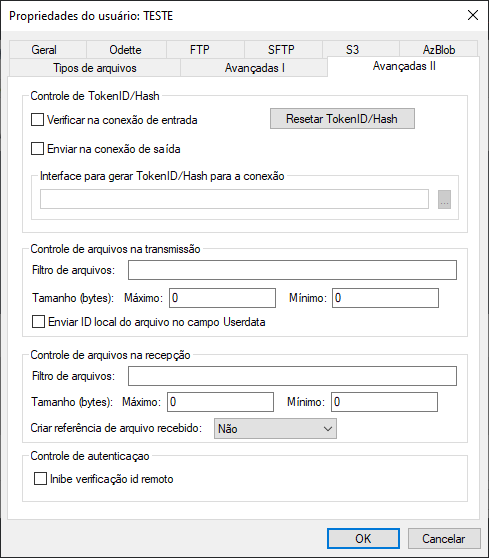

Campos | Descrição
:---   | :---
Verificar na conexão de entrada| Valida a informação do Hash de controle de máquina na conexão de entrada.
Enviar na conexão de saída| Esta opção assinalada habilita o envio de informações TolkenID/Hash e  é configurada quando utilizamos o STCP OFTP Server com a conexão automática habilitada.
Resetar TokenID/Hash| Apaga a informação do TolkenID ou Hash de controle de máquina.
Interface para gerar TokenID/Hash para a conexão| Parâmetro que informa a biblioteca utilizada para gerar as informações TolkenID/Hash para a conexão.
Controle de arquivos na transmissão| As opções definidas neste grupo serão utilizadas pelo STCP OFTP Server no tratamento da transmissão e recepção dos arquivos.
Filtro de arquivos| Preencha este campo com uma expressão regular para validar o nome do arquivo.
Tamanho máximo| Preencha este campo com o tamanho máximo que um arquivo pode ter para ser transferido.
Enviar ID local do arquivo no campo Userdata| Esta opção assinalada habilita o envio de um sequencial para o arquivo.
Controle de arquivos na recepção| As opções definidas neste grupo serão utilizadas pelo STCP OFTP Server para validar as informações da conexão (endereço IP, porta, endereço X.25, certificado SSL3 etc.).
Filtro de arquivos| Preencha este campo com uma expressão regular para validar o nome do arquivo.
Tamanho máximo| Preencha este campo com o tamanho máximo que um arquivo pode ter para ser transferido.
Criar referência de arquivo recebido| Esta opção controla a duplicidade de arquivo, criando uma referência do arquivo no diretório Restart.

## Agendamento

Você poderá adicionar, remover, modificar ou copiar os parâmetros de configuração de um agendamento do serviço STCP OFTP Server.

<span style="display:inline-block; width: 25px; height: 25px; border-radius: 50%; background-color: #0095C7; color: white; text-align: center; line-height: 25px; font-size: 14px; font-family: Arial;">1</span> &nbsp; Clique em **Adicionar**.

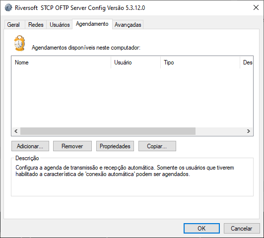

<span style="display:inline-block; width: 25px; height: 25px; border-radius: 50%; background-color: #0095C7; color: white; text-align: center; line-height: 25px; font-size: 14px; font-family: Arial;">2</span> &nbsp; Na guia **Geral**, preencha os campos com as informações descritas abaixo.


Campos              | Descrição
:---                | :---
Desabilitar         | Esta opção assinalada desabilita a execução do agendamento.
Nome                | Preencha este campo com o nome desejado para a nova agenda.
Descrição           | Preencha este campo com a descrição da nova agenda.
Agenda              |Este grupo de opções possibilita selecionar o modo de operação da agenda.  <br> Obs.: É possível desativar os campos que não sejam necessários para utilização no modo desejado.
Por data & hora     | Esta opção habilita o modo de funcionamento da agenda programado para a data e hora especificadas.
Por data & intervalo| Esta opção habilita o modo de funcionamento da agenda programado para a data especificada e intervalo de tempo contínuo.
Por intervalo       | Esta opção habilita o modo de funcionamento da agenda programado somente por intervalo de tempo continuo.
Iniciar conexão de saída para:| Este grupo de opções possibilita selecionar o modo de funcionamento da conexão para transferência. Obs.: Somente será iniciada uma conexão para o usuário que tenha habilitado e configurado a conexão automática.
Recepção            | Esta opção assinalada habilita a recepção de arquivos durante a execução do agendamento. <br> Obs.: Caso esta opção esteja habilitada, uma conexão será estabelecida para verificar se existe novo arquivo para receber.
Transmissão         | Esta opção assinalada habilita a transmissão de arquivos durante a execução deste agendamento. <br> Obs.: Caso esta opção esteja habilitada e não exista arquivo para transmitir, a conexão não será estabelecida.
Transmissão com recepção| Esta opção assinalada habilita a transmissão e recepção de arquivos durante a execução deste agendamento. <br> Obs.: Caso esta opção esteja habilitada e não exista arquivo para transmitir, a conexão não será estabelecida.
Usuário             | Selecione o usuário associado ao agendamento da conexão de saída neste campo.
Sessões             | Preencha este campo com a quantidade de sessões de transferência que devem ser ativadas. <br> Obs.: Esta quantidade deve ser inferior ou igual à quantidade de sessões configurada para o usuário.
Controle de arquivos na Transmissão e Recepção            | As opções definidas neste grupo serão utilizadas pelo STCP OFTP Server no tratamento das transferências (transmissão e recepção) deste agendamento. <br> Obs.: Estas configurações irão sobrepor as definidas para o usuário.
Filtro de Arquivos  | Preencha este campo com uma expressão regular para validar o nome do arquivo.
Tamanho máximo      | Preencha este campo com o tamanho máximo que um arquivo pode ter para ser transferido.
Executar Comando    | Esta opção assinalada habilita a execução de um comando externo (executável ou bat).
Comando             | Preencha este campo com o nome da aplicação (executável ou bat) a ser executada por este agendamento.

<span style="display:inline-block; width: 25px; height: 25px; border-radius: 50%; background-color: #0095C7; color: white; text-align: center; line-height: 25px; font-size: 14px; font-family: Arial;">3</span> &nbsp; Na guia **Avançadas**, configure o período do agendamento.

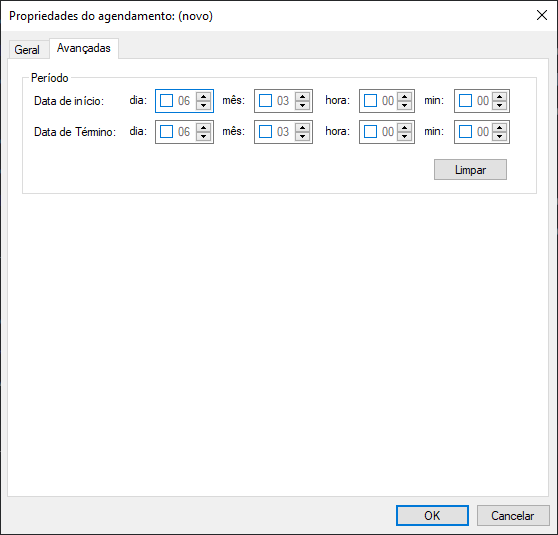

Campos         | Descrição
:---           | :---
Data de início | Marque a opção de hora de início da execução da agenda.
Data de Término| Marque a opção de hora de término da execução da agenda.
Limpar         | Clique em Limpar para desabilitar a data de início e de término da execução da agenda.

Pressione o botão **OK** para gravar as alterações ou **Cancelar** para retornar sem gravar as alterações.

## Avançadas

<span style="display:inline-block; width: 25px; height: 25px; border-radius: 50%; background-color: #0095C7; color: white; text-align: center; line-height: 25px; font-size: 14px; font-family: Arial;">1</span> &nbsp; Preencha os campos com as informações descritas.

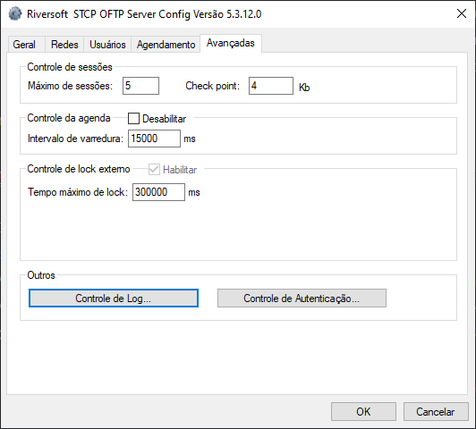

Campos            | Descrição
:---              | :---
Máximo de sessões | Este campo informa a quantidade máxima de sessões simultâneas de transferência que podem ser ativadas pelo serviço. <br> Obs.: Limitado a dez (10) sessões simultâneas na versão STCP OFTP Server Lite.
Check Point       | Preencha este campo com o múltiplo da quantidade de dados recebidos para que o STCP OFTP Server force uma gravação física do arquivo. No caso de uma interrupção da transferência, a sua recuperação ocorrerá a partir da última posição de check point corretamente gravada.
Desabilitar       | Desabilita o Controle da agenda.
Intervalo de varredura| Preencha este campo com o intervalo mínimo de processamento da agenda em milésimos de segundos.
Habilitar         | Habilita o Controle de lock externo.
Tempo máximo de lock| Tempo máximo que o arquivo permanece bloqueado.
Tempo de espera para uma nova tentativa| Tempo de espera para nova tentativa de processar o arquivo.
Máximo de tentativas| Número de tentativas de processar o arquivo.
Controle de log   | As opções deste grupo controlam as propriedades de configuração dos Logs do sistema.
Controle de autenticação| As opções deste grupo controlam o tipo de autenticação utilizado pelo STCP OFTP Server para validar um usuário. A autenticação está disponível pelo Sistema Operacional e a do STCP. <br> Obs.: Recomendamos a utilização da autenticação STCP.

<span style="display:inline-block; width: 25px; height: 25px; border-radius: 50%; background-color: #0095C7; color: white; text-align: center; line-height: 25px; font-size: 14px; font-family: Arial;">2</span> &nbsp; Em seguida, clique em **Controle de Log**

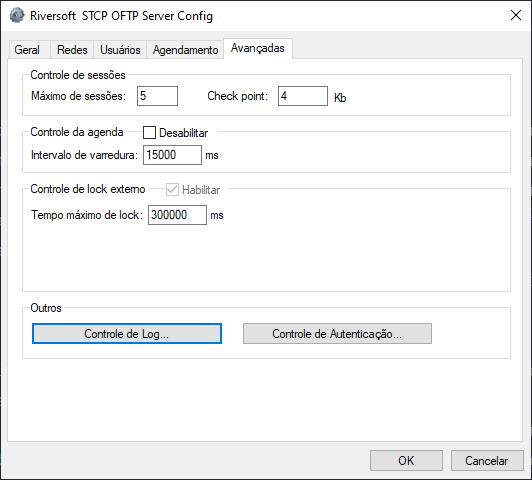

<span style="display:inline-block; width: 25px; height: 25px; border-radius: 50%; background-color: #0095C7; color: white; text-align: center; line-height: 25px; font-size: 14px; font-family: Arial;">3</span> &nbsp; Na guia **Geral**, preencha os seguintes campos.


Campos | Descrição
:---   | :---
Interface de Log (DLL)| Grava em arquivo de texto caso a DLL selecionada seja stcplogtxt.dll ou grava em Banco de dados se a DLL for logodbc.dll.
Gravar no arquivo de mensagem| Preencha este campo com o nível de evento que será armazenado no arquivo de mensagens.
Apresentar na console do STCP| Preencha este campo com o nível de evento que será mostrado na janela de mensagens do STCP OFTP Server.
Executar Comando Externo     | Preencha este campo com o nível de evento que irá disparar um comando externo (programa ou bat).
Comando Externo| Preencha este campo com o nome do comando externo (programa ou bat).
Aceitar        | Registra nos arquivos de log ou no Banco de dados do STCP.
Rejeitar       | Não registra nos arquivos de log ou no Banco de dados do STCP.
Comando para conexão ao banco de dados (ODBC)| String de conexão à fonte de dados ODBC. Informe DNS, usuário e senha.
Senha    | Digite a senha para acesso ao banco de dados.
Confirmar| Preencha este campo com a senha informada no campo Senha para validação.
Gravar arquivo de mensagem por usuário| Esta opção assinalada habilita a geração do arquivo de mensagens dos eventos para cada usuário. <br> Obs.: O arquivo de mensagens será gerado no subdiretório LOG de cada usuário.

**Tabela com a descrição do Nível do evento**

Nível do Evento | Descrição
:---            | :---
0               | Os eventos de início e término da aplicação.
1               | Os eventos que contenham algum erro.
2               | Os eventos de término da operação de cancelamento de espera de uma conexão.
3               | Os eventos de início e término de cancelamento das conexões.
4               | Os eventos de início e término de conexão com sucesso, início e término de sessão, início e término de transmissão ou início e término de recepção.
5               | Não definido.
6               | Não definido.
7               | Os eventos de início e término da unidade de processamento (threads).
8               | Os eventos de início e término da agenda.

> Obs.: Os eventos associados a um nível inferior ou igual ao selecionado serão processados.


Pressione o botão **OK** para prosseguir ou **Cancelar** para abandonar sem alterar as configurações.

<span style="display:inline-block; width: 25px; height: 25px; border-radius: 50%; background-color: #0095C7; color: white; text-align: center; line-height: 25px; font-size: 14px; font-family: Arial;">4</span> &nbsp; Clique em **Controle de Autenticação**


<span style="display:inline-block; width: 25px; height: 25px; border-radius: 50%; background-color: #0095C7; color: white; text-align: center; line-height: 25px; font-size: 14px; font-family: Arial;">5</span> &nbsp; Na guia **Geral**, preencha os seguintes campos.


Campos | Descrição
:---   | :---
Interface de Autenticação (DLL)| Parâmetro que informa a biblioteca utilizada para configurar a interface de autenticação do STCP.
Tipo   | Tipos de autenticação suportados pelo STCP OFTP Server: SO(Windows), STCP (Autenticação Nativa da aplicação), Securld/RSA, LDAP.

<span style="display:inline-block; width: 25px; height: 25px; border-radius: 50%; background-color: #0095C7; color: white; text-align: center; line-height: 25px; font-size: 14px; font-family: Arial;">6</span> &nbsp; Na guia **SO(Windows)**, preencha os seguintes campos.

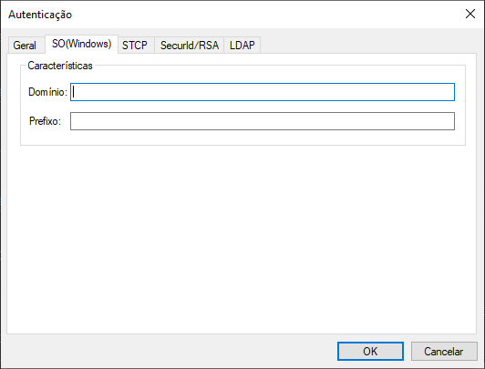


Campos  | Descrição
:---   | :---
Domínio | Domínio do sistema operacional.
Prefixo |Prefixo para mascarar o usuário.
-----

<span style="display:inline-block; width: 25px; height: 25px; border-radius: 50%; background-color: #0095C7; color: white; text-align: center; line-height: 25px; font-size: 14px; font-family: Arial;">7</span> &nbsp; Na guia **STCP**, habilite ou desabilite as seguintes opções.

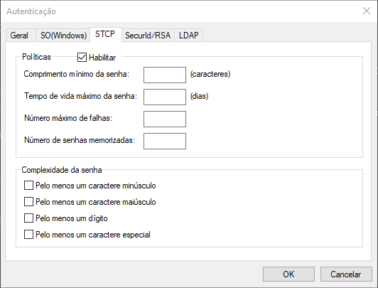

Campos    | Descrição
:---      | :---
Habilitar | Esta opção habilita as opções de política e de complexidade da senha.
Comprimento mínimo de senha| Número mínimo de caracteres que uma senha pode conter.
Tempo de vida máximo da senha| Quantidade máxima de dias para uma senha expirar.
Número máximo de falhas| Número máximo de tentativas de autenticação.
Número de senhas memorizadas| Quantidade de senhas que o STCP pode memorizar.
Pelo menos um caractere minúsculo| Esta opção assinalada força a criação de senhas com pelo menos um caractere minúsculo.
Pelo menos um caractere maiúsculo| Esta opção assinalada força a criação de senhas com pelo menos um caractere maiúsculo.
Pelo menos um dígito| Esta opção assinalada força a criação de senhas com pelo menos um caractere numérico.
Pelo menos um caractere especial| Esta opção assinalada força a criação de senhas com pelo menos um caractere especial.

<span style="display:inline-block; width: 25px; height: 25px; border-radius: 50%; background-color: #0095C7; color: white; text-align: center; line-height: 25px; font-size: 14px; font-family: Arial;">8</span> &nbsp; Na guia **Securld/RSA**, preencha o seguinte campo.


Campos | Descrição
:---   | ---
Arquivo de configuração| Parâmetro que informa as configurações para autenticação Securld/RSA.
------

<span style="display:inline-block; width: 25px; height: 25px; border-radius: 50%; background-color: #0095C7; color: white; text-align: center; line-height: 25px; font-size: 14px; font-family: Arial;">9</span> &nbsp; Na guia **LDAP**, preencha o seguinte campo.

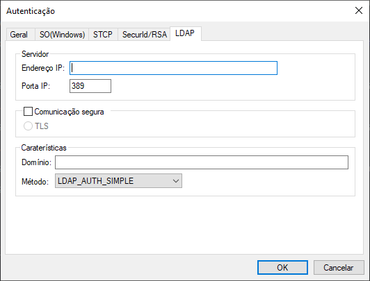

Campos     | Descrição
:---       | :---
Endereço IP| Preencha este campo com o endereço TCP/IP ou nome (DNS) do servidor STCP OFTP Server.
Porta IP   | Preencha este campo com a porta TCP/IP do servidor STCP OFTP Server. <br> Obs.: A porta padrão do serviço LDAP é a 389.
Comunicação segura| Esta opção assinalada habilita a utilização de criptografia na comunicação com o servidor STCP OFTP Server. <br> Obs.: Antes de habilitar esta opção, leia atentamente o capítulo sobre Segurança.
TLS       | Configura a comunicação segura com criptografia e certificação digital, com a utilização da padronização definida na RFC2246 (TLS). O TLS é comumente encontrado nos servidores de sites seguros (HTTPS) e oferece o maior grau de segurança atualmente disponível. <br> Obs.: Antes de habilitar esta opção, confirme se o servidor com o qual você deseja se comunicar suporta esta característica.
Domínio    | Domínio do servidor de autenticação.
Método     | Métodos utilizados pelo protocolo LDAP: LDAP_AUTH_SIMPLE, LDAP_AUTH_DIGEST, LDAP_AUTH_DPA, LDAP_AUTH_MSN, LDAP_AUTH_NEGOTIATE, LDAP_AUTH_NTLM, LDAP_AUTH_SICILY, LDAP_AUTH_SSPI

Pressione o botão **OK** para gravar as configurações ou **Cancelar** para abandonar sem alterar as configurações.

<span style="display:inline-block; width: 25px; height: 25px; border-radius: 50%; background-color: #0095C7; color: white; text-align: center; line-height: 25px; font-size: 14px; font-family: Arial;">10</span> &nbsp; Na guia **Usuários**, selecione o usuário e clique em **Propriedades**.

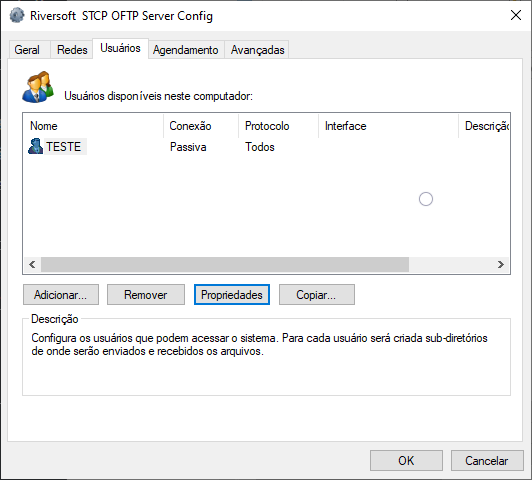

Após adicionar corretamente o Usuário, é necessário configurar os **Tipos de Arquivos.  Obs.: Ao pressionar o botão OK, somente as configurações da guia Geral e Avançadas serão gravadas.**

## Tipos de Arquivos

<span style="display:inline-block; width: 25px; height: 25px; border-radius: 50%; background-color: #0095C7; color: white; text-align: center; line-height: 25px; font-size: 14px; font-family: Arial;">1</span> &nbsp; Clique em **Adicionar**.


A configuração de um **Tipo de Arquivo** possibilita alterar algumas características na transferência do arquivo, tais como: conversão do nome ou formato do arquivo, conversão da codificação dos dados, inicialização de uma aplicação ou bat, entre outras.

O tipo **Default** sempre deverá existir e será utilizado nos casos em que não haja um tipo específico definido para a transferência em andamento.

A associação entre um **Tipo de arquivo** e o arquivo propriamente dito pode ser estabelecida de três formas distintas:

Tipo | Descrição
:--- | :---
1    | Através do nome do arquivo e o nome do tipo.
2    | Parte do nome do arquivo e os valores definidos nas propriedades de Prefixo e Sufixo do tipo.
3    | O nome do arquivo e os valores definidos em uma expressão regular.

> Obs.: Para informações mais detalhadas sobre expressão regular (RegEx), acesse o site [Rubular](https://rubular.com/).

A tabela abaixo demonstra a associação do nome do arquivo com o tipo específico:

Nome Tipo| Tipo| Prefixo| Sufixo| RegEx| Nome Arquivo| Associação
:--- |:--- |:--- |:--- |:--- |:--- |:---
TEST.0   | 1   | —      | —     | —    | TEST.0 /TEST.TXT| Sim /Não
TEST.1   | 2   | TEST   | —     | —    | TEST.TXT /TXT.TEST| Sim /Não
TEST.2   | 2   | —      | TEST  | —    |TXT.TEST /TXT.TXT| Sim /Não
TEST.3   | 3   | —      | —     | T.T  |TXT.TXT /TXTTXT| Sim /Não
Default  | —   | —      | —     | —    | TXTTXT | Sim

<span style="display:inline-block; width: 25px; height: 25px; border-radius: 50%; background-color: #0095C7; color: white; text-align: center; line-height: 25px; font-size: 14px; font-family: Arial;">2</span> &nbsp; Informe o Nome do novo tipo de arquivo e clique em **OK**.


Campos | Descrição
:---   | :---
Nome do novo tipo de arquivo| Preencha este campo com o nome desejado para o novo tipo. <br> Obs.: Não utilize caracteres especiais ou espaços em branco.

<span style="display:inline-block; width: 25px; height: 25px; border-radius: 50%; background-color: #0095C7; color: white; text-align: center; line-height: 25px; font-size: 14px; font-family: Arial;">3</span> &nbsp; Na guia **Geral**, configure as seguintes opções.


Campos | Descrição
:---   | :---
Verificar nome do arquivo por:| As opções definidas neste grupo serão utilizadas pelo STCP OFTP Server para definir a forma de associação do nome do arquivo com o tipo: Padrão (Default), Prefixo/Sufixo, Nome do tipo, Expressão regular. <br> Obs.: O nome do tipo associa o nome do arquivo ao nome do tipo de arquivo criado.
Prefixo| Preencha este campo com o prefixo do nome do arquivo que deve ser associado a este tipo.
Sufixo | Preencha este campo com o sufixo do nome do arquivo que deve ser associado a este tipo.
Expressão Regular (Regex)| Preencha este campo com a expressão regular que deve ser associada a este tipo.
Características da Transmissão| As opções definidas neste grupo serão utilizadas pelo STCP OFTP Server para definir as características do arquivo na transmissão.
Desabilitar| Esta opção permite desabilitar ou habilitar o tratamento do tipo de arquivo na transmissão.
Formato do registro| Esta opção permite selecionar o formato do registro do arquivo, são eles: Não Formatado, Fixo e Variável.  <br> Obs.: Somente utilize Fixo ou Variável quando o servidor Odette for uma versão de mainframe (grande porte) e esta característica estiver habilitada.
Tamanho| Preencha este campo com a quantidade de caracteres (bytes) que compõem o registro.  Obs.: Somente utilize esta opção quando o formato do registro for Fixo ou Variável.
Executar comando externo| Preencha este campo com o nome do comando externo (programa ou bat).
Comando a ser executado| Preencha este campo com o nome de uma aplicação ou arquivo de lote (bat) a ser executado após o envio, com sucesso, do arquivo.
Tabela conversão de dados| Esta opção permite selecionar a tabela de conversão dos dados na transmissão, são elas: Nenhuma, ANSI2E.TAB, ASC2EBC.TAB (converte de ASCII para EBCDIC), E2ANSI.TAB, EBC2ASC.TAB (converte de EBCDIC para ASCII), ODTA2E.TAB, ODTE2A.TAB, STDA2E.TAB e STDE2A.TAB.
Origem| Preencha este campo com a identificação Odette (OID) de origem do arquivo.  <br> Obs.: Quando o usuário é criado, este campo contém a identificação local.
Converte nome arquivo| Esta opção permite selecionar a conversão do nome do arquivo antes de transmitir, são elas: Não, maiúscula ou minúscula.
Destino| Preencha este campo com o a identificação Odette (OID) do destino deste arquivo.  <br> Obs.: Quando o usuário é criado, este campo contém a identificação remota.
Userdata| Preencha este campo com os dados extras associados à identificação Odette informada. <br> Obs.: Preencha este campo somente se for requerido pelo servidor.
Remover CR+LF| Esta opção permite habilitar ou desabilitar a remoção dos caracteres CR (Carriage Return) e LF (Line Feed) na transmissão do arquivo. <br> Obs.: Somente utilize esta opção quando o formato do registro for Fixo ou Variável.
Remover Timestamp| Esta opção permite habilitar ou desabilitar a remoção do timestamp externo do nome do arquivo.
Desabilitar| Esta opção permite desabilitar ou habilitar o tratamento do tipo de arquivo na recepção.
Executar comando externo| Preencha este campo com o nome do comando externo (programa ou bat).
Comando a ser executado| Preencha este campo com o nome de uma aplicação ou arquivo de lote (bat) a ser executado após a recepção com sucesso do arquivo.
Tabela conversão de dados| Esta opção permite selecionar a tabela de conversão dos dados na recepção, são elas: Nenhuma, ASC2EBC.TAB (converte de ASCII para EBCDIC)  e EBC2ASC.TAB (converte de EBCDIC para ASCII).
Converte nome arquivo| Esta opção permite selecionar a conversão do nome do arquivo antes de transmitir, são elas: Não, maiúscula ou minúscula.
Inserir CR+LF| Esta opção permite habilitar ou desabilitar a inserção dos caracteres CR (Carriage Return) e LF (Line Feed) na recepção do arquivo. <br> Obs.: Somente utilize esta opção quando o formato do registro for Fixo ou Variável.
Inserir Timestamp| Esta opção permite habilitar ou desabilitar a inserção do timestamp externo no nome do arquivo.
Sobrepor arquivo| Esta opção permite habilitar ou inibir a sobreposição do arquivo quando já existir um arquivo com o mesmo nome.
Inibir EERP| Esta opção permite habilitar ou desabilitar o envio do comando Odette EERP (End to End Response) ao final da recepção do arquivo com sucesso. <br> Obs.: Somente utilize esta opção se o servidor suportar esta característica.
EERP libera| Esta opção permite habilitar ou desabilitar o tratamento do arquivo recebido somente após o envio do Odette EERP (End to End Response). <br> Obs.: Somente utilize esta opção se o servidor suportar esta característica.

Pressione o botão **OK** para gravar as configurações ou **Cancelar** para abandonar sem alterar as configurações.

**Formato do Timestamp externo do arquivo**

A utilização do timestamp externo do arquivo tem o seguinte formato:

```
<nome do arquivo>.YYYYMMDDhhmmssnnn
```

`<nome do arquivo>`| Nome do arquivo sem caracteres especiais ou espaços.
:---              | :---
**YYYY**         | Ano
**MM**            | Mês
**DD**            | Dia
**Hh**            | Hora
**mm**            | Minuto
**ss**            | Segundos
**nnn**           | Milésimos de segundos

<span style="display:inline-block; width: 25px; height: 25px; border-radius: 50%; background-color: #0095C7; color: white; text-align: center; line-height: 25px; font-size: 14px; font-family: Arial;">4</span> &nbsp; Na guia **Avançadas**, configure as seguintes opções para o tipo de arquivo.

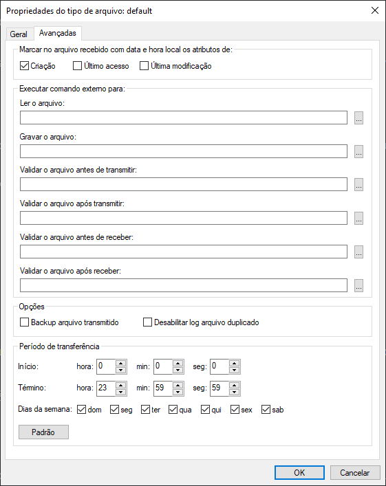

Campos | Descrição
:---   | :---
Marcar no arquivo recebido| Esta opção permite habilitar/desabilitar a inserção da data e hora
com data e hora local os atributos de:| local no arquivo recebido para os atributos correspondentes. <br> Obs.: A data e a hora do protocolo ODETTE serão utilizadas nos atributos desabilitados.
Ler o arquivo| Preencha este campo com o nome de um programa externo que será executado para realizar a leitura do arquivo.
Gravar o arquivo| Preencha este campo com o nome de um programa externo que será executado para realizar a gravação do arquivo.

**Validar o arquivo antes de transmitir**

Executa um comando externo para validar o arquivo antes de transmitir. Em caso de sucesso (Return code 0), o processo de transmissão será executado.


**Validar o arquivo após transmitir**

Executa comando para validar arquivo após a transmissão. Em caso de sucesso (Return code 0), o processo de transmissão será executado.


**Validar o arquivo antes de receber**

Executa um comando externo antes de receber o arquivo. Em caso de sucesso (Return code 0), o arquivo é fechado e a recepção, finalizada com sucesso.


**Validar o arquivo após receber**

Executa um comando externo após receber o arquivo, antes do fechamento do arquivo. Em caso de sucesso (Return code 0), o processo é finalizado com sucesso.


Backup arquivo transmitido | Esta opção assinalada habilita o backup dos arquivos transmitidos para este tipo.
:---                       | :---
Período de transferência   | Início e término de uma transferência.
Início                     | Início do intervalo do período de transferência.
Término                    | Término do intervalo do período de transferência.
Dias da semana             | Informa os dias da semana em que a transferência poderá ocorrer.
Padrão                     | Restaura configuração padrão para o período de transferência.

Pressionar o botão **OK** para gravar as configurações ou **Cancelar** para abandonar sem alterar as configurações.

## Chave privativa e Certificado TLS

Os seguintes procedimentos devem ser executados para a geração da chave privativa e do certificado digital a serem utilizados na comunicação TLS.

<span style="display:inline-block; width: 25px; height: 25px; border-radius: 50%; background-color: #0095C7; color: white; text-align: center; line-height: 25px; font-size: 14px; font-family: Arial;">1</span> &nbsp; No prompt de comando, execute a aplicação **openssl.exe** (Ex.: C:\STCPODT\Program\openssl.exe) para iniciar o processo de geração do par de chaves assimétricas (privada/pública).


<span style="display:inline-block; width: 25px; height: 25px; border-radius: 50%; background-color: #0095C7; color: white; text-align: center; line-height: 25px; font-size: 14px; font-family: Arial;">2</span> &nbsp; Utilize o comando abaixo para gerar a chave privativa que será utilizada para criptografia da conexão.

```pshell
genrsa -out[unidade_disco][diretorio_instalação_stcp]\keys\[nome_da_chave].key 1024
```

Exemplo:

```pshell
genrsa –out c:\stcpodt\keys\stcp_abcde.key 1024
```


<span style="display:inline-block; width: 25px; height: 25px; border-radius: 50%; background-color: #0095C7; color: white; text-align: center; line-height: 25px; font-size: 14px; font-family: Arial;">3</span> &nbsp; O próximo passo é gerar o Certificado Digital associado à chave gerada anteriormente. Para isso, utilize o comando abaixo.

```pshell
req –new –x509 –key [unidade_disco][diretório_instalação_stcp]\keys\[nome_da_chave].key –out [unidade_disco][diretório_instalação_stcp]\certs\[nome_do_certificado].cer –days 1825 –config ./openssl.cnf
```

Exemplo:

```pshell
req –new –x509 –key c:\stcpodt\keys\stcp_interprint.key –out c:\stcpodt\certs\stcp_abcde.cer –days 1825 –config ./openssl.cnf
```
<span style="display:inline-block; width: 25px; height: 25px; border-radius: 50%; background-color: #0095C7; color: white; text-align: center; line-height: 25px; font-size: 14px; font-family: Arial;">4</span> &nbsp; Preencha as informações solicitadas para concluir o processo de geração do Certificado Digital.


## Comunicação TLS

<span style="display:inline-block; width: 25px; height: 25px; border-radius: 50%; background-color: #0095C7; color: white; text-align: center; line-height: 25px; font-size: 14px; font-family: Arial;">1</span> &nbsp; Para acessar o configurador do STCP OFTP Server Enterprise/Lite, clique em **Iniciar** e depois, em **Riversoft STCP OFTP Server Config**.

<span style="display:inline-block; width: 25px; height: 25px; border-radius: 50%; background-color: #0095C7; color: white; text-align: center; line-height: 25px; font-size: 14px; font-family: Arial;">2</span> &nbsp; Acesse a guia **Redes** para adicionar as interfaces que ficarão disponíveis para o serviço de transferência e adicione uma interface do serviço de transferência.


<span style="display:inline-block; width: 25px; height: 25px; border-radius: 50%; background-color: #0095C7; color: white; text-align: center; line-height: 25px; font-size: 14px; font-family: Arial;">3</span> &nbsp; Clique em **Adicionar** e selecione o protocolo **OFTP – TCP/IP**.

<span style="display:inline-block; width: 25px; height: 25px; border-radius: 50%; background-color: #0095C7; color: white; text-align: center; line-height: 25px; font-size: 14px; font-family: Arial;">4</span> &nbsp; Clique em **OK** para entrar nas configurações.

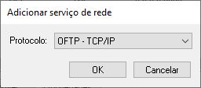

<span style="display:inline-block; width: 25px; height: 25px; border-radius: 50%; background-color: #0095C7; color: white; text-align: center; line-height: 25px; font-size: 14px; font-family: Arial;">5</span> &nbsp; Clique na guia **TCP/IP** e configure os parâmetros apresentados.


<span style="display:inline-block; width: 25px; height: 25px; border-radius: 50%; background-color: #0095C7; color: white; text-align: center; line-height: 25px; font-size: 14px; font-family: Arial;">6</span> &nbsp; Clique na guia **TLS**, configure os parâmetros apresentados abaixo e pressione o botão **OK** para finalizar.


## Estrutura dos diretórios

Após a instalação e configuração da aplicação, irá criar a seguinte árvore de diretórios onde serão armazenadas as informações de configuração, logs e controle.


  

    
      
      

      
        
        
      

      
        
      

      
      

      
        
        

        
        
      

      
      


    

    
    

    
    

    
    

    
      
    

    
      
      
      
      
      
      
      
      
    

    
      
      
      
      
      
      
      
      
      
      
      
      
      
      
      
      
      
      
      
      
      
      
      
      
      
      
      
      
      
      
      
      
      
      
      
      
      
    

    
    

    
    

    
    
    
    
    

  



