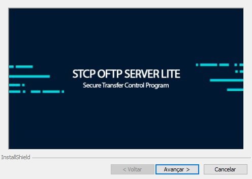
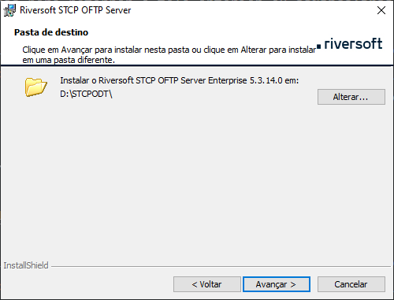
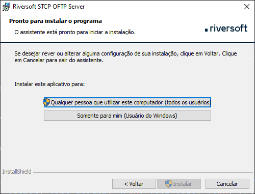
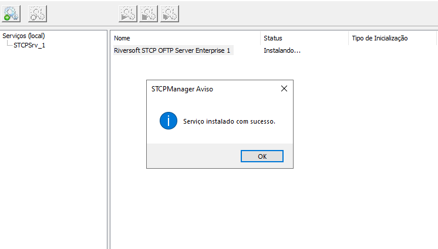

## Requisitos 

Confira os requisitos de software e hardware da aplicação: 

- Processador de 2 gigahertz (GHz);
- 2 gigabytes (GB) de RAM;
- 150 megabytes (MB) de espaço disponível em disco rígido para o aplicativo; 1
- Sistema operacional Windows 10/11/2012/2016/2019/2022; 2
- Banco de dados (SQL Server, MySQL, MariaDB, Oracle); 3
- Driver ODBC para conexão com o Banco de Dados.


  1 O espaço disponível para os arquivos transferidos dependerá do volume e política de armazenamento de dados adotada.



  2 Server with Desktop Experience.



  3 Para versão STCP OFTP Server Enterprise.


## Distribuição dos pacotes

O pacote de instalação será distribuído através de um link, disponibilizado pela Equipe de Sustentação da Riversoft.

Após extrair o zip com o arquivo executável, os seguintes passos devem ser executados:

Clique no arquivo executável para iniciar o processo de instalação.

Esta é a tela de boas-vindas, clique em **Avançar** para continuar.

Pressione **Voltar** para retornar à tela anterior ou **Cancelar** para interromper o processo de instalação.

Leia cuidadosamente o **Contrato de Licença de Uso do Usuário Final** e caso concorde com os termos propostos, marque a opção correspondente e pressione o botão **Avançar** para prosseguir com a instalação.

Pressione **Voltar** para retornar à tela anterior ou **Cancelar** para interromper o processo de instalação.

Na tela **Informações do cliente**, informe o Nome do usuário e Empresa.

Clique em **Avançar** para continuar a instalação.

Pressione **Voltar** para retornar à tela anterior ou **Cancelar** para cancelar todo o processo de instalação.

Na tela **Pasta de destino**, clique em **Avançar** para instalar no diretório padrão ou **Alterar** para selecionar outro diretório ou criar um novo.

Pressione **Voltar** para retornar à tela anterior ou **Cancelar** para interromper o processo de instalação.

Na tela **Pronto para instalar o programa**, verifique se as configurações escolhidas estão corretas e clique em **Instalar** para continuar.

Pressione **Voltar** para retornar à tela anterior ou **Cancelar** para interromper o processo de instalação.

Por fim, clique em **Concluir** para finalizar a instalação.

## Estrutura dos diretórios

Após a instalação da aplicação, a seguinte árvore de diretórios será criada onde serão armazenadas as informações de configuração, logs e controle.


  

    
      
      

      
        
        
      

      
        
      

      
      

      
        
        

        
        
      

      
      

    

    
    

    
    

    
    

    
      
    

    
      
      
      
      
      
      
      
      
    

    
      
      
      
      
      
      
      
      
      
      
      
      
      
      
      
      
      
      
      
      
      
      
      
      
      
      
      
      
      
      
      
      
      
      
      
      
      
    

    
    

    
    

    
    
    
    
    

  



Para cada **usuário** configurado no serviço, é criado um conjunto individual de subdiretórios para controle das transferências e integração com as aplicações externas, conforme mostra a tabela abaixo:

| <Diretório de Dados>\       | Subdiretório de dados configurado.                                                                                       |
| :-------------------------- | :----------------------------------------------------------------------------------------------------------------------- |
| **<Diretório do Usuário>**\ | Subdiretório individual do usuário.                                                                                      |
| **CONTROLE**                | Subdiretório de controle da aplicação.                                                                                   |
| **ENTRADA**\                | Subdiretório onde os arquivos recebidos com sucesso serão disponibilizados.                                              |
| **RESTART**                 | Subdiretório onde os arquivos que estão em processo de recepção são armazenados temporariamente.                         |
| **FORMATO**                 | Subdiretório que contém as definições dos tipos de arquivos.                                                             |
| **LOG**                     | Subdiretório onde serão armazenados os arquivos de eventos e registro das transferências.                                |
| **SAIDA**\                  | Subdiretório onde os arquivos a serem enviados devem ser disponibilizados.                                               |
| **BACKUP**                  | Subdiretório onde os arquivos enviados com sucesso serão armazenados se a opção de backup do usuário estiver habilitada. |
| **PENDENTE**                | Subdiretório onde o arquivo de controle da transmissão será armazenado temporariamente.                                  |
| **TEMP**                    | Subdiretório de uso geral.                                                                                               |

Para **transmitir**, os arquivos devem ser disponibilizados no subdiretório **SAIDA** e os arquivos recebidos estarão no subdiretório **ENTRADA**.

## Serviço do STCP OFTP Server

Para que sejá possível criar e iniciar o serviço do STCP OFTP Server, utilizaremos o **STCP OFTP Server Manager**.

O STCP OFTP Server Manager é um sistema gerenciador de serviços STCP, que é similar ao gerenciador de serviços do Windows, embora seja usado somente para manipular serviços da família de **produtos do STCP**.

Esse sistema permite que seja instalado/desinstalado o serviço do Riversoft STCP OFTP Server Enterprise (STCPSrv_1) ou Lite (STCPSrvLite_1).

Também é permitido iniciar, parar e reiniciar um serviço, desde que se tenham as permissões apropriadas.

Acesse o STCP OFTP Server Configuration Manager (**Iniciar - Todos os programas - Riversoft STCP OFTP Server**), selecione o serviço _Riversoft STCP OFTP Server Enterprise 1/Lite 1_ e clique no botão _Instalar serviço_.

Uma mensagem confirmando que o serviço foi instalado com sucesso será exibida. Clique em _OK_ para finalizar.

Selecione o serviço recém-criado e clique no botão _Iniciar_.

O serviço será iniciado e seu status alterado para _Iniciado_. Esse servico também pode ser criado e removido pelo prompt de comando (cmd) do sistema operacional.

 

