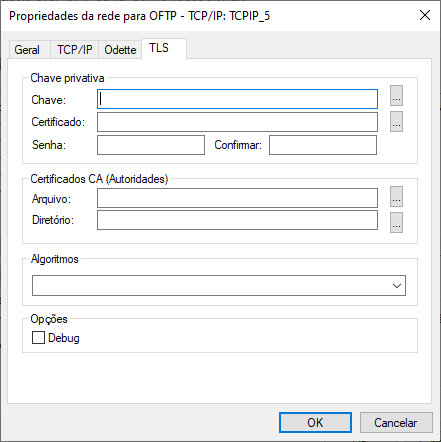
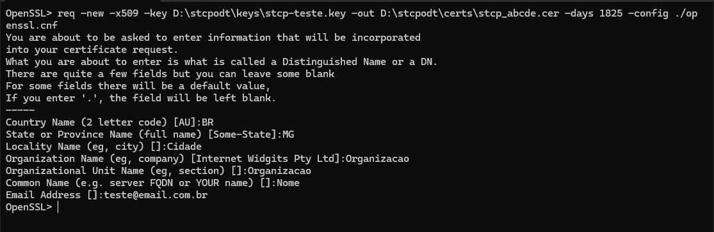
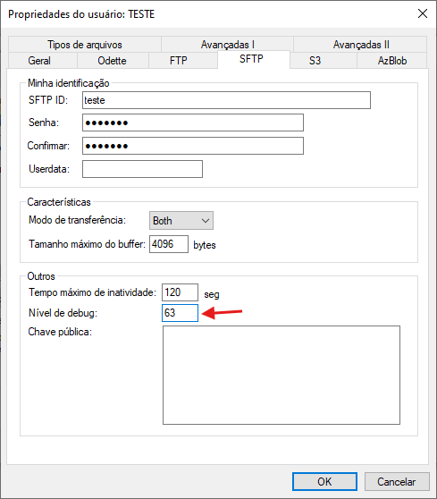
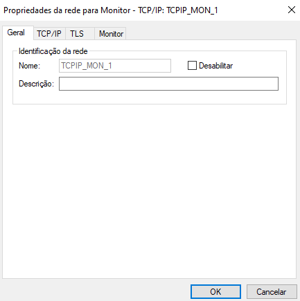
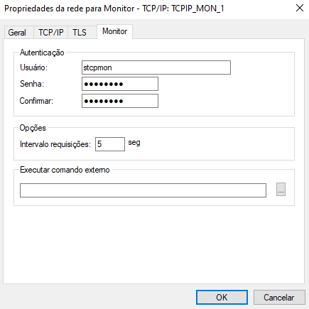

## Configurador

O programa de configuração do STCP OFTP Server foi instalado na pasta selecionada durante o processo de instalação e pode ser acessado através do menu **Iniciar**. Caso você não tenha alterado a pasta padrão, execute os seguintes passos:

 No menu **Iniciar** pesquise por **Riversoft STCP OFTP Server Config**.


 Clique no programa **Riversoft STCP OFTP Server Config**.

O programa de configuração pode ser acessado também na pasta **Program** da aplicação, conforme exemplo de estrutura abaixo:

```
*:\STCPODT\Program\Riversoft STCP OFTP Server Config
```


  
    
       
        
      
    
  


## Informações gerais

Na guia **Geral** preencha os campos com as informações de identificação descritas abaixo.


| Campos                | Descrição                                                                                                                                                                                                                                                      |
| :-------------------- | :------------------------------------------------------------------------------------------------------------------------------------------------------------------------------------------------------------------------------------------------------------- |
| Nome                  | Este campo informa o nome do serviço do STCP OFTP Server.                                                                                                                                                                                                      |
| Descrição             | Este campo informa a descrição do serviço do STCP OFTP Server.                                                                                                                                                                                                 |
| Utilizar login        | Esta opção assinalada habilita a utilização de uma conta do sistema operacional pelo serviço STCP OFTP Server. <br> Obs.: Sempre que o diretório de dados selecionado for uma unidade de rede, esta opção deverá ser habilitada.                               |
| Usuário               | Preencha este campo com o nome do usuário que deve ser utilizado pelo serviço STCP OFTP Server.                                                                                                                                                                |
| Senha                 | Preencha este campo com a senha do usuário que deve ser utilizado pelo serviço STCP OFTP Server.                                                                                                                                                               |
| Confirmar             | Preencha este campo com a senha do usuário para ser validada.                                                                                                                                                                                                  |
| Diretório de controle | Este campo informa o nome do diretório de instalação do STCP OFTP Server onde serão armazenadas as configurações dos usuários, logs e arquivos de depuração da comunicação. <br> Obs.: Para a versão STCP OFTP Server, este parâmetro não pode ser modificado. |
| Diretório de dados    | Preencha este campo com o diretório, onde a estrutura de subdiretórios para envio e recepção dos arquivos de cada usuário deverá ser criada.  <br> Obs.: Esta configuração deve ser alterada antes da criação dos usuários.                                    |
| Número de série*      | Preencha este campo com o número de série que é disponibilizado pela Riversoft. <br>                                                                                                                                                                                          |

> [!WARNING] Atenção
> <span style="color:red;">*</span> Parâmetros obrigatórios
----

## Redes

Nesta guia, você poderá adicionar, remover ou modificar os parâmetros das interfaces de redes controladas pelo serviço do STCP OFTP Server.

Clique em **Adicionar**.


> O STCP OFTP Server oferece a capacidade de configurar múltiplas interfaces de redes com diferentes protocolos de comunicação, como TCP/IP, além da opção de implementar medidas de segurança adicionais através de protocolos como SFTP, HTTPS e TLS.

> [!NOTE] Aviso:
> As configurações de Redes somente serão utilizadas para as conexões entrantes (inbound).

Selecione um serviço de rede e clique em **OK**.

| Protocolo                   | Descrição                                                                                                                                                                                                                                 |
| :-------------------------- | :---------------------------------------------------------------------------------------------------------------------------------------------------------------------------------------------------------------------------------------- |
| OFTP - TCP/IP               | Configura o STCP OFTP Server para utilizar o protocolo de comunicação TCP/IP.                                                                                                                                                             |
| API DirectLink - HTTP/S*     | Configura o STCP Server para comunicar com com a API do DirectLink. |
| SFTP DirectLink – TCP/IP    | Configura o STCP Server para se comunicar via protocolo SFTP com o DirectLink.                                                                                                                              |
| Monitor – TCP/IP            | Habilita a rede para supervisão do STCP através do protocolo TCP/IP.                                                                                                                                                                      |
| Monitor DirectLink - TCP/IP | Habilita a rede para supervisão do DirectLink através do protocolo TCP/IP.                                                                                                                                                                |

> [!NOTE] Nota:
> <span style="color:red;">*</span> <a href="/stcpdirectlink/api/" target="_blank">Acesse a seção de API do DirectLink para mais informações</a>  &nbsp;

### Configurar uma porta TLS

Acesse o configurador do STCP Server: **Riversoft STCP OFTP Server Config**.

Acesse a guia **Redes** para adicionar as interfaces que ficarão disponíveis para o serviço de transferência e adicione uma interface do serviço de transferência.


Clique em **Adicionar** e selecione o protocolo **OFTP – TCP/IP**.

Clique em **OK** para entrar nas configurações.


Preencha as informações na guia **Geral** antes de prosseguir.


Clique na guia **TCP/IP** e configure os parâmetros apresentados.


Clique na guia **Odette** e configure os parâmetros apresentados.


Agora, na guia **TLS**, configure os parâmetros apresentados abaixo e pressione o botão **OK** para finalizar.



### Chave privativa e certificado

Os seguintes procedimentos devem ser executados para a geração da chave privativa e do certificado digital a serem utilizados na comunicação TLS.

No prompt de comando, execute a aplicação **openssl.exe** (Ex.: C:\STCPODT\Program\openssl.exe) para iniciar o processo de geração do par de chaves assimétricas (privada/pública).


Utilize o comando abaixo para gerar a chave privativa que será utilizada para criptografia da conexão.

```shell
genrsa -out[unidade_disco][diretorio_instalação_stcp]\keys\[nome_da_chave].key 1024
```

Exemplo:

```bin
genrsa –out c:\stcpodt\keys\stcp_abcde.key 1024
```


O próximo passo é gerar o Certificado Digital associado à chave gerada anteriormente. Para isso, utilize o comando abaixo.

```bin
req –new –x509 –key [unidade_disco][diretório_instalação_stcp]\keys\[nome_da_chave].key –out [unidade_disco][diretório_instalação_stcp]\certs\[nome_do_certificado].cer –days 1825 –config ./openssl.cnf
```

Exemplo:

```bin
req –new –x509 –key c:\stcpodt\keys\stcp_interprint.key –out c:\stcpodt\certs\stcp_abcde.cer –days 1825 –config ./openssl.cnf
```

Preencha as informações solicitadas para concluir o processo de geração do Certificado Digital.



### Configuração da Rede

Novamente acesse o **STCP OFTP Server Config**.

Na guia Redes selecione a rede desejada e clique no botão Propriedades.


Na janela Propriedades da rede, selecione a guia *TLS* e no grupo *Chave privativa*, informe os parâmetros *Chave e Certificado*.

> NOTA: Caso o certificado tenha sido instalado em um servidor Microsoft IIS, previamente será necessária a exportação do certificado para um arquivo PFX e a conversão desse arquivo para o formato PEM através do utilitário OpenSSL.


| PARAMÊTROS  | DESCRIÇÃO                                                                                                                               |
| :---------- | :-------------------------------------------------------------------------------------------------------------------------------------- |
| Chave       | Preencha este campo com o nome do arquivo (caminho completo) onde se encontra instalada a chave privativa.                              |
| Certificado | Preencha este campo com o nome do arquivo (caminho completo) onde se encontra o certificado digital (X509) associado à chave privativa. |

Pressione o botão OK para salvar e sair do STCP OFTP Server Config.

Reinicie o serviço do Riversoft STCP OFTP Server para que as alterações sejam aplicadas.

### OFTP

Na guia **Geral**, preencha as seguintes opções de configuração:


| Campos      | Descrição                                                 |
| :---------- | :-------------------------------------------------------- |
| Nome        | Campo com o nome da interface de rede configurada.        |
| Descrição   | Preencha este campo com a descrição da interface de rede. |
| Desabilitar | Esta opção assinalada desabilita a interface de rede.     |

Na guia **TCP/IP**, configure as seguintes opções para o protocolo **OFTP: TCP/IP_1**.


> [!WARNING] Aviso:
> *As marcas citadas são propriedade dos seus respectivos donos.

| Campos             | Descrição                                                                                                                                                                                                                                                                                                                                                                                                         |
| :----------------- | :---------------------------------------------------------------------------------------------------------------------------------------------------------------------------------------------------------------------------------------------------------------------------------------------------------------------------------------------------------------------------------------------------------------- |
| Endereço IP        | Preencha este campo com o endereço TCP/IP ou nome (DNS) da interface local para a qual o serviço STCP OFTP Server deve ser disponibilizado. <br> Obs.: Utilize o endereço 0.0.0.0 para habilitar o serviço sobre todas as interfaces de rede.                                                                                                                                                                     |
| Porta IP           | Preencha este campo com a porta IP da interface local para a qual o serviço STCP OFTP Server deve ser disponibilizado. <br> Obs.: A porta padrão do serviço OFTP é a 3305.                                                                                                                                                                                                                                        |
| Comunicação Segura | Esta opção assinalada habilita a utilização de criptografia na comunicação com o servidor STCP OFTP Server, você pode escolher entre a opção Nativa ou TLS. <br> Obs.: Antes de habilitar esta opção, leia atentamente o capítulo sobre Segurança.                                                                                                                                                                |
| TLS                | Configura a comunicação segura com criptografia e certificação digital, com a utilização da padronização definida na RFC2246 (TLS1/SSL3). O TLS1/SSL3 é comumente encontrado nos servidores de sites seguros (HTTPS) e oferece o maior grau de segurança atualmente disponível. <br> Obs.: Antes de habilitar esta opção, confirme se o servidor com o qual você deseja se comunicar suporta esta característica. |
| Compatibilidade    | Esta opção possibilita compatibilizar o STCP OFTP Server com diferentes produtos atualmente existentes no mercado.                                                                                                                                                                                                                                                                                                |
| RFC2204            | Esta opção de compatibilidade permite a comunicação do STCP OFTP Server com outros produtos que seguem a recomendação RFC2204.                                                                                                                                                                                                                                                                                    |
| RFC1006/RFC1086    | Esta opção de compatibilidade permite a comunicação do STCP OFTP Server através de gateways de comunicação TCP-IP/X.25, que seguem a recomendação RFC1006/1086.                                                                                                                                                                                                                                                   |
| RVS*               | Esta opção de compatibilidade permite a comunicação do STCP OFTP Server com o produto RVS*. <br> Obs.: Esta opção não deve ser habilitada quando o servidor RVS* for uma versão do mainframe (grande porte).                                                                                                                                                                                                      |
| X.25/Router        | Esta opção de compatibilidade permite a comunicação do STCP OFTP Server através de roteadores com suporte à comunicação X.25 através de socket. <br> Obs.: Consulte a Riversoft sobre esta configuração se você estiver em dúvidas.                                                                                                                                                                               |
| XFB*/SSL           | Habilita a compatibilidade do STCP com o XFB em conexões seguras SSL.                                                                                                                                                                                                                                                                                                                                             |
| Compressão GZIP    | Esta opção assinalada habilita a utilização da compressão GZIP onthe-fly (durante a transferência).  <br> Obs.: Antes de habilitar esta opção, confirme se o servidor com o qual você deseja se comunicar suporta esta característica.                                                                                                                                                                            |

Na guia **Odette**, configure as seguintes opções para o protocolo **OFTP: TCP/IP_1**.


| Campos                      | Descrição                                                                                                                                                                                                                                                                                                                       |
| :-------------------------- | :------------------------------------------------------------------------------------------------------------------------------------------------------------------------------------------------------------------------------------------------------------------------------------------------------------------------------ |
| Características             | As opções definidas neste grupo serão utilizadas pelo STCP OFTP Server na comunicação com o servidor Odette. <br> Obs.: Não modifique estas características sem ler atentamente o que significa cada uma delas e ter certeza que realmente deseja fazê-lo.                                                                      |
| Créditos                    | Preencha este campo com a quantidade de blocos de dados que serão transferidos até aguardar uma nova autorização para envio. O intervalo válido é de 1 até 99.                                                                                                                                                                  |
| Special Logic               | Esta opção assinalada habilita o controle do regime de comunicação lógica especial. Somente deve ser habilitado para comunicação através do protocolo PAD ou SERIAL. <br> Obs.: Não habilite esta opção quando não for utilizado o Protocolo PAD ou SERIAL.                                                                     |
| Tamanho máximo do buffer    | Preencha este campo com o tamanho máximo dos blocos de dados que serão transferidos. O intervalo válido é de 1 até 65535.                                                                                                                                                                                                       |
| Outros                      | As opções definidas neste grupo serão utilizadas localmente pelo STCP OFTP Server para controlar o tempo de inatividade e a geração do arquivo de depuração da comunicação.                                                                                                                                                     |
| Tempo máximo de inatividade | Preencha este campo com o tempo máximo de inatividade de comunicação entre o STCP OFTP Server e o computador remoto.                                                                                                                                                                                                            |
| Nível de debug              | Preencha este campo com o nível de detalhamento das informações que serão gravadas no arquivo de depuração. Para obter no mesmo arquivo de depuração a informação dos diferentes níveis, preencha este campo com a soma dos níveis desejados. <br> Obs.: Veja na tabela abaixo os níveis de debug na configuração dos usuários. |

#### Nível de Debug

Em alguns casos, para se obter uma análise mais detalhada de problemas relacionados ao intercâmbio de arquivos, torna-se necessária a depuração dos processos de conexão e transferência, realizadas pelo *STCP OFTP Server*.

Através da configuração do parâmetro *Nível de debug* é possível gerar um arquivo de depuração na pasta DEBUG (Ex. C:\STCPODT\Debug) do diretório de instalação do STCP.

Acesse o STCP OFTP Server Config (Iniciar – Todos os programas – Riversoft STCP OFTP Server). Selecione o usuário desejado na guia Usuários e clique no botão Propriedades Na janela Propriedades do usuário, na guia do protocolo utilizado (Odette, SFTP, FTP, HTTP) altere o valor do campo "Nível de debug" para 63 (outros valores podem ser utilizados – vide Tabela abaixo).

Após a alteração, disponibilize um arquivo de teste na pasta SAIDA do usuário, que apresenta o erro, e inicie uma nova conexão. O arquivo de debug será gerado no diretório DEBUG (Ex. C:\STCPODT\Debug).

> [!NOTE] Nota:
> Uma vez gerado o erro, você pode voltar o nível de debug para o seu valor padrão (0).



Para cada tentativa de conexão será criado um novo arquivo de depuração no diretório **DEBUG** com a seguinte sintaxe:

```{filename="Arquivo de debug"}

ODTDEB.<Protocolo>.<Usuario>.YYYYMMDDhhmmssnnn
```

| Informação |            Descrição            |
| :--------- | :-----------------------------: |
| Protocolos | **TCP/IP, TLS, SFTP OU HTTP/S** |
| Perfil     |    Nome do perfil utilizado     |
| YYYY       |               Ano               |
| MM         |               Mês               |
| DD         |               Dia               |
| hh         |              Hora               |
| mm         |             Minuto              |
| ss         |            Segundos             |
| nnn        |      Milésimos de segundos      |

A tabela a seguir contém a relação entre o nível de detalhamento e as informações que serão geradas.

| Nível |                                    Descrição                                     |
| :---- | :------------------------------------------------------------------------------: |
| 0     |                        Não grava o arquivo de depuração.                         |
| 1     |             Grava as informações de entrada e saída das sub-rotinas              |
| 2     |             Grava as informações de mudanças do estado do protocolo.             |
| 4     |   Grava as informações dos pacotes recebidos e enviados, formatado por campo.    |
| 8     | Grava as informações dos pacotes recebidos e enviados, formatado em hexadecimal. |
| 16    |   Grava as informações dos eventos ocorridos (Somente se ocorrer algum erro).    |
| 32    |                     Grava as informações dos sub-registros.                      |
| 63    |                 Grava as informações completas (Debug completo)                  |

> [!WARNING] Aviso
> Somente habilite ou altere esta opção quando for solicitado por uma equipe especializada.

Na guia **TLS**, configure as seguintes opções para o protocolo **OFTP – TCP/IP**.


| Campos                       | Descrição                                                                                                                                                                                                                                                                                                 |
| :--------------------------- | :-------------------------------------------------------------------------------------------------------------------------------------------------------------------------------------------------------------------------------------------------------------------------------------------------------- |
| Chave Privativa              | As opções deste grupo estão relacionadas às chaves pública e privada utilizadas pelo protocolo TLS1/SSL3 para autenticação e criptografia dos dados. <br> Obs.: O arquivo da chave privativa deve estar no formato PKCS#12 e os certificados, no formato DER ou PEM.                                      |
| Chave                        | Preencha este campo com o nome do arquivo (caminho completo) onde se encontra instalada a chave privativa.                                                                                                                                                                                                |
| Certificado                  | Preencha este campo com o nome do arquivo (caminho completo) onde se encontra instalado o certificado digital (X509) associado à chave privativa.                                                                                                                                                         |
| Senha                        | Preencha este campo com a senha que protege o arquivo de chave privativa.                                                                                                                                                                                                                                 |
| Confirmar                    | Preencha este campo com a senha informada no campo senha para validação.                                                                                                                                                                                                                                  |
| Certificados CA (Autoridade) | As opções deste grupo estão relacionadas aos certificados digitais das autoridades certificadoras (CA) que servirão para validar a autenticidade do certificado apresentado pelo servidor. <br> Obs.: O arquivo da chave privativa deve estar no formato PKCS#12 e os certificados no formato DER ou PEM. |
| Arquivo                      | Preencha este campo com o nome do arquivo (caminho completo) onde se encontra instalado o certificado digital (X509) contendo a chave pública que assina o certificado apresentado pelo servidor.                                                                                                         |
| Diretório                    | Preencha este campo com o nome do diretório (caminho completo) onde se encontram instalados os certificados digitais (X509) contendo a chave pública que assina o certificado apresentado pelo servidor.                                                                                                  |
| Algoritmos                   | Preencha este campo com os nomes dos algoritmos suportados para assinatura digital, hashing e criptografia dos dados. <br> Obs.: Caso este campo não seja configurado, o protocolo TLS será selecionado automaticamente.                                                                                  |
| Debug                        | Esta opção permite gerar um arquivo de depuração na pasta Debug do diretório de instalação do STCP.                                                                                                                                                                                                       |

Pressione o botão **OK** para prosseguir ou **Cancelar** para abandonar sem alterar as configurações.

#### Configuração de Cipher Suites

Para atender às necessidades de troca de informações com segurança através da internet, o STCP utiliza o protocolo TLS (Transport Layer Security), dando suporte à configuração de um conjunto de cifras (cipher suites) utilizados para garantir a autenticidade (Ex. Algoritmos RSA/ECDHE), confidencialidade (Ex. Algoritmos AES/AES128/AES256) e a integridade (Ex. Algoritmos SHA1/SHA256/SHA384).

Os métodos e o conjunto de cifras utilizados devem ser definidos e ajustados com base nas políticas de segurança e preferências específicas da área de segurança de cada organização.

> [!NOTE] Nota
> A suíte de produtos Riversoft STCP está em constante atualização para cumprir com os mais recentes requisitos de segurança, assim como novas exigências no mercado de File-Transfer (EDI). Dessa forma, recomendamos também a atualização do produto.

#### Atualização de bibliotecas

a) Através do link enviado pela equipe de suporte da Riversoft, faça download do pacote de atualização do produto;

b) Pare o serviço do STCP OFTP Server através do gerenciador de serviços do seu sistema operacional;

c) Copie o conteúdo do arquivo compactado (ZIP) para a pasta Program do diretório de instalação do STCP OFTP Server (Ex. C:\STCPODT\Program), substituindo os arquivos atuais;

d) Inicie ou reinicie o serviço do STCP OFTP Server através do gerenciador de serviços do sistema operacional;

#### Configuração do Cipher Suítes

a) Através do STCP OFTP Server Config (menu Iniciar – Todos os Programas – Riversoft STCP OFTP Server), na guia Redes, selecione a rede segura desejada (Ex. TCPIP_3) e clique no botão Propriedades;


b) Na janela Propriedades da rede, na guia TLS, será necessário alterar o parâmetro Algoritmos com o conjunto de cifras (cipher suite) escolhido (vide exemplo abaixo).

**ECDHE-RSA-AES256-GCM-SHA384**


c) Reinicie o serviço do Riversoft STCP OFTP Server através do gerenciador de serviços do sistema operacional.

#### Atualização da biblioteca apiossl.dll

Em algumas situações, caso um cliente ou parceiro utilize uma versão do _Riversoft STCP OFTP Client_, anterior a 4.0.0, o erro **10809** ou similar poderá ocorrer no momento da conexão.

Nesse caso, também será necessária a atualização da biblioteca APIOSSL.DLL do lado dos clientes ou parceiros que utilizem o Riversoft STCP OFTP. Essa DLL está localizada na pasta Program do diretório de instalação do STCP OFTP Client (Ex. C:\STCPCLT\Program).

a) Através do link enviado pela equipe de suporte da Riversoft, faça o download do pacote de atualização do produto;

b) Copie o conteúdo do arquivo compactado (ZIP) para a pasta Program do diretório de instalação do STCP OFTP Client (Ex. C:\STCPCLT\Program), substituindo os arquivos atuais;

c) Inicie uma nova conexão para validar a comunicação e troca de arquivos.

### API DirectLink

Na guia **Geral**, preencha as seguintes opções de configuração:


| Campos      | Descrição                                                 |
| :---------- | :-------------------------------------------------------- |
| Nome        | Campo com o nome da interface de rede configurada.        |
| Descrição   | Preencha este campo com a descrição da interface de rede. |
| Desabilitar | Esta opção assinalada desabilita a interface de rede.     |

Na guia **TCP/IP**, configure as seguintes opções:


| Campos             | Descrição                                                                                                                                                                                                                                                                                                                                                                                                         |
| :----------------- | :---------------------------------------------------------------------------------------------------------------------------------------------------------------------------------------------------------------------------------------------------------------------------------------------------------------------------------------------------------------------------------------------------------------- |
| Endereço IP        | Preencha este campo com o endereço TCP/IP ou nome (DNS) da interface local para a qual o serviço STCP OFTP Server deve ser disponibilizado. <br> Obs.: Utilize o endereço 0.0.0.0 para habilitar o serviço sobre todas as interfaces de rede.                                                                                                                                                                     |
| Porta IP           | Preencha este campo com a porta IP da interface local para a qual o serviço STCP OFTP Server deve ser disponibilizado. <br> Obs.: A porta padrão do serviço OFTP é a 3305.                                                                                                                                                                                                                                        |
| Comunicação Segura | Esta opção assinalada habilita a utilização de criptografia na comunicação com o servidor STCP OFTP Server, você pode escolher entre a opção Nativa ou TLS. <br> Obs.: Antes de habilitar esta opção, leia atentamente o capítulo sobre Segurança.                                                                                                                                                                |
| TLS                | Configura a comunicação segura com criptografia e certificação digital, com a utilização da padronização definida na RFC2246 (TLS1/SSL3). O TLS1/SSL3 é comumente encontrado nos servidores de sites seguros (HTTPS) e oferece o maior grau de segurança atualmente disponível. <br> Obs.: Antes de habilitar esta opção, confirme se o servidor com o qual você deseja se comunicar suporta esta característica. |
| Compatibilidade    | Esta opção possibilita compatibilizar o STCP OFTP Server com diferentes produtos atualmente existentes no mercado.                                                                                                                                                                                                                                                                                                |
| RFC2204            | Esta opção de compatibilidade permite a comunicação do STCP OFTP Server com outros produtos que seguem a recomendação RFC2204.                                                                                                                                                                                                                                                                                    |
| RFC1006/RFC1086    | Esta opção de compatibilidade permite a comunicação do STCP OFTP Server através de gateways de comunicação TCP-IP/X.25, que seguem a recomendação RFC1006/1086.                                                                                                                                                                                                                                                   |
| RVS*               | Esta opção de compatibilidade permite a comunicação do STCP OFTP Server com o produto RVS*. <br> Obs.: Esta opção não deve ser habilitada quando o servidor RVS* for uma versão do mainframe (grande porte).                                                                                                                                                                                                      |
| X.25/Router        | Esta opção de compatibilidade permite a comunicação do STCP OFTP Server através de roteadores com suporte à comunicação X.25 através de socket. <br> Obs.: Consulte a Riversoft sobre esta configuração se você estiver em dúvidas.                                                                                                                                                                               |
| XFB*/SSL           | Habilita a compatibilidade do STCP com o XFB em conexões seguras SSL.                                                                                                                                                                                                                                                                                                                                             |
| Compressão GZIP    | Esta opção assinalada habilita a utilização da compressão GZIP onthe-fly (durante a transferência).  <br> Obs.: Antes de habilitar esta opção, confirme se o servidor com o qual você deseja se comunicar suporta esta característica.                                                                                                                                                                            |

> [!WARNING] Aviso:
> *As marcas citadas são propriedade dos seus respectivos donos.

Na guia **TLS**, configure as seguintes opções:


| Campos                       | Descrição                                                                                                                                                                                                                                                                                                 |
| :--------------------------- | :-------------------------------------------------------------------------------------------------------------------------------------------------------------------------------------------------------------------------------------------------------------------------------------------------------- |
| Chave Privativa              | As opções deste grupo estão relacionadas às chaves pública e privada utilizadas pelo protocolo TLS para autenticação e criptografia dos dados. <br> Obs.: O arquivo da chave privativa deve estar no formato PKCS#12 e os certificados, no formato DER ou PEM.                                            |
| Chave                        | Preencha este campo com o nome do arquivo (caminho completo) onde se encontra instalada a chave privativa.                                                                                                                                                                                                |
| Certificado                  | Preencha este campo com o nome do arquivo (caminho completo) onde se encontra instalado o certificado digital (X509) associado à chave privativa.                                                                                                                                                         |
| Senha                        | Preencha este campo com a senha que protege o arquivo de chave privativa.                                                                                                                                                                                                                                 |
| Confirmar                    | Preencha este campo com a senha informada no campo senha para validação.                                                                                                                                                                                                                                  |
| Certificados CA (Autoridade) | As opções deste grupo estão relacionadas aos certificados digitais das autoridades certificadoras (CA) que servirão para validar a autenticidade do certificado apresentado pelo servidor. <br> Obs.: O arquivo da chave privativa deve estar no formato PKCS#12 e os certificados no formato DER ou PEM. |
| Arquivo                      | Preencha este campo com o nome do arquivo (caminho completo) onde se encontra instalado o certificado digital (X509) contendo a chave pública que assina o certificado apresentado pelo servidor.                                                                                                         |
| Diretório                    | Preencha este campo com o nome do diretório (caminho completo) onde se encontram instalados os certificados digitais (X509) contendo a chave pública que assina o certificado apresentado pelo servidor.                                                                                                  |
| Algoritmos                   | Preencha este campo com os nomes dos algoritmos suportados para assinatura digital, hashing e criptografia dos dados. <br> Obs.: Caso este campo não seja configurado, o protocolo TLS será selecionado automaticamente.                                                                                  |
| Debug                        | Esta opção permite gerar um arquivo de depuração na pasta Debug do diretório de instalação do STCP.                                                                                                                                                                                                       |

----
Na guia **API**, configure as seguintes opções:


| Campos                      | Descrição                                                                                                 |
| :-------------------------- | :-------------------------------------------------------------------------------------------------------- |
| URL de acesso               | Preencha este campo com a URL de requisição.                                                              |
| Estáticas                   | Preencha este campo com o diretório (caminho completo) onde se encontram páginas estáticas do DirectLink. |
| Templates                   | Preencha este campo com o diretório (caminho completo) onde se encontram os templates do DirectLink.      |
| Versão TLS                  | Preencha estes campos com a versão mínima e máxima escolhida do TLS.                                      |
| Headers Customizados (json) | Preencha este campo com os headers customizados no formato json.                                          |
| Log requisições HTTP/S      | Preencha este campo com o nome do arquivo (caminho completo) onde se encontra o log das requisções https. |

Pressione o botão **OK** para prosseguir ou **Cancelar** para abandonar sem alterar as configurações.

### SFTP DirectLink

Na guia **Geral**, configure as seguintes opções:


| Campos      | Descrição                                                 |
| :---------- | :-------------------------------------------------------- |
| Nome        | Campo com o nome da interface de rede configurada.        |
| Descrição   | Preencha este campo com a descrição da interface de rede. |
| Desabilitar | Esta opção assinalada desabilita a interface de rede.     |

-----

Na guia **TCP/IP**, configure as seguintes opções:


| Campos             | Descrição                                                                                                                                                                                                                                                                                                                                                                                             |
| :----------------- | :---------------------------------------------------------------------------------------------------------------------------------------------------------------------------------------------------------------------------------------------------------------------------------------------------------------------------------------------------------------------------------------------------- |
| Endereço IP        | Preencha este campo com o endereço TCP/IP ou nome (DNS) da interface local para a qual o serviço STCP OFTP Server deve ser disponibilizado. <br> Obs.: Utilize o endereço 0.0.0.0 para habilitar o serviço sobre todas as interfaces de rede.                                                                                                                                                         |
| Porta IP           | Preencha este campo com a porta IP da interface local para a qual o serviço STCP OFTP Server deve ser disponibilizado. <br> Obs.: A porta padrão do serviço OFTP é a 3305.                                                                                                                                                                                                                            |
| Comunicação Segura | Esta opção assinalada habilita a utilização de criptografia na comunicação com o servidor STCP OFTP Server, você pode escolher entre a opção Nativa ou TLS. <br> Obs.: Antes de habilitar esta opção, leia atentamente o capítulo sobre Segurança.                                                                                                                                                    |
| TLS                | Configura a comunicação segura com criptografia e certificação digital, com a utilização da padronização definida na RFC2246 (TLS). O TLS é comumente encontrado nos servidores de sites seguros (HTTPS) e oferece o maior grau de segurança atualmente disponível. <br> Obs.: Antes de habilitar esta opção, confirme se o servidor com o qual você deseja se comunicar suporta esta característica. |
| Compatibilidade    | Esta opção possibilita compatibilizar o STCP OFTP Server com diferentes produtos atualmente existentes no mercado.                                                                                                                                                                                                                                                                                    |
| RFC2204            | Esta opção de compatibilidade permite a comunicação do STCP OFTP Server com outros produtos que seguem a recomendação RFC2204.                                                                                                                                                                                                                                                                        |
| RFC1006/RFC1086    | Esta opção de compatibilidade permite a comunicação do STCP OFTP Server através de gateways de comunicação TCP-IP/X.25, que seguem a recomendação RFC1006/1086.                                                                                                                                                                                                                                       |
| RVS*               | Esta opção de compatibilidade permite a comunicação do STCP OFTP Server com o produto RVS*. <br> Obs.: Esta opção não deve ser habilitada quando o servidor RVS* for uma versão do mainframe (grande porte).                                                                                                                                                                                          |
| X.25/Router        | Esta opção de compatibilidade permite a comunicação do STCP OFTP Server através de roteadores com suporte à comunicação X.25 através de socket. <br> Obs.: Consulte a Riversoft sobre esta configuração se você estiver em dúvidas.                                                                                                                                                                   |
| XFB*/SSL           | Habilita a compatibilidade do STCP com o XFB em conexões seguras SSL.                                                                                                                                                                                                                                                                                                                                 |
| Compressão GZIP    | Esta opção assinalada habilita a utilização da compressão GZIP onthe-fly (durante a transferência).  <br> Obs.: Antes de habilitar esta opção, confirme se o servidor com o qual você deseja se comunicar suporta esta característica.                                                                                                                                                                |

----

> [!WARNING] Aviso:
> *As marcas citadas são propriedade dos seus respectivos donos.

Na guia **SSH/SFTP**, configure as seguintes opções:


| Campos                         | Descrição                                                                                                        |
| :----------------------------- | :--------------------------------------------------------------------------------------------------------------- |
| Chave Privativa                | Este grupo está relacionado à chave privada utilizada pelo protocolo para autenticação e criptografia dos dados. |
| Chave                          | Preencha este campo com o nome do arquivo (caminho completo) onde se encontra instalada a chave privativa.       |
| Senha                          | Preencha este campo com a senha que protege o arquivo de chave privativa.                                        |
| Confirma                       | Preencha este campo com a senha informada no campo senha para validação.                                         |
| Chaves autorizadas             | As opções deste grupo estão relacionadas à chave autorizada para validação da conexão.                           |
| Arquivo                        | Preencha este campo com o caminho do arquivo da chave autorizada para validação da conexão.                      |
| Métodos de autenticação        | Preencha este campo com o(s) método(s) que serão utilizados para conexão.                                        |
| Máximo de conexões             | Preencha este campo com a quantidade máxima de conexões.                                                         |
| Máximo de arquivos abertos     | Preencha este campo com a quantidade máxima de arquivos que serão abertos nas conexões.                          |
| Máximo de arquivos listados    | Preencha este campo com a quantidade máxima de arquivos que serão listados nas conexões.                         |
| Permissão de arquivo  (padrão) | Preencha este campo com a permissão dos arquivos (Read, Write, Execute).                                         |
| Tempo de inatividade           | Preencha este campo com o tempo (em segundos) de inatividade da conexão.                                         |
| Nível de debug                 | Preencha este campo com o nível de detalhamento das informações que serão gravadas no arquivo de depuração.      |

----

Pressione o botão **OK** para prosseguir ou **Cancelar** para abandonar sem alterar as configurações.

### Monitor - TCP/IP

Na rede de monitoração, temos o [STCP Console](/stcpserver/guias/stcp-console/), com uma rede (Ex: TCPIP_MON_1) utilizando o protocolo *Monitor – TCP/IP* que deverá estar previamente criada e configurada, na guia *Redes*, do STCP OFTP Server.

Por padrão da aplicação, para este tipo de rede é utilizada a porta **33050**, que poderá ser alterada conforme especificações e/ou características da infraestrutura utilizada.

Acesse o STCP OFTP Server Config (Iniciar - Todos os programas - Riversoft STCP OFTP Server) e na guia *Redes* clique no botão *Adicionar* e selecione o protocolo *Monitor – TCP/IP*. Clique no botão *OK* para confirmar.



Na janela *Propriedades da rede para Monitor*, preencha o campo descrição e selecione a guia *TCP/IP*.


Realize as suas configurações de TLS:


Por fim, selecione a guia *Monitor* e preencha os campos abaixo:

```{filename="Usuário de monitoração"}
Usuário: stcpmon
Senha: stcpmon
Confirmar: stcpmon
```



Clique no botão *OK* para salvar as alterações.

Clique no botão *OK* novamente para finalizar o configurador.

Acesse o **STCP OFTP Server Manager** (*Iniciar - Todos os programas - Riversoft STCP OFTP Server*), selecione o serviço do *STCP OFTP Server* e clique no botão *Reiniciar*.


Após o reinício do serviço a rede de monitoração *TCPIP_MON_1* já estará ativa.

### Monitor - DirectLink

Na guia **Geral**, configure as seguintes opções:


| Campos      | Descrição                                                 |
| :---------- | :-------------------------------------------------------- |
| Nome        | Campo com o nome da interface de rede configurada.        |
| Descrição   | Preencha este campo com a descrição da interface de rede. |
| Desabilitar | Esta opção assinalada desabilita a interface de rede.     |

---

Na guia **TCP/IP**, configure as seguintes opções:


| Campos             | Descrição                                                                                                                                                                                                                                                                                                                                                                                             |
| :----------------- | :---------------------------------------------------------------------------------------------------------------------------------------------------------------------------------------------------------------------------------------------------------------------------------------------------------------------------------------------------------------------------------------------------- |
| Endereço IP        | Preencha este campo com o endereço TCP/IP ou nome (DNS) da interface local para a qual o serviço STCP OFTP Server deve ser disponibilizado. <br> Obs.: Utilize o endereço 0.0.0.0 para habilitar o serviço sobre todas as interfaces de rede.                                                                                                                                                         |
| Porta IP           | Preencha este campo com a porta IP da interface local para a qual o serviço STCP OFTP Server deve ser disponibilizado. <br> Obs.: A porta padrão do serviço OFTP é a 3305.                                                                                                                                                                                                                            |
| Comunicação Segura | Esta opção assinalada habilita a utilização de criptografia na comunicação com o servidor STCP OFTP Server, você pode escolher entre a opção Nativa ou TLS. <br> Obs.: Antes de habilitar esta opção, leia atentamente o capítulo sobre Segurança.                                                                                                                                                    |
| TLS                | Configura a comunicação segura com criptografia e certificação digital, com a utilização da padronização definida na RFC2246 (TLS). O TLS é comumente encontrado nos servidores de sites seguros (HTTPS) e oferece o maior grau de segurança atualmente disponível. <br> Obs.: Antes de habilitar esta opção, confirme se o servidor com o qual você deseja se comunicar suporta esta característica. |
| Compatibilidade    | Esta opção possibilita compatibilizar o STCP OFTP Server com diferentes produtos atualmente existentes no mercado.                                                                                                                                                                                                                                                                                    |
| RFC2204            | Esta opção de compatibilidade permite a comunicação do STCP OFTP Server com outros produtos que seguem a recomendação RFC2204.                                                                                                                                                                                                                                                                        |
| RFC1006/RFC1086    | Esta opção de compatibilidade permite a comunicação do STCP OFTP Server através de gateways de comunicação TCP-IP/X.25, que seguem a recomendação RFC1006/1086.                                                                                                                                                                                                                                       |
| RVS*               | Esta opção de compatibilidade permite a comunicação do STCP OFTP Server com o produto RVS*. <br> Obs.: Esta opção não deve ser habilitada quando o servidor RVS* for uma versão do mainframe (grande porte).                                                                                                                                                                                          |
| X.25/Router        | Esta opção de compatibilidade permite a comunicação do STCP OFTP Server através de roteadores com suporte à comunicação X.25 através de socket. <br> Obs.: Consulte a Riversoft sobre esta configuração se você estiver em dúvidas.                                                                                                                                                                   |
| XFB*/SSL           | Habilita a compatibilidade do STCP com o XFB em conexões seguras SSL.                                                                                                                                                                                                                                                                                                                                 |
| Compressão GZIP    | Esta opção assinalada habilita a utilização da compressão GZIP onthe-fly (durante a transferência).  <br> Obs.: Antes de habilitar esta opção, confirme se o servidor com o qual você deseja se comunicar suporta esta característica.                                                                                                                                                                |

----

> [!WARNING] Aviso:
> *As marcas citadas são propriedade dos seus respectivos donos.

Na guia **TLS**, configure as seguintes opções:


| Campos                       | Descrição                                                                                                                                                                                                                                                                                                 |
| :--------------------------- | :-------------------------------------------------------------------------------------------------------------------------------------------------------------------------------------------------------------------------------------------------------------------------------------------------------- |
| Chave Privativa              | As opções deste grupo estão relacionadas às chaves pública e privada utilizadas pelo protocolo TLS para autenticação e criptografia dos dados. <br> Obs.: O arquivo da chave privativa deve estar no formato PKCS#12 e os certificados, no formato DER ou PEM.                                            |
| Chave                        | Preencha este campo com o nome do arquivo (caminho completo) onde se encontra instalada a chave privativa.                                                                                                                                                                                                |
| Certificado                  | Preencha este campo com o nome do arquivo (caminho completo) onde se encontra instalado o certificado digital (X509) associado à chave privativa.                                                                                                                                                         |
| Senha                        | Preencha este campo com a senha que protege o arquivo de chave privativa.                                                                                                                                                                                                                                 |
| Confirmar                    | Preencha este campo com a senha informada no campo senha para validação.                                                                                                                                                                                                                                  |
| Certificados CA (Autoridade) | As opções deste grupo estão relacionadas aos certificados digitais das autoridades certificadoras (CA) que servirão para validar a autenticidade do certificado apresentado pelo servidor. <br> Obs.: O arquivo da chave privativa deve estar no formato PKCS#12 e os certificados no formato DER ou PEM. |
| Arquivo                      | Preencha este campo com o nome do arquivo (caminho completo) onde se encontra instalado o certificado digital (X509) contendo a chave pública que assina o certificado apresentado pelo servidor.                                                                                                         |
| Diretório                    | Preencha este campo com o nome do diretório (caminho completo) onde se encontram instalados os certificados digitais (X509) contendo a chave pública que assina o certificado apresentado pelo servidor.                                                                                                  |
| Algoritmos                   | Preencha este campo com os nomes dos algoritmos suportados para assinatura digital, hashing e criptografia dos dados. <br> Obs.: Caso este campo não seja configurado, o protocolo TLS será selecionado automaticamente.                                                                                  |
| Debug                        | Esta opção permite gerar um arquivo de depuração na pasta Debug do diretório de instalação do STCP.                                                                                                                                                                                                       |

----

Na guia **Monitor**, configure as seguintes opções:


| Campos                   | Descrição                                                                                      |
| :----------------------- | :--------------------------------------------------------------------------------------------- |
| Usuário                  | Preencha este campo com o nome do usuário da rede de supervisão.                               |
| Senha                    | Preencha este campo com a senha do usuário que deve ser utilizada pelo rede de supervisão.     |
| Confirmar                | Preencha este campo com a senha informada no campo senha para validação.                       |
| Intervalo de requisições | Esta opção assinalada o tempo (em segundos) de intervalo entre as requisições feitas.          |
| Executar comando externo | Preencha este campo com o nome de um comando externo (programa ou bat) que deve ser executado. |

----

Pressione o botão **OK** para prosseguir ou **Cancelar** para abandonar sem alterar as configurações.

## Usuários

Na guia **Usuários**, você poderá adicionar, remover, modificar ou copiar os parâmetros de configuração de um usuário do serviço STCP OFTP Server.

Clique em **Adicionar**.


> [!WARNING] Aviso:
> Para um novo usuário adicionado, automaticamente, será criada uma estrutura de subdiretórios [(veja a estrutura de diretórios)](/stcpserver/instalacao/#estrutura-dos-diretórios) para o envio e recepção dos arquivos, dentro do **Diretório de Dados** que foi previamente configurado na guia **Geral**.

<br>

Preencha os campos com as informações descritas abaixo e clique em **OK**.


| Campos    | Descrição                                                                                                                                                         |
| :-------- | :---------------------------------------------------------------------------------------------------------------------------------------------------------------- |
| Nome      | Preencha este campo com o nome desejado para este usuário, que corresponde à identificação ODETTE (OID) do parceiro. <br> Obs.: Não utilize caracteres especiais. |
| Senha     | Preencha este campo com a senha de autenticação associada ao usuário. <br> Obs.: Tamanho máximo de oito (8) caracteres.                                           |
| Confirmar | Preencha este campo com a senha de autenticação associada ao usuário para validação.                                                                              |
| Descrição | Preencha este campo com a descrição de sua livre escolha.                                                                                                         |

Pressione o botão **OK** para gravar as configurações ou **Cancelar** para abandonar sem alterar as configurações.

### Geral

<!-- -->

Nesta guia, configure as seguintes opções descritas abaixo:


| Campos                       | Descrição                                                                                                                                                                                                                                                                                                                                                                                     |
| :--------------------------- | :-------------------------------------------------------------------------------------------------------------------------------------------------------------------------------------------------------------------------------------------------------------------------------------------------------------------------------------------------------------------------------------------- |
| Descrição                    | Preencha este campo com a descrição de sua livre escolha.                                                                                                                                                                                                                                                                                                                                     |
| Alterar senha                | Esta opção permite alterar a senha do Usuário criado.                                                                                                                                                                                                                                                                                                                                         |
| Email                        | Este e-mail deve estar associado à Caixa Postal e serve para o sistema de notificação.                                                                                                                                                                                                                                                                                                        |
| Máximo de sessões            | Este campo informa a quantidade máxima de sessões simultâneas de transferência que podem ser ativadas.                                                                                                                                                                                                                                                                                        |
| Bloquear usuário             | Esta opção assinalada bloqueia temporariamente este usuário de realizar as operações de transferência.                                                                                                                                                                                                                                                                                        |
| Backup arquivos transmitidos | Esta opção assinalada habilita temporariamente este usuário a mover os arquivos transmitidos com sucesso para o subdiretório de backup. <br> Obs.: Os arquivos movidos para o diretório de backup contêm uma extensão no final do nome com a seguinte característica: YYYYMMDDhhmmss, onde YYYY é o ano, MM é o mês, DD é o dia, hh é a hora, mm são os segundos do término da transferência. |
| Nome longo para arquivos     | Esta opção assinalada habilita temporariamente este usuário a transferir arquivos com nome maior que 26 (vinte e seis) posições. <br> Obs.: Não habilite esta opção se você não tiver absoluta certeza de que o parceiro remoto é outro STCP OFTP Server e que esteja também com esta característica habilitada.                                                                              |
| Senha nunca expira           | Esta opção assinalada impede que a senha expire.                                                                                                                                                                                                                                                                                                                                              |
| Conexão automática           | Esta opção assinalada habilita este usuário a iniciar uma conexão.                                                                                                                                                                                                                                                                                                                            |
| Protocolo                    | Este campo seleciona o tipo de protocolo de comunicação que este usuário irá utilizar para conexão. Após selecionar, pressione o botão Configurar para acessar a tela de configuração específica do protocolo de comunicação.                                                                                                                                                                 |

Selecione a opção de **Protocolo** desejada e clique em **Configurar**.


| Protocolo     |                                                Descrição                                                |
| :------------ | :-----------------------------------------------------------------------------------------------------: |
| OFTP - TCP/IP | Configura o STCP OFTP Server para utilizar o protocolo de comunicação TCP/IP através de uma rede local. |
| HTTP – TCP/IP |                  Configura o STCP OFTP  para utilizar o protocolo de comunicação HTTP.                  |
| FTP – TCP/IP  |               Configura o STCP OFTP Server para utilizar o protocolo de comunicação FTP.                |
| SFTP – TCP/IP |               Configura o STCP OFTP Server para utilizar o protocolo de comunicação SFTP.               |
| S3 – AWS      |            Configura o STCP OFTP Server para utilizar o protocolo de comunicação S3, da AWS.            |
| Blob – Azure  |        Configura o STCP OFTP Server para utilizar o protocolo de comunicação Blob, da Microsoft.        |

---

> [!TIP] Dica:
> Clique [aqui](https://docs.aws.amazon.com/pt_br/AmazonS3/latest/userguide/Welcome.html) para mais informações sobre o **Amazon Simple Storage Service (S3)**.

> [!TIP] Dica:
> Clique [aqui](https://azure.microsoft.com/pt-br/products/storage/blobs) para mais informações sobre o **Armazenamento de Blobs do Azure**.

#### Protocolo OFTP

Configure as seguintes opções na guia **TCP/IP**.


> [!WARNING] Aviso:
> *As marcas citadas são propriedade dos seus respectivos donos.

| Campos             | Descrição                                                                                                                                                                                                                                                                                                                                                                                                         |
| :----------------- | :---------------------------------------------------------------------------------------------------------------------------------------------------------------------------------------------------------------------------------------------------------------------------------------------------------------------------------------------------------------------------------------------------------------- |
| Endereço IP        | Preencha este campo com o endereço TCP/IP ou nome (DNS) do servidor STCP OFTP Server.                                                                                                                                                                                                                                                                                                                             |
| Porta IP           | Preencha este campo com a porta TCP/IP do servidor STCP OFTP Server.                                                                                                                                                                                                                                                                                                                                              |
| Comunicação Segura | Esta opção assinalada habilita a utilização de criptografia na comunicação com o servidor STCP OFTP Server. Você pode escolher entre a opção Nativa ou SSL3. <br> Obs.: Antes de habilitar esta opção, leia atentamente o capítulo sobre Segurança.                                                                                                                                                               |
| TLS                | Configura a comunicação segura com criptografia e certificação digital, com a utilização da padronização definida na RFC2246 (TLS1/SSL3). O TLS1/SSL3 é comumente encontrado nos servidores de sites seguros (HTTPS) e oferece o maior grau de segurança atualmente disponível. <br> Obs.: Antes de habilitar esta opção, confirme se o servidor com o qual você deseja se comunicar suporta esta característica. |
| Compatibilidade    | Esta opção possibilita compatibilizar o STCP OFTP Server com diferentes produtos atualmente existentes no mercado.                                                                                                                                                                                                                                                                                                |
| RFC2204            | Esta opção de compatibilidade permite a comunicação do STCP OFTP Server com outros produtos que seguem a recomendação RFC2204.                                                                                                                                                                                                                                                                                    |
| RFC1006/RFC1086    | Esta opção de compatibilidade permite a comunicação do STCP OFTP Server através de gateways de comunicação TCP-IP/X.25, que seguem a recomendação RFC1006/1086.                                                                                                                                                                                                                                                   |
| RVS*               | Esta opção de compatibilidade permite a comunicação do STCP OFTP Server com o produto RVS*. <br> Obs.: Esta opção não deve ser habilitada quando o servidor RVS* for uma versão do mainframe (grande porte).  * As marcas citadas são propriedade dos seus respectivos donos.                                                                                                                                     |
| X25/Router         | Esta opção de compatibilidade permite a comunicação do STCP OFTP Server através de roteadores com suporte à comunicação X.25 através de socket. <br> Obs.: Consulte a Riversoft sobre esta configuração se você estiver em dúvida.                                                                                                                                                                                |
| XFB*/SSL           | Habilita a compatibilidade do STCP com o XFB em conexões seguras SSL.                                                                                                                                                                                                                                                                                                                                             |
| Compressão GZIP    | Esta opção assinalada habilita a utilização da compressão GZIP onthe-fly (durante a transferência).<br> Obs.: Antes de habilitar esta opção, confirme se o servidor com o qual você deseja se comunicar suporta esta característica.                                                                                                                                                                              |

Na guia **TLS**, configure as seguintes opções para o protocolo **OFTP – TCP/IP**.


| Campos                       | Descrição                                                                                                                                                                                                                                                                                                  |
| :--------------------------- | :--------------------------------------------------------------------------------------------------------------------------------------------------------------------------------------------------------------------------------------------------------------------------------------------------------- |
| Chave Privativa              | As opções deste grupo estão relacionadas às chaves pública e privada, utilizadas pelo protocolo TLS para autenticação e criptografia dos dados. <br> Obs.: O arquivo da chave privativa deve estar no formato PKCS#12 e os certificados, no formato DER ou PEM.                                            |
| Chave                        | Preencha este campo com o nome do arquivo (caminho completo) onde se encontra instalada a chave privativa.                                                                                                                                                                                                 |
| Certificado                  | Preencha este campo com o nome do arquivo (caminho completo) onde se encontra instalado o certificado digital (X509) associado à chave privativa.                                                                                                                                                          |
| Senha                        | Preencha este campo com a senha que protege o arquivo da chave privativa.                                                                                                                                                                                                                                  |
| Confirmar                    | Preencha este campo com a senha informada no campo Senha para validação.                                                                                                                                                                                                                                   |
| Certificados CA (Autoridade) | As opções deste grupo estão relacionadas aos certificados digitais das autoridades certificadoras (CA) que servirão para validar a autenticidade do certificado apresentado pelo servidor. <br> Obs.: O arquivo da chave privativa deve estar no formato PKCS#12 e os certificados, no formato DER ou PEM. |
| Arquivo                      | Preencha este campo com o nome do arquivo (caminho completo) onde se encontra instalado o certificado digital (X509) contendo a chave pública que assina o certificado apresentado pelo servidor.                                                                                                          |
| Diretório                    | Preencha este campo com o nome do diretório (caminho completo) onde se encontram instalados os certificados digitais (X509) contendo a chave pública que assina o certificado apresentado pelo servidor.                                                                                                   |
| Algoritmos                   | Preencha este campo com os nomes dos algoritmos suportados para assinatura digital, hashing e criptografia dos dados. <br> Obs.: Caso este campo não seja configurado, o protocolo TLS1/SSL3 irá selecionar automaticamente.                                                                               |
| Debug                        | Esta opção permite criar um arquivo de depuração.                                                                                                                                                                                                                                                          |

Na guia **Proxy**, configure as seguintes opções para o protocolo **OFTP – TCP/IP**.


| Campos                      | Descrição                                                                                                                                                                                |
| :-------------------------- | :--------------------------------------------------------------------------------------------------------------------------------------------------------------------------------------- |
| Servidor Proxy              | As opções deste grupo possibilitam a configuração da comunicação através de um servidor Proxy.                                                                                           |
| Habilitar                   | Esta opção assinalada habilita a utilização de um servidor Proxy.                                                                                                                        |
| SOCKS4                      | Esta opção habilita a utilização de um servidor Proxy em conformidade com a especificação SOCKS4.                                                                                        |
| SOCKS5                      | Esta opção habilita a utilização de um servidor Proxy em conformidade com a recomendação RFC1928 (SOCKS5) e RFC1929. Obs.: O processo de autenticação utilizado é o definido na RFC1929. |
| HTTP                        | Esta opção habilita a utilização de um servidor Proxy em conformidade com a recomendação RFC2817 (HTTP). <br> Obs.: O processo de autenticação utilizado é o Basic.                      |
| Endereço IP                 | Preencha este campo com o endereço TCP/IP ou nome (DNS) do servidor STCP Proxy.                                                                                                          |
| Porta IP                    | Preencha este campo com a porta TCP/IP do servidor Proxy.                                                                                                                                |
| Autenticação                | As opções deste grupo possibilitam a configuração do usuário e senha que serão informados ao servidor Proxy.                                                                             |
| Basic                       | Marque esta opção se o seu servidor Proxy suporta o modo de autenticação Basic.                                                                                                          |
| NTLM                        | Marque esta opção se o seu servidor Proxy suporta o modo de autenticação NTLM. Caso você utilize servidores Proxy da Microsoft, esta deve ser a opção preferencial.                      |
| Usuário                     | Preencha este campo com o nome do usuário autorizado a utilizar o serviço de Proxy.                                                                                                      |
| Senha                       | Preencha este campo com a senha do usuário autorizado a utilizar o serviço de Proxy.                                                                                                     |
| Confirmar                   | Preencha este campo com a senha informada no campo Senha para validação.                                                                                                                 |
| Lê configuração Proxy do IE | Pressione este botão para ler as configurações de Proxy configuradas no Internet Explorer. <br> Obs.: As informações de autenticação não serão lidas do IE.                              |

Pressione o botão **OK** para prosseguir ou **Cancelar** para abandonar sem alterar as configurações.

Na guia **Avançadas**, configure as seguintes opções.


| Campos             | Descrição                                                                           |
| :----------------- | :---------------------------------------------------------------------------------- |
| Máscara de arquivo | Através de expressão regular, esta opção serve para filtrar o que se deseja baixar. |

#### Protocolo FTP

Configure as seguintes opções na guia **TCP/IP**.


| Campos                   | Descrição                                                                                                                                                                                                                                                                                                                                                                                                         |
| :----------------------- | :---------------------------------------------------------------------------------------------------------------------------------------------------------------------------------------------------------------------------------------------------------------------------------------------------------------------------------------------------------------------------------------------------------------- |
| Endereço IP              | Preencha este campo com o endereço TCP/IP ou nome (DNS) do servidor STCP OFTP Server.                                                                                                                                                                                                                                                                                                                             |
| Porta IP                 | Preencha este campo com a porta TCP/IP do servidor STCP OFTP Server. Obs.: A porta padrão do protocolo FTP é a 21.                                                                                                                                                                                                                                                                                                |
| TLS                      | Configura a comunicação segura com criptografia e certificação digital, com a utilização da padronização definida na RFC2246 (TLS1/SSL3). O TLS1/SSL3 é comumente encontrado nos servidores de sites seguros (HTTPS) e oferece o maior grau de segurança atualmente disponível. <br> Obs.: Antes de habilitar esta opção, confirme se o servidor com o qual você deseja se comunicar suporta esta característica. |
| AUTH TLS                 | Habilita o processo de autenticação criptografado, garantindo a segurança na troca de senha.                                                                                                                                                                                                                                                                                                                      |
| AUTH SSL                 | Habilita o envio de um comando explícito para o servidor FTP a fim de utilizar a segurança SSL.                                                                                                                                                                                                                                                                                                                   |
| Tamanho máximo do buffer | Preencha este campo com o tamanho máximo dos blocos de dados que serão transferidos. O intervalo válido é de 1 até 65535.                                                                                                                                                                                                                                                                                         |
| FTP Passivo         | Modo de conexão com um servidor FTP que permite que o cliente inicie a transferência de dados.                                                                                                                                                                                                                                                                                                               |

------------------

Na guia **Proxy**, configure as seguintes opções:


| Campos      | Descrição                                                                                                |
| :---------- | :------------------------------------------------------------------------------------------------------- |
| Habilitar   | Esta opção assinalada habilita a utilização de um servidor Proxy.                                        |
| Endereço IP | Preencha este campo com o endereço TCP/IP ou nome (DNS) do servidor STCP Proxy.                          |
| Porta IP    | Preencha este campo com a porta TCP/IP do servidor Proxy.                                                |
| Proxy Type  | Parâmetro utilizado para gerenciar as configurações do Firewall caso este seja utilizado na conexão FTP. |
| Usuário     | Preencha este campo com o nome do usuário autorizado a utilizar o serviço de Proxy.                      |
| Senha       | Preencha este campo com a senha do usuário autorizado a utilizar o serviço de Proxy.                     |
| Confirmar   | Preencha este campo com a senha informada no campo Senha para validação.                                 |

Na guia **TLS**, configure as seguintes opções:


| Campos                       | Descrição                                                                                                                                                                                                                                                                                                 |
| :--------------------------- | :-------------------------------------------------------------------------------------------------------------------------------------------------------------------------------------------------------------------------------------------------------------------------------------------------------- |
| Chave Privativa              | As opções deste grupo estão relacionadas às chaves pública e privada utilizadas pelo protocolo TLS1/SSL3 para autenticação e criptografia dos dados. Obs.: O arquivo da chave privativa deve estar no formato PKCS#12 e os certificados, no formato DER ou PEM.                                           |
| Chave                        | Preencha este campo com o nome do arquivo (caminho completo) onde se encontra instalada a chave privativa. Certificado                                                                                                                                                                                    | Preencha este campo com o nome do arquivo (caminho completo) onde se encontra instalado o certificado digital (X509) associado à chave privativa. |
| Senha                        | Preencha este campo com a senha que protege o arquivo de chave privativa.                                                                                                                                                                                                                                 |
| Confirmar                    | Preencha este campo com a senha informada no campo senha para validação.                                                                                                                                                                                                                                  |
| Certificados CA (Autoridade) | As opções deste grupo estão relacionadas aos certificados digitais das autoridades certificadoras (CA) que servirão para validar a autenticidade do certificado apresentado pelo servidor. <br> Obs.: O arquivo da chave privativa deve estar no formato PKCS#12 e os certificados no formato DER ou PEM. |
| Campo                        | IssuerCN: Emissor do certificado. IssuerDN: Detalhes sobre o emissor. SubjectCN: Para quem foi emitido o certificado. SubjectDN: Detalhes sobre o usuário para quem foi emitido o certificado.                                                                                                            |
| Valor                        | O valor deste campo está relacionado aos certificados digitais das autoridades certificadoras (CA) que servirão para validar a autenticidade do certificado apresentado pelo servidor FTP.                                                                                                                |

Na guia **Avançadas**, configure as seguintes opções:


| Campos               | Descrição                                                                                                                  |
| :------------------- | :------------------------------------------------------------------------------------------------------------------------- |
| Diretório remoto     | Configura o diretório remoto de onde se deseja baixar o arquivo.                                                           |
| Diretório de backup  | Configura o diretório de backup, que controla o processo de download e o torna eficaz, evitando a duplicidade de arquivos. |
| Extensão de backup   | Configura extensão para arquivo de backup no servidor remoto (FTP).                                                        |
| Máscara de arquivo   | Através de expressão regular, esta opção serve para filtrar o que se deseja baixar.                                        |
| Remover arquivo      | Esta opção permite ou não remover o arquivo do diretório do servidor de FTP.                                               |
| Diretório remoto     | Configura o diretório remoto para onde se deseja subir o arquivo.                                                          |
| Diretório temporário | Configura o diretório temporário, que garante a integridade dos arquivos durante o upload.                                 |
| Extensão temporária  | Configura uma extensão temporária para arquivo no servidor remoto (FTP).                                                   |

Pressione o botão **OK** para prosseguir ou **Cancelar** para abandonar sem alterar as configurações.

#### Protocolo SFTP

Configure as seguintes opções na guia **TCP/IP**.


| Campos                   | Descrição                                                                                                                                                                                                                                                                                                                                                                                                         |
| :----------------------- | :---------------------------------------------------------------------------------------------------------------------------------------------------------------------------------------------------------------------------------------------------------------------------------------------------------------------------------------------------------------------------------------------------------------- |
| Endereço IP              | Preencha este campo com o endereço TCP/IP ou nome (DNS) do servidor STCP OFTP Server.                                                                                                                                                                                                                                                                                                                             |
| Porta IP                 | Preencha este campo com a porta TCP/IP do servidor STCP OFTP Server.                                                                                                                                                                                                                                                                                                                                              |
| TLS                     | Configura a comunicação segura com criptografia e certificação digital, com a utilização da padronização definida na RFC2246 (TLS1/SSL3). O TLS1/SSL3 é comumente encontrado nos servidores de sites seguros (HTTPS) e oferece o maior grau de segurança atualmente disponível. <br> Obs.: Antes de habilitar esta opção, confirme se o servidor com o qual você deseja se comunicar suporta esta característica. |
| Tamanho máximo do buffer | Preencha este campo com o tamanho máximo dos blocos de dados que serão transferidos. O intervalo válido é de 1 até 65535.                                                                                                                                                                                                                                                                                         |

Na guia **Proxy**, configure as seguintes opções.


| Campos      | Descrição                                                                                                 |
| :---------- | :-------------------------------------------------------------------------------------------------------- |
| Habilitar   | Esta opção assinalada habilita a utilização de um servidor Proxy.                                         |
| Endereço IP | Preencha este campo com o endereço TCP/IP ou nome (DNS) do servidor STCP Proxy.                           |
| Porta IP    | Preencha este campo com a porta TCP/IP do servidor Proxy.                                                 |
| Proxy Type  | Parâmetro utilizado para gerenciar as configurações do Firewall caso este seja utilizado na conexão SFTP. |
| Usuário     | Preencha este campo com o nome do usuário autorizado a utilizar o serviço de Proxy.                       |
| Senha       | Preencha este campo com a senha do usuário autorizado a utilizar o serviço de Proxy.                      |
| Confirmar   | Preencha este campo com a senha informada no campo Senha para validação.                                  |

Na guia **TLS**, configure as seguintes opções.


| Campos      | Descrição                                                                                                  |
| :---------- | :--------------------------------------------------------------------------------------------------------- |
| Chave       | Preencha este campo com o nome do arquivo (caminho completo) onde se encontra instalada a chave privativa. |
| Senha       | Preencha este campo com a senha que protege o arquivo de chave privativa.                                  |
| Confirmar   | Preencha este campo com a senha informada no campo Senha para validação.                                   |
| FingerPrint | Assinatura digital da chave privativa.                                                                     |

Na guia **Avançadas**, configure as seguintes opções.


| Campos               | Descrição                                                                                                                  |
| :------------------- | :------------------------------------------------------------------------------------------------------------------------- |
| Diretório remoto     | Configura o diretório remoto de onde se deseja baixar o arquivo.                                                           |
| Diretório de backup  | Configura o diretório de backup, que controla o processo de download e o torna eficaz, evitando a duplicidade de arquivos. |
| Extensão de backup   | Configura extensão para arquivo de backup no servidor remoto (SFTP).                                                       |
| Máscara de arquivo   | Através de expressão regular, esta opção serve para filtrar o que se deseja baixar.                                        |
| Remover arquivo      | Esta opção permite ou não remover o arquivo do diretório do servidor de SFTP.                                              |
| Diretório remoto     | Configura o diretório remoto para onde se deseja subir o arquivo.                                                          |
| Diretório temporário | Configura o diretório temporário, que garante a integridade dos arquivos durante o upload.                                 |
| Extensão temporária  | Configura uma extensão temporária para arquivo no servidor remoto (SFTP).                                                  |

### Odette

Na guia **Odette**, preencha os campos com as informações descritas abaixo.


| Campos                                | Descrição                                                                                                                                                                                                                                                                                                                                             |
| :------------------------------------ | :---------------------------------------------------------------------------------------------------------------------------------------------------------------------------------------------------------------------------------------------------------------------------------------------------------------------------------------------------- |
| OID (Odette ID)                       | Preencha este campo com a identificação Odette associada a este usuário. Este campo poderá ter no máximo 25 (vinte e cinco) caracteres.                                                                                                                                                                                                               |
| Senha                                 | Preencha este campo com a senha associada à identificação Odette. Este campo poderá ter no máximo oito (8) caracteres.                                                                                                                                                                                                                                |
| Confirmar                             | Preencha este campo com a senha informada no campo Senha para validação.                                                                                                                                                                                                                                                                              |
| Userdata                              | Preencha este campo com os dados extras associados à identificação Odette informada. <br> Obs.: Preencha este campo somente se for requerido pelo servidor.                                                                                                                                                                                           |
| Características                       | As opções definidas neste grupo serão utilizadas pelo STCP OFTP Server na comunicação com o servidor Odette. <br> Obs.: Não modifique estas características sem ler atentamente o que significa cada uma delas e ter certeza de que realmente deseja fazê-lo.                                                                                         |
| Modo de transferência                 | Esta opção permite selecionar o modo de transferência que será utilizado para comunicação com o servidor, são eles: Both (transmissão e recepção de arquivos), Sender (somente transmissão de arquivos) e Receiver (somente recepção de arquivos).                                                                                                    |
| Créditos                              | Preencha este campo com a quantidade de blocos de dados que serão transferidos até aguardar uma nova autorização para envio. <br> Obs.: O intervalo válido é de 1 até 99.                                                                                                                                                                             |
| Tamanho máximo do buffer              | Preencha este campo com o tamanho máximo dos blocos de dados que serão transferidos. O intervalo válido é de 1 até 65535.                                                                                                                                                                                                                             |
| Compressão                            | Esta opção assinalada habilita a compressão dos dados (padrão Odette) de uma transferência.                                                                                                                                                                                                                                                           |
| Restart                               | Esta opção assinalada habilita o controle de recuperação automática na interrupção de uma transferência. Com esta opção habilitada, o STCP OFTP Server irá recuperar a transferência do ponto de interrupção.                                                                                                                                         |
| Special Logic                         | Esta opção assinalada habilita o controle do regime de comunicação lógica especial. Somente deve ser habilitado para comunicação através do protocolo PAD ou SERIAL. Obs.: Não habilite esta opção quando não for utilizado o Protocolo PAD ou SERIAL.                                                                                                |
| Tempo máximo de espera de pacote (T1) | Tempo máximo para detectar timeout de processo.                                                                                                                                                                                                                                                                                                       |
| Tempo máximo de espera de pacote (T2) | Tempo máximo para detectar erros na recepção dos caracteres individuais.                                                                                                                                                                                                                                                                              |
| Número máximo de retransmissões       | Número máximo de retransmissões utilizando o controle do regime de comunicação de lógica especial.                                                                                                                                                                                                                                                    |
| Outros                                | As opções definidas neste grupo serão utilizadas localmente pelo STCP OFTP Server para controlar o tempo de inatividade e a geração do arquivo de depuração da comunicação.                                                                                                                                                                           |
| Tempo máximo de inatividade           | Preencha este campo com o tempo máximo de inatividade de comunicação entre o STCP OFTP Server e o computador remoto.                                                                                                                                                                                                                                  |
| Nível de debug*                       | Preencha este campo com o nível de detalhamento das informações que serão gravadas no arquivo de depuração. Para obter no mesmo arquivo de depuração a informação dos diferentes níveis, preencha este campo com a soma dos níveis desejados. <br> Consulte a tabelas dos [Níveis de Debug](/stcpserver/configuracao/#nível-de-debug) |

> [!WARNING] Aviso
> *Somente habilite esta opção quando for solicitado por uma equipe especializada.

### FTP

Nesta seção, configure as seguintes opções.


| Campos                      | Descrição                                                                                                                                                                                                                                                                                                                |
| :-------------------------- | :----------------------------------------------------------------------------------------------------------------------------------------------------------------------------------------------------------------------------------------------------------------------------------------------------------------------- |
| FTP ID                      | Identificação de acesso ao FTP.                                                                                                                                                                                                                                                                                          |
| Senha                       | Senha de acesso ao FTP.                                                                                                                                                                                                                                                                                                  |
| Confirmar                   | Preencha este campo com a senha informada no campo Senha para validação.                                                                                                                                                                                                                                                 |
| Userdata                    | Preencha este campo com os dados extras associados à identificação Odette informada. <br> Obs.: Preencha este campo somente se for requerido pelo servidor.                                                                                                                                                              |
| Modo de transferência       | Esta opção permite selecionar o modo de transferência que será utilizado para comunicação com o servidor, são eles: Both (transmissão e recepção de arquivos), Sender (somente transmissão de arquivos) e Receiver (somente recepção de arquivos).                                                                       |
| Tamanho máximo do buffer    | Preencha este campo com o tamanho máximo dos blocos de dados que serão transferidos. O intervalo válido é de 1 até 65535                                                                                                                                                                                                 |
| Tempo máximo de inatividade | Preencha este campo com o tempo máximo de inatividade de comunicação entre o STCP OFTP Server e o computador remoto.                                                                                                                                                                                                     |
<!-- | Nível de Debug              | Preencha este campo com o nível de detalhamento das informações que serão gravadas no arquivo de depuração. Para obter no mesmo arquivo de depuração a informação dos diferentes níveis, preencha este campo com a soma dos níveis desejados. <br> Consulte a tabelas dos [Níveis de Debug](/stcpserver/configuracao/#nível-de-debug) | -->

### SFTP

Nesta seção, configure as seguintes opções.


| Campos                      | Descrição                                                                                                                                                                                                                                                                                                           |
| :-------------------------- | :------------------------------------------------------------------------------------------------------------------------------------------------------------------------------------------------------------------------------------------------------------------------------------------------------------------ |
| SFTP ID                     | Identificação de acesso ao SFTP.                                                                                                                                                                                                                                                                                    |
| Senha                       | Senha de acesso ao SFTP.                                                                                                                                                                                                                                                                                            |
| Confirmar                   | Preencha este campo com a senha informada no campo Senha para validação.                                                                                                                                                                                                                                            |
| Userdata                    | Preencha este campo com os dados extras associados à identificação Odette informada. <br> Obs.: Preencha este campo somente se for requerido pelo servidor.                                                                                                                                                         |
| Modo de transferência       | Esta opção permite selecionar o modo de transferência que será utilizado para comunicação com o servidor, são eles: Both (transmissão e recepção de arquivos), Sender (somente transmissão de arquivos) e Receiver (somente recepção de arquivos).                                                                  |
| Tamanho máximo do buffer    | Preencha este campo com o tamanho máximo dos blocos de dados que serão transferidos. O intervalo válido é de 1 até 65535.                                                                                                                                                                                           |
| Tempo máximo de inatividade | Preencha este campo com o tempo máximo de inatividade de comunicação entre o STCP OFTP Server e o computador remoto.                                                                                                                                                                                                |
| Nível de Debug              | Preencha este campo com o nível de detalhamento das informações que serão gravadas no arquivo de depuração. Para obter no mesmo arquivo de depuração a informação dos diferentes níveis, preencha este campo com a soma dos níveis desejados. |

### S3

Nesta seção, configure as seguintes opções:


| Campos                                | Descrição                                                                                                                                                                                                                                                                                                                                                   |
| :------------------------------------ | :---------------------------------------------------------------------------------------------------------------------------------------------------------------------------------------------------------------------------------------------------------------------------------------------------------------------------------------------------------- |
| Chave de acesso ID (Access Key ID)    | Preencha este campo com a sequência de caracteres única associada a conta da AWS.                                                                                                                                                                                                                                                                           |
| Segredo da chave  (Secret Access Key) | Preencha este campo com a sequência de caracteres única associada a uma conta da AWS usada para provar a identidade do usuário ou da aplicação que está tentando acessar os recursos da AWS.                                                                                                                                                                |
| Token de acesso                       | Preencha este campo com a credencial temporária, utilizado como parte do processo de autenticação para acessar recursos na AWS. O token de acesso é fornecido juntamente com a Access Key ID e a Secret Access Key sempre que você usa credenciais temporárias.                                                                                             |
| Userdata                              | Preencha este campo com os dados extras associados à identificação Odette informada.                                                                                                                                                                                                                                                                        |
| Modo de transferência                 | Esta opção permite selecionar o modo de transferência que será utilizado para comunicação com o servidor, são eles: **Both** (transmissão e recepção de arquivos), **Sender** (somente transmissão de arquivos) e **Receiver** (somente recepção de arquivos).                                                                                              |
| Tamanho máximo do buffer              | Preencha este campo com o tamanho máximo dos blocos de dados que serão transferidos. O intervalo válido é de 1 até 65535.                                                                                                                                                                                                                                   |
| Tempo máximo de inatividade           | Preencha este campo com o tempo máximo de inatividade de comunicação entre o STCP OFTP Server e o servidor remoto.                                                                                                                                                                                                                                          |
| Nível de Debug                        | Preencha este campo com o nível de detalhamento das informações que serão gravadas no arquivo de depuração. Para obter no mesmo arquivo de depuração a informação dos diferentes níveis, preencha este campo com a soma dos níveis desejados. |

### AzBlob

Nesta seção, configure as seguintes opções:


| Campos                      | Descrição                                                                                                                                                                                                                                                                                                                                                         |
| :-------------------------- | :---------------------------------------------------------------------------------------------------------------------------------------------------------------------------------------------------------------------------------------------------------------------------------------------------------------------------------------------------------------- |
| Chave de acesso ID          | Preencha este campo com a chave para acessar a conta de armazenamento do Azure.                                                                                                                                                                                                                                                                                   |
| Segredo da chave            | Preencha este campo com a sequência de caracteres para autenticação.                                                                                                                                                                                                                                                                                              |
| Token de acesso             | Preencha este campo com a credencial temporária, utilizado como parte do processo de autenticação.                                                                                                                                                                                                                                                                |
| Userdata                    | Preencha este campo com os dados extras associados à identificação informada.                                                                                                                                                                                                                                                                                     |
| Modo de transferência       | Esta opção permite selecionar o modo de transferência que será utilizado para comunicação com o servidor, são eles: **Both** (transmissão e recepção de arquivos), **Sender** (somente transmissão de arquivos) e **Receiver** (somente recepção de arquivos).                                                                                                    |
| Tamanho máximo do buffer    | Preencha este campo com o tamanho máximo dos blocos de dados que serão transferidos. O intervalo válido é de 1 até 65535.                                                                                                                                                                                                                                         |
| Tempo máximo de inatividade | Preencha este campo com o tempo máximo de inatividade de comunicação entre o STCP OFTP Server e o servidor remoto.                                                                                                                                                                                                                                                |
| Nível de Debug              | Preencha este campo com o nível de detalhamento das informações que serão gravadas no arquivo de depuração. Para obter no mesmo arquivo de depuração a informação dos diferentes níveis, preencha este campo com a soma dos níveis desejados. |

### Avançadas I

Nesta seção, configure as seguintes opções para o usuário.


| Campos                                  | Descrição                                                                                                                                                                                                                             |
| :-------------------------------------- | :------------------------------------------------------------------------------------------------------------------------------------------------------------------------------------------------------------------------------------ |
| Controle da conexão                     | As opções definidas neste grupo serão utilizadas pelo STCP OFTP Server para validar as informações da conexão (endereço IP, porta, endereço X.25, certificado SSL3 etc.).                                                             |
| Filtro da conexão                       | Preencha este campo com uma expressão regular para validar as informações da conexão.                                                                                                                                                 |
| Executar comando no início da conexão   | Preencha este campo com o nome de um comando externo (programa ou bat) que deve ser executado no início da conexão, imediatamente, após a identificação do usuário e antes de transferir (enviar ou receber) os arquivos.             |
| Aguardar término da execução do comando | Esta opção assinalada habilita o STCP OFTP Server a aguardar o encerramento do comando externo. <br> Obs.: Utilize esta opção com cautela. Caso a aplicação necessite realizar operações complexas, mantenha esta opção desabilitada. |
| Executar comando no fim da conexão      | Preencha este campo com o nome de um comando externo (programa ou bat) que deve ser executado ao final da conexão.                                                                                                                    |
| Aguardar término da execução do comando | Esta opção assinalada habilita o STCP OFTP Server a aguardar o encerramento do comando externo. <br> Obs.: Utilize esta opção com cautela. Caso a aplicação necessite realizar operações complexas, mantenha esta opção desabilitada. |
| Período de conexão                      | Início e término de uma conexão.                                                                                                                                                                                                      |
| Início                                  | Início do intervalo do período de conexão.                                                                                                                                                                                            |
| Término                                 | Término do intervalo do período de conexão.                                                                                                                                                                                           |
| Dias da semana                          | Informa os dias da semana em que a conexão poderá ocorrer.                                                                                                                                                                            |
| Padrão                                  | Restaura configuração padrão para o período de conexão.                                                                                                                                                                               |

### Avançadas II

Nesta seção, configure as seguintes opções para o usuário.


| Campos                                           | Descrição                                                                                                                                                                 |
| :----------------------------------------------- | :------------------------------------------------------------------------------------------------------------------------------------------------------------------------ |
| Verificar na conexão de entrada                  | Valida a informação do Hash de controle de máquina na conexão de entrada.                                                                                                 |
| Enviar na conexão de saída                       | Esta opção assinalada habilita o envio de informações TolkenID/Hash e  é configurada quando utilizamos o STCP OFTP Server com a conexão automática habilitada.            |
| Resetar TokenID/Hash                             | Apaga a informação do TolkenID ou Hash de controle de máquina.                                                                                                            |
| Interface para gerar TokenID/Hash para a conexão | Parâmetro que informa a biblioteca utilizada para gerar as informações TolkenID/Hash para a conexão.                                                                      |
| Controle de arquivos na transmissão              | As opções definidas neste grupo serão utilizadas pelo STCP OFTP Server no tratamento da transmissão e recepção dos arquivos.                                              |
| Filtro de arquivos                               | Preencha este campo com uma expressão regular para validar o nome do arquivo.                                                                                             |
| Tamanho máximo                                   | Preencha este campo com o tamanho máximo que um arquivo pode ter para ser transferido.                                                                                    |
| Enviar ID local do arquivo no campo Userdata     | Esta opção assinalada habilita o envio de um sequencial para o arquivo.                                                                                                   |
| Controle de arquivos na recepção                 | As opções definidas neste grupo serão utilizadas pelo STCP OFTP Server para validar as informações da conexão (endereço IP, porta, endereço X.25, certificado SSL3 etc.). |
| Filtro de arquivos                               | Preencha este campo com uma expressão regular para validar o nome do arquivo.                                                                                             |
| Tamanho máximo                                   | Preencha este campo com o tamanho máximo que um arquivo pode ter para ser transferido.                                                                                    |
| Criar referência de arquivo recebido             | Esta opção controla a duplicidade de arquivo, criando uma referência do arquivo no diretório Restart.                                                                     |

### Tipos de Arquivos

Clique em **Adicionar**.


A configuração de um **Tipo de Arquivo** possibilita alterar algumas características na transferência do arquivo, tais como: conversão do nome ou formato do arquivo, conversão da codificação dos dados, inicialização de uma aplicação ou bat, entre outras.

O tipo **Default** sempre deverá existir e será utilizado nos casos em que não haja um tipo específico definido para a transferência em andamento.

A associação entre um **Tipo de arquivo** e o arquivo propriamente dito pode ser estabelecida de três formas distintas:

| Tipo | Descrição                                                                                     |
| :--- | :-------------------------------------------------------------------------------------------- |
| 1    | Através do nome do arquivo e o nome do tipo.                                                  |
| 2    | Parte do nome do arquivo e os valores definidos nas propriedades de Prefixo e Sufixo do tipo. |
| 3    | O nome do arquivo e os valores definidos em uma expressão regular.                            |

> Obs.: Para informações mais detalhadas sobre expressão regular (RegEx), acesse o site [Rubular](https://rubular.com/).

A tabela abaixo demonstra a associação do nome do arquivo com o tipo específico:

| Nome Tipo | Tipo | Prefixo | Sufixo | RegEx | Nome Arquivo       | Associação |
| :-------- | :--- | :------ | :----- | :---- | :----------------- | :--------- |
| TEST.0    | 1    | —       | —      | —     | TEST.0 /TEST.TXT   | Sim /Não   |
| TEST.1    | 2    | TEST    | —      | —     | TEST.TXT /TXT.TEST | Sim /Não   |
| TEST.2    | 2    | —       | TEST   | —     | TXT.TEST /TXT.TXT  | Sim /Não   |
| TEST.3    | 3    | —       | —      | T.T   | TXT.TXT /TXTTXT    | Sim /Não   |
| Default   | —    | —       | —      | —     | TXTTXT             | Sim        |

Informe o Nome do novo tipo de arquivo e clique em **OK**.


| Campos                       | Descrição                                                                                                                   |
| :--------------------------- | :-------------------------------------------------------------------------------------------------------------------------- |
| Nome do novo tipo de arquivo | Preencha este campo com o nome desejado para o novo tipo. <br> Obs.: Não utilize caracteres especiais ou espaços em branco. |

Na guia **Geral**, configure as seguintes opções.


| Campos                         | Descrição                                                                                                                                                                                                                                                                                          |
| :----------------------------- | :------------------------------------------------------------------------------------------------------------------------------------------------------------------------------------------------------------------------------------------------------------------------------------------------- |
| Verificar nome do arquivo por: | As opções definidas neste grupo serão utilizadas pelo STCP OFTP Server para definir a forma de associação do nome do arquivo com o tipo: Padrão (Default), Prefixo/Sufixo, Nome do tipo, Expressão regular. <br> Obs.: O nome do tipo associa o nome do arquivo ao nome do tipo de arquivo criado. |
| Prefixo                        | Preencha este campo com o prefixo do nome do arquivo que deve ser associado a este tipo.                                                                                                                                                                                                           |
| Sufixo                         | Preencha este campo com o sufixo do nome do arquivo que deve ser associado a este tipo.                                                                                                                                                                                                            |
| Expressão Regular (Regex)      | Preencha este campo com a expressão regular que deve ser associada a este tipo.                                                                                                                                                                                                                    |
| Características da Transmissão | As opções definidas neste grupo serão utilizadas pelo STCP OFTP Server para definir as características do arquivo na transmissão.                                                                                                                                                                  |
| Desabilitar                    | Esta opção permite desabilitar ou habilitar o tratamento do tipo de arquivo na transmissão.                                                                                                                                                                                                        |
| Formato do registro            | Esta opção permite selecionar o formato do registro do arquivo, são eles: Não Formatado, Fixo e Variável.  <br> Obs.: Somente utilize Fixo ou Variável quando o servidor Odette for uma versão de mainframe (grande porte) e esta característica estiver habilitada.                               |
| Tamanho                        | Preencha este campo com a quantidade de caracteres (bytes) que compõem o registro.  Obs.: Somente utilize esta opção quando o formato do registro for Fixo ou Variável.                                                                                                                            |
| Executar comando externo       | Preencha este campo com o nome do comando externo (programa ou bat).                                                                                                                                                                                                                               |
| Comando a ser executado        | Preencha este campo com o nome de uma aplicação ou arquivo de lote (bat) a ser executado após o envio, com sucesso, do arquivo.                                                                                                                                                                    |
| Tabela conversão de dados      | Esta opção permite selecionar a tabela de conversão dos dados na transmissão, são elas: Nenhuma, ANSI2E.TAB, ASC2EBC.TAB (converte de ASCII para EBCDIC), E2ANSI.TAB, EBC2ASC.TAB (converte de EBCDIC para ASCII), ODTA2E.TAB, ODTE2A.TAB, STDA2E.TAB e STDE2A.TAB.                                |
| Origem                         | Preencha este campo com a identificação Odette (OID) de origem do arquivo.  <br> Obs.: Quando o usuário é criado, este campo contém a identificação local.                                                                                                                                         |
| Converte nome arquivo          | Esta opção permite selecionar a conversão do nome do arquivo antes de transmitir, são elas: Não, maiúscula ou minúscula.                                                                                                                                                                           |
| Destino                        | Preencha este campo com o a identificação Odette (OID) do destino deste arquivo.  <br> Obs.: Quando o usuário é criado, este campo contém a identificação remota.                                                                                                                                  |
| Userdata                       | Preencha este campo com os dados extras associados à identificação Odette informada. <br> Obs.: Preencha este campo somente se for requerido pelo servidor.                                                                                                                                        |
| Remover CR+LF                  | Esta opção permite habilitar ou desabilitar a remoção dos caracteres CR (Carriage Return) e LF (Line Feed) na transmissão do arquivo. <br> Obs.: Somente utilize esta opção quando o formato do registro for Fixo ou Variável.                                                                     |
| Remover Timestamp              | Esta opção permite habilitar ou desabilitar a remoção do timestamp externo do nome do arquivo.                                                                                                                                                                                                     |
| Desabilitar                    | Esta opção permite desabilitar ou habilitar o tratamento do tipo de arquivo na recepção.                                                                                                                                                                                                           |
| Executar comando externo       | Preencha este campo com o nome do comando externo (programa ou bat).                                                                                                                                                                                                                               |
| Comando a ser executado        | Preencha este campo com o nome de uma aplicação ou arquivo de lote (bat) a ser executado após a recepção com sucesso do arquivo.                                                                                                                                                                   |
| Tabela conversão de dados      | Esta opção permite selecionar a tabela de conversão dos dados na recepção, são elas: Nenhuma, ASC2EBC.TAB (converte de ASCII para EBCDIC)  e EBC2ASC.TAB (converte de EBCDIC para ASCII).                                                                                                          |
| Converte nome arquivo          | Esta opção permite selecionar a conversão do nome do arquivo antes de transmitir, são elas: Não, maiúscula ou minúscula.                                                                                                                                                                           |
| Inserir CR+LF                  | Esta opção permite habilitar ou desabilitar a inserção dos caracteres CR (Carriage Return) e LF (Line Feed) na recepção do arquivo. <br> Obs.: Somente utilize esta opção quando o formato do registro for Fixo ou Variável.                                                                       |
| Inserir Timestamp              | Esta opção permite habilitar ou desabilitar a inserção do timestamp externo no nome do arquivo.                                                                                                                                                                                                    |
| Sobrepor arquivo               | Esta opção permite habilitar ou inibir a sobreposição do arquivo quando já existir um arquivo com o mesmo nome.                                                                                                                                                                                    |
| Inibir EERP                    | Esta opção permite habilitar ou desabilitar o envio do comando Odette EERP (End to End Response) ao final da recepção do arquivo com sucesso. <br> Obs.: Somente utilize esta opção se o servidor suportar esta característica.                                                                    |
| EERP libera                    | Esta opção permite habilitar ou desabilitar o tratamento do arquivo recebido somente após o envio do Odette EERP (End to End Response). <br> Obs.: Somente utilize esta opção se o servidor suportar esta característica.                                                                          |

Pressione o botão **OK** para gravar as configurações ou **Cancelar** para abandonar sem alterar as configurações.

**Formato do Timestamp externo do arquivo**

A utilização do timestamp externo do arquivo tem o seguinte formato:

```
<nome do arquivo>.YYYYMMDDhhmmssnnn
```

| `<nome do arquivo>` | Nome do arquivo sem caracteres especiais ou espaços. |
| :------------------ | :--------------------------------------------------- |
| **YYYY**            | Ano                                                  |
| **MM**              | Mês                                                  |
| **DD**              | Dia                                                  |
| **Hh**              | Hora                                                 |
| **mm**              | Minuto                                               |
| **ss**              | Segundos                                             |
| **nnn**             | Milésimos de segundos                                |

Na guia **Avançadas**, configure as seguintes opções para o tipo de arquivo.


| Campos                                 | Descrição                                                                                                                                                 |
| :------------------------------------- | :-------------------------------------------------------------------------------------------------------------------------------------------------------- |
| Marcar no arquivo recebido com data e hora local os atributos de: | Esta opção permite habilitar/desabilitar a inserção da data e hora com data e hora local no arquivo recebido para os atributos correspondentes. <br> Obs.: A data e a hora do protocolo ODETTE serão utilizadas nos atributos desabilitados.  |
| Ler o arquivo                          | Preencha este campo com o nome de um programa externo que será executado para realizar a leitura do arquivo.                                              |
| Gravar o arquivo                       | Preencha este campo com o nome de um programa externo que será executado para realizar a gravação do arquivo.                                             |

**Validar o arquivo antes de transmitir**

Executa um comando externo para validar o arquivo antes de transmitir. Em caso de sucesso (Return code 0), o processo de transmissão será executado.


**Validar o arquivo após transmitir**

Executa comando para validar arquivo após a transmissão. Em caso de sucesso (Return code 0), o processo de transmissão será executado.


**Validar o arquivo antes de receber**

Executa um comando externo antes de receber o arquivo. Em caso de sucesso (Return code 0), o arquivo é fechado e a recepção, finalizada com sucesso.


**Validar o arquivo após receber**

Executa um comando externo após receber o arquivo, antes do fechamento do arquivo. Em caso de sucesso (Return code 0), o processo é finalizado com sucesso.


| Backup arquivo transmitido | Esta opção assinalada habilita o backup dos arquivos transmitidos para este tipo. |
| :------------------------- | :-------------------------------------------------------------------------------- |
| Período de transferência   | Início e término de uma transferência.                                            |
| Início                     | Início do intervalo do período de transferência.                                  |
| Término                    | Término do intervalo do período de transferência.                                 |
| Dias da semana             | Informa os dias da semana em que a transferência poderá ocorrer.                  |
| Padrão                     | Restaura configuração padrão para o período de transferência.                     |

Pressionar o botão **OK** para gravar as configurações ou **Cancelar** para abandonar sem alterar as configurações.

## Agendamento

Você poderá adicionar, remover, modificar ou copiar os parâmetros de configuração de um agendamento do serviço STCP OFTP Server.

Clique em **Adicionar**.


Na guia **Geral**, preencha os campos com as informações descritas abaixo.


| Campos                                         | Descrição                                                                                                                                                                                                                     |
| :--------------------------------------------- | :---------------------------------------------------------------------------------------------------------------------------------------------------------------------------------------------------------------------------- |
| Desabilitar                                    | Esta opção assinalada desabilita a execução do agendamento.                                                                                                                                                                   |
| Nome                                           | Preencha este campo com o nome desejado para a nova agenda.                                                                                                                                                                   |
| Descrição                                      | Preencha este campo com a descrição da nova agenda.                                                                                                                                                                           |
| Agenda                                         | Este grupo de opções possibilita selecionar o modo de operação da agenda.  <br> Obs.: É possível desativar os campos que não sejam necessários para utilização no modo desejado.                                              |
| Por data & hora                                | Esta opção habilita o modo de funcionamento da agenda programado para a data e hora especificadas.                                                                                                                            |
| Por data & intervalo                           | Esta opção habilita o modo de funcionamento da agenda programado para a data especificada e intervalo de tempo contínuo.                                                                                                      |
| Por intervalo                                  | Esta opção habilita o modo de funcionamento da agenda programado somente por intervalo de tempo continuo.                                                                                                                     |
| Iniciar conexão de saída para:                 | Este grupo de opções possibilita selecionar o modo de funcionamento da conexão para transferência. Obs.: Somente será iniciada uma conexão para o usuário que tenha habilitado e configurado a conexão automática.            |
| Recepção                                       | Esta opção assinalada habilita a recepção de arquivos durante a execução do agendamento. <br> Obs.: Caso esta opção esteja habilitada, uma conexão será estabelecida para verificar se existe novo arquivo para receber.      |
| Transmissão                                    | Esta opção assinalada habilita a transmissão de arquivos durante a execução deste agendamento. <br> Obs.: Caso esta opção esteja habilitada e não exista arquivo para transmitir, a conexão não será estabelecida.            |
| Transmissão com recepção                       | Esta opção assinalada habilita a transmissão e recepção de arquivos durante a execução deste agendamento. <br> Obs.: Caso esta opção esteja habilitada e não exista arquivo para transmitir, a conexão não será estabelecida. |
| Usuário                                        | Selecione o usuário associado ao agendamento da conexão de saída neste campo.                                                                                                                                                 |
| Sessões                                        | Preencha este campo com a quantidade de sessões de transferência que devem ser ativadas. <br> Obs.: Esta quantidade deve ser inferior ou igual à quantidade de sessões configurada para o usuário.                            |
| Controle de arquivos na Transmissão e Recepção | As opções definidas neste grupo serão utilizadas pelo STCP OFTP Server no tratamento das transferências (transmissão e recepção) deste agendamento. <br> Obs.: Estas configurações irão sobrepor as definidas para o usuário. |
| Filtro de Arquivos                             | Preencha este campo com uma expressão regular para validar o nome do arquivo.                                                                                                                                                 |
| Tamanho máximo                                 | Preencha este campo com o tamanho máximo que um arquivo pode ter para ser transferido.                                                                                                                                        |
| Executar Comando                               | Esta opção assinalada habilita a execução de um comando externo (executável ou bat).                                                                                                                                          |
| Comando                                        | Preencha este campo com o nome da aplicação (executável ou bat) a ser executada por este agendamento.                                                                                                                         |

Na guia **Avançadas**, configure o período do agendamento.


| Campos          | Descrição                                                                              |
| :-------------- | :------------------------------------------------------------------------------------- |
| Data de início  | Marque a opção de hora de início da execução da agenda.                                |
| Data de Término | Marque a opção de hora de término da execução da agenda.                               |
| Limpar          | Clique em Limpar para desabilitar a data de início e de término da execução da agenda. |

Pressione o botão **OK** para gravar as alterações ou **Cancelar** para retornar sem gravar as alterações.

## Avançadas

Preencha os campos com as informações descritas.


| Campos                                  | Descrição                                                                                                                                                                                                                                                                     |
| :-------------------------------------- | :---------------------------------------------------------------------------------------------------------------------------------------------------------------------------------------------------------------------------------------------------------------------------- |
| Máximo de sessões                       | Este campo informa a quantidade máxima de sessões simultâneas de transferência que podem ser ativadas pelo serviço. <br> Obs.: Limitado a dez (10) sessões simultâneas na versão STCP OFTP Server Lite.                                                                       |
| Check Point                             | Preencha este campo com o múltiplo da quantidade de dados recebidos para que o STCP OFTP Server force uma gravação física do arquivo. No caso de uma interrupção da transferência, a sua recuperação ocorrerá a partir da última posição de check point corretamente gravada. |
| Desabilitar                             | Desabilita o Controle da agenda.                                                                                                                                                                                                                                              |
| Intervalo de varredura                  | Preencha este campo com o intervalo mínimo de processamento da agenda em milésimos de segundos.                                                                                                                                                                               |
| Habilitar                               | Habilita o Controle de lock externo.                                                                                                                                                                                                                                          |
| Tempo máximo de lock                    | Tempo máximo que o arquivo permanece bloqueado.                                                                                                                                                                                                                               |
| Tempo de espera para uma nova tentativa | Tempo de espera para nova tentativa de processar o arquivo.                                                                                                                                                                                                                   |
| Máximo de tentativas                    | Número de tentativas de processar o arquivo.                                                                                                                                                                                                                                  |
| Controle de log                         | As opções deste grupo controlam as propriedades de configuração dos Logs do sistema.                                                                                                                                                                                          |
| Controle de autenticação                | As opções deste grupo controlam o tipo de autenticação utilizado pelo STCP OFTP Server para validar um usuário. A autenticação está disponível pelo Sistema Operacional e a do STCP. <br> Obs.: Recomendamos a utilização da autenticação STCP.                               |

Em seguida, clique em **Controle de Log**


Na guia **Geral**, preencha os seguintes campos.


| Campos                                        | Descrição                                                                                                                                                                          |
| :-------------------------------------------- | :--------------------------------------------------------------------------------------------------------------------------------------------------------------------------------- |
| Interface de Log (DLL)                        | Grava em arquivo de texto caso a DLL selecionada seja stcplogtxt.dll ou grava em Banco de dados se a DLL for logodbc.dll.                                                          |
| Gravar no arquivo de mensagem                 | Preencha este campo com o nível de evento que será armazenado no arquivo de mensagens.                                                                                             |
| Apresentar na console do STCP                 | Preencha este campo com o nível de evento que será mostrado na janela de mensagens do STCP OFTP Server.                                                                            |
| Executar Comando Externo                      | Preencha este campo com o nível de evento que irá disparar um comando externo (programa ou bat).                                                                                   |
| Comando Externo                               | Preencha este campo com o nome do comando externo (programa ou bat).                                                                                                               |
| Aceitar                                       | Registra nos arquivos de log ou no Banco de dados do STCP.                                                                                                                         |
| Rejeitar                                      | Não registra nos arquivos de log ou no Banco de dados do STCP.                                                                                                                     |
| Comando para conexão ao banco de dados (ODBC) | String de conexão à fonte de dados ODBC. Informe DNS, usuário e senha.                                                                                                             |
| Senha                                         | Digite a senha para acesso ao banco de dados.                                                                                                                                      |
| Confirmar                                     | Preencha este campo com a senha informada no campo Senha para validação.                                                                                                           |
| Gravar arquivo de mensagem por usuário        | Esta opção assinalada habilita a geração do arquivo de mensagens dos eventos para cada usuário. <br> Obs.: O arquivo de mensagens será gerado no subdiretório LOG de cada usuário. |

**Tabela com a descrição do Nível do evento**

| Nível do Evento | Descrição                                                                                                                                           |
| :-------------- | :-------------------------------------------------------------------------------------------------------------------------------------------------- |
| 0               | Os eventos de início e término da aplicação.                                                                                                        |
| 1               | Os eventos que contenham algum erro.                                                                                                                |
| 2               | Os eventos de término da operação de cancelamento de espera de uma conexão.                                                                         |
| 3               | Os eventos de início e término de cancelamento das conexões.                                                                                        |
| 4               | Os eventos de início e término de conexão com sucesso, início e término de sessão, início e término de transmissão ou início e término de recepção. |
| 5               | Não definido.                                                                                                                                       |
| 6               | Não definido.                                                                                                                                       |
| 7               | Os eventos de início e término da unidade de processamento (threads).                                                                               |
| 8               | Os eventos de início e término da agenda.                                                                                                           |

> Obs.: Os eventos associados a um nível inferior ou igual ao selecionado serão processados.

Pressione o botão **OK** para prosseguir ou **Cancelar** para abandonar sem alterar as configurações.

Clique em **Controle de Autenticação**


Na guia **Geral**, preencha os seguintes campos.


| Campos                          | Descrição                                                                                                                        |
| :------------------------------ | :------------------------------------------------------------------------------------------------------------------------------- |
| Interface de Autenticação (DLL) | Parâmetro que informa a biblioteca utilizada para configurar a interface de autenticação do STCP.                                |
| Tipo                            | Tipos de autenticação suportados pelo STCP OFTP Server: SO(Windows), STCP (Autenticação Nativa da aplicação), Securld/RSA, LDAP. |

Na guia **SO(Windows)**, preencha os seguintes campos.


| Campos  | Descrição                        |
| :------ | :------------------------------- |
| Domínio | Domínio do sistema operacional.  |
| Prefixo | Prefixo para mascarar o usuário. |

-----

Na guia **STCP**, habilite ou desabilite as seguintes opções.


| Campos                            | Descrição                                                                              |
| :-------------------------------- | :------------------------------------------------------------------------------------- |
| Habilitar                         | Esta opção habilita as opções de política e de complexidade da senha.                  |
| Comprimento mínimo de senha       | Número mínimo de caracteres que uma senha pode conter.                                 |
| Tempo de vida máximo da senha     | Quantidade máxima de dias para uma senha expirar.                                      |
| Número máximo de falhas           | Número máximo de tentativas de autenticação.                                           |
| Número de senhas memorizadas      | Quantidade de senhas que o STCP pode memorizar.                                        |
| Pelo menos um caractere minúsculo | Esta opção assinalada força a criação de senhas com pelo menos um caractere minúsculo. |
| Pelo menos um caractere maiúsculo | Esta opção assinalada força a criação de senhas com pelo menos um caractere maiúsculo. |
| Pelo menos um dígito              | Esta opção assinalada força a criação de senhas com pelo menos um caractere numérico.  |
| Pelo menos um caractere especial  | Esta opção assinalada força a criação de senhas com pelo menos um caractere especial.  |

Na guia **Securld/RSA**, preencha o seguinte campo.


| Campos                  | Descrição                                                             |
| :---------------------- | --------------------------------------------------------------------- |
| Arquivo de configuração | Parâmetro que informa as configurações para autenticação Securld/RSA. |

------

Na guia **LDAP**, preencha o seguinte campo.


| Campos             | Descrição                                                                                                                                                                                                                                                                                                                                                                                             |
| :----------------- | :---------------------------------------------------------------------------------------------------------------------------------------------------------------------------------------------------------------------------------------------------------------------------------------------------------------------------------------------------------------------------------------------------- |
| Endereço IP        | Preencha este campo com o endereço TCP/IP ou nome (DNS) do servidor STCP OFTP Server.                                                                                                                                                                                                                                                                                                                 |
| Porta IP           | Preencha este campo com a porta TCP/IP do servidor STCP OFTP Server. <br> Obs.: A porta padrão do serviço LDAP é a 389.                                                                                                                                                                                                                                                                               |
| Comunicação segura | Esta opção assinalada habilita a utilização de criptografia na comunicação com o servidor STCP OFTP Server. <br> Obs.: Antes de habilitar esta opção, leia atentamente o capítulo sobre Segurança.                                                                                                                                                                                                    |
| TLS                | Configura a comunicação segura com criptografia e certificação digital, com a utilização da padronização definida na RFC2246 (TLS). O TLS é comumente encontrado nos servidores de sites seguros (HTTPS) e oferece o maior grau de segurança atualmente disponível. <br> Obs.: Antes de habilitar esta opção, confirme se o servidor com o qual você deseja se comunicar suporta esta característica. |
| Domínio            | Domínio do servidor de autenticação.                                                                                                                                                                                                                                                                                                                                                                  |
| Método             | Métodos utilizados pelo protocolo LDAP: LDAP_AUTH_SIMPLE, LDAP_AUTH_DIGEST, LDAP_AUTH_DPA, LDAP_AUTH_MSN, LDAP_AUTH_NEGOTIATE, LDAP_AUTH_NTLM, LDAP_AUTH_SICILY, LDAP_AUTH_SSPI                                                                                                                                                                                                                       |

Pressione o botão **OK** para gravar as configurações ou **Cancelar** para abandonar sem alterar as configurações.

Na guia **Usuários**, selecione o usuário e clique em **Propriedades**.


Após adicionar corretamente o Usuário, é necessário configurar os **Tipos de Arquivos**.

> [!WARNING] Observação
> Ao pressionar o botão **OK**, somente as configurações da guia **Geral** e **Avançadas** serão gravadas.
