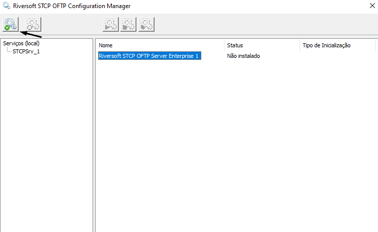
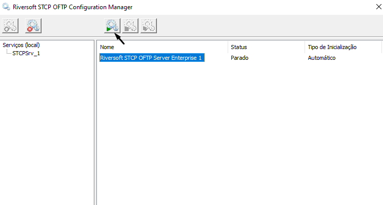
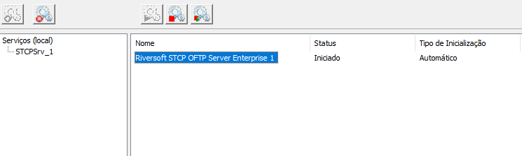

## Utilização

O STCP OFTP Server, para cada usuário configurado no serviço, cria um conjunto individual de subdiretórios para controle das transferências e integração com as aplicações externas, conforme mostra figura abaixo:

<Diretório de Dados>\ | Subdiretório de dados configurado.
:---                  | :---
**<Diretório do Usuário>**\ | Subdiretório individual do usuário.
**CONTROLE**          | Subdiretório de controle da aplicação.
**ENTRADA**\          | Subdiretório onde os arquivos recebidos com sucesso serão disponibilizados.
**RESTART**           | Subdiretório onde os arquivos que estão em processo de recepção são armazenados temporariamente.
**FORMATO**           | Subdiretório que contém as definições dos tipos de arquivos.
**LOG**               | Subdiretório onde serão armazenados os arquivos de eventos e registro das transferências.
**SAIDA**\            | Subdiretório onde os arquivos a serem enviados devem ser disponibilizados.
**BACKUP**            | Subdiretório onde os arquivos enviados com sucesso serão armazenados se a opção de backup do usuário estiver habilitada.
**PENDENTE**          | Subdiretório onde o arquivo de controle da transmissão será armazenado temporariamente.
**TEMP**              | Subdiretório de uso geral.

Para transmitir, os arquivos devem ser disponibilizados no subdiretório **SAIDA** e os arquivos recebidos estarão no subdiretório **ENTRADA**.

## Linha de comando

A sintaxe para executar o STCP OFTP Server através de uma linha de comando é a seguinte:

```pshell
CTCPSVC.EXE <Arquivo de configuração> [-addservice|-delservice|-noservice]
```
Parâmetro  | Descrição
:---       | :---
<arquivo de configuração>| Define o nome do arquivo de configuração de instalação "CTCP.INI" com o caminho completo.
-addservice| Adiciona o STCP OFTP Server como um serviço do sistema operacional.
-delservice| Remove o STCP OFTP Server como um serviço do sistema operacional.
-noservice | Executa o STCP OFTP Server como uma aplicação.

Exemplo:

```pshell
C:\STCPODT\Program\ctcpsvc.exe C:\STCPODT\CTCP.INI –noservice
```
No exemplo acima, o STCP OFTP Server será executado como uma **aplicação**.

## Serviço do STCP OFTP Server

Para que sejá possível criar e iniciar o serviço do STCP OFTP Server, utilizaremos o **STCP OFTP Server Manager**.

O STCP OFTP Server Manager é um sistema gerenciador de serviços STCP, é similar ao gerenciador de serviços do Windows, embora seja usado somente para manipular serviços da família de **produtos do STCP**.

Esse sistema permite que seja instalado/desinstalado o serviço do Riversoft STCP OFTP Server Enterprise (STCPSrv_1) ou Lite (STCPSrvLite_1).

Também é permitido iniciar, parar e reiniciar um serviço, desde que se tenham as permissões apropriadas.

Acesse o STCP OFTP Server Configuration Manager (**Iniciar - Todos os programas - Riversoft STCP OFTP Server**), selecione o serviço _Riversoft STCP OFTP Server Enterprise 1/Lite 1_ e clique no botão _Instalar serviço_.



Uma mensagem confirmando que o serviço foi instalado com sucesso será exibida. Clique em _OK_ para finalizar.


Selecione o serviço recém-criado e clique no botão _Iniciar_.



O serviço será iniciado e seu status alterado para _Iniciado_. Esse servico também pode ser criado e removido pelo prompt de comando (cmd) do sistema operacional.


<br>


