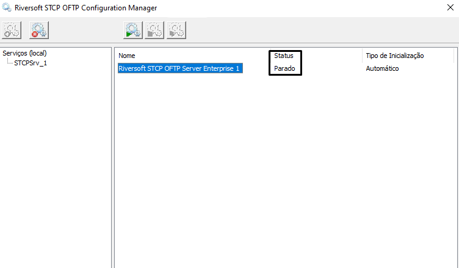

## Antes de Iniciar

Nos casos de migração de servidores, para preservar as configurações dos roteamentos (_STCPRen_) e agendamentos em operação no ambiente atual, recomendamos que o novo servidor possua as mesmas características (_hostname, endereço ip, recursos compartilhados_) ao antigo.

Antes de qualquer alteração no ambiente STCP, recomenda-se uma cópia de segurança dos diretórios de _Controle e Dados_ da aplicação.


## Migração dos Arquivos de Configuração (*.INI)

Para transferir as configurações do STCP, no servidor atual para um novo, após a instalação copie os arquivos de configuração *_.INI_, existentes no diretório de _Controle_ (Ex. **C:\STCPODT**), do servidor antigo para respectivo diretório do novo servidor.

Acesse o diretório de instalação do STCP no terminal e liste os arquivos com a extensão **.ini**

```bash {filename="D:\STCPODT"}
dir *.ini
```


* CTCP.INI
* CTCPSCHED.INI
* NOME-USUARIO1.INI ... NOME-USUARIO2.INI ...

## Migração Diretórios

A estrutura de pastas (Exemplo abaixo **D:\STCPODT\work\NOME-USUARIO**), configurada no diretório de **Dados** do STCP OFTP, também deverá ser copiada do **servidor atual** para o **novo**. Cada usuário criado (guia Usuários) possui a sua própria estrutura de pastas.



  Dependendo das configurações atuais do ambiente em questão, outros arquivos como: regras de roteamento, script VBS, arquivos de lote, dentre outros, deverão ser copiados dos seus respectivos diretórios para o novo servidor.


---
## Serviço

Acesse o Riversoft STCP OFTP Server Manager com privilégios de Administrador (_Ex: D:\STCPODT\Program\Riversoft STCP OFTP Server Manager_) e pare o serviço da aplicação.


 Após parar o serviço, certifique de validar se o serviço está parado:



Após parar o serviço, certifique de deletá-lo, esse procedimento pode ser feito através do comando abaixo (Verifique as permissões e se necessário, execute o prompt como **administrador**)

```bash
sc delete [nome do serviço]
```


Em _Adicionar/Remover Programas_ no _Painel de Controle_ do Windows, remova a versão atual do STCP OFTP Server. A estrutura de diretórios da aplicação (_Controle e Dados_) será mantida, juntamente com os arquivos de configuração (.INI).


<br>


Faça o download, da versão nova versão, através do link que é dispnibilizado pela Equipe de Sustentação da Riversoft e realize a instalação do produto.


Após o processo de instalação, acesse o STCP OFTP Server Config (**Iniciar - Todos os programas - Riversoft STCP OFTP Server**) e na guia _Avançadas_ clique no botão _Controle de Log_.


Na janela _Propriedades do Log_, no painel _Interface de Log (DLL)_, selecione a biblioteca de log desejada e clique no botão _OK_ para salvar esta alteração.

Para a gravação de log em **banco de dados** (ODBC), selecione o arquivo:
```
<disco>:\STCPODT\Program\stcplogodbc.dll
```


Para a gravação de log em **arquivo texto**, selecione o arquivo:
```
<disco>:\STCPODT\Program\stcplogtxt.dll
```


Ainda na guia _Avançadas_, clique no botão _Controle de Autenticação_.

Na guia _Geral da janela Autenticação_, no painel _Interface de Autenticação (DLL)_, selecione o arquivo: **[disco]:\STCPODT\Program\stcpauthwin.dll**

Certifique-se de que o campo _Tipo_, do painel _Autenticação_, esteja com o valor _STCP_ e clique no botão _OK_ para salvar as alterações realizadas.


Clique no botão _OK_ para fechar o STCP OFTP Server Config. O próximo passo é a criação do <a href="/stcpserver/03-util/#serviço-do-stcp-oftp-server">serviço do STCP OFTP Server no Windows</a>  &nbsp;